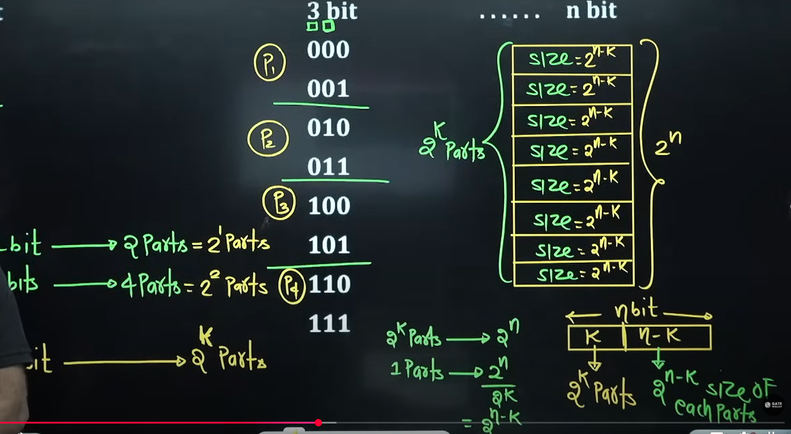
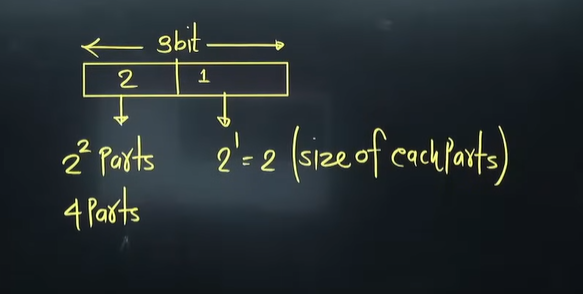
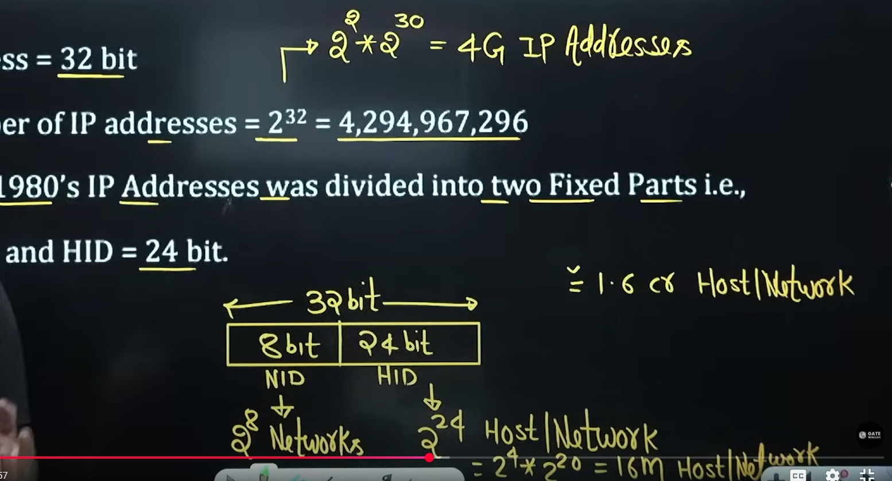
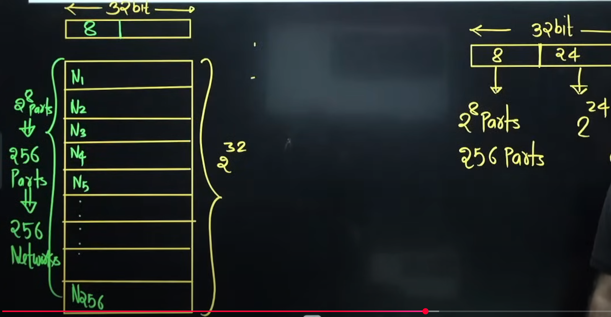
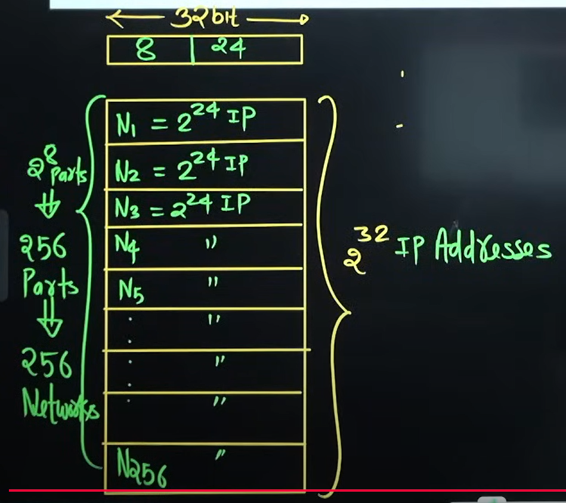
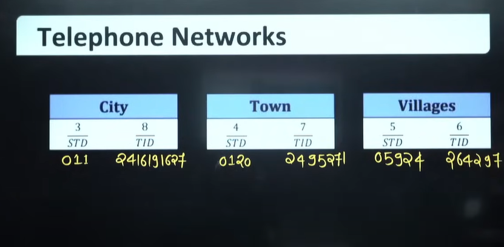
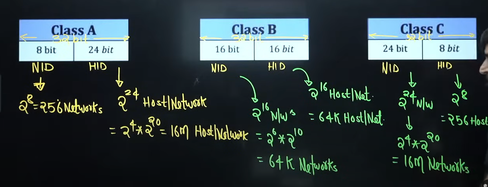
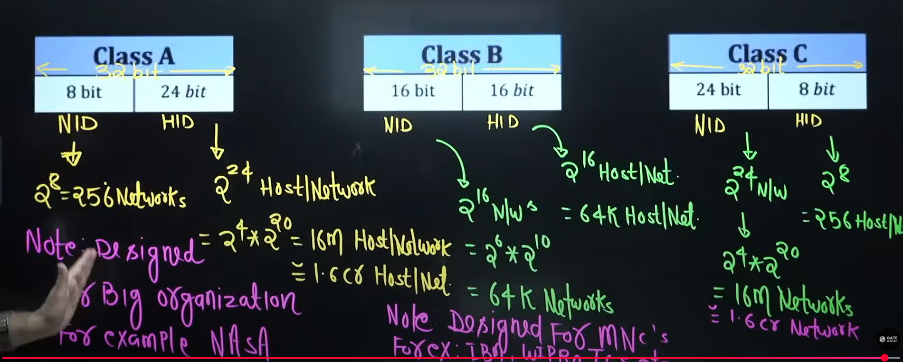

# Syllabus
## IPv4 Addressing
1. Introduction to IP Addressing
2. Classful Addressing
3. Type of communication
4. Subnetting
5. Classless Addressing
6. Subnetting in CIDR
7. Supernetting
8. Supernetting in CIDR

## Error Control
1. Simple parity
2. 2D Parity
3. Checksum
4. CRC
5. Hamming Code

## Flow control at Data Link layer
1. Delay in computer network
2. Stop & wait
3. Go Back-N(GB-N)
4. Selective repeat(SR)

## Internet protocol version(IPv4)
1. IPv4 Header
2. Fragmentation in IPv4

## Transport layer protocol(TCP)
1. TCP Header
2. Wrap Around Time
3. Connection establishment phase
4. Data Transfer phase
5. Connection termination diagram
6. TCP state transition diagram
7. Flags in TCP
8. Flow control in TCP
9. Error Control in TCP
10. TCP timer management
11. Congestion control in TCP
12. Traffic Shaping

## User datagram protocol(UDP)
1. UDP Header
2. Why we need UDP
3. TC vs UDP

## Media Access Control
1. ALOHA
2. CSMA
3. CSMA/CD
4. CSMA/CA
5. Reservation
6. Polling
7. Token passing
8. FDMA
9. TDMA
10. CDMA

## Routing Protocol
1. Shortest Path
2. Flooding
3. Distance vector Routing
4. Link state Routing

## Switching
1. Circuit switching
2. Packet switching
3. Virtual circuit switching
4. Datagram switching

## Application Layer protocol
1. DNS
2. SMTP
3. FTP
4. HTTP
5. Email

## Basics of IP Support Protocol
1. ARP
2. RARP
3. DHCP
4. ICMP

## OSI and TCP/IP protocol Stack
1. OSI Model
2. Functions of OSI Layers
3. TCP/IP Model

## Miscellaneous
1. Network Address Translation(NAT)
2. Ethernet Bridging

# Books
1. Behrouz A. Forouzan
2. Andrew S. Tanenbaum
3. Kurose and ross

* Lectures and notes are enough

# Basics of IP Addressing
2^1 = 2  
2^2 = 4  
2^3 = 8  
2^4 = 16  
.  
.  
.  
2^9=512  
2^10 =1024 = 1K(Kilo)  
2^20 = 1024 * 1024 = 1M(Mega)  
2^30=1024 * 1024 * 1024 = 1G(Giga)  
2^40 = 1T(Tera)  
2^50 = 1P(Peta)  
2^60 = 1E(Exa)  
2^70 = 1Z(Zetta)  
2^80 = 1Y(Yotta)  

Bita -> b  
Byte -> B  

1 Byte = 8bits  
1KB = 1024 Byte  
1MB = 1024KB(Kilo Byte)  
1GB = 1024MB(Mega Byte)(e.g. Jio Intial data plan)    
1TB = 1024GB(Giga Byte)( e.g. Laptop Harddisk)    
1EB = 1024PB(Peta Byte)  
1ZB = 1024EB(Exa Byte)  
1YB = 1024ZB(Zetta Byte)  

* Binary Number to decimal number

Weightage =>128,64,32,16,8,4,2,1,0

00000000=0  
00000001=1(2^0)  
00000011=3(2^2-1)  
00000111=7(2^3-1)  
00001111=15(2^4-1)  
00011111=31(2^5-1)  
00111111=63(2^6-1)  
01111111=127(2^7-1)  
11111111=255(2^8-1)  

* Range पता चल जाएगा ऊपर से
  * e.g 8 bit का number है => 0 (minimum value) to 2^8-1(maximum value)
  * **Hence => n bit का number है => 0 (minimum value) to 2^n-1(maximum value)**

* Binary number to decimal value
Second way =>  

10000000=128  
11000000=192 (128 + 64)    
11100000=224 (128 + 64 + 32)  
11110000=240 (128 + 64 + 32 + 16) [255-15(लास्ट के 4 बिट का वेटेज) ]  
11111000=248[255-7]  
11111100=252[255-3] => 255 में 3 कम कर दो    
11111110=254[255-1]  
11111111=255  

(To write the number directly instead of converting and taking time to do that)  


* 1 bit
  * 0,1 = 2^1 combination
* 2 bit
  * 00,01,10,11 = 2^2 combination banega(address space . Basically total combiantions is called address space.)
  * 1 fix karne par => 2 parts me address space divide hoga
* Now suppose we have a 3 bit number
  * 000,001,010,011,100,101,110,111 =8 = 2^3 combination i.e. We have 8 combination of address space
  * 1 bit fix karne par => 2 parts me address space divide hoga
  * 2 bit fix karne par => 4 parts me address space divide hoga
* n bit ( with 2 bit we have 2^2 combination, with 3 bit number we have 2^3 combination)
  * therefore with n bit number we will have 2^n combination banega (address space)

* Address Space(Now if someone selects k bit from n bit number then)
  * 1 bit fixed then = Address space will get divide in two parts = 2^1 parts (can be written as)
  * 2 bits = 4 parts = 2^2 parts
  * .
  * .
  * .
  * **अगर मेरे पास n bit का नंबर है तो और k bits फिक्स किया तो => address space 2^k parts में divide होगा**
  * Basically 2^n combination number will get divided into 2^k parts
  * Now remainning bits are (n-k) bits. now can you tell be size of each part? Basically apply the unitary method of class 5
  *  2^k parts have 2^n combination
     *  therefore 1 part will be 2^n/2^k
     * हरेक parts का size कितना होगा? 2^(n-k) size of each part


  



# Introduction to IP Addressing
Here we have 32 bit number.

IPv4 Address = 32 bit  
Total number of IP addresses = 2^32 = 4,294,967,296=> more than 4 billion  

2^32 = 2^2*2^30 = (4G IP Addresses - basically saying we have 4 giga IP addresses)
Initially in 1980's  Addresses was divided into two fixed parts
NID = 8 bit  
HID = 24 bit  
* agar 8 bit ki network id hai toh total combination banega = 2^8 networks
* host id = 24 bits = combination will be 2^24(host/network) = 2^4 * 2^20 = 16M Host/network = approx 1.6 crore Host/network
* So each part will have 2^24 IP addresses. IOW N1 will have 2^24 IP address, N2 will have 2^24 IP address. And continuing till network N256 part will have 2^24 IP address.
* And if you are still confused about part it is basically grouping of IP address when a particular bit is fixed.

```txt
Why this is correct (bit-level view)
An IPv4 address is a 32-bit binary number.
When we say:
Network part → some leading bits are fixed
Host part → remaining bits are variable
➡️ All IPs that share the same fixed bits belong to the same group (network).

That “group” is exactly what a network is.
```







## Disadvantage
* There are only 256(2^8) Network's(These are basically parts), and even a small organization must buy 16M computer (HOST) to purchase one network
  

## Solution - classful Addressing

# Telephone Networks
1. 11 digit number
2. Two parts - STD code and TID code
3. Unique  







