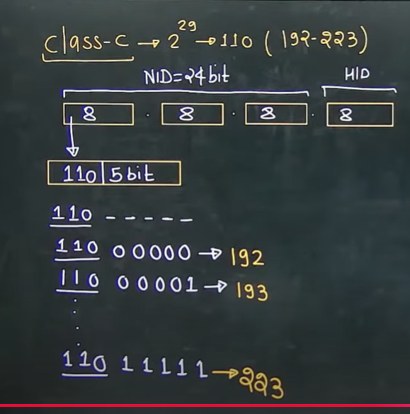
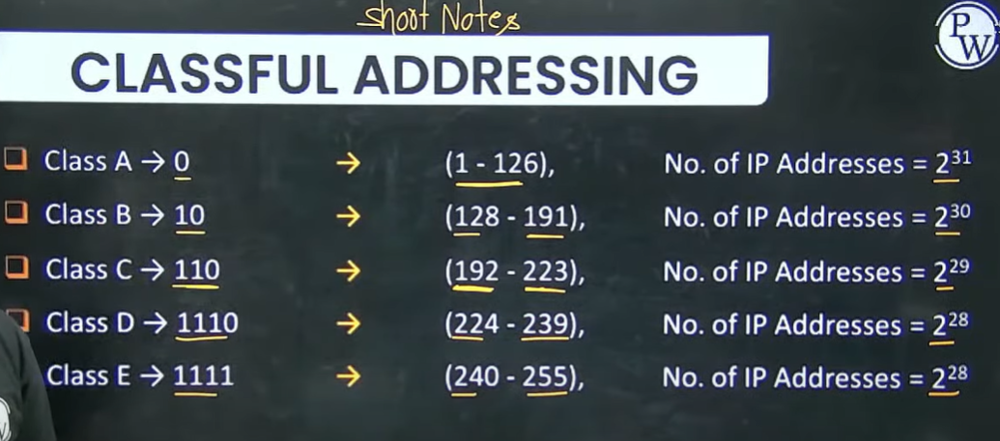

# Classful Addressing

## 🌍 What is **Classful Addressing**?

Classful addressing was the **original IPv4 addressing system** (1981, RFC 791).
It divided the **32-bit IPv4 space** into **fixed blocks called “classes”** (A, B, C, D, E), based on the **leading bits** of the address.

### Classes:

* **Class A** → For very large networks (few networks, many hosts each)
* **Class B** → For medium-sized networks
* **Class C** → For small networks (many networks, few hosts each)
* **Class D** → Reserved for multicast
* **Class E** → Reserved for experimental

Each class had a **default subnet mask**:

* A → /8 (255.0.0.0)
* B → /16 (255.255.0.0)
* C → /24 (255.255.255.0)

---

## ❓ Why was Classful Addressing done?

At the time (early internet), the goals were **simplicity and manageability**:

1. **Easy to understand** → Just by looking at the **first few bits**, you know if it’s Class A, B, or C.
   Example:

   * `10.x.x.x` → Class B
   * `192.x.x.x` → Class C

2. **Simplified routing** → Routers could decide quickly based on class, without complex subnet lookups.

3. **Matching organization sizes** →

   * Big companies/government → Class A (millions of hosts)
   * Universities/medium ISPs → Class B (65k hosts)
   * Small companies → Class C (254 hosts)

---

## ⚠️ Problem with Classful Addressing

It **wasted a massive amount of IP space**:

* A company might get a whole **Class A (16M IPs)** even if they only needed 1000.
* Small companies often ran out of Class C networks.

By the 1990s, IPv4 was running out of space because of this waste.

---

## ✅ What replaced it?

* In **1993**, **Classless Inter-Domain Routing (CIDR)** was introduced.
* CIDR uses **variable-length subnet masks (VLSM)** — so instead of rigid “classes,” you can allocate **just enough addresses**.
  Example: Instead of giving Class B (65k) to a company, you can give them a **/20 block (4096 IPs)**.

---

👉 **In short:**
Classful addressing was the **first, simple way to divide IPv4 addresses**, but it was too rigid and wasteful. CIDR replaced it to allow finer control and prevent IPv4 exhaustion.

# IP Address division


Note -
1. Number of IP Addresses present in class A = 2^31
2. Class B = 2^30
3. Class C = 2^29
4. Class D = 2^28
5. Class E = 2^28

**Classful IP addressing is nothing but grouping IPs by fixed leading bits, and the remaining bits decide how many addresses exist.**

| Class | First bits | Binary prefix |
| ----- | ---------- | ------------- |
| A     | 0          | `0xxxxxxx`    |
| B     | 10         | `10xxxxxx`    |
| C     | 110        | `110xxxxx`    |
| D     | 1110       | `1110xxxx`    |
| E     | 1111       | `1111xxxx`    |


## IP Address Representation
1. dot Binary

e.g. 11001000.11111100.00111111.11110111
convert in dotted decimal  
Weightage - 128,64, 32, 16,8,4,2,1  
200.252.63.247

2. convert in Hexadecimal 


C8:FC:3F:F7


# Class A [1-126]


Note - 
1. Whenever we have all zeros or all ones, either in the network ID or in the Host ID of any IP addresses. These IP addresses are reserved for some special purpose, so we cannot assign these IP addresses to computer.


So Practically we have the following - 


### **1. 0.0.0.0 as the “default route”**

* In IP routing, `0.0.0.0/0` means **“all possible IP addresses.”**
* A router uses it as a **catch-all route** → if no specific route matches the destination IP, traffic is sent to this **default route** (usually pointing to a gateway).
* So `0.0.0.0` here doesn’t mean “this device,” it means **“anywhere.”**

👉 Example:
If your PC wants to reach `8.8.8.8` (Google DNS), and your routing table doesn’t have a more specific entry, the packet goes via the default route (`0.0.0.0/0` → gateway).

---

### **2. 0.0.0.0 as a DHCP client address**

* Before a computer has an IP address, it uses `0.0.0.0` as its **source IP** when talking to a DHCP server.
* Why? Because it doesn’t yet know its own IP address.
* The DHCP discovery message is broadcast with:

  * Source IP = `0.0.0.0`
  * Destination IP = `255.255.255.255`

👉 Meaning: **“I don’t have an IP, please assign me one.”**

---

### ✅ Summary

* **Default Route (`0.0.0.0/0`)** → “Send traffic anywhere if no better match is found.”
* **DHCP client (`0.0.0.0`)** → “I don’t know my IP yet, I’m requesting one.”

It’s the same address, but the meaning depends on **context (routing vs DHCP).**

* 127.X.X.X -> Self Connectivity or Loop Back Testing or Inter Process Communication

* 2^8 Networks
  * subtract 2 => 2^7-2 = 126 Networks
* 2^24 Host/Network
  * subtract 2 => 2^24-2
* 10.0.0.0 - cannot be assigned to any computer
  * 10.255.255.255 - cannot be assigned to any computer


# Class B (128-191)
* IP Address - 2^30
  * Kitne bits fix hain? 10


* here we don't have anything IP address to cancel

Now -  Visualization Part  

here we have two octet of Network ID
second octet will be from 0 to 255 and for each first octet startting value from 128, 129. ...toll 191


# Class C (2^29 - 110 bits fixed here)
In class C we have 24 bit for network ID and last 8 bit for host ID.
Also we have 110 first three bits fixed in network ID. 



We have 3 bits fixed in class C , so number of network will be 2^21 practically.


* Number of networks - 32*2^16 = 2^21

```
with 5 bits we will have 32 combination
and other 2 octet will give 2^8 and 2^8 combination.
So total will be 32 x 2^16
```

```
Total Class C IPs = (number of networks) × (IPs per network)
                  = 2²¹ × 2⁸
                  = 2²⁹

```


# Class D (2^28 and we have 4 bits fixed - 1110)
Here we don't have any NID or HID
Note - 
1. No network id and no host id in class D
2. class D is used for multicasting
3. Class D IP address is not assigned to any computer


# Class E
* 240-255
* 2^28
* we don't have anything to cancel here because - No network and no host id in class E. 
* Class E is reserved for research and future purpose


# Short notes



Number of hosts per network


# Questions

Question 1 -  


Question 2 -  


Question 3 -  


Question 4 -  


another way -  


