# Computer Networks 03 | Types of Communication
> Question  
> 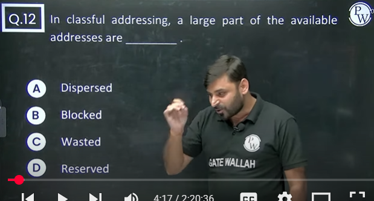  
> Class A - 2^24 IP Address in one network or 2^24 Host/Network  
> Class B - 2^16 IP Addresses in one network  
> Class C - 2^8 IP Addresses in one networkc  

> Question  
> 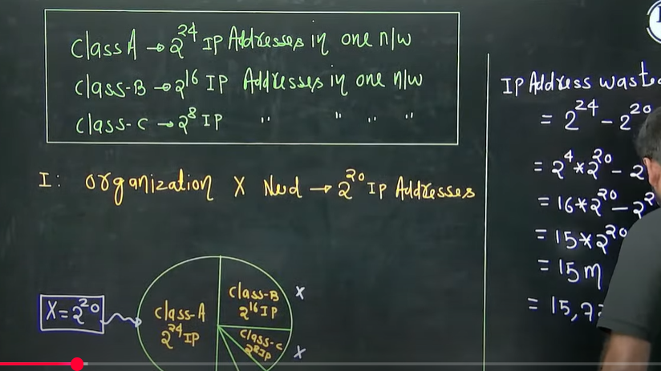

# Concept
> 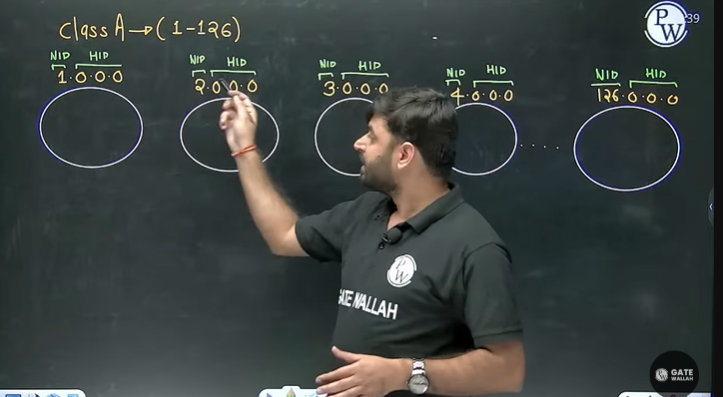  
> Note - When ever we have all 0's in HID part of any IP address, that IP address represent the NID of entire network this the reason we can't assign this IP address to any host.

> **Example**  
> 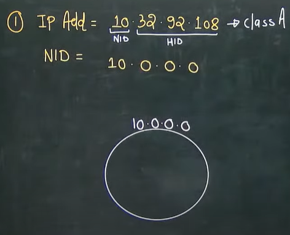  
> Network ID kaise nikalenge? Host ID me sare bits zero kar do 

> **Example**  
> 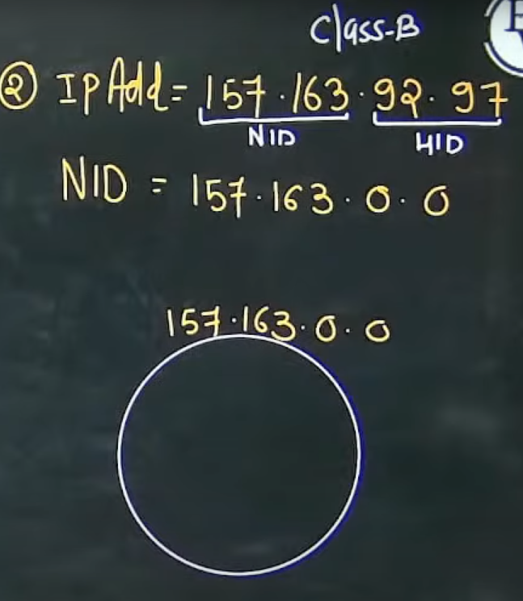

> **Example**  
> 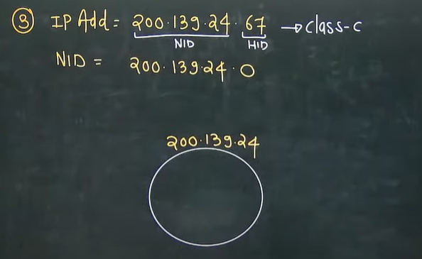

## Types of communication
1. Unicast communication **(1 to 1)**
2. Broadcast communication **(1 to all)**
3. Multicast communication **(1 to many)**

## Unicast Communication
Transmitting the data from one computer to another computer is called as unicast communication.  
It is one to one transmission

> **Example**  
> 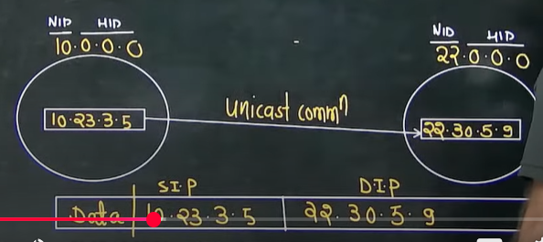  

> **Example**  
> 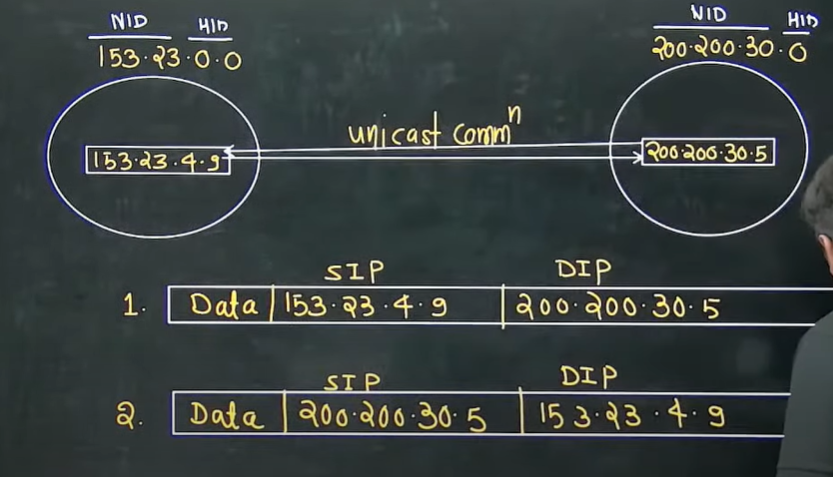

Note - 
* In Unicast communication both source and destination can be present in the same network or different network.

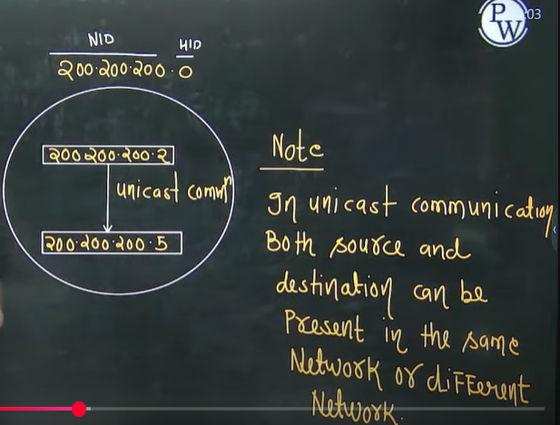

## Broadcast communication(1 to all)
Two types -  
1. Limited Broadcasting
2. Direct Broadcasting

**Limited Broadcasting** -   
Transmitting data from **one** computer to **all other** computer in the **same network** is called as Limited Broadcasting

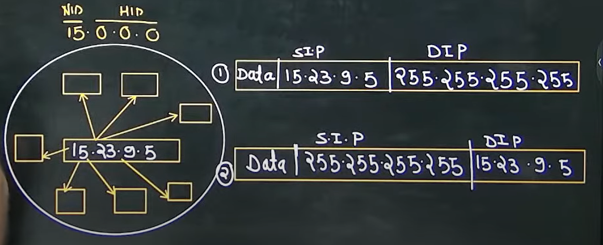

Note - 
1. Limited Broadcast address cannot be use as a Source IP Address
2. Limited Broadcast address will always be used as a destination IP address

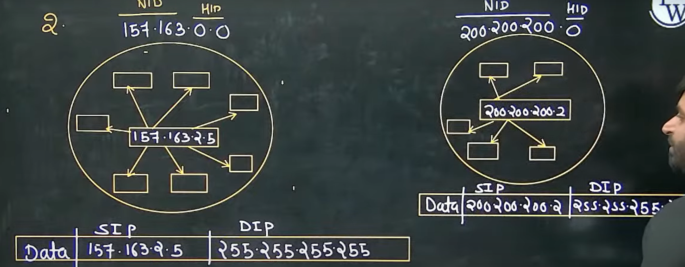

2. **Directed Broadcasting** - Transmitting data from one computer to all other computer in the different N/W is called as Direct Broadcasting

Note - Whenever we have all 1's(or 255) in HID part of any IP address, that IP address represents the direct broadcast address so this is the reason we **cannot** **assign this IP address to any host**

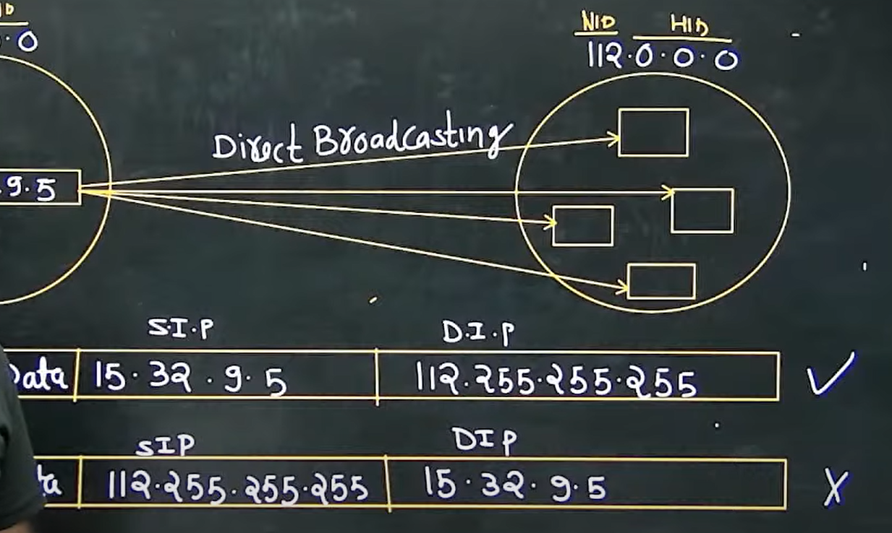

Note - 
1. Directed Broadcast Address can't be used as a source IP address
2. Directed Broadcast Address will always be used as Destination IP address

example 2  of direct broadcast - 
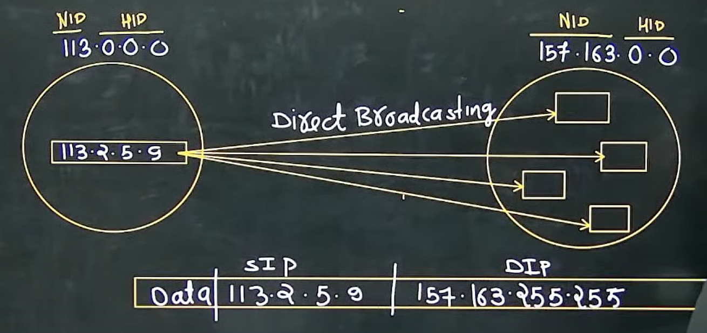

|Network ID|Host ID|Name|
|--|--|--|
|Valid|0's|NID of entire network|
|valid|1's|Direct Broadcast address|
|1's|1's|Limited Broadcast Address|

Example -   

|IP Address|Network ID|Direct Broadcast Address|Limited Broadcast Address|
|--|--|--|--|
|19.35.21.31|19.0.0.0|19.255.255.255|255.255.255.255|
|119.31.34.2|119.0.0.0|119.255.255.255|255.255.255.255|
|150.0.94.31|150.0.0.0|150.0.255.255|255.255.255.255|
|190.34.17.31|190.34.0.0|190.34.255.255|255.255.255.255|
|200.200.34.92|200.200.34.0|200.200.34.255|255.255.255.255|
|217.39.47.9|217.39.47.0|217.39.47.255|255.255.255.255|
|226.9.7.97|X|X|X|
|243.2.3.5|X|X|X>|

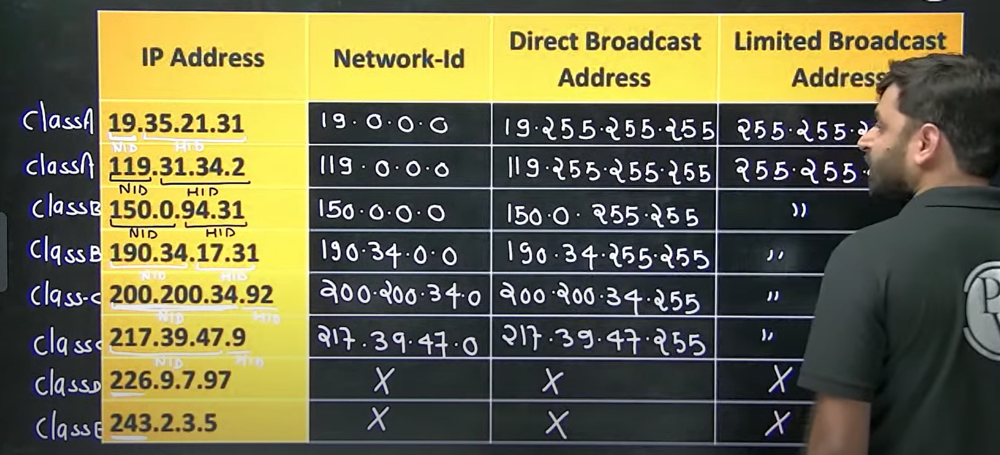

## Network Masks - 
A network mask helps you to know which portion of the address identifies the network-id and which portion of the address identifies the host-id. Class A, B, and C networks have default masks, also known as natural masks, as shown here-  
Class A - 255.0.0.0  
Class B - 255.255.0.0  
Class C - 255.255.255.0  

Note - In the network mask number of ones indicate network ID part and number of zeros indicate host id part

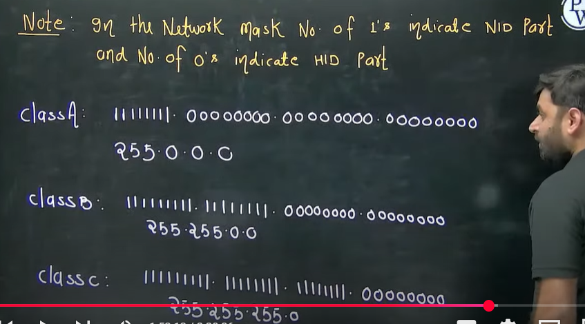

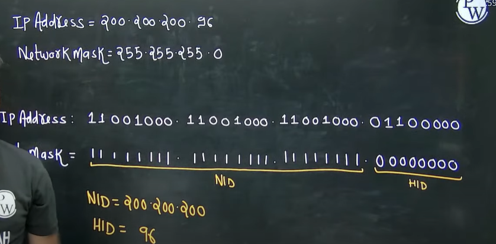

Note - IP Address ANDing Network Mask => It gives Network ID

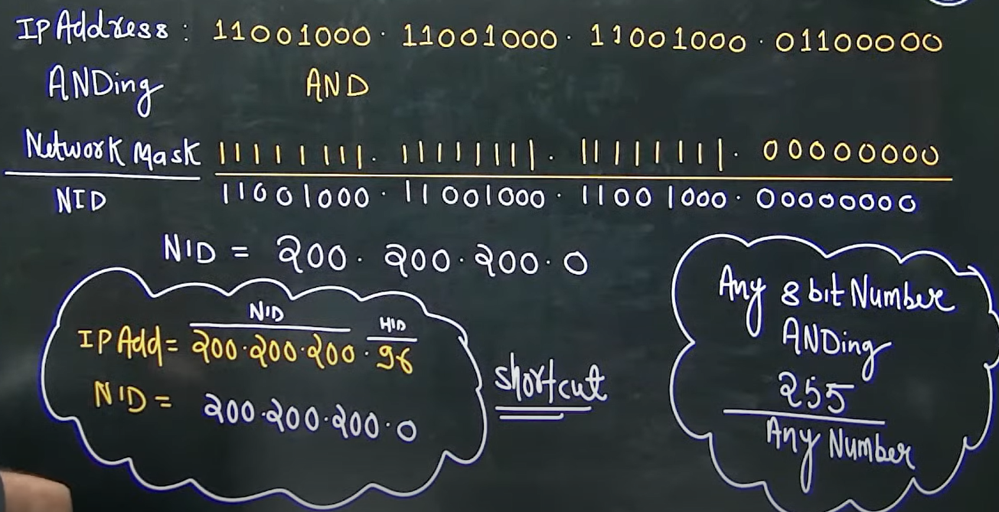

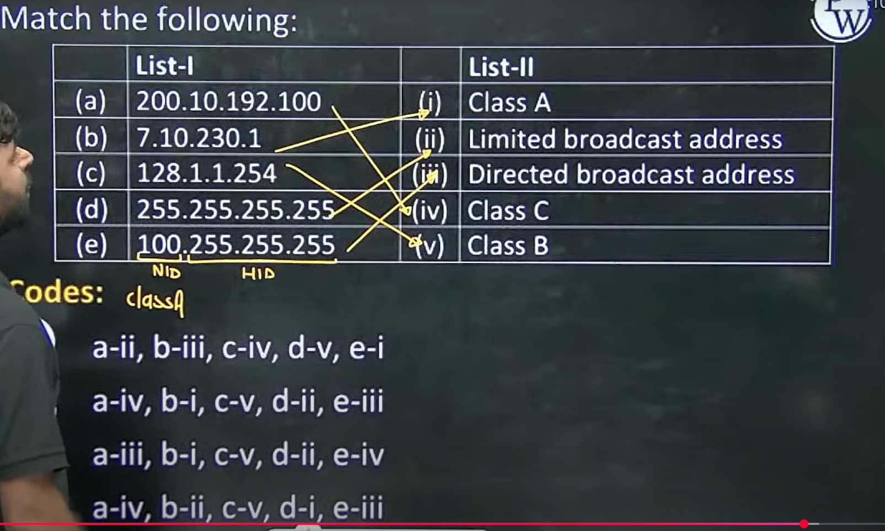

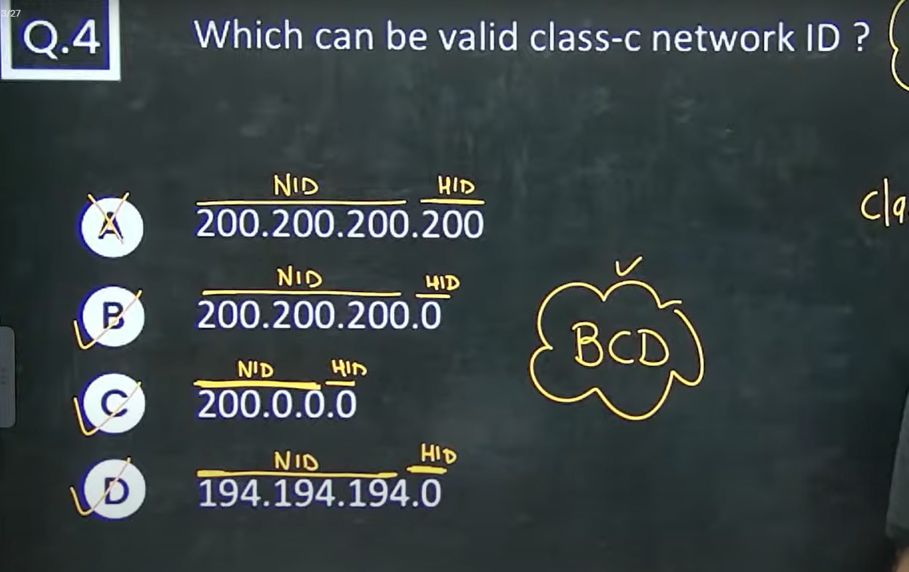

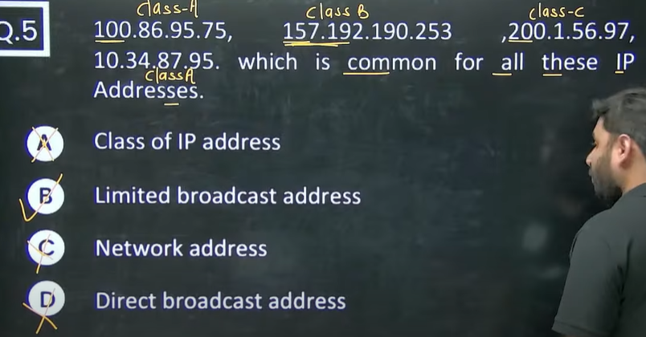

Home Work - Questions 6,7,8,9

# Notes - ChatGPT

👉 **Limited Broadcast** and **Directed Broadcast** — perfect for quick revision or interview recall 👇

---

## 📘 **Broadcasting in IPv4 — Quick Notes**

---

### 🔹 **1. Limited Broadcast**

| Concept                     | Details                                                         |
| --------------------------- | --------------------------------------------------------------- |
| **Address**                 | `255.255.255.255`                                               |
| **Meaning**                 | “Send to *everyone* in *my local network*.”                     |
| **Scope**                   | Local network only (cannot cross routers)                       |
| **Use case**                | When host doesn’t yet know its own IP (e.g., **DHCP Discover**) |
| **Source IP allowed?**      | ❌ No — because `255.255.255.255` is not a unique sender         |
| **Destination IP allowed?** | ✅ Yes                                                           |
| **Routable?**               | ❌ Never — routers drop it immediately                           |
| **Example**                 | A new PC broadcasting to find a DHCP server on LAN              |
| **Analogy**                 | Shouting “Hey everyone in this room!”                           |

---

### 🔹 **2. Directed Broadcast**

| Concept                     | Details                                                            |
| --------------------------- | ------------------------------------------------------------------ |
| **Address**                 | `<Network ID> + all host bits = 1`                                 |
| **Meaning**                 | “Send to *everyone* in *that specific remote network*.”            |
| **Scope**                   | Crosses router boundaries (if not blocked)                         |
| **Example Network**         | For `192.168.1.0/24` → Directed Broadcast = `192.168.1.255`        |
| **Use case**                | Network management tools, wake-on-LAN, or controlled subnet alerts |
| **Source IP allowed?**      | ❌ No                                                               |
| **Destination IP allowed?** | ✅ Yes                                                              |
| **Routable?**               | ⚠️ Possible, but **disabled by default (RFC 2644)**                |
| **Risk**                    | Can be exploited in **Smurf attacks** (mass ICMP reply flood)      |
| **Analogy**                 | Shouting “Hey everyone in the next room!”                          |

---

### 🧭 **3. Key Differences**

| Feature                      | Limited Broadcast              | Directed Broadcast                         |
| ---------------------------- | ------------------------------ | ------------------------------------------ |
| **Address Example**          | `255.255.255.255`              | `192.168.1.255`                            |
| **Target**                   | All hosts on **local** network | All hosts on a **specific remote** network |
| **Router Forwarding**        | ❌ Never                        | ⚠️ Can (but usually blocked)               |
| **Used in DHCP?**            | ✅ Yes                          | ❌ Rarely                                   |
| **Can be Source Address?**   | ❌ No                           | ❌ No                                       |
| **Common in Real Networks?** | ✅ Yes                          | ⚠️ Rare / Disabled                         |
| **Security Concern**         | Minimal                        | High (DoS via Smurf attack)                |

---

### 💡 **4. Memory Tricks**

* 🏠 **Limited = Local** → “Everyone near me.”
* 🧭 **Directed = Destination network** → “Everyone over there.”
* 🚫 **Routers block broadcasts** → They like *unicast* (clear routes).
* 📜 **RFC 919 + 922** define broadcasting; **RFC 2644** disables directed broadcast by default.

---

### ⚙️ **5. Bonus Examples**

| Network      | Subnet Mask         | Directed Broadcast |
| ------------ | ------------------- | ------------------ |
| 192.168.10.0 | 255.255.255.0       | 192.168.10.255     |
| 172.16.4.0   | 255.255.252.0 (/22) | 172.16.7.255       |
| 10.0.0.0     | 255.0.0.0 (/8)      | 10.255.255.255     |

---

### 🧠 **6. Pro Tip for Interviews**

If they ask:

> “Can a Class C host send a directed broadcast to a Class A network?”

Say:

> “Yes, syntactically it can form that address — but in practice, routers will block it (per RFC 2644) to prevent Smurf attacks.”

