# Problem solving on Subnetting(6 Hours)

# Question 9

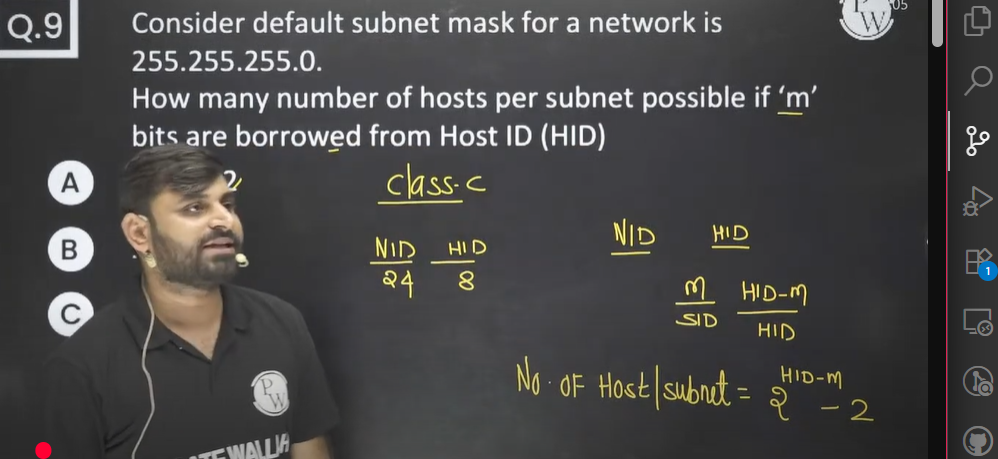

# Question 10

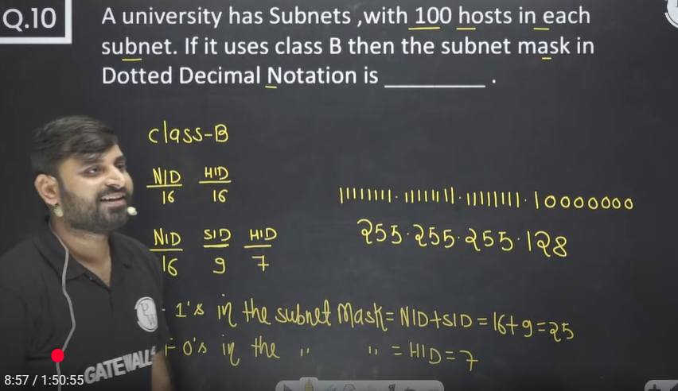

# Question 11
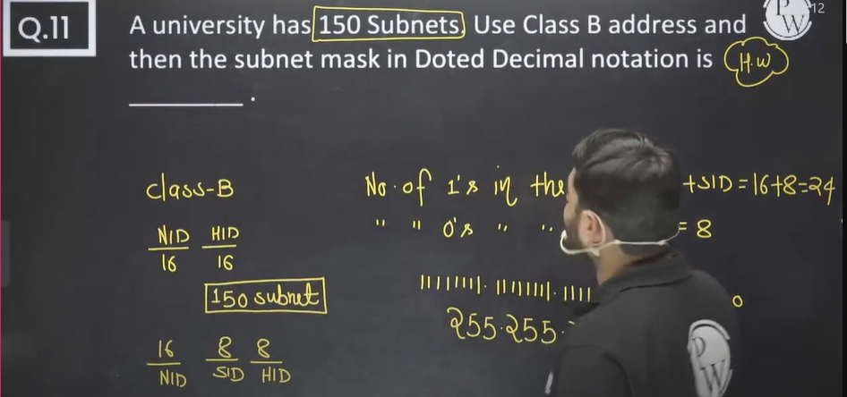

# Part 1

## Question 1

IP Address = 200.200.200.126  
Subnet Mask = 255.255.255.255.192  
then find Subnet ID and Host ID

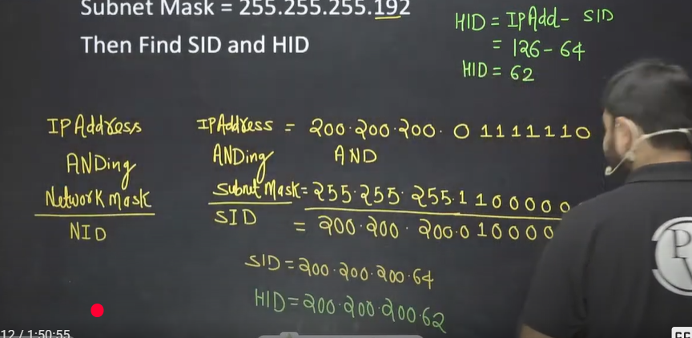

## Question 2

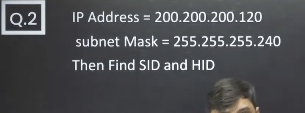

## Question 3
Write the 120 as bits value starting from larger values (128, 64, 32, 16, 8, 4, 2, 1)  
And then whichever are common add those value.

Just remember - To find the subnet ID do the bitwise Anding with subnet mask.  
And after that to find the host id , subtract the subnet id from ip value( i.e. 120 - 40 = 80)

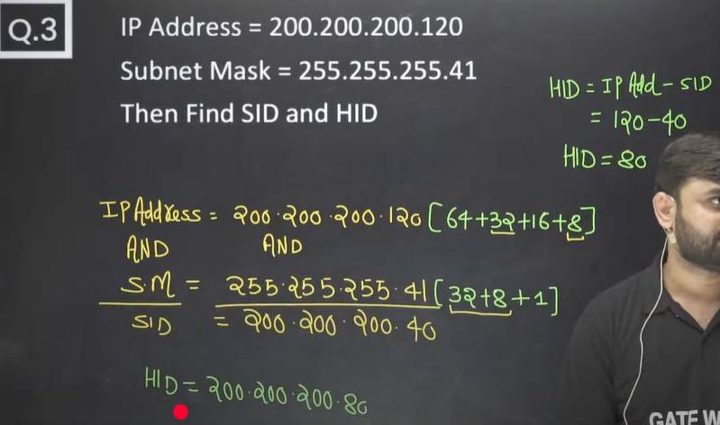

## Question 4
Same as above question. Just to the bitwise Anding with Mask address as IP address address is given. You can also use shortcut to quikly write down values and add the common in both(IP address and mask address)

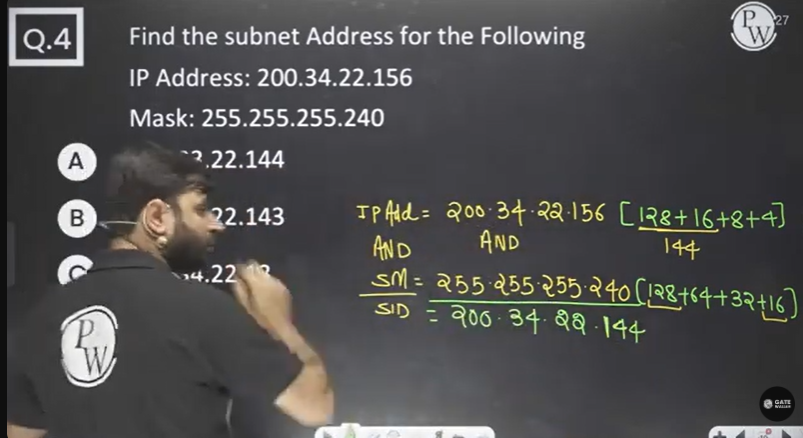

## Important discussion

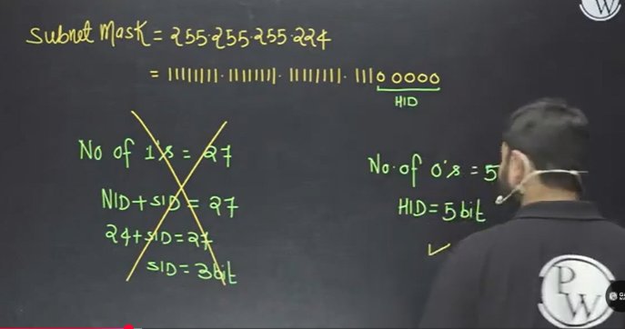

In above the number 0's indicate Host ID part. therefore HID = 5 bit

**In the above example the above subnet mask can be used for class A, class B or class C. Because in above the number of 1's is greater than 8, greater than 16 and greater than 24. So that's why above subnet mask can be used for class A, class B and Class C**

In the above example from subnet mask, we can't say that subnet ID is of 27 bits. Because default subnet mask of class A is 255.0.0.0 and some extra one's are present we can say the number of bits borrowed for class A.

Similarly default subnet mask of class B is 255.255.0.0 and any extra bits indicate subnet ID but it can also be for class A
Similary default subnet for class C is 255.255.255.0 And any extra bits indicate subnet ID but it can also be for class A , class B and class C

## Question 5

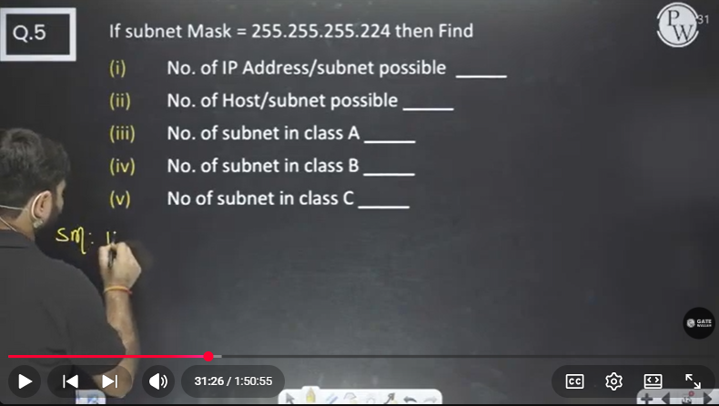

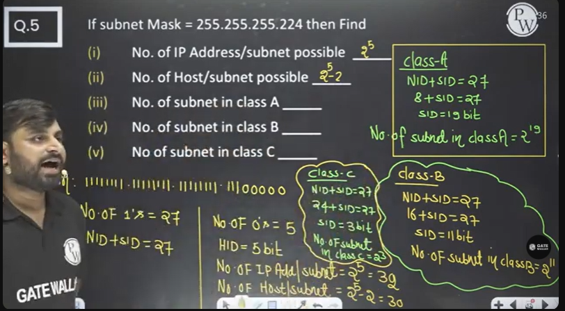

**Shortcut Note - To find the no. of subnet in above find how many extra 1's are present.**

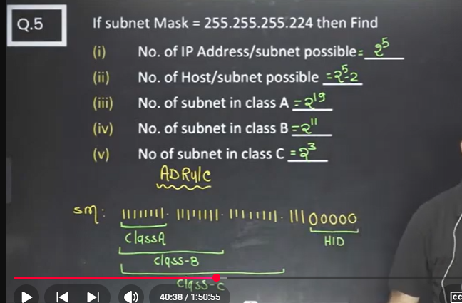

## Question 6
Same as above

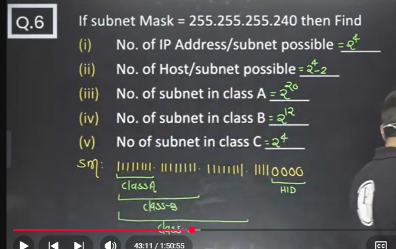

## Question 7

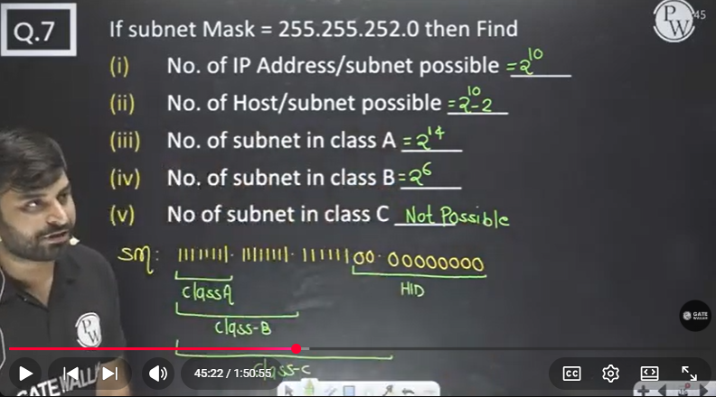

For class C subnet to be possible, no of minimum ones required is 24. so subnet for class C is not possible in above.