## Question 1

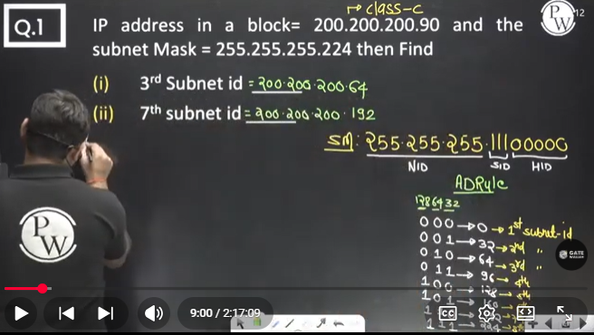

## Question 2

If IP addresss is given , then जो भी एक्सट्रा 1 है subnet mask में वो SID represent करती है । 

Subnet ID निकालने के लिए Host ID में सारे 1 को 0 कर दो । 

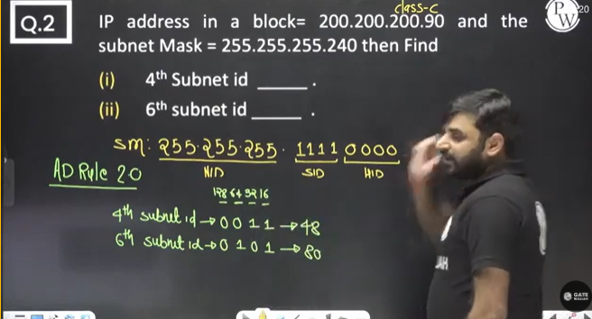

apply the AD rule 2.0 to get the answer quickly

## Question 3
Important question  

Apply the AD rule 2.0  

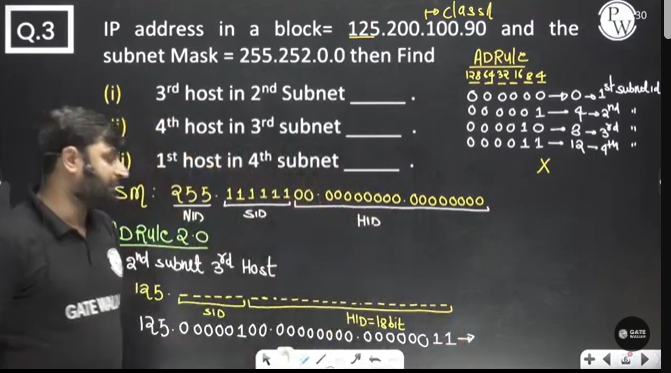

Clear? 

Second part =>  

To write 3rd subnet ID, the last two bits is enough. simply write 10. but we have 6 bits in SID. so write it as 000010  

Now to write the 4th host we need to write 4 in decimal. since when all 0's are present in host ID , then that IP is not assigned to any computer . so counting will start from 00000001  

but we have 18 bits. so to write 4th host simply write it as 00000100

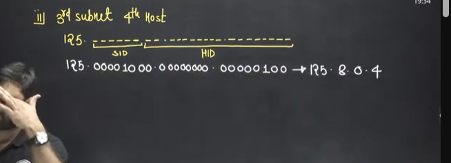

third part =>  
1st host in 4th subnet

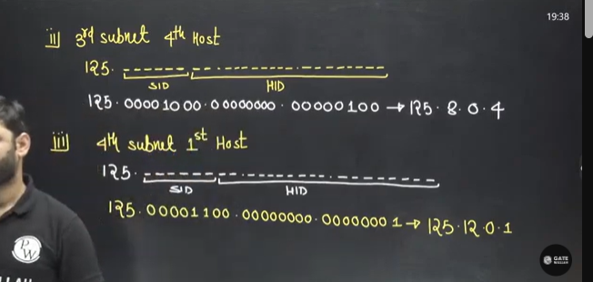

## Question 4

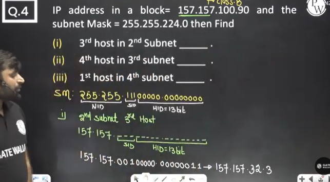

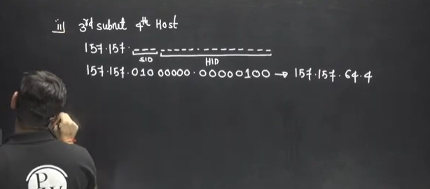

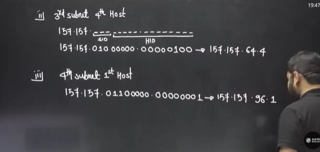

## Question 5
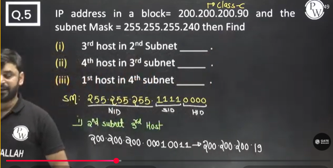

## Question 6
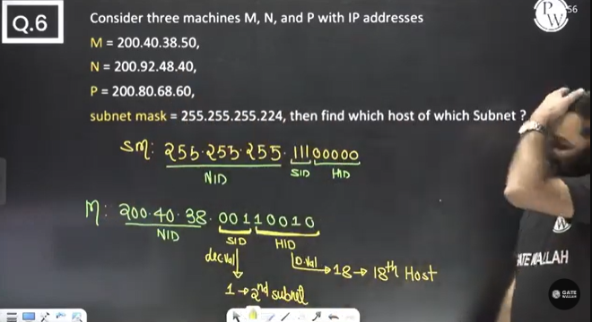

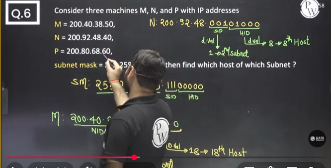

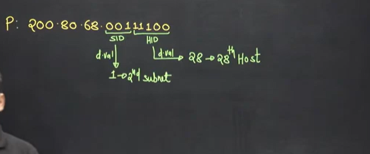

## Question 7
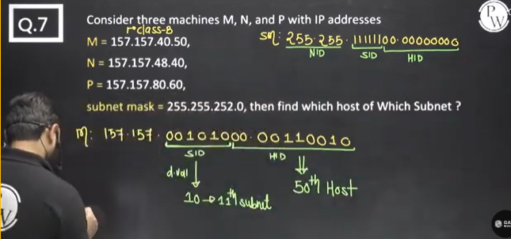

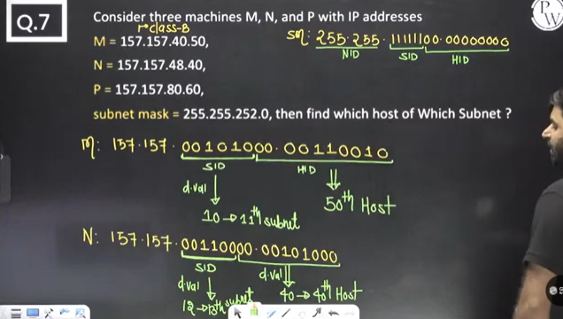

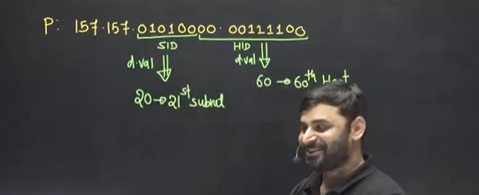
 
## Question 8

## Question 9

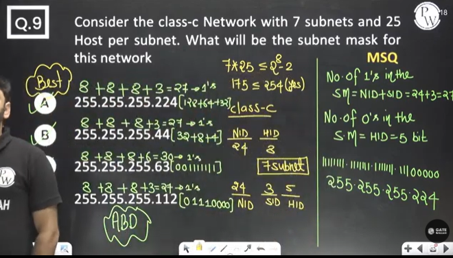

## Question 10
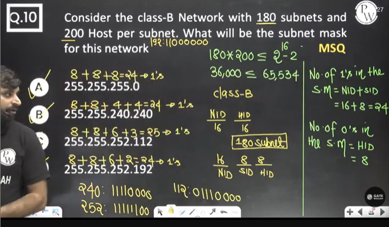

## Question 11
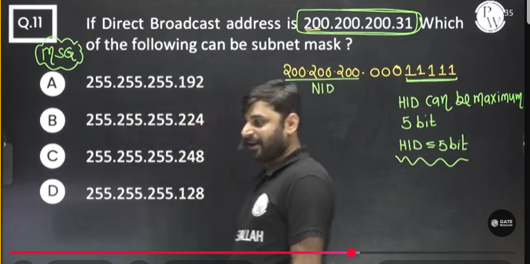

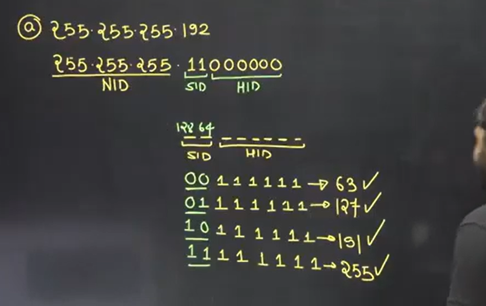

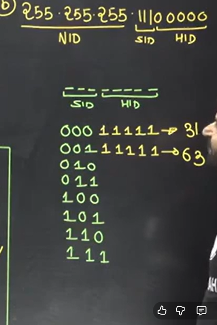

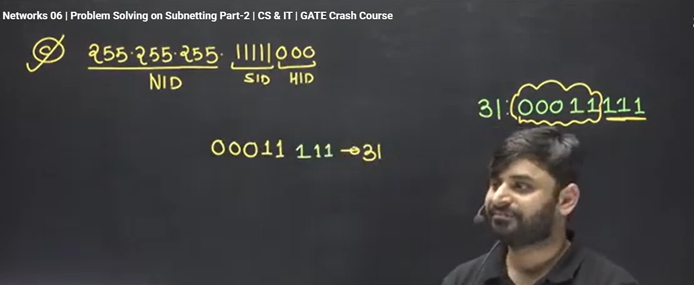

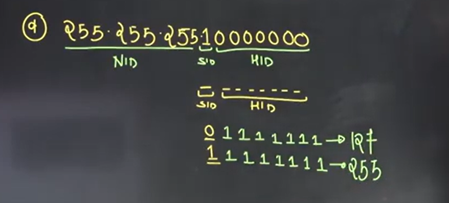

AD Rule -  

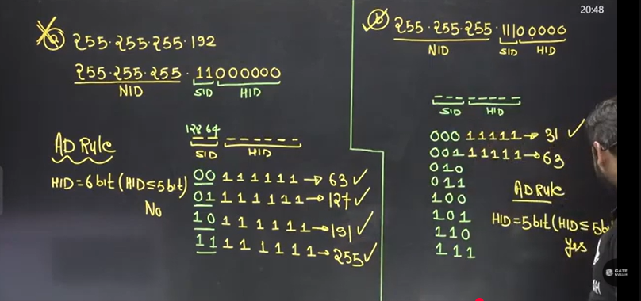

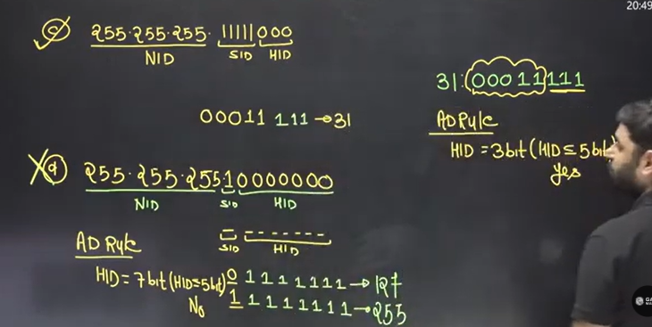

## Question 12

