# Computer Networks 07 | Problem Solving on Subnetting part-3 

## Question 1
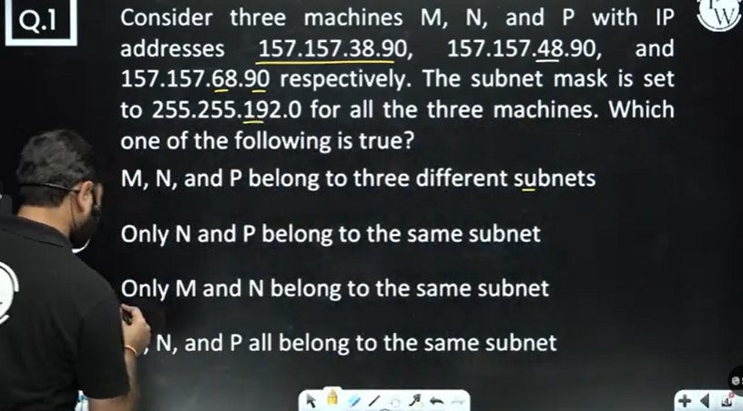

**Remember - Normal procedure is if we do Anding of IP address with subnet mask we will get the subnet ID.**

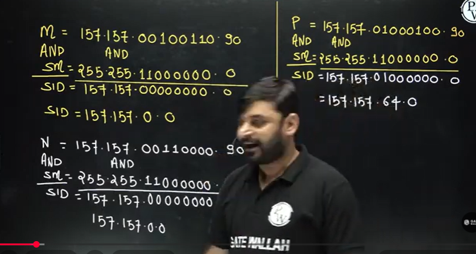

Shortcut - After identifying which class the IP address belongs, then we can easily identify from extra bits. But first find the subnet ID bits from subnet mask.

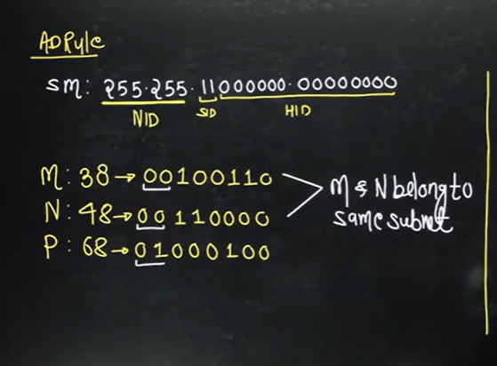

Shortcut 2 -  

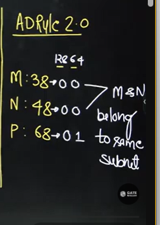

## Question 2

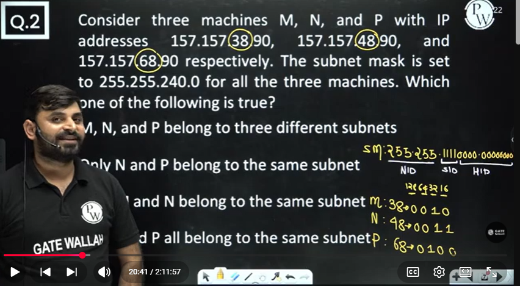

above can be done by finding the subnet ID by ANDing the IP with subnet mask which will give subnet ID. but that is long process.

shortcut - just take the 3rd octet of each IP.
write down the subnet ID from subnet mask.
then how will you write 38, 48, 68 from its 4 bits which are 1's in subnet ID(basically starting from 128...1)

## Question 3

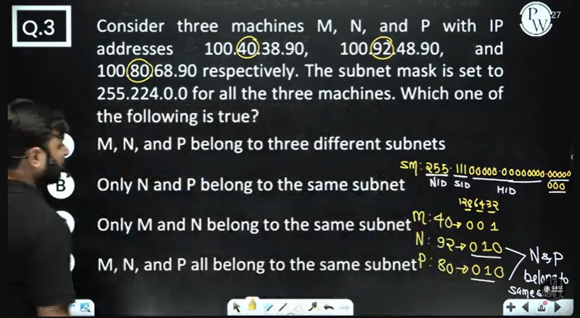

## Question 4

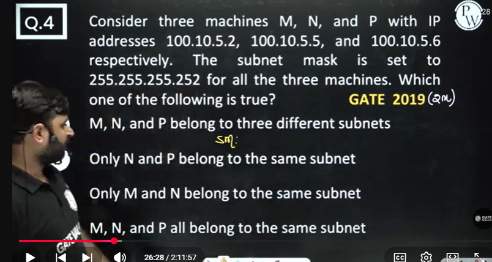

above can be done by doing bitwise ANDing but that will take time  
Shortcut -   

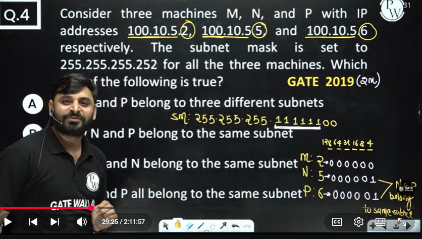

## Question 5

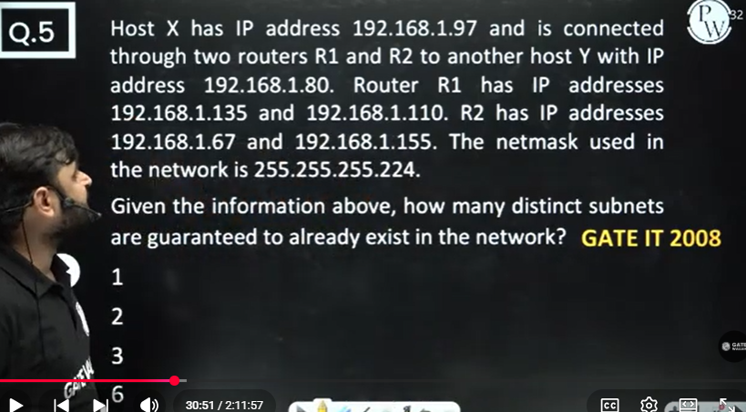

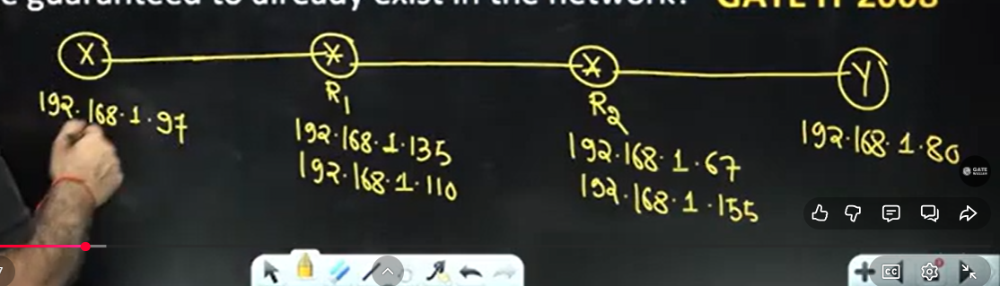

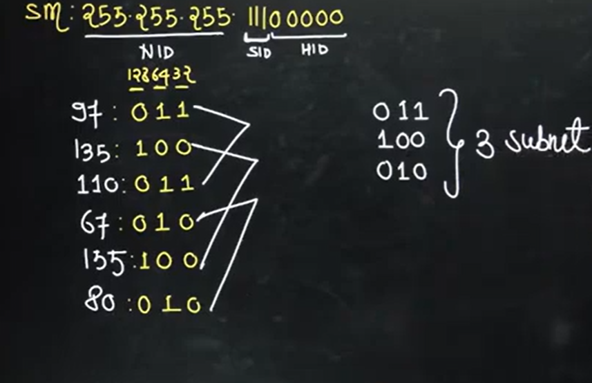

## Question 6

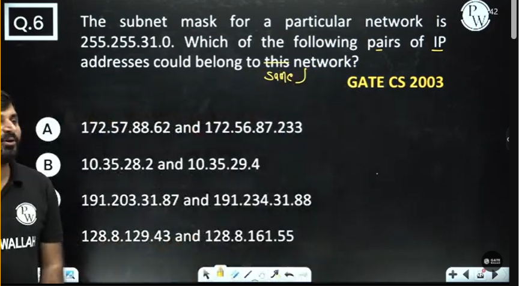

Normal logic is that - for same network , we should have same subnet ID

Basically doing bitwise ANDing of IP addresses of each options. If subnet ID is same then that option will be correct if both have same subnet ID

So basically you have to do 8 AND operations. how to save time?

Option A - No need to check as second octet is different in both IP addresses. Since first two octet of subnet mask is 255 and 255.

Option C - second octet values are 203 and 204. No need to check i.e. bitwise ANDing to find the subnet ID. here 2nd octet is also differ.

We need to focus on 3rd octet last 5 bits.  

Subnet mask - 255.255.00011111.0  

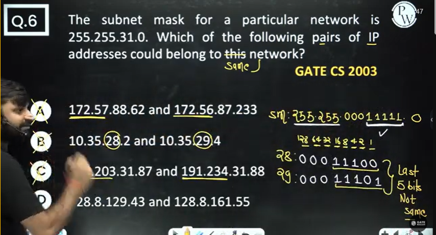

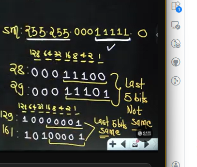

## Question 7

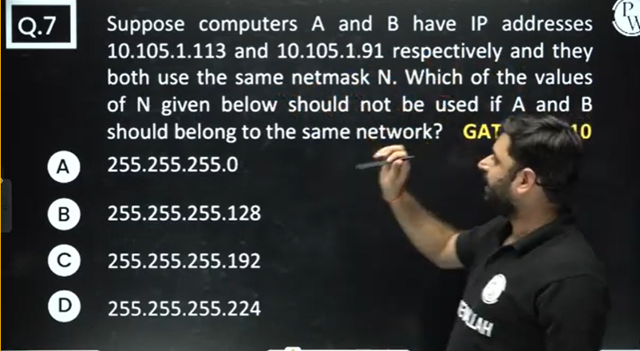

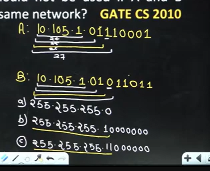

You can do the bitwise ANDing or just find the upto which bits are same.

## Question 8

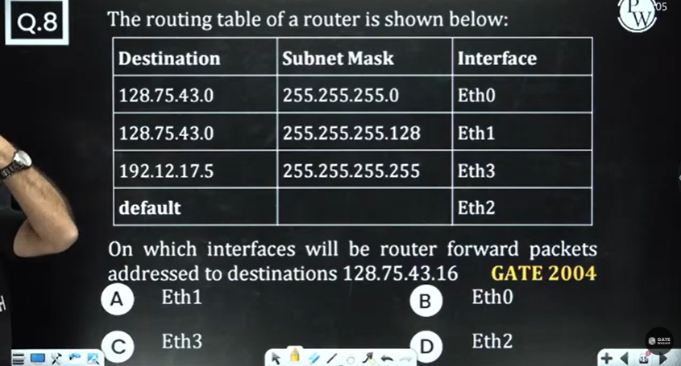

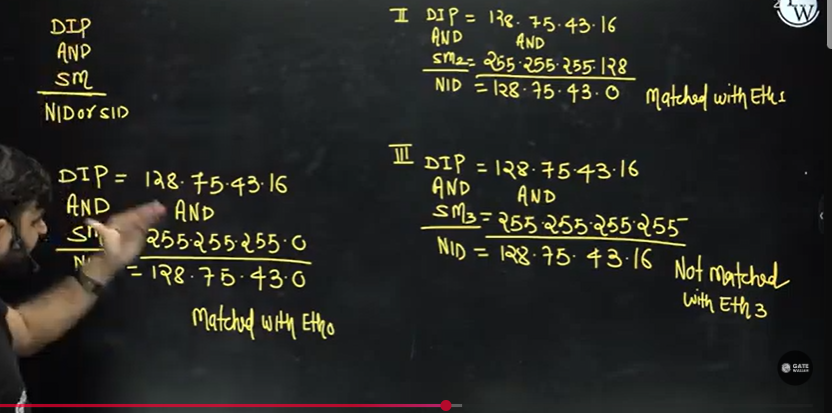

**Note - If DIP matched with more than one interface then Router forward the packet to the interface which have longest subnet mask.[i.e. more no. of 1's in the subnet mask]**

Note - First start witht the longest subnet mask

## Question 9

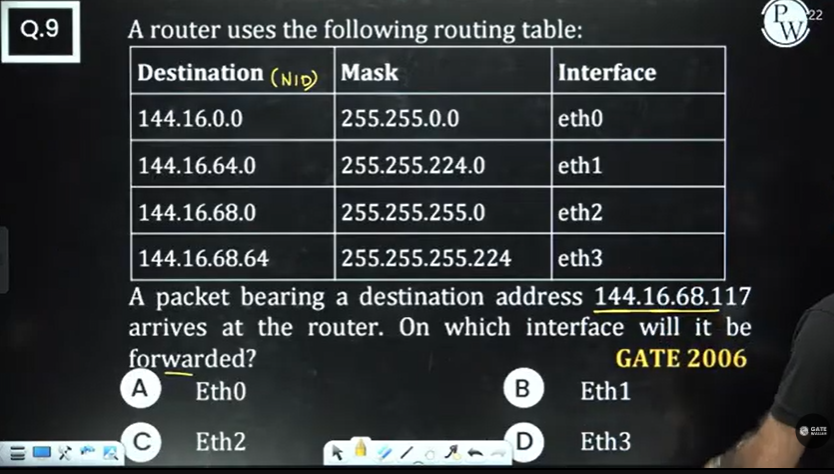

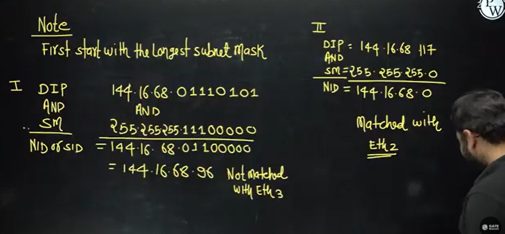

## Question 10
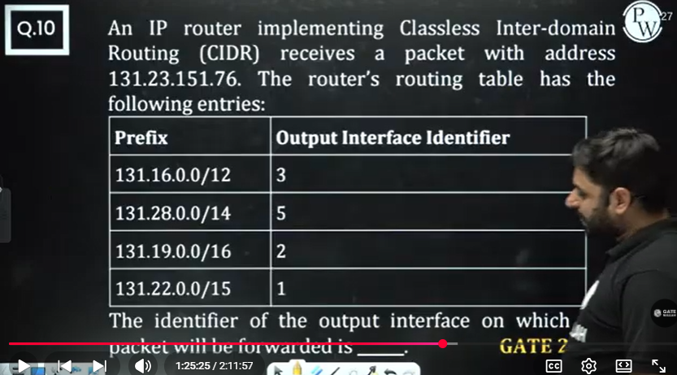

## Question 11

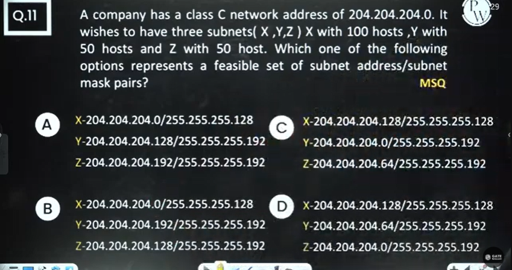

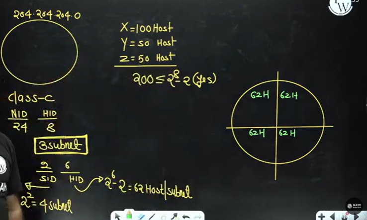

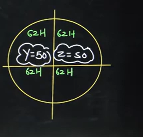

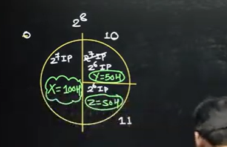

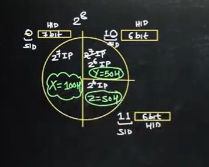

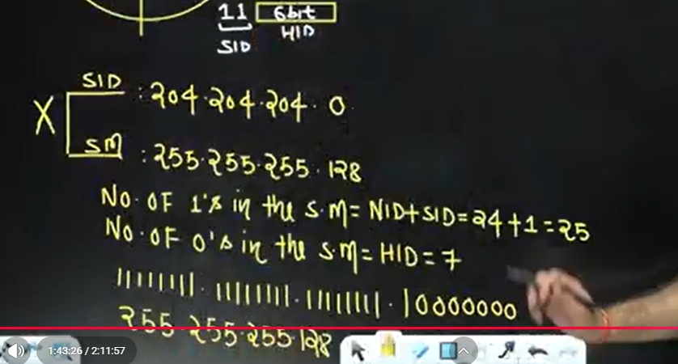

