# Computer Networks 09 | Classless Addressing (Part 2)

Today we will discuss about variable length subnet mask

## VLSM (variable length subnet mask) in CIDR

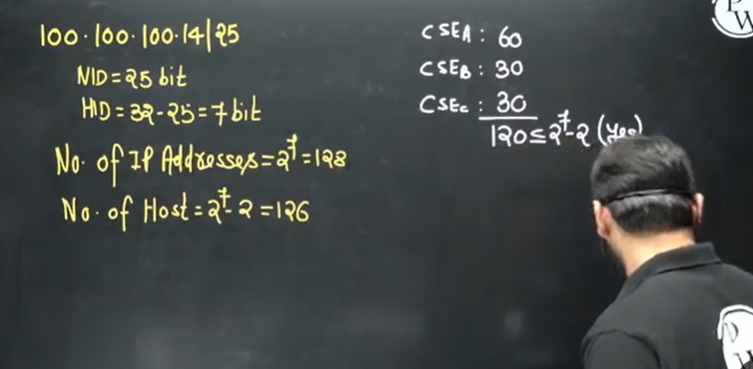

total demands is 120 and we have 126.

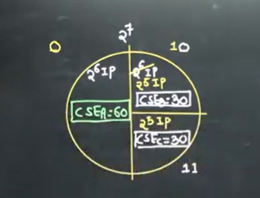

requirement is satisfied in above

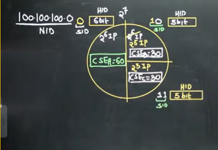

how to find SID and DBA for above CSE section A, CSE section B and CSE section C

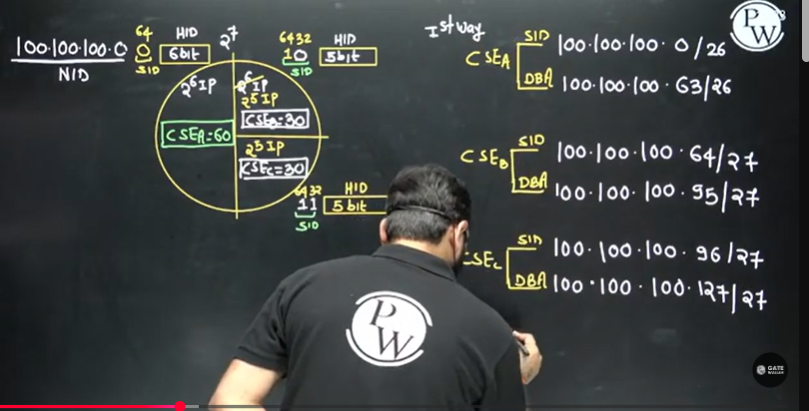

above is first way.

second way -  
We can swap CSE B and CSE C . they can be interchanged as well.

3rd way -  
This time we will give second half to CSE A instead of first half.

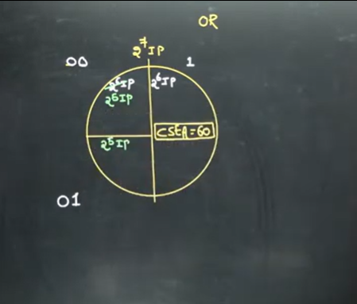

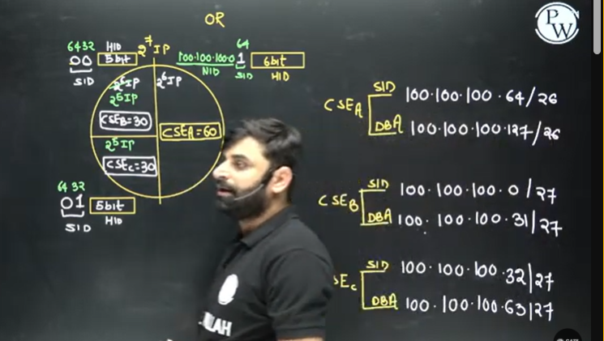

4th way -  

We can swap CSE B and CSE C

## Problems

## Question 1
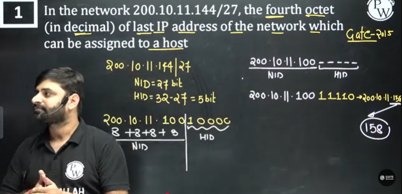

## Question 2

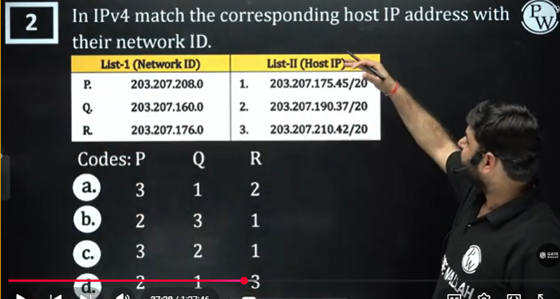

We can easily find out network ID from host ID

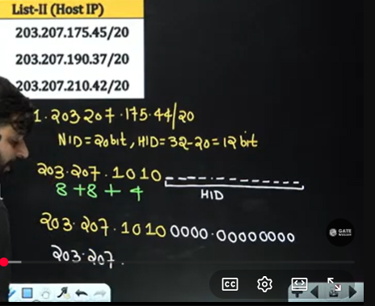

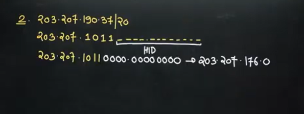

## Question 3
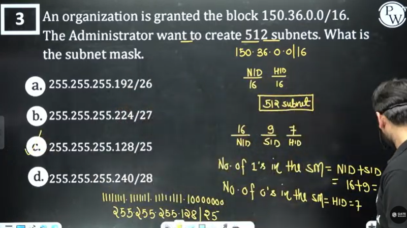

We will need to borrow 9 bits to create 512 subnets
for 4 subnets - 2 bit borrow
for 8 subnets - 3 bit borrow
for 16 subnets - 4 bit borrow
.  
.  

## Question 4
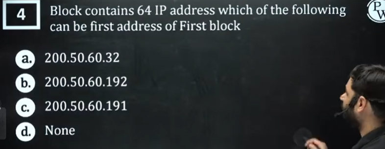

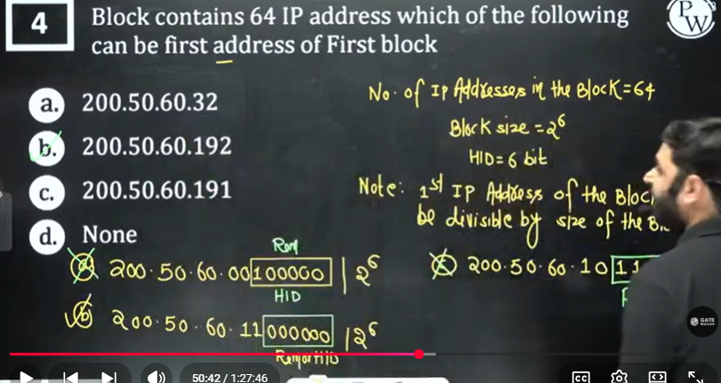

## Question 5

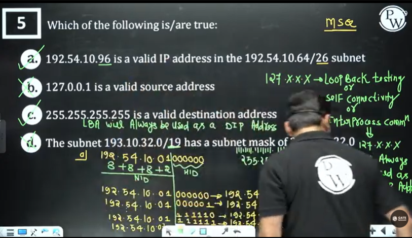

## Question 6

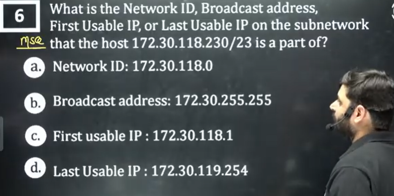

## Question 7

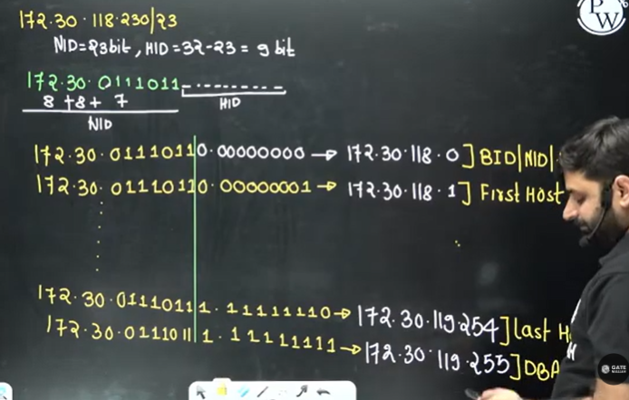

  

 