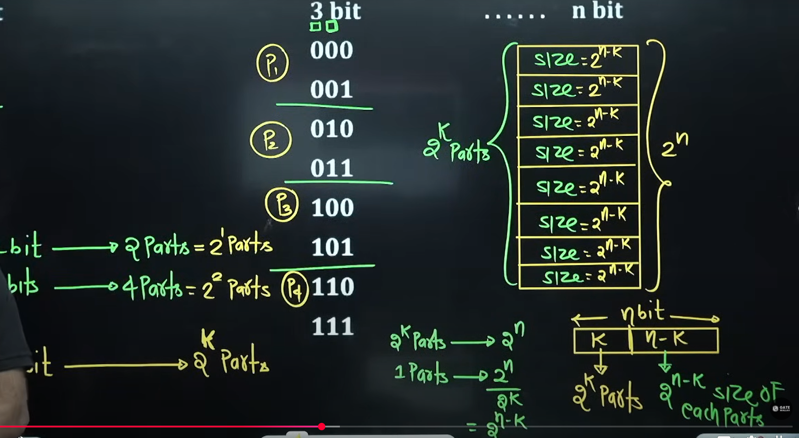
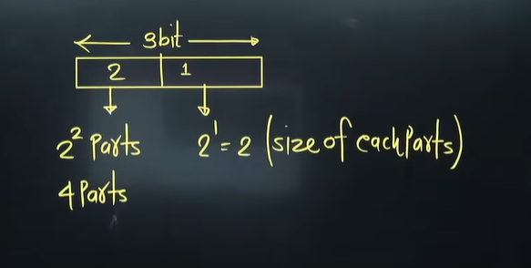
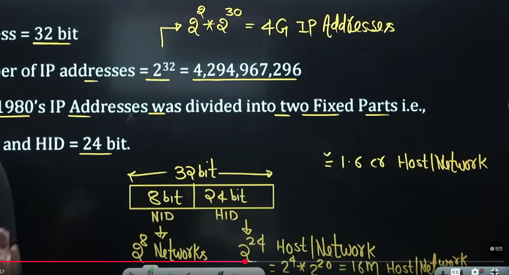
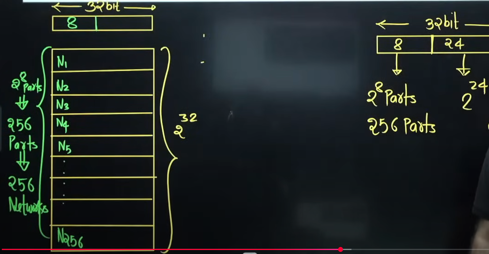
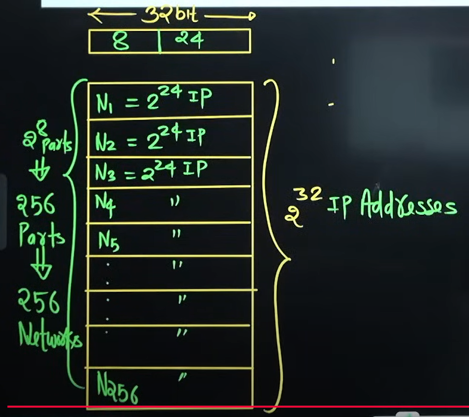
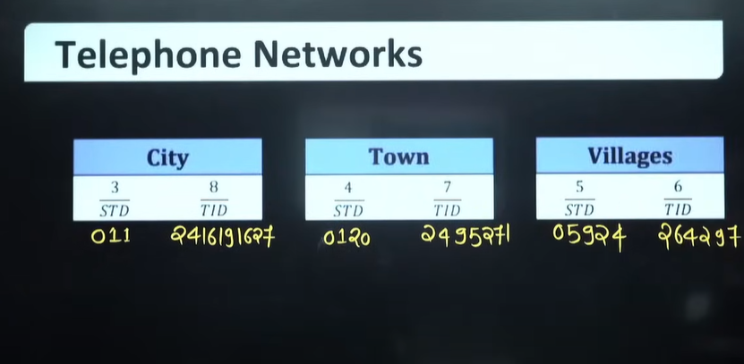
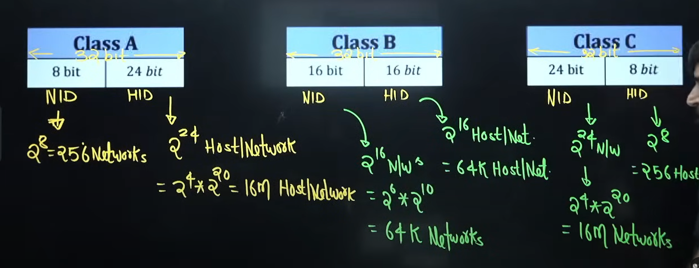
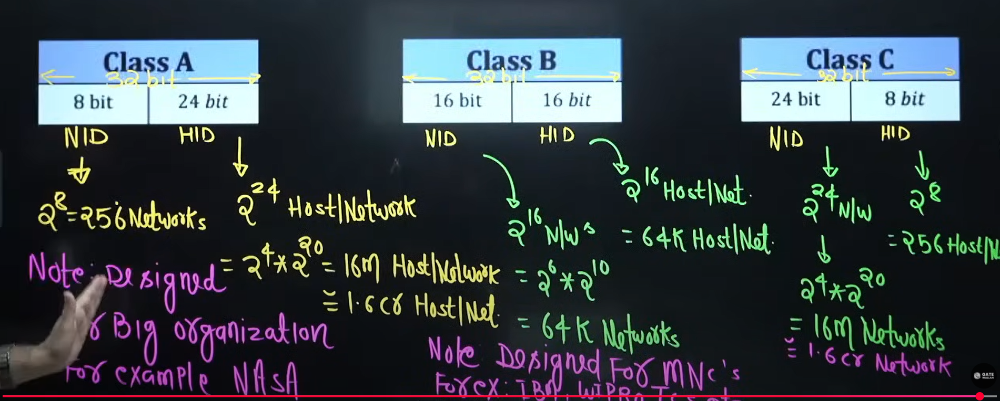

# Syllabus
## IPv4 Addressing
1. Introduction to IP Addressing
2. Classful Addressing
3. Type of communication
4. Subnetting
5. Classless Addressing
6. Subnetting in CIDR
7. Supernetting
8. Supernetting in CIDR

## Error Control
1. Simple parity
2. 2D Parity
3. Checksum
4. CRC
5. Hamming Code

## Flow control at Data Link layer
1. Delay in computer network
2. Stop & wait
3. Go Back-N(GB-N)
4. Selective repeat(SR)

## Internet protocol version(IPv4)
1. IPv4 Header
2. Fragmentation in IPv4

## Transport layer protocol(TCP)
1. TCP Header
2. Wrap Around Time
3. Connection establishment phase
4. Data Transfer phase
5. Connection termination diagram
6. TCP state transition diagram
7. Flags in TCP
8. Flow control in TCP
9. Error Control in TCP
10. TCP timer management
11. Congestion control in TCP
12. Traffic Shaping

## User datagram protocol(UDP)
1. UDP Header
2. Why we need UDP
3. TC vs UDP

## Media Access Control
1. ALOHA
2. CSMA
3. CSMA/CD
4. CSMA/CA
5. Reservation
6. Polling
7. Token passing
8. FDMA
9. TDMA
10. CDMA

## Routing Protocol
1. Shortest Path
2. Flooding
3. Distance vector Routing
4. Link state Routing

## Switching
1. Circuit switching
2. Packet switching
3. Virtual circuit switching
4. Datagram switching

## Application Layer protocol
1. DNS
2. SMTP
3. FTP
4. HTTP
5. Email

## Basics of IP Support Protocol
1. ARP
2. RARP
3. DHCP
4. ICMP

## OSI and TCP/IP protocol Stack
1. OSI Model
2. Functions of OSI Layers
3. TCP/IP Model

## Miscellaneous
1. Network Address Translation(NAT)
2. Ethernet Bridging

# Books
1. Behrouz A. Forouzan
2. Andrew S. Tanenbaum
3. Kurose and ross

* Lectures and notes are enough

# Basics of IP Addressing
2^1 = 2  
2^2 = 4  
2^3 = 8  
2^4 = 16  
.  
.  
.  
2^9=512  
2^10 =1024 = 1K(Kilo)  
2^20 = 1024 * 1024 = 1M(Mega)  
2^30=1024*1024*1024 = 1G(Giga)  
2^40 = 1T(Tera)  
2^50 = 1P(Peta)  
2^60 = 1E(Exa)  
2^70 = 1Z(Zetta)  
2^80 = 1Y(Yotta)  

Bita -> b  
Byte -> B  

1 Byte = 8bits  
1KB = 1024 Byte  
1MB = 1024KB(Kilo Byte)  
1GB = 1024MB(Mega Byte)  
1TB = 1024GB(Giga Byte)  
1EB = 1024PB(Peta Byte)  
1ZB = 1024EB(Exa Byte)  
1YB = 1024ZB(Zetta Byte)  

* Binary Number to decimal number

Weightage =>128,64,32,16,8,4,2,1,0

00000000=0  
00000001=1  
00000011=3(2^2-1)  
00000111=7(2^3-1)  
00001111=15(2^4-1)  
00011111=31(2^5-1)  
00111111=63(2^6-1)  
01111111=127(2^7-1)  
11111111=255(2^8-1)  

* Range pata chal jaayega upar se
  * e.g 8 bit ka number hai => 0 to 2^8-1
  * n bit ka number hai=> 0 to 2^n-1

* Binary number to decimal value

10000000=128  
11000000=192  
11100000=224  
11110000=240[255-15]  
11111000=248[255-7]  
11111100=252[255-3]  
11111110=254[255-1]  
11111111=255  

* 1 bit
  * 0,1 = 2^1 combination
* 2 bit
  * 00,01,10,11 = 2^2 combination banega
  * 1 fix karne par => 2 parts me address space divide hoga
* 3 bit
  * 000,001,010,011,100,101,110,111 =8 = 2^3 combination
  * 1 bit fix karne par => 2 parts me address space divide hoga
  * 2 bit fix karne par => 4 parts me address space divide hoga
* n bit
  * 2^n combination banega

* Address Space
  * 1 bit = 2 = 2^1 parts
  * 2 bits = 4 parts = 2^2 parts
  * Agar mere paas n bit hai toh aur k bits fix kiya toh => address space 2^k parts me divide hoga
  * basically 2^n combination ko 2^k parts me divide kar diya
  * harek parts ka size kitna hota? 2^(n-k) parts

  

# Introduction to IP Addressing
IPv4 Address = 32 bit  
Total number of IP addresses = 2^32 = 4,294,967,296=> more than 4 billion  

2^32 = 2^2*2^30 = (4G IP Addresses)
Initially in 1980's  Addresses was divided into two fixed parts
NID = 8 bit  
HID = 24 bit  
* agar 8 bit ki network id hai toh total combination banega = 2^8 networks
* host id = 24 bits = combination will be 2^24(host/network) = 2^4 * 2^20 = 16M Host/network = approx 1.6 cr Host/network

## Disadvantage
* There are only 256 Network's, and even a small organization must buy 16M computer (HOST) to purchase one network
  

## Solution - classful Addressing

# Telephone Networks
1. 11 digit number
2. Two parts - STD code and TID code
3. Unique  

