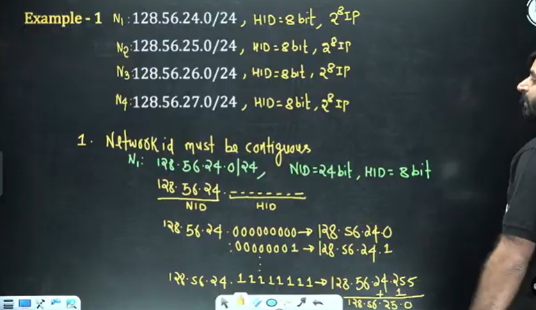
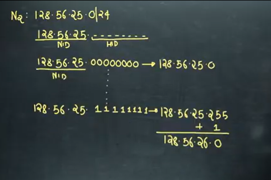
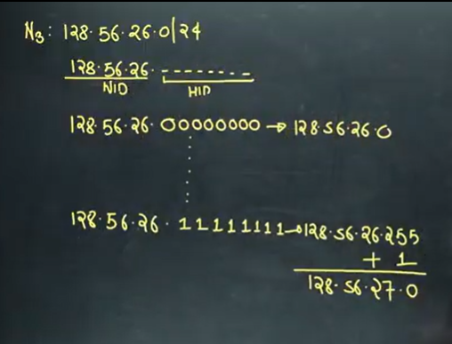
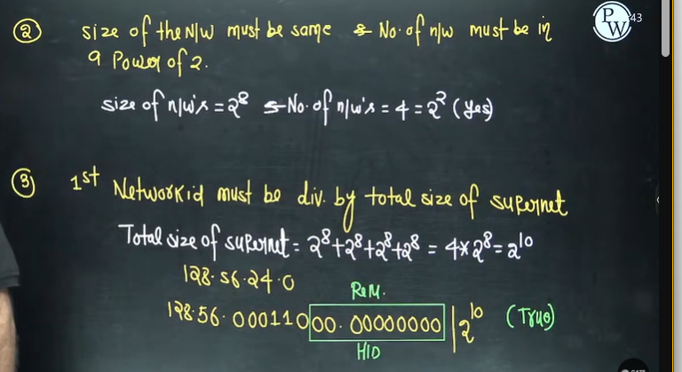
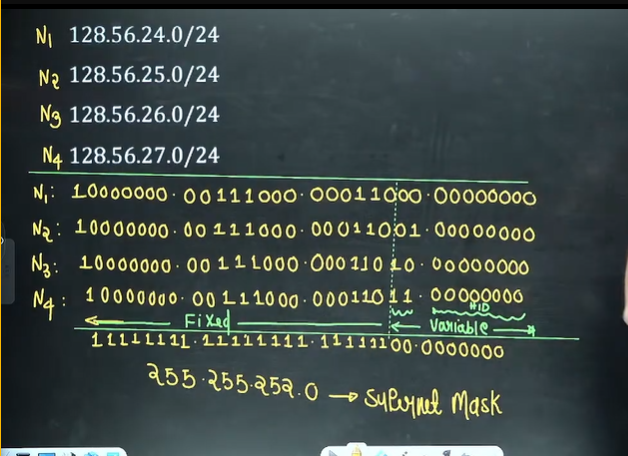

# Computer Networks 10 | Supernetting

```
**Supernetting** (also known as **route aggregation** or **CIDR aggregation**) is a technique in computer networking used to **combine multiple smaller networks (subnets) into one larger network**.

In simple words:
👉 **Subnetting** divides a network into smaller parts.
👉 **Supernetting** does the opposite — it **merges multiple networks into a bigger one**.

---

### 🧠 Let’s break it down

#### 🔹 1. The Problem

Originally, IP addresses were divided into **classes**:

* Class A: 1.0.0.0 – 126.255.255.255
* Class B: 128.0.0.0 – 191.255.255.255
* Class C: 192.0.0.0 – 223.255.255.255

But suppose an ISP owns **16 contiguous Class C networks**, like:

```
192.168.0.0/24
192.168.1.0/24
192.168.2.0/24
...
192.168.15.0/24
```

Advertising all 16 routes separately in a routing table is inefficient — it wastes memory and bandwidth.

---

#### 🔹 2. The Solution → Supernetting

Supernetting allows the ISP to **combine** those 16 networks into **one summarized route**, such as:

```
192.168.0.0/20
```

This single route covers all addresses from **192.168.0.0 to 192.168.15.255**, reducing the routing table size.

---

### 🧩 3. How Supernetting Works

* You **decrease the number of bits** in the subnet mask.
* This makes the network **larger**, combining smaller networks.

For example:

| Before         | After (Supernetted)                |
| -------------- | ---------------------------------- |
| 192.168.0.0/24 | 192.168.0.0/22                     |
| 192.168.1.0/24 | Covers 192.168.0.0 – 192.168.3.255 |
| 192.168.2.0/24 |                                    |
| 192.168.3.0/24 |                                    |

So the /24 networks are merged into one /22 network.

---

### 📘 4. CIDR and Supernetting

Supernetting became possible because of **CIDR (Classless Inter-Domain Routing)**, which ignores the old class system and allows flexible subnet masks — like `/13`, `/20`, etc.
CIDR helps routers to **summarize routes**, reducing the size of global routing tables.

---

### ⚙️ 5. Benefits of Supernetting

✅ Reduces routing table size (fewer entries)
✅ Improves routing efficiency and speed
✅ Saves bandwidth (fewer route advertisements)
✅ Simplifies network management

---

### ⚠️ 6. Conditions for Supernetting

To combine networks:

1. The networks must be **contiguous** (one after another).
2. They must have the **same prefix length**.
3. The resulting network address must start at a boundary that matches the new prefix.

Example:
Merging `192.168.0.0/24` and `192.168.1.0/24` → possible → gives `192.168.0.0/23`
But merging `192.168.0.0/24` and `192.168.2.0/24` → ❌ not possible (not contiguous).

---

### 🧮 Example Calculation

Let’s combine these:

```
Network 1: 192.168.0.0/24
Network 2: 192.168.1.0/24
```

Binary representation:

```
192.168.0.0 = 11000000.10101000.00000000.00000000
192.168.1.0 = 11000000.10101000.00000001.00000000
```

Common prefix = 23 bits
→ Combined supernet: `192.168.0.0/23`

---

### 🧾 Summary Table

| Term             | Meaning                                                                           |
| ---------------- | --------------------------------------------------------------------------------- |
| **Subnetting**   | Divides a large network into smaller ones                                         |
| **Supernetting** | Combines smaller networks into a larger one                                       |
| **CIDR**         | Enables both subnetting and supernetting by allowing variable-length subnet masks |


```

* We will talk about supernetting in both classful and classless addressing

## Supernetting in Classless addressing


Note - Class B, class cannot be combined. It also has some restriction

## Rules for supernetting
a. **Network ID must be contiguous**
Contiguous means IP addresses must be in sequence.

b. **Size of the Network must be same & No. of network must be a power of 2**
c. **First Network ID must be divisible by size of the supernet.**









## Supernet Mask
It is a 32 bit number used to generate a single IP address for the group of network based on the following two rules  

**Rule 1 - No of 1s in the supernet mask indicate fixed part.**  
**Rule 2 - No of 0s in the supernet mask indicate variable part.**



