# Supernetting in Classfull Addressing

## Example 1 - 

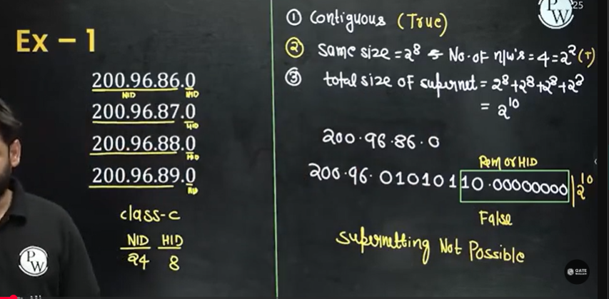

## Example 2 -  

## Concept

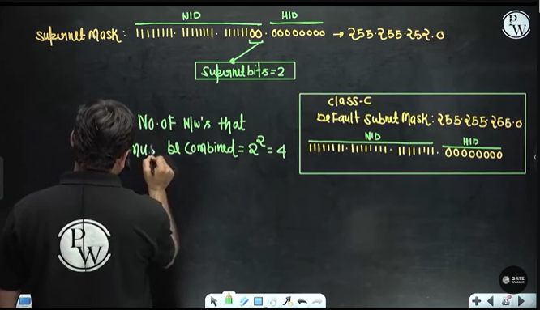

## Example 3

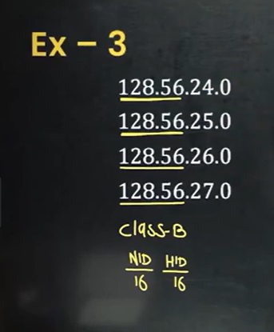

we cannot apply supernetting on single network

## Example 4

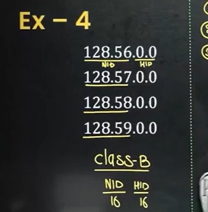

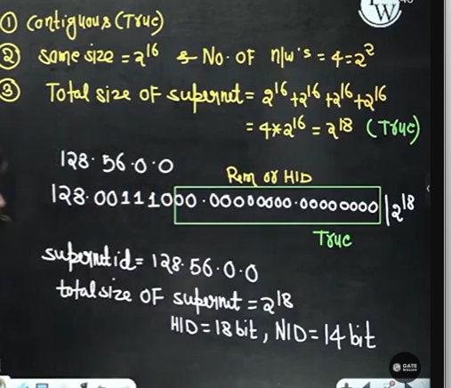

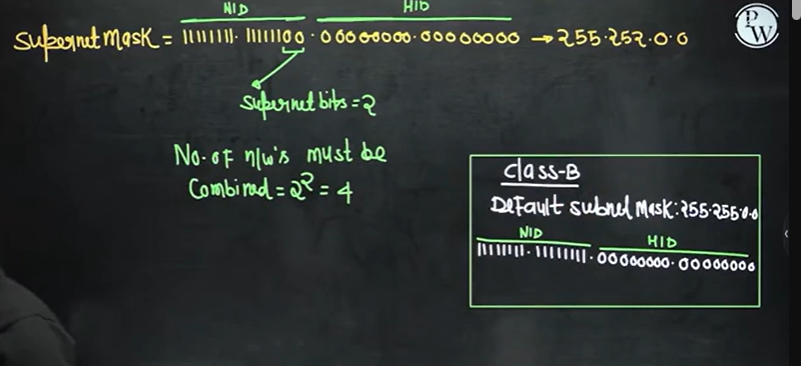

## Difference between Subnet Mask and Supernet Mask

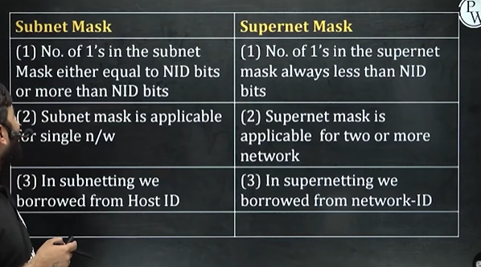

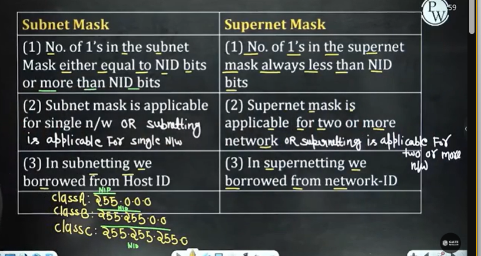

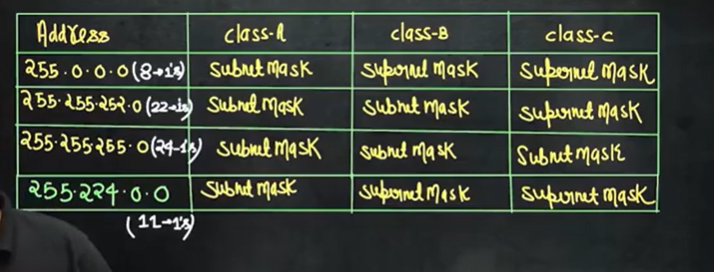

If it is not subnet then it will be supernet. no need to check if it is supernet

## Question 1

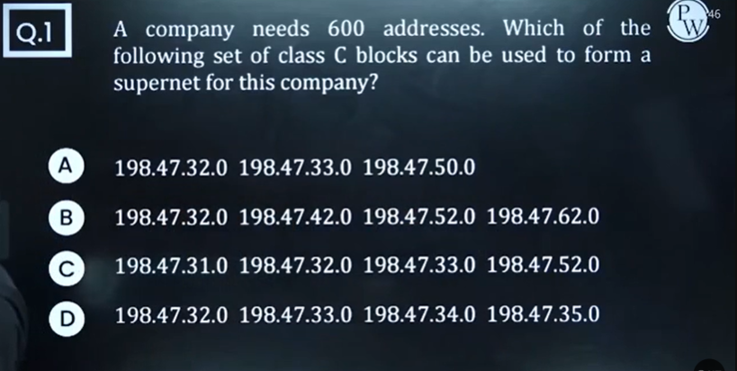

Answer - 1st option

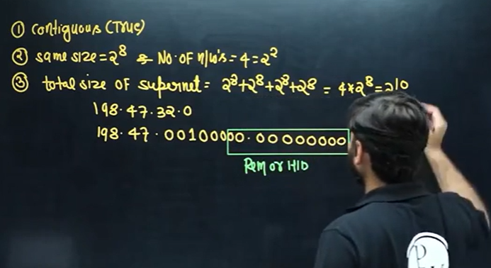

## Question 2

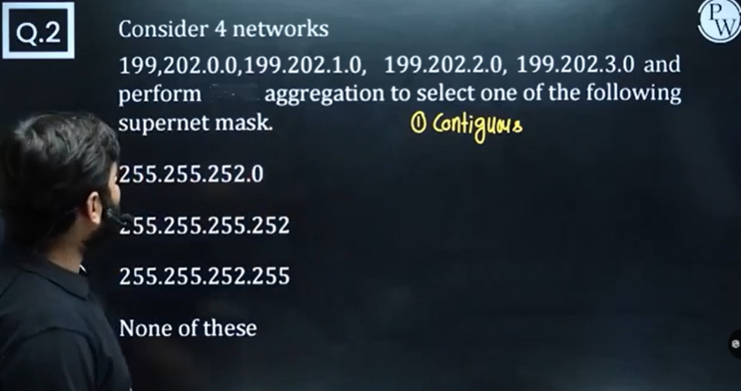

To find the supernet mask, just find the no. of bits in NID and put it as 1. and then find the value.

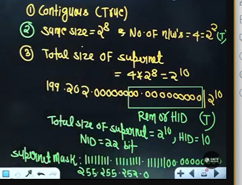

## Question 3

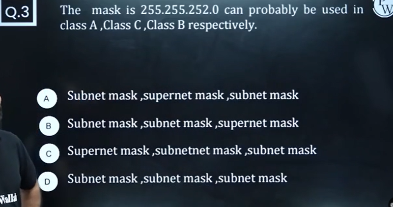

Option A

## Question 4

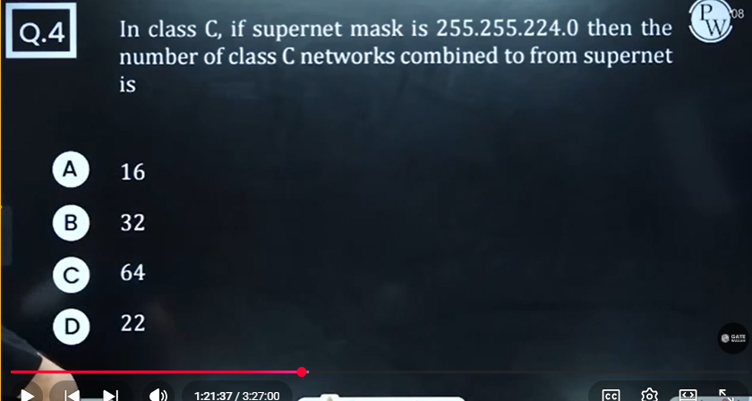

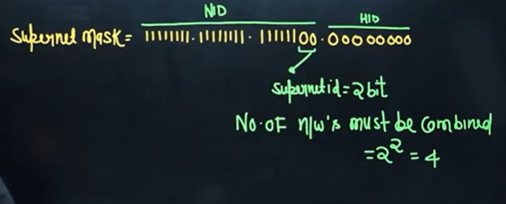

## Question 5

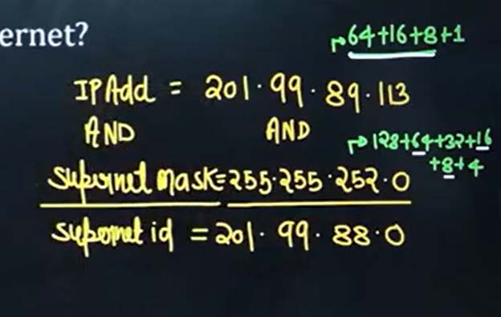

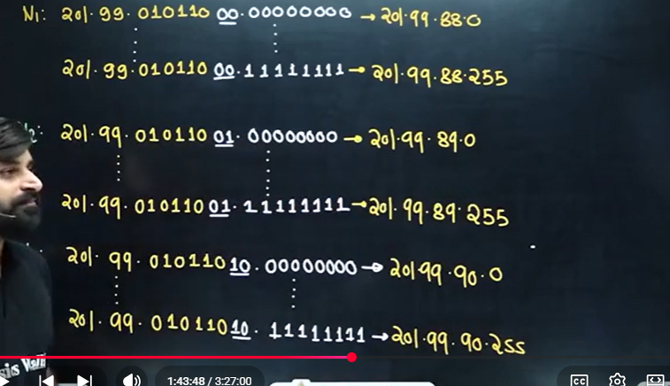

first option will be correct

first supernet ID(00) first ip and last supernet id(11) last ip

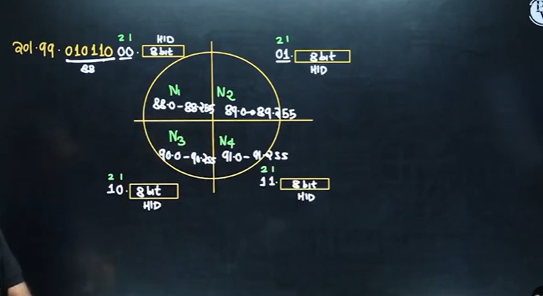

Ultimately findout the supernet ID and last network DBA(direct broadcast address)
no need to find for N2, N3 in above. But questions can be modified for N2, N3 range.

## Question 7

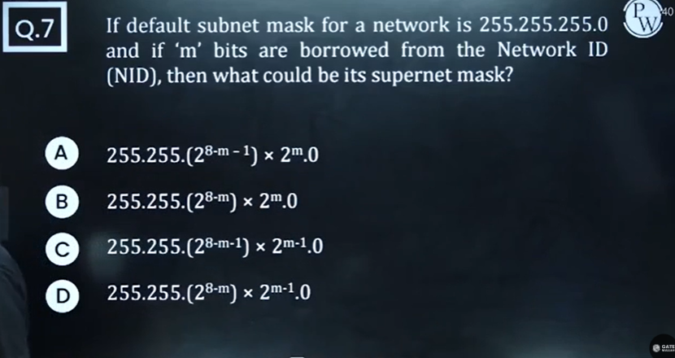

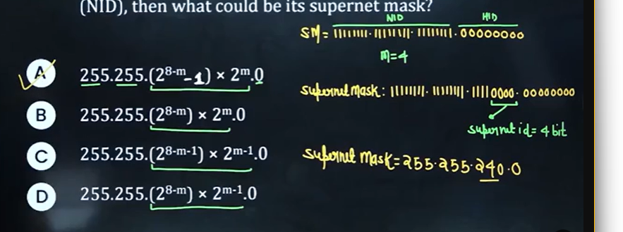

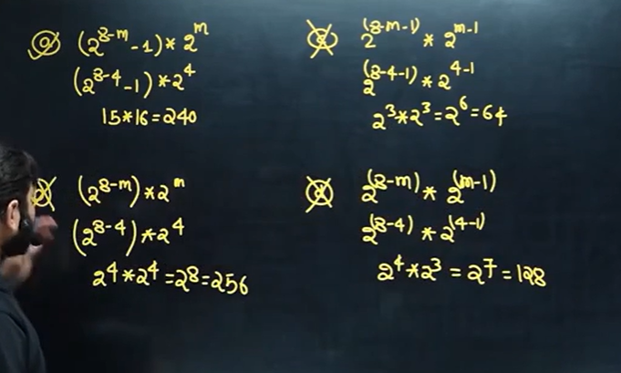

## Question 8

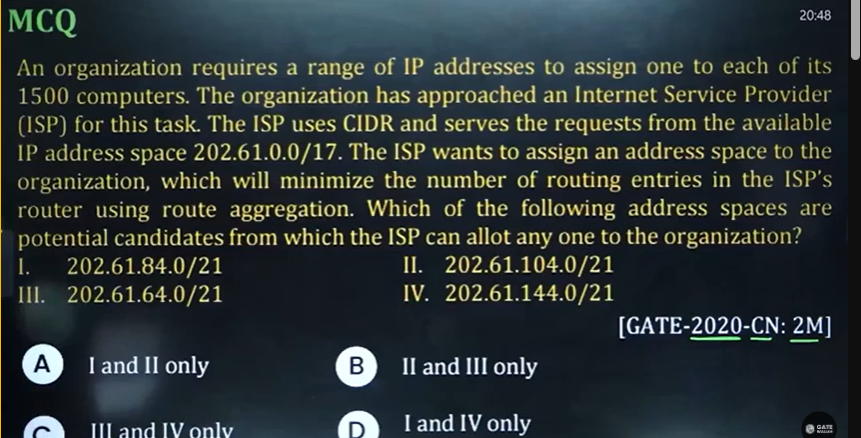

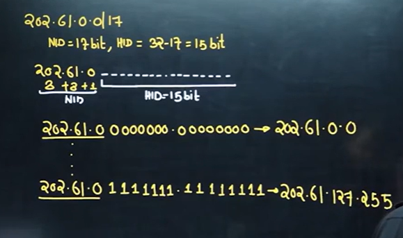

option 4 202.61.144.0/21 will not be correct because it is out of range.  

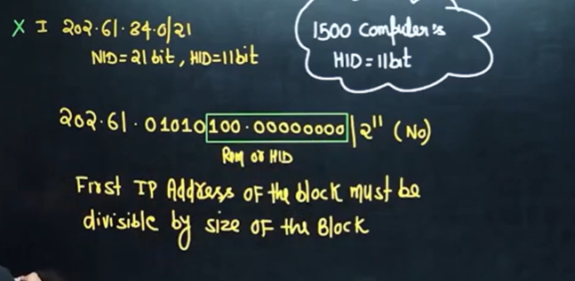

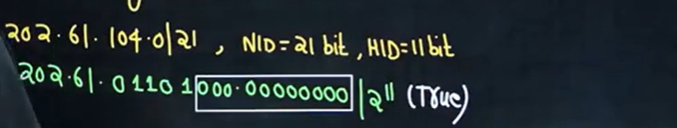

therefore second option is correct

third option is also correct

## Question 9

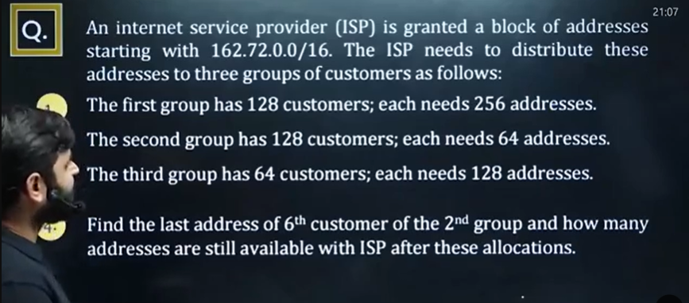