# Types of Error and Hamming Distance

## Error
If data received is not same as the data sent then this means error has occured.

Types of Errors -  
1. Signle-Bit error
2. Burst Error  

## Single bit error - 
The term single bit error means that only 1 bit of given data unit is changed from 1 to 0 or 0 to 1.

e.g.  
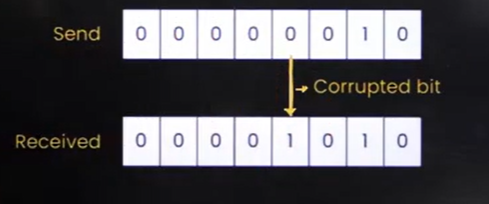

## Burst Error
The term burst error means that 2 or more bits in the data unit have changed from 1 to 0 or from 0 to 1.  

 
Note - **Burst Length** - To find the burst error mark the first bit which has changed and last bit and then count the number of bits

Which error has more chance to get affected?

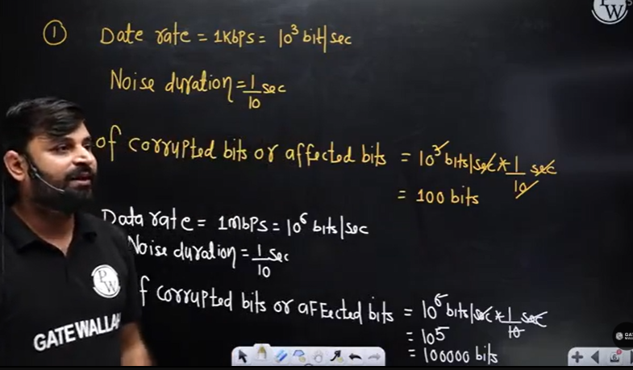

So burst bit error has more chance.

**Formula -**  
Number of corrupted bits or affected bits = Data rate * Noise duration

## Redundancy 
1. The central concept in detecting or correcting error is Redundancy.
2. To be able to detect or correct the errors, we need to **send some extra bits with our data**. These redundant bits are added by the sender and removed by the receiver.

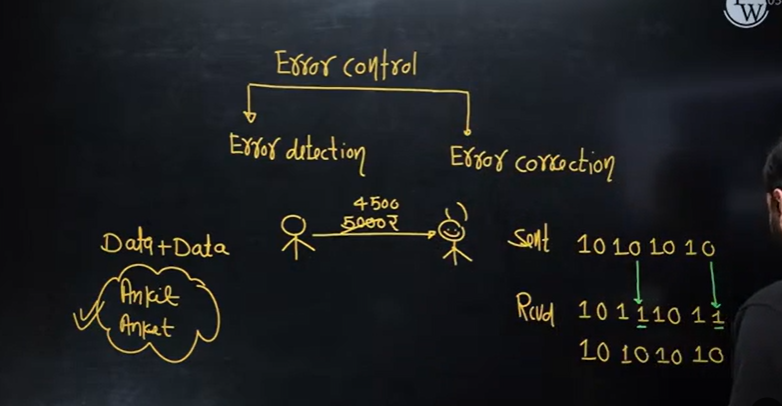

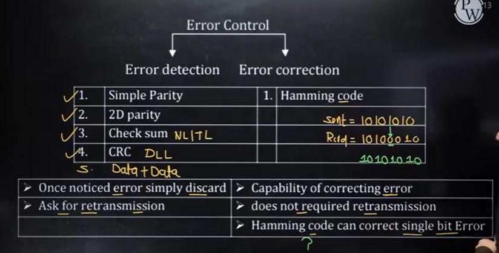

## Hamming Distance
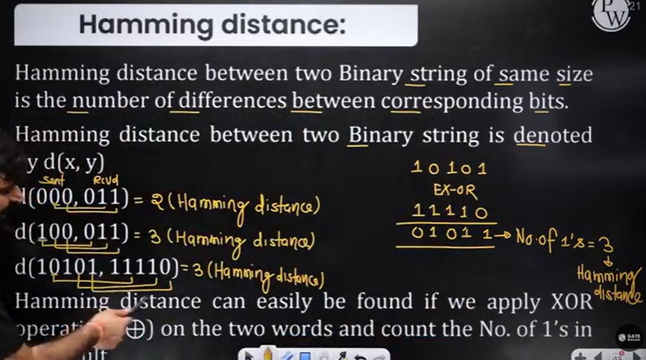

To find the hamming distance just find out how many bits have changed. but if data size increases it's better to go with ex-or method

How to find Ex-OR?
To find the hamming distance just do the ex-or operation between two set of data or more

0 ex-or 0 = 0  
0 ex-or 1 = 1  
1 ex-or 1 = 0  
1 ex-or 0 = 1  

Basically ex-or is Mod2Addition or Mod2Sum

add the bits and then divide by 2. remainder is the output

1 ex-or 1 ex-or 1 = 1

## Minimum Hamming Distance

## Minimum Hamming Distance for Error Detection

Minimum Hamming distance required **to detect d bit error = d+1**

Minimum hamming distance required  **to correct "d" bit error = 2d + 1**

## Question 1

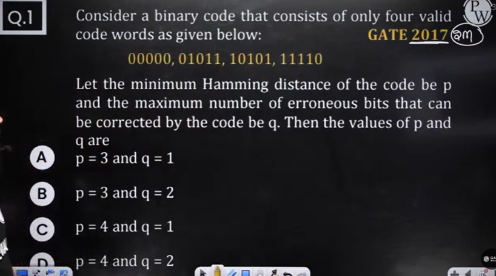

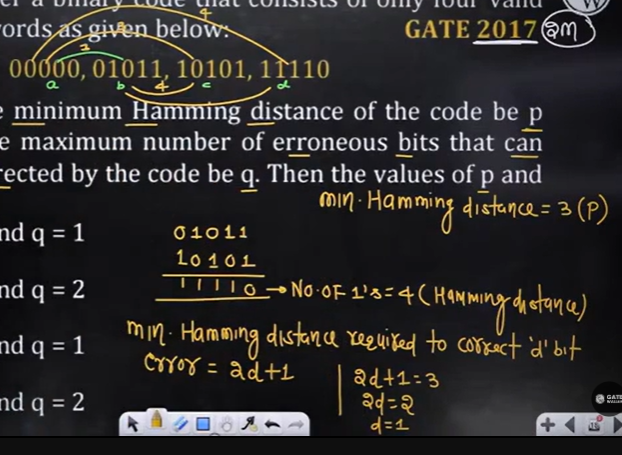

Least number of bits changed is 3  
So minimum hamming distance is 3  
So p = 3  

Now q is for how many bits error can be corrected  
now, wkt minimum hamming distance required to correct d bit error = 2d + 1  
so, 2d+1 = 3  
2d = 2  
d = 1  
so q is 1.

p = 3 and q = 1
 
## Question 2

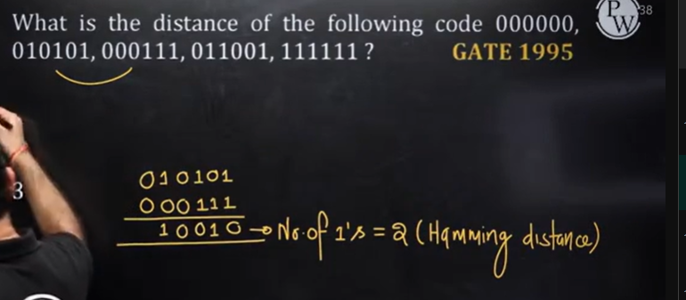

Distance means it's asking for minimum hamming distance  
No pair has only 1 bit changed so d is not correct option.
minimum bits changed in any pair is 2. so that's the answer.  

## Question 3

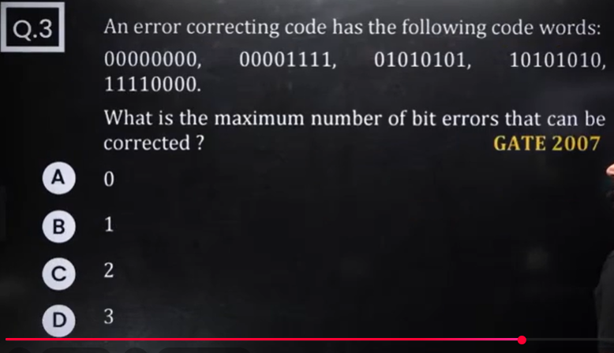

Least no. of bits changed in any pair is 4  

so minimum hamming distance is 4  

minimum distance required to correct 'd' bit error is 2d+1  

so 2d+1 = 4  
d = 1.5  
now lower boundry or upper boundry  
take lower boudary  
d = 1  
why lower boundry?  

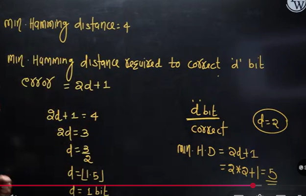

## Question 4

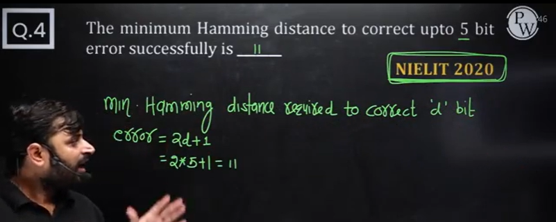

In above question it is asking for "correct" d bit error so formula will be 2d+1

in this question we are given with d value which is equal to 5  
so put d = 5 in 2d+1  
so it is 11  

## Question 5
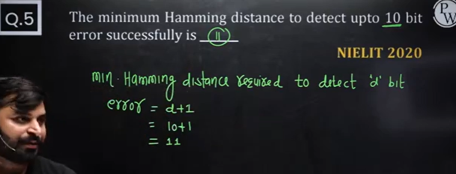

in above question it is asking for "detect"

## 🧩 **1. Types of Errors in Computer Networks**

When data is transmitted over a communication channel (like a wire, fiber, or wireless medium), **errors** can occur due to noise, interference, or signal distortion.

There are mainly **two types of errors**:

### 🔹 **A. Single-bit Error**

* **Definition:** Only **one bit** in the data unit (like a byte or frame) is altered (flipped from 0→1 or 1→0).
* **Example:**

  * Sent: `1011001`
  * Received: `1001001`  ← (the 2nd bit got changed)
* **Usually happens:** in **wired channels**, where noise bursts are short.

---

### 🔹 **B. Burst Error**

* **Definition:** **Two or more consecutive bits** are changed during transmission.
* **Example:**

  * Sent: `1011001`
  * Received: `1000111`  ← (bits 2, 3, and 4 got altered)
* **Usually happens:** in **wireless channels**, where interference lasts longer.
* **Burst length:** is the number of bits from the **first corrupted bit to the last corrupted bit**, including both.

---

There are also **classifications** based on error detection/correction concepts:

| Type                 | Description                                             | Example                              |
| -------------------- | ------------------------------------------------------- | ------------------------------------ |
| **Random Error**     | Bits are changed at random positions                    | `1010101 → 1110001`                  |
| **Systematic Error** | A pattern or repeated disturbance affects specific bits | Signal distortion or faulty hardware |
| **Detected Error**   | Error detected by the receiver using parity, CRC, etc.  | Receiver requests retransmission     |
| **Undetected Error** | Error that slips past detection mechanism               | Dangerous in critical systems        |

---

## 🧮 **2. Hamming Distance**

### 🔹 **Definition**

The **Hamming Distance** between two binary strings of equal length is the **number of bit positions where the bits differ**.

👉 It measures **how different two codewords are**.

### 🔹 **Formula**

[
\text{Hamming Distance (d)} = \text{Number of positions where bits differ}
]

### 🔹 **Example**

Compare `1011101` and `1001001`
Positions that differ: (2nd, 4th, 6th) → 3 differences
✅ **Hamming Distance = 3**

---

## 🧠 **Use of Hamming Distance in Error Detection and Correction**

| Purpose              | Requirement                                                                                              | Explanation                                     |
| -------------------- | -------------------------------------------------------------------------------------------------------- | ----------------------------------------------- |
| **Error Detection**  | Code must have a minimum Hamming distance **≥ 2**                                                        | It can detect **single-bit errors**             |
| **Error Correction** | Code must have a minimum Hamming distance **≥ 3**                                                        | It can **detect and correct single-bit errors** |
| **General Formula**  | To detect up to *d* errors → ( d_{min} = d + 1 )   To correct up to *t* errors → ( d_{min} = 2t + 1 ) | Used to design error-correcting codes (ECC)     |

---

### 🔹 **Example — Hamming Code**

Suppose we design a code with a **minimum Hamming distance of 3**:

* If one bit flips (error), we can **detect and correct** it.
* If two bits flip, we can **detect** but not **correct** them.

---

### 🧩 **Quick Summary**

| Concept              | Meaning                                      | Example                         |
| -------------------- | -------------------------------------------- | ------------------------------- |
| **Single-bit Error** | Only one bit changed                         | `1010 → 1110`                   |
| **Burst Error**      | Multiple consecutive bits changed            | `1010 → 1100`                   |
| **Hamming Distance** | Number of bit differences                    | `1011` vs `1001` → 1 difference |
| **d_min = 3**        | Can detect 2-bit errors, correct 1-bit error | Used in Hamming codes           |

