# Computer Networks 12 | CRC & Checksum

## CRC - Cyclic Redundancy Check
* Length of the dataword = n
* Length of the divisor = k
* Append (k-1) Zero's to the original message
* Perform modulo 2 division
* Remainder of division = CRC
* Code word = n+k-1
Note - CRC must be (k-1) bits
* Codeword = dataword with Appended(k-1) Zero's + CRC

Chart -  

example - 

If the CRC is 4 bit add 3 zeros to the data  
If the CRC is 5 bit add 4 zeros to the data  

Perform modulo 2 division(basically apply ex-or) operation  

After performing, again start from leading 1

0 ex-or 1 is 1  
1 ex-or 0 is 0  
0 ex-or 0 is 0  
1 ex-or 1 is 0  

The remainder is the answer
when to stop? divisor length is 4 bit and remainder is 3 bit.  

So codeword will be 1001001**111**

basically whatever remainder you got replace it with the zeros appended in the data.

**If Receiver received uncorrupted data**  

CRC is 3 bit so remainder is 3 bit - 3 zeros

**Syndrom = 0** 

so dataword will be accepted = [1001001]

And if remainder would have been non-zero receiver would then reject it

**If Receiver received corrupted data**  
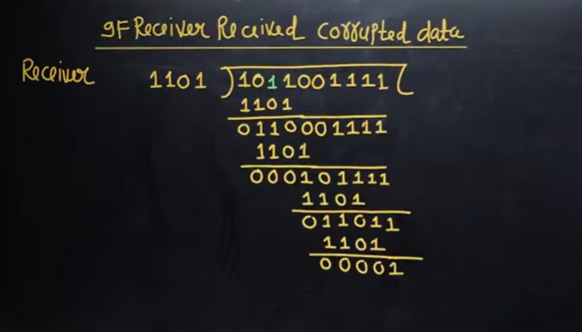

so in above syndrom not equal to zero  
so dataword will be rejected
so that means there is some error in that.
CRC is error detection scheme. but which bit is changed reciver doesn't know  

## Polynomial Notation in CRC(Cyclic Redundancy Check)
* Data word = d(x)
* Codeword = c(x)
* Generator = g(x)
* Syndrome = s(x)
* Error = e(x)

## How to apply the CRC step by step
1. Determine the degree 'r' of g(x) (highest power)
2. Determine x^rd(x)
3. Determine the remainder by dividing x^rd(x) by g(x)
4. Codeword = x^rd(x) + remainder

Let's take an example -  

First find d(x) -  
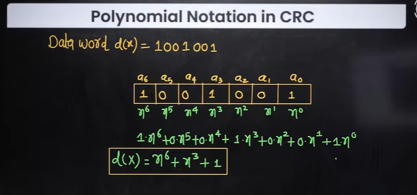

**step1 -** 

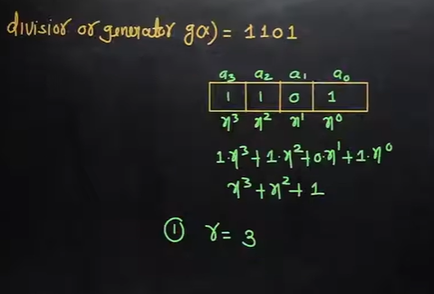

**step2 -** 

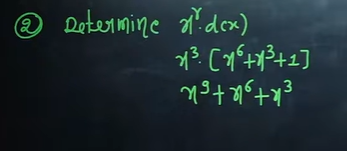

above is nothing but data with appended zeros  

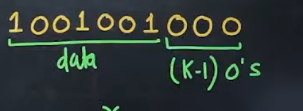

**step3 -** Determine the remainder by dividing x^r.d(x) by g(x)

g(x) = x^3 + x^2 + 1   
r = 3  
d(x) = x^9 + x^6 + x^3  

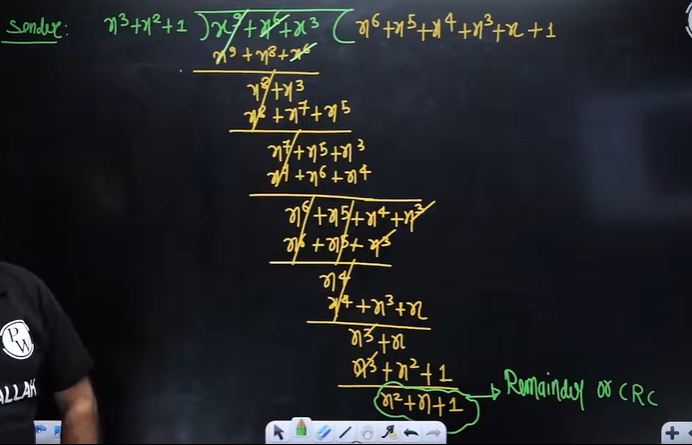

above x^9 and x^6 will be cancelled but not by concept of substraction

x^9 means 9th bit is 1 , so by ex-or 1 , 1 becomes 0  

similarly for x^6  

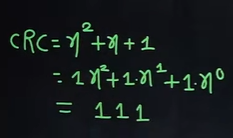

so from above image CRC is 111 which is same as previous example  

**step 4 -**  
codeword = x^r.d(x) + Remainder  
x^9 + x^6 + x^3 + x^2 + x + 1  

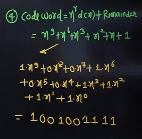

## Question 1

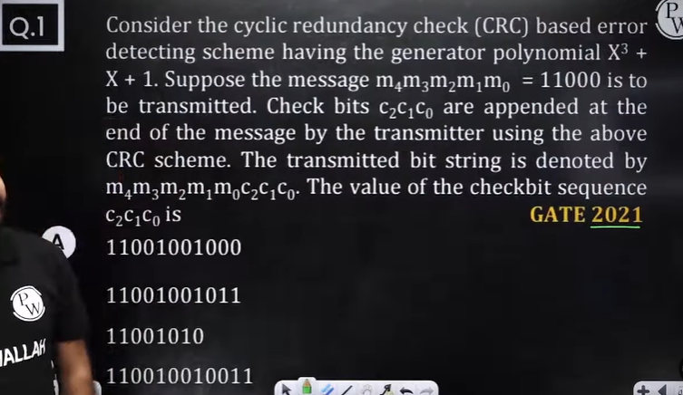

options are wrong in above questions.

generator = x^3 + x + 1  

message = 11000  

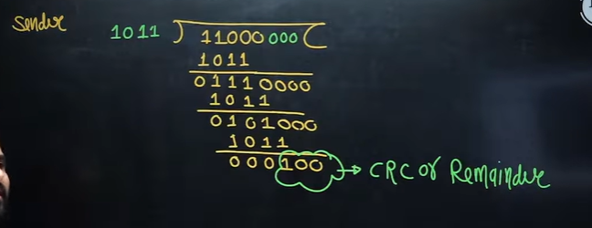

Ans is 100  

## Question 2

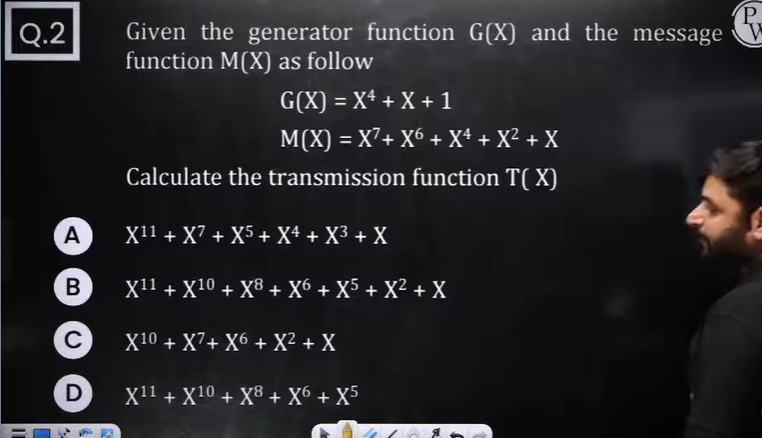

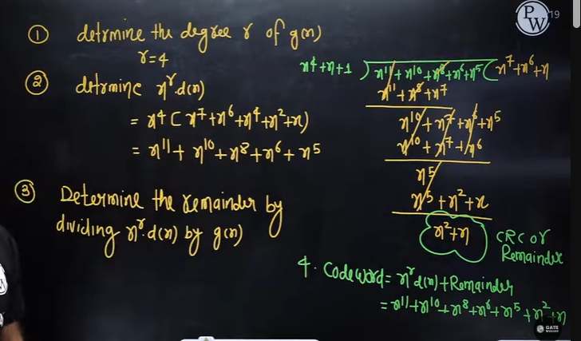 

option b is correct. Also after solving till step 2, options become clear

## Question 3

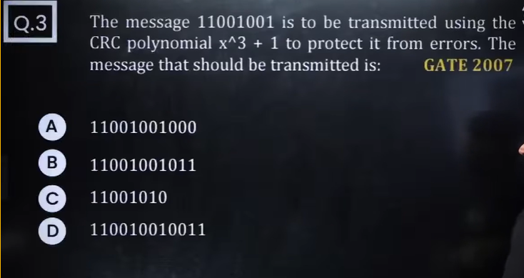

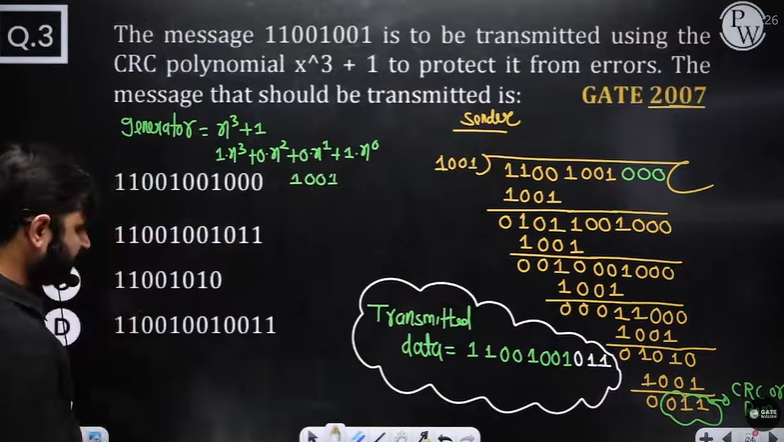

option b is correct

## Question 4

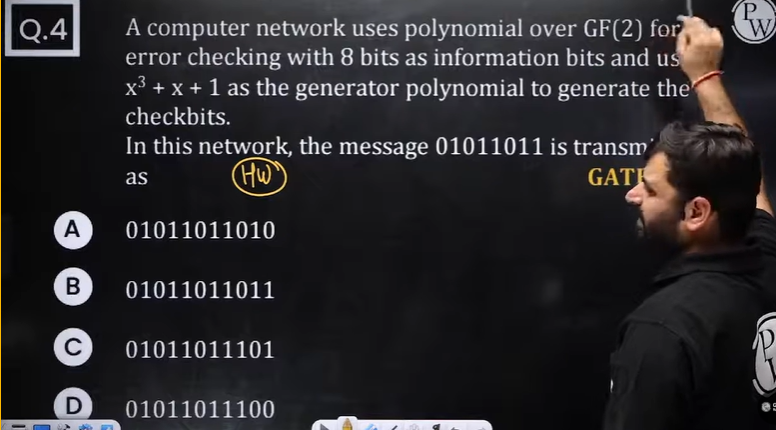

## Question 5

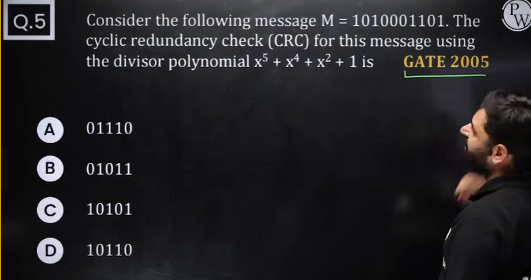

## Question 6

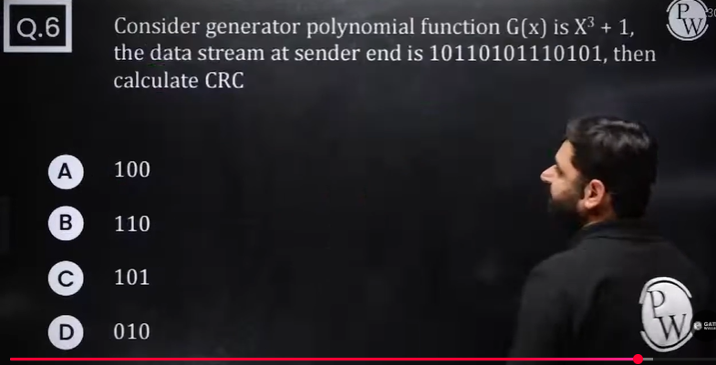