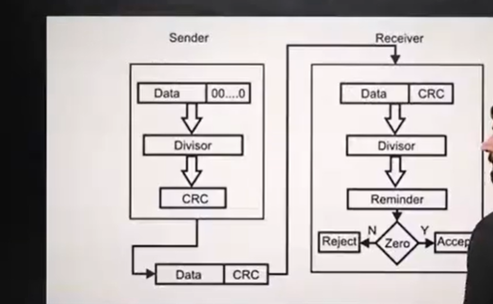
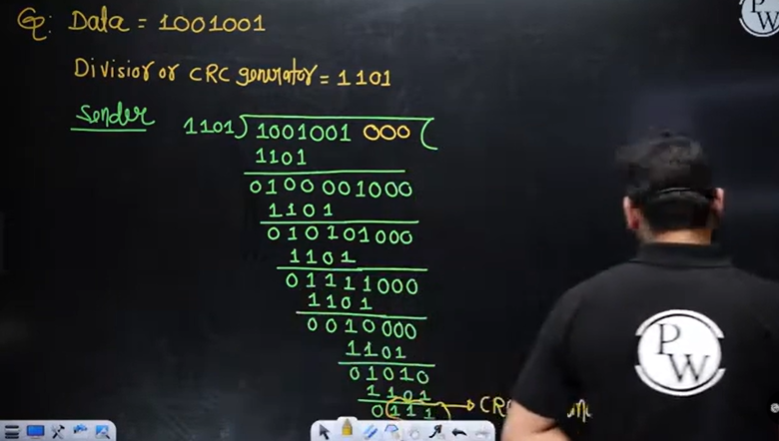
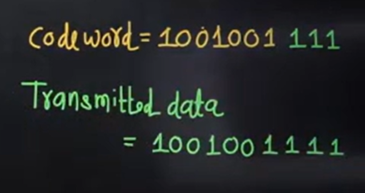
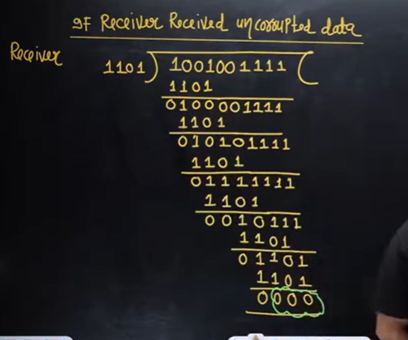

# Computer Networks 12 | CRC & Checksum

## CRC - Cyclic Redundancy Check
* Length of the dataword = n
* Length of the divisor = k
* Append (k-1) Zero's to the original message
* Perform modulo 2 division
* Remainder of division = CRC
* Code word = n+k-1
Note - CRC must be (k-1) bits
* Codeword = dataword with Appended(k-1) Zero's + CRC

Chart -  

example - 

If the CRC is 4 bit add 3 zeros to the data  
If the CRC is 5 bit add 4 zeros to the data  

Perform modulo 2 division(basically apply ex-or) operation  

After performing, again start from leading 1

0 ex-or 1 is 1  
1 ex-or 0 is 0  
0 ex-or 0 is 0  
1 ex-or 1 is 0  

The remainder is the answer
when to stop? divisor length is 4 bit and remainder is 3 bit.  

So codeword will be 1001001**111**

basically whatever remainder you got replace it with the zeros appended in the data.

If Receiver received uncorrupted data  

CRC is 3 bit so remainder is 3 bit - 3 zeros

**Syndrom = 0** 

so dataword will be accepted = [1001001]

And if remainder would have been non-zero receiver would then reject it