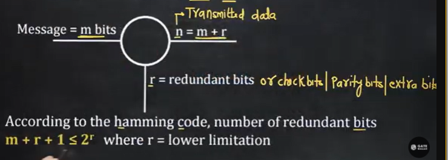
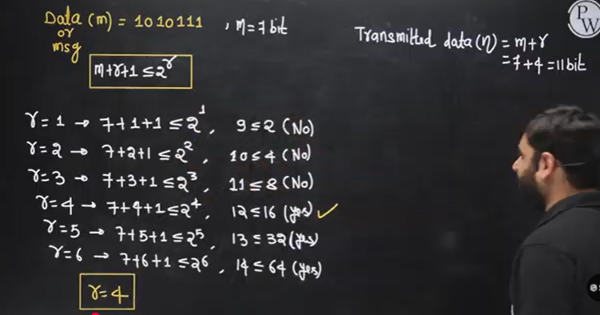
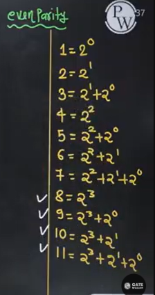
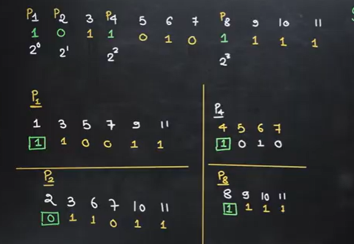
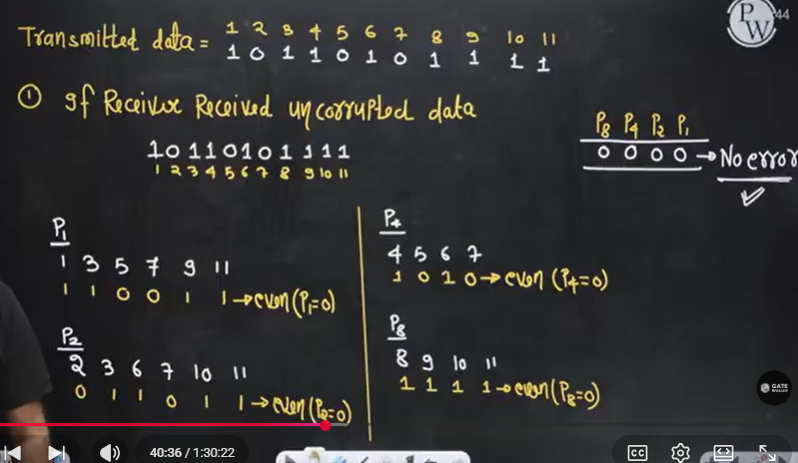
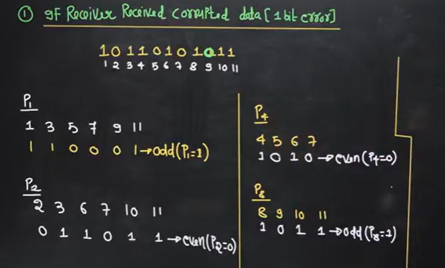
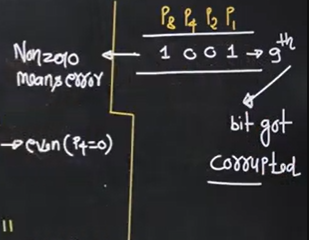
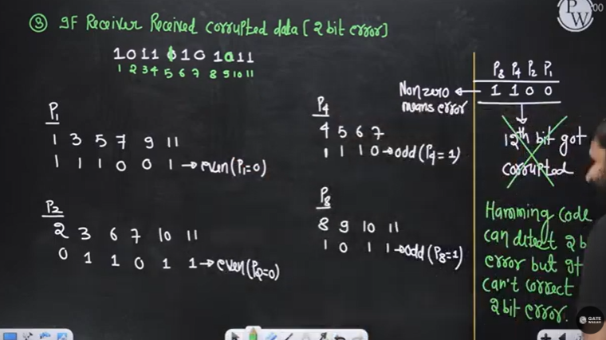
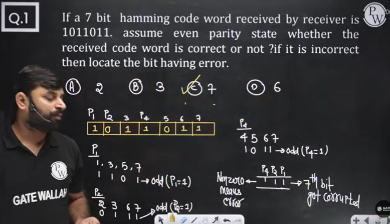

# Computer Networks 13 | Hamming Code

* Hamming code can **correct 1 bit error** only.
* Hamming code **can detect upto 2 bit error.**
* Hamming code is **used for error correction.**

Example -  

redundant bits positions or parity bits positions = 2^i where i>=0

2^0, 2^1, 2^2, 2^3, ....  
1,2,4,8....  

so, Transmitted data = 10110101111  

1. If receiver received uncorrupted data - 

2. If Receiver received corrupted data (1 bit error)

convert 1001 which is non-zero into decimal. so 9th bit is corrupted.

3. Case 3 - If Receiver received corrupted data (2 bit error)  

## Question 1

