# Computer Networks 15 | Delay in Computer Network

* **Bandwidth** - Bandwidth represent the rate at which no. of bits **placed on the link** in one sec.
* **Velocity** - Represent the rate, distance covered in one sec.

## Example for above

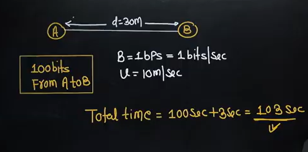

1 bit is put on the link in one second. for 100 bits it will be 100 seconds. And last bit travel time is taken(why) to transfer from A to B which is 3 second.

## Delay in Computer Network
1. Transmission delay - Td
2. Propagative delay - Pd
3. Queuing delay - Qd
4. Processing delay - Prd

## Transmission delay - 
Time taken to transfer a packet **on to the outgoing Link** is called as Transmission delay
> It's basically time taken to transfer th packet to the link

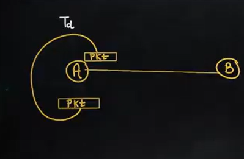

Example 1 -  

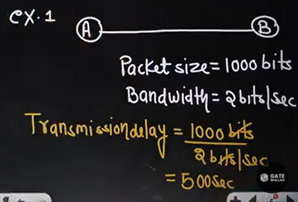

Example 2 -  

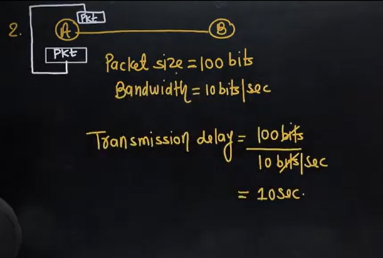

Now what will be the generalize formula for Transmission delay?  

**Transmission delay = Packet Size or Length of the packet/Bandwidth**  

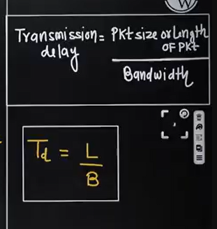

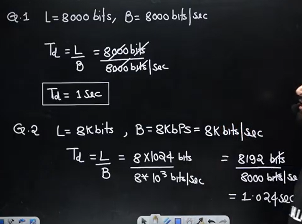

Remember this table -  

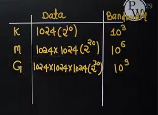

## Propagative Delay
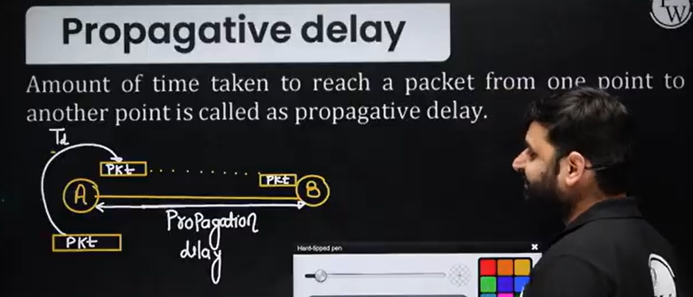
Here packet travels from A to B

Example -  
 
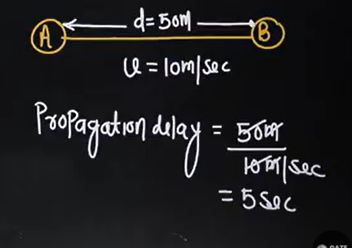

Propagation delay = Distance/Velocity  
Pd = d/u

## Question 1

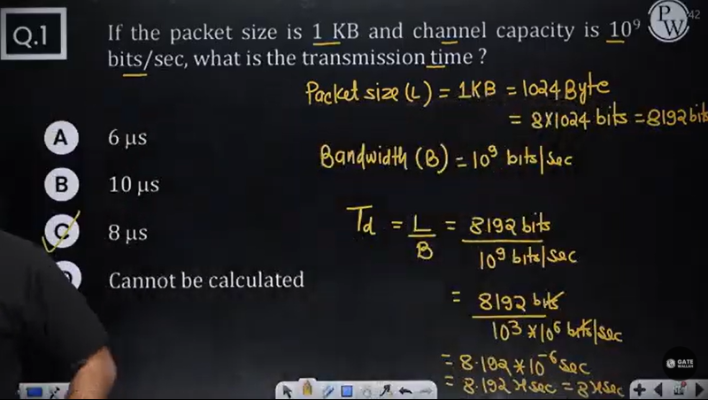

## Question 2

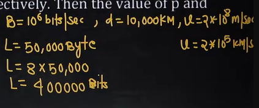

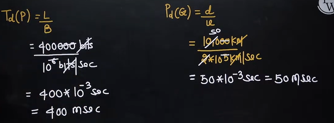

d is the correct option

## Question 3
