# Computer Networks 15 | Stop & Wait Protocol | Computer Science & IT | GATE Crash Course

> Revise , so that you don't forget

## Flow Control
Flow control coordinate the **amount of data** can be sent **before receiving the acknowledgement**

Buffer capacity = 25 bits

**Analogy** - Teaching by an Instructor and learning speed of students

* Flow control protocols  
  * **Noiseless Channel**(perfect channel, no packet lost, no corrupted packet)
    * 1. Simplest protocol(not in GATE syllabus)
    * 2. Stop wait protocol
  * **Noisy Channel**(data loss, frame loss, acknowledgement loss or duplicate packets are possibility)
    * 1. Stop wait ARQ(Automatic repeat request)
    * 2. Go-back-N ARQ(GBN ARQ)
    * 3. Selective Repeat ARQ

## Nosieless channel - 1. Stop and Wait Protocol
1. Used in **connection-oriented** communication
   1. > Connection are of two types. Connection oriented and connection less. Here first we need to establish connection.
2. Stop and wait protocol is a flow control for Transmission of **frames** over **noiseless channel**.

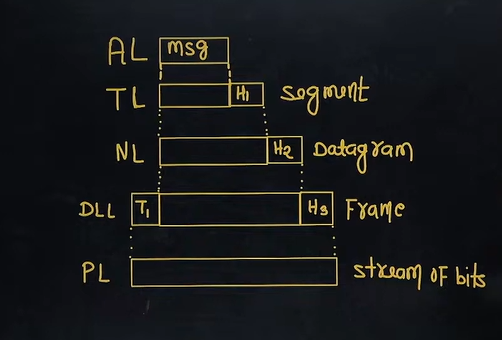

3. It provides **unidirectional** data transmission with flow control facilities **without error control**
   1. We don't have any solution if something gets corrupted in the packet
4. The idea of stop and wait protocol is straightforward.
   1. After transmitting one Frame, the sender waits for an acknowledgement before transmitting the next frame.

## Primitives of Stop and Wait protocol
Sender Side -   
Rule 1 - Send one data packet at a time  
Rule 2 - Send the next packet only after receiving the ACK for the previous packet.  

Receiver Side -   
Rule 1 - Receive and consume the data packet.
Rule 2 - After consuming packet, Ack need to be sent.

## Problems of stop & wait Protocol
1. **Lost data packet**  

Note -   
* Sender wait for ACK for an infinite amount of time
* Receiver wait for data an infinite amount of time

2. **Lost Acknowledgement**

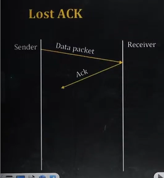

Note - Sender wait for an infinte amout of time for Acknowledgement

3. Delay Acknowledgement

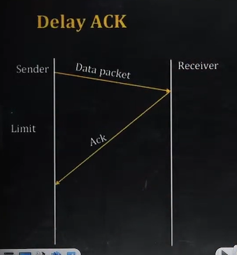

Note - Delay Acknowledgement might be wrongly considered as an Acknowledgement of some other packet.

Above 3 Problems are resolved by using stop and wait ARQ(Automatic Repeat Request)

## Noisy Channel - Stop and Wait ARQ
1. It Provides both **Error control** and **flow control**
   1. > simple "stop and wait protocol" only provided flow control.
2. Error control in stop and wait ARQ is done by **keeping a copy** of sent frame until it receives an acknowledgment.
   1. > It will keep data in the buffer
3. Sender start a timer when it send a frame. If ACK is not received with in the allocated time period, the sender assume that the frame was lost or damage and resends it.
4. Receiver send an Acknowledgement to sender. If it receives a frame correctly.
5. ACK number always define the number of the Next expected frame.
   1. example - refer below diagram

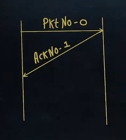

6. Stop and wait ARQ = Stop and wait + Time out + sequence Number(Data Packet) + sequence Number(ACK)

1. Solution of lost data packet -  

2. Solution of Lost Acknowledgement

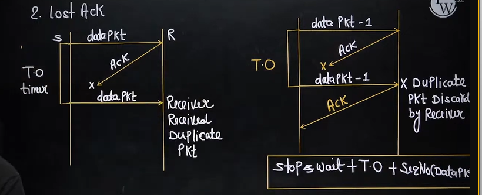

3. Solution of Delay Acknowledgement

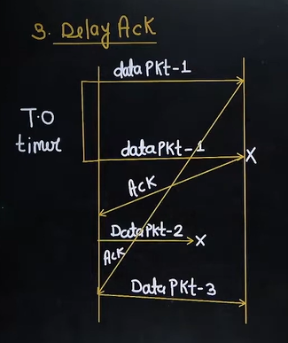

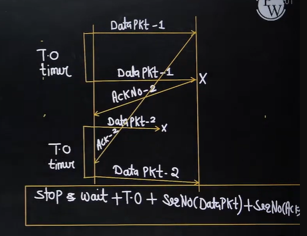

## Efficiency OR Line Utilization OR Link Utilization OR Sender Utilization

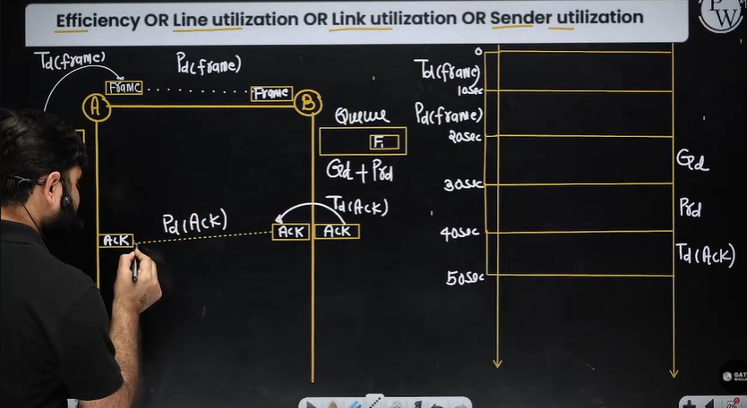

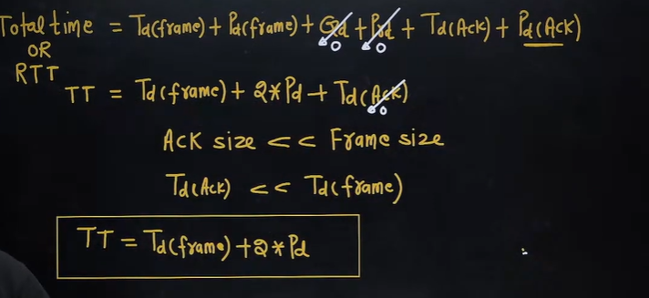

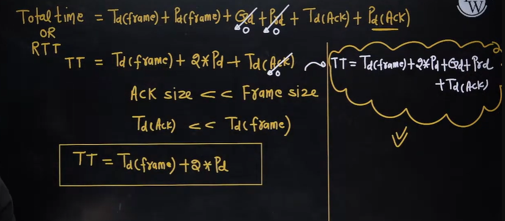

formula of efficiency -  

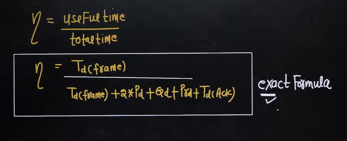

## Throughput OR effective Bandwidth or Bandwidth utilization OR Maximum data

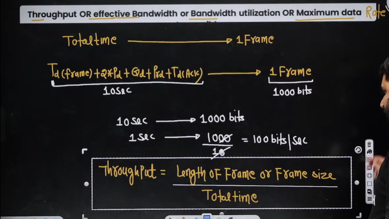

