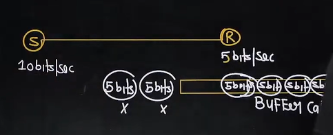

# Computer Networks 15 | Stop & Wait Protocol | Computer Science & IT | GATE Crash Course

> Revise , so that you don't forget

## Flow Control
Flow control coordinate the amount of data can be sent before receiving the acknowledgement

Buffer capacity = 25 bits

Analogy - Teaching by an Instructor and learning speed of students

* Flow control protocols
  * Noiseless Channel
    * 1. Simplest protocol
    * 2. Stop wait protocol
  * Noisy Channel
    * 1. Stop wait ARQ(Automatic repeat request)
    * 2. Go-back- N ARG
    * 3. Selective Repeat ARG

## Stop and Wait Protocol
