# Computer Networks 16 | Go Back-N Protocol | CS & IT | 

## Question 5

Now substitue the values

 

 ## Question 6

 

 

## Question 7

## Question 8
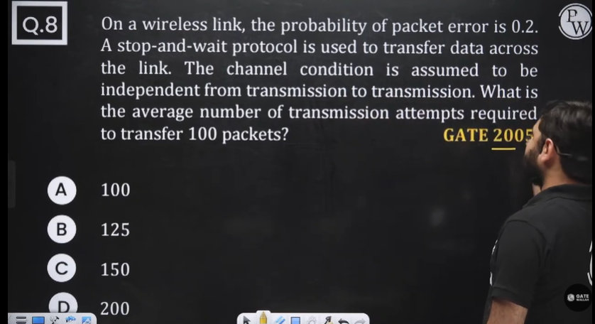

same question as discussed in last lecture

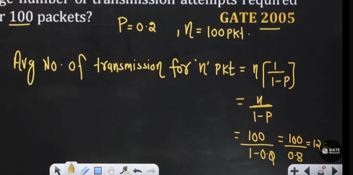

## Question 9

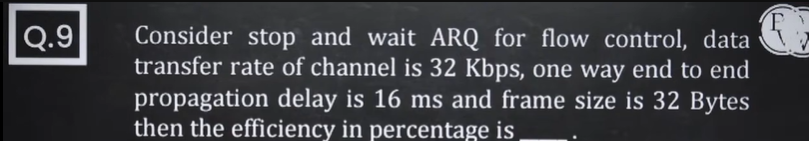

Same question - directly use the general formula and substitue the values

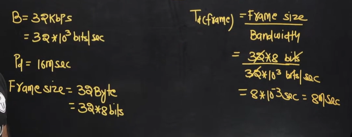

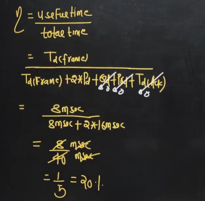

## Question 10

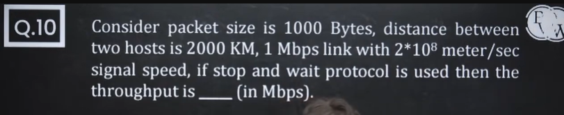

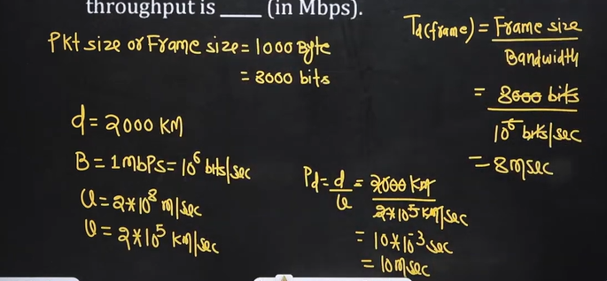

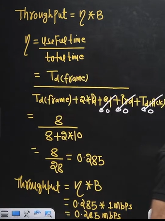

Throughput by another formula -   

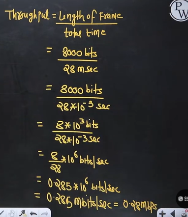

## GO Back-N ARQ
* Sliding Window
  * GB-N
  * S-R

**Sliding Window** - In the Sliding window concept instead of sending one packet and wait for the acknowledgement, we send 'w' packet and wait for the Acknowledgement. Where 'w' is the sender window size.

## GB-N(N>1)
1. In the GB-N the sender window size is N itself
   1. > e.g. GB-5 where 5 is sender window size
2. In the GB-N the **receiver window size** is **equal to one** always
   1. > e.g. GB-10 . In this window sender size is 10. And window receiver size is equal to 1
   2. > e.g. GB-15 . In this windows sender size is 15 and window receiver size is 1.

## e.g. GB-5
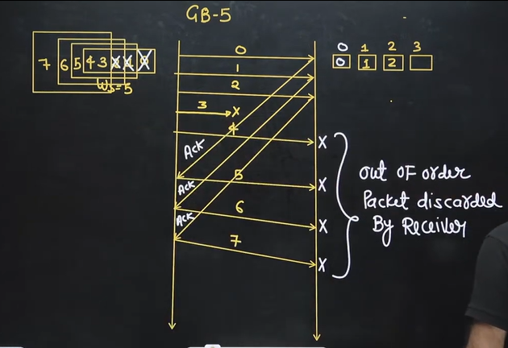

* Sender window size is 5 i.e. WS = 5. It means sender has buffer size available to store 5 packets.
* Sliding window means - Now sender will not send one packet. It will send complete window. Here we have 5 packets. एक बार में 1 पैकेट नहीं भेजेगा, एक ही बार में 5 पैकेट भेजेगा
* Reciever window size is 1
* सेंडर उस पैकेट को अपने मिमोरी में रखेगा जबतक उसका Acknowledgement ना आ जाए
  * Suppose If Acknowledgment does not come then packet would have got lost. And so for that I need to retransmit it again. So for that I need to keep it in memory. So I won't delete it from sender until Acknowledgment doesn't come from receiver
* So e.g. if acknowledgement of 2 comes 2 will be deleted from sender and 7 will be added in sender's buffer memory by sliding the window. And then 7 will be sent to the receiver.
* Now suppose 3 packet is lost while sending. So sender will not receive the acknowledgment from receiver. so question is does receiver will accept the packet 4,5,6, or 6.? The answer is NO. it will discard those packet. **It will not accept out of order packet**

Question - Why receiver doesnot accept out of order packets? because it's size is 1.  

So above problem is solved by SR  

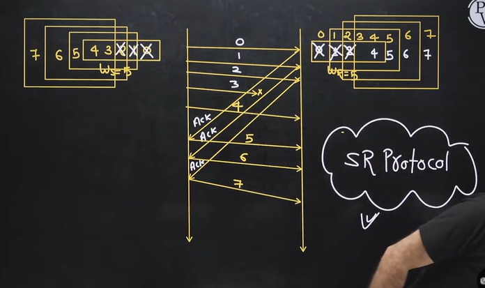

* Now Since sender will not receive the acknowledgement , it will come to know that 3rd packet would have been lost. And will also know that next packets - 4,5,6,7 would also been discarded by reciever. since reciver size is 1. So it will go back 5 from last transmitted packet.

Time-out timer is maintained only for lost packet. Because other packets would have been discarded by reciver, so there is no requirement to maintain for 4,5,6 or 7 packet  

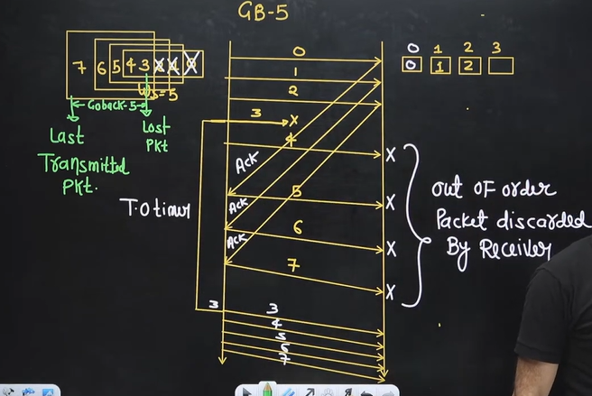

Note -  
1. Go-Back-'N' is always from last transmitted packet.

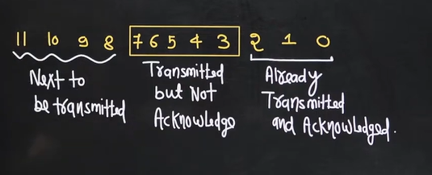

**Note -**  
1. Out of order Packet is not received by the receiver. 
2. Timer is maintained only ofr the first frame(right most) in the window because if its timer expire then sender assume that rest of the frames are not received by receiver (because out of order delivery is rejected)

## Question 

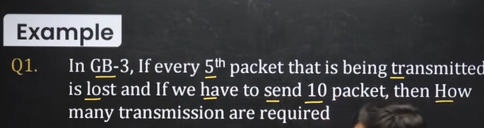

