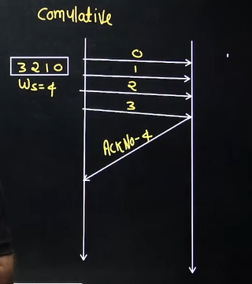
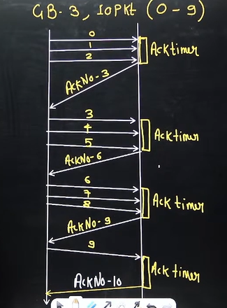
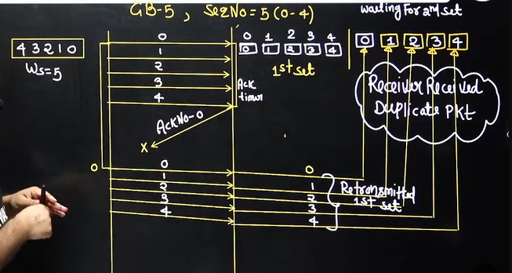

# Computer Networks 17 | Go Back-N Protocol - 02

## Types of Acknowledgement
The term **acknowledgment (ACK)** refers to feedback sent by a receiver to inform the sender that data was received successfully. Depending on the protocol and context, acknowledgments can be categorized in a few important ways:

---

# ✅ **1. Positive Acknowledgment**

* The receiver sends an **ACK** to confirm successful reception of a packet or frame.
* Used in most reliable protocols.
* Example: TCP acknowledgment.

**Effect:** Sender knows it can safely send the next data.

---

# ❌ **2. Negative Acknowledgment (NACK or NAK)**

* The receiver sends a **NACK** to indicate that a packet was corrupted or missing.
* Example: ARQ protocols like Stop-and-Wait ARQ optionally support NACK.

**Effect:** Sender retransmits the specific packet indicated.

---

# 🕒 **3. Cumulative Acknowledgment**

* The receiver sends an ACK for the **highest in-order sequence number** received.
* Acknowledges multiple packets with one ACK.
* Used in TCP.

**Example:**
If packets 1, 2, 3, 4 were received, receiver sends ACK = 5
(meaning: expecting 5 next).

---

# 📦 **4. Selective Acknowledgment (SACK)**

* Used when packets can arrive out of order.
* Receiver tells exactly **which packets were received**, not just cumulative.
* Helps avoid unnecessary retransmissions in TCP.

---

# 🔁 **5. Delayed Acknowledgment**

* Receiver intentionally waits for a short time before sending ACK.
* Used to reduce overhead by combining ACKs.
* Common in TCP (typical delay: ~200 ms).

---

# ⚡ **6. Immediate (or Piggybacked) Acknowledgment**

* ACK is sent immediately when data is received.
* Often piggybacked with outgoing data to reduce traffic.

Example:

* In full-duplex TCP, ACKs can be attached to outgoing data packets.

---

# 📡 **7. Implicit Acknowledgment**

* ACK is not sent explicitly; instead, correct behavior implies acknowledgment.
* Example: In **Ethernet CSMA/CD**, if no collision feedback is detected, it's assumed the frame succeeded.

---

# 🔄 **8. ACK in ARQ Protocol Context**

Automatic Repeat reQuest (ARQ) protocols use ACK/NACK schemes:

| ARQ Protocol         | ACK Type Style  |
| -------------------- | --------------- |
| Stop-and-Wait ARQ    | Positive & NACK |
| Go-Back-N ARQ        | Cumulative ACK  |
| Selective Repeat ARQ | Selective ACK   |

---

# 🌐 **Transport Layer Perspective**

TCP acknowledgments include:
✓ cumulative ACK
✓ selective acknowledgment (optional via SACK option)
✓ delayed ACK
✓ piggybacked ACK

---

# **In Summary**

**Types of acknowledgments in computer networks can be classified as:**

✔ **Positive ACK**
✔ **Negative ACK (NACK)**
✔ **Cumulative ACK**
✔ **Selective ACK (SACK)**
✔ **Delayed ACK**
✔ **Immediate / Piggybacked ACK**
✔ **Implicit ACK**

## Acknowledgement
Two types -  
1. **Independent**
   1. > Suppose we have sender size 4
   2. > Independent each packet we will have separate acknowledgement
   3. > Packet number 0 acknowledgement number will be 1. Similarly for packet 1, ACK number will be 2

2. **Cumulative**
   1. > After receiving group of packets, it will send 1 Acknowledgement

> Now we have a question? 
>  In cumulative after how many packet it will send the acknowledgement?

Note - GBN uses cumulative Acknowledgement and Acknowledgement number defines the number of next expected Frame

> **ACK Timer is less than Time out timer**

## Relationship between window size & Sequence number

