# Computer Networks 17 | Go Back-N Protocol - 02

## Types of Acknowledgement
The term **acknowledgment (ACK)** refers to feedback sent by a receiver to inform the sender that data was received successfully. Depending on the protocol and context, acknowledgments can be categorized in a few important ways:

---

# ✅ **1. Positive Acknowledgment**

* The receiver sends an **ACK** to confirm successful reception of a packet or frame.
* Used in most reliable protocols.
* Example: TCP acknowledgment.

**Effect:** Sender knows it can safely send the next data.

---

# ❌ **2. Negative Acknowledgment (NACK or NAK)**

* The receiver sends a **NACK** to indicate that a packet was corrupted or missing.
* Example: ARQ protocols like Stop-and-Wait ARQ optionally support NACK.

**Effect:** Sender retransmits the specific packet indicated.

---

# 🕒 **3. Cumulative Acknowledgment**

* The receiver sends an ACK for the **highest in-order sequence number** received.
* Acknowledges multiple packets with one ACK.
* Used in TCP.

**Example:**
If packets 1, 2, 3, 4 were received, receiver sends ACK = 5
(meaning: expecting 5 next).

---

# 📦 **4. Selective Acknowledgment (SACK)**

* Used when packets can arrive out of order.
* Receiver tells exactly **which packets were received**, not just cumulative.
* Helps avoid unnecessary retransmissions in TCP.

---

# 🔁 **5. Delayed Acknowledgment**

* Receiver intentionally waits for a short time before sending ACK.
* Used to reduce overhead by combining ACKs.
* Common in TCP (typical delay: ~200 ms).

---

# ⚡ **6. Immediate (or Piggybacked) Acknowledgment**

* ACK is sent immediately when data is received.
* Often piggybacked with outgoing data to reduce traffic.

Example:

* In full-duplex TCP, ACKs can be attached to outgoing data packets.

---

# 📡 **7. Implicit Acknowledgment**

* ACK is not sent explicitly; instead, correct behavior implies acknowledgment.
* Example: In **Ethernet CSMA/CD**, if no collision feedback is detected, it's assumed the frame succeeded.

---

# 🔄 **8. ACK in ARQ Protocol Context**

Automatic Repeat reQuest (ARQ) protocols use ACK/NACK schemes:

| ARQ Protocol         | ACK Type Style  |
| -------------------- | --------------- |
| Stop-and-Wait ARQ    | Positive & NACK |
| Go-Back-N ARQ        | Cumulative ACK  |
| Selective Repeat ARQ | Selective ACK   |

---

# 🌐 **Transport Layer Perspective**

TCP acknowledgments include:
✓ cumulative ACK
✓ selective acknowledgment (optional via SACK option)
✓ delayed ACK
✓ piggybacked ACK

---

# **In Summary**

**Types of acknowledgments in computer networks can be classified as:**

✔ **Positive ACK**
✔ **Negative ACK (NACK)**
✔ **Cumulative ACK**
✔ **Selective ACK (SACK)**
✔ **Delayed ACK**
✔ **Immediate / Piggybacked ACK**
✔ **Implicit ACK**

## Acknowledgement
Two types -  
1. **Independent****(हरेक पैकेट के लिए Individual Acknowledgement)**
   1. > Suppose we have sender window size 4. four packets are sent back to back.
   2. > Independent each packet we will have separate acknowledgement
   3. > Packet number 0 acknowledgement number will be 1. Similarly for packet 1, ACK number will be 2

2. **Cumulative**
   1. > Here also we have window size 4 of the sender
   2. > After receiving group of packets, it will send only **1 Acknowledgement**
   3. > ACK no - 4 means - I have received packets 0,1,2,3 packets and waiting for 5th packet

> Now we have a question? 
> In cumulative after how many packet it will send the acknowledgement?

Note - GBN uses **cumulative Acknowledgement** and **Acknowledgement number defines the number of next expected Frame**

Which timer should expire first?
> **ACK Timer is less than Time out timer**

Let's take an example -  

What will happen with the last packet? And timer starts. In this only packet came so, only one acknowledgement will go. ACK NO - 10

## Relationship between window size & Sequence number
e.g. GB-5, Sequence No. = 5(0-4)

जो 1st पैकेट होता है, उसी का Timeout timer होता है ।

Note -  
1. Duplicate Packet problem can be solved by Increasing the sequence Number or Decreasing the sender window size. **OR**
2. Duplicate Packet Problem can be solved by using following formula

Ws + Wr <= ASN(Available Sequence number)

Problem of duplicate packet  

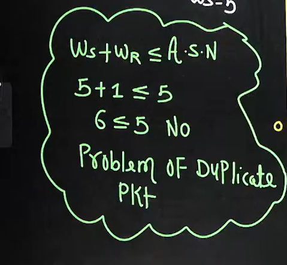

Below we don't have problems of duplicates packet

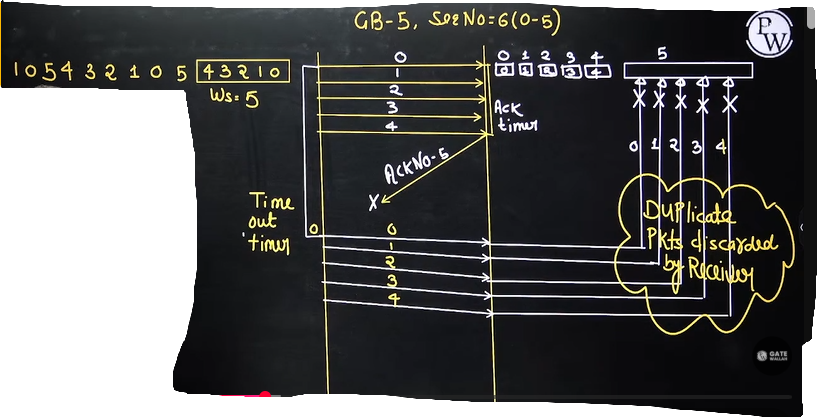

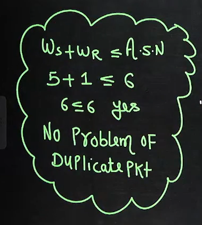

**Wr Size** - In the **GB-N** the window receiver size is **equal to one always** irrespective of window sender size(Ws=1)

**Ws size** - Window sender size is calculated based on the following formula  
Ws + Wr <= ASN  
Ws + 1 <= ASN  
Ws <= ASN-1  

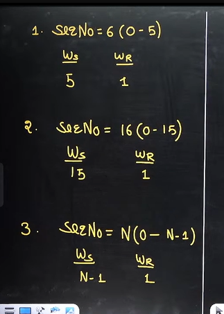

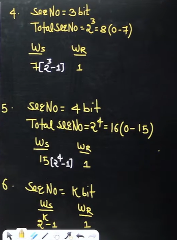

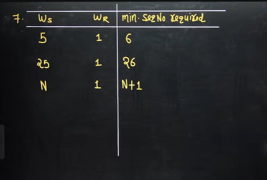

In above figure just add the window sender size and window receiver size to the get the min. sequence number required

Which of the following are possible?

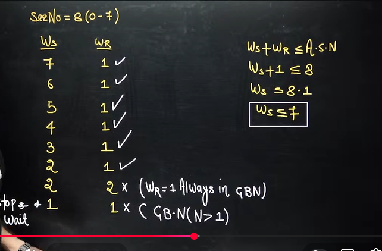

In GBN we does not send one packet

## Efficiency Formula -  

efficiency = useful time/total time

Here we send complete window and wait for acknowledgment.

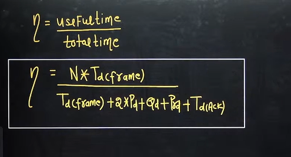

## Throughput Formula - 

here we are sending n packets not 1 packet, that's why we need to multiply it in the frame

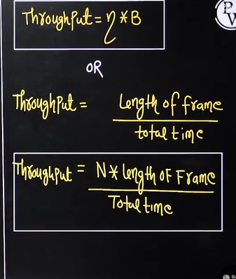

## Problems Solving on GB-N Protocol

## Question 1

1. In Go-back-N protocol, if the maximum window size is 512, what is the range of sequence number

* 0 to 513
* 1 to 513
* 0 to 512
* 1 to 512

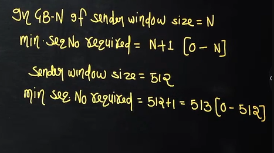

sequence number starts from 0

## Question 2
 
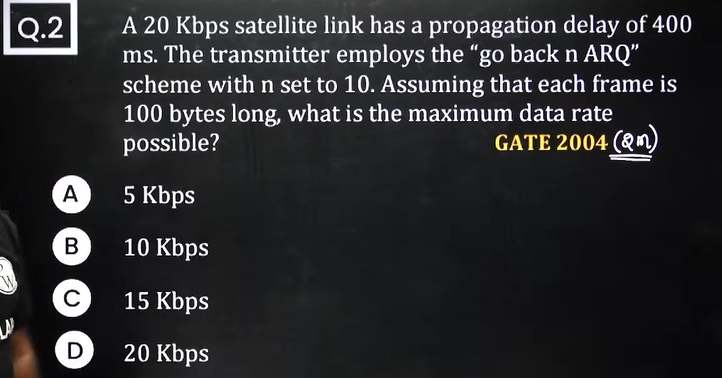

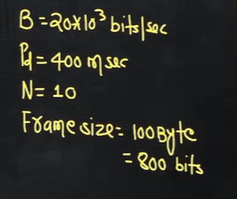

In above question we need find the throughput

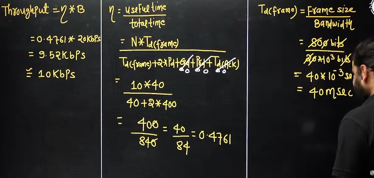

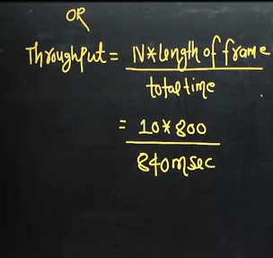

## Question 3
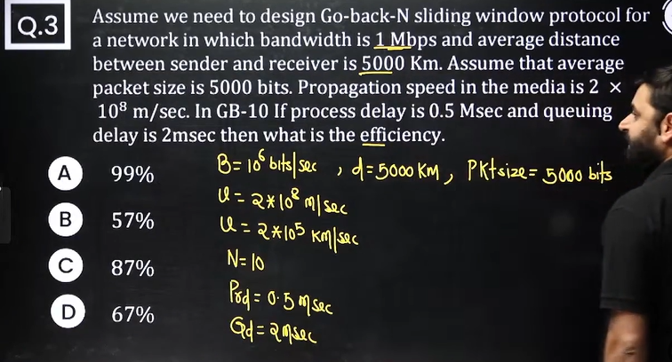

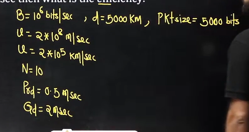

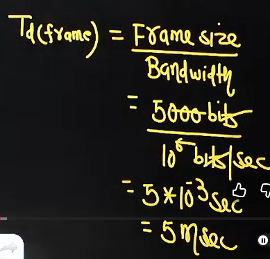

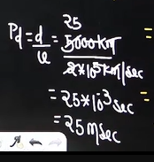

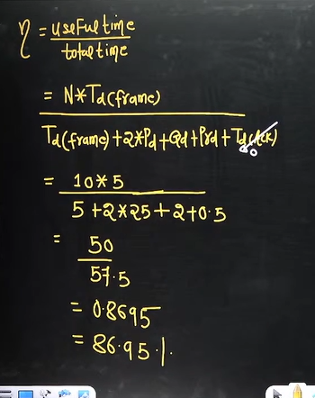

## Question 4

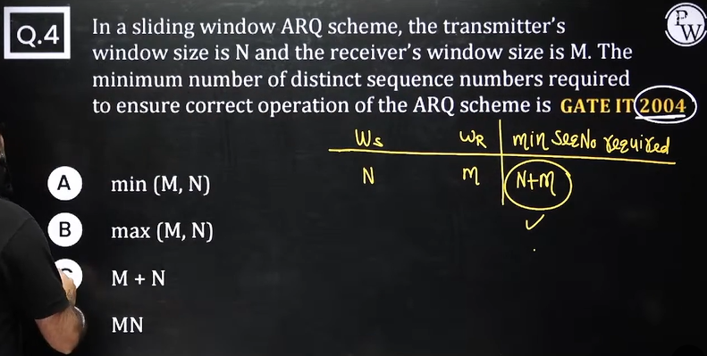

## Question 5

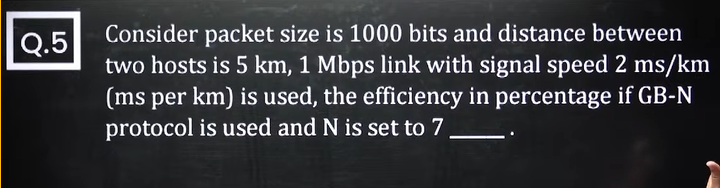

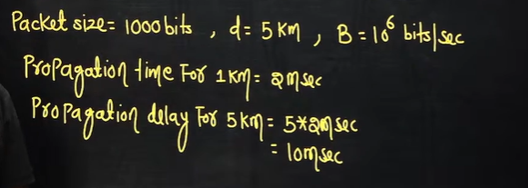

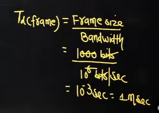

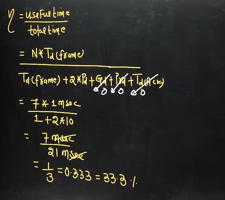

## Question 6
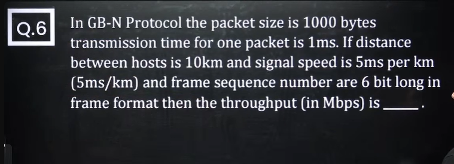

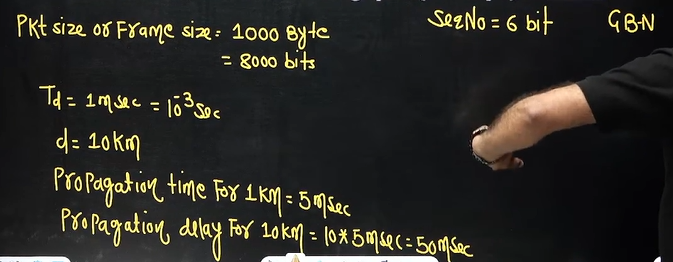

Now we need to find out the N??
In GB-N , N is sender window size

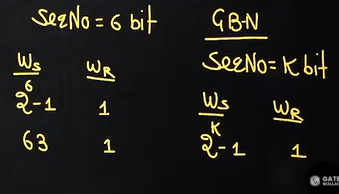

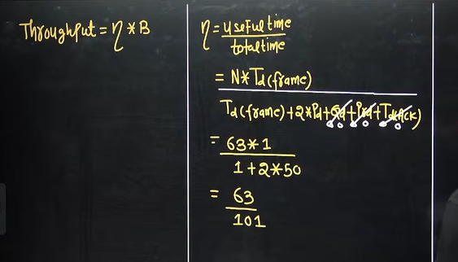

now how to find the bandwidth??

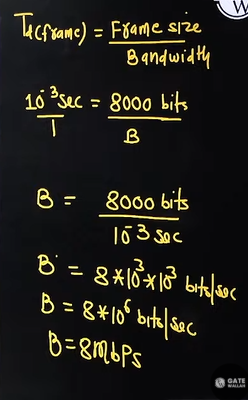

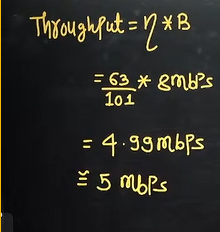

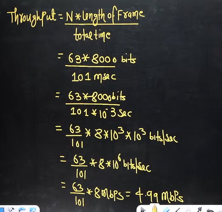

## Question 7

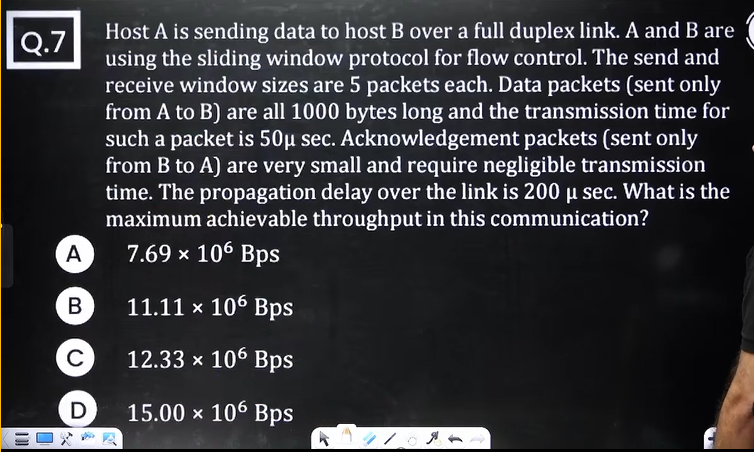

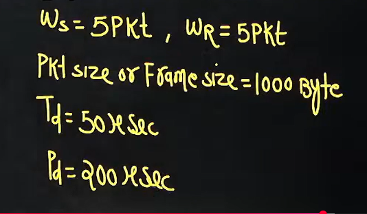

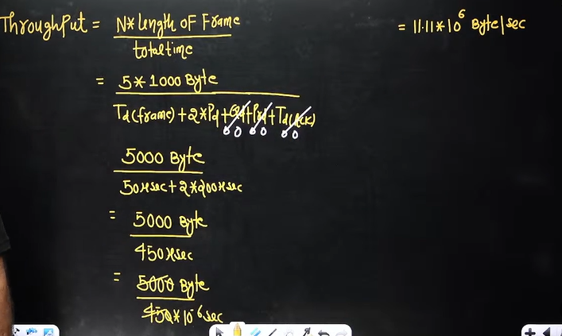

Above question is not of GB-N but it can be solved . Actually it's of S-R
For throughput receiver window size is not required
## Question 8

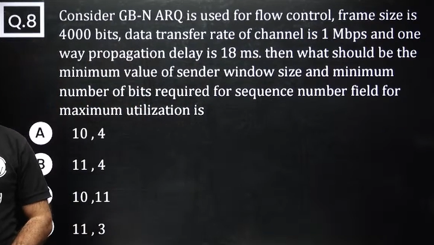

first collect the data

L = 4000 bits i.e. Frame size  
Bandwidth = 10^6 bits/sec  
Pd = 18msec  

if efficency is not given we will assume efficeincy as 100% or 1

Transmission delay = frame size/Bandwidth =4000/10^6  
4msec  

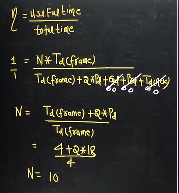

## Question 9
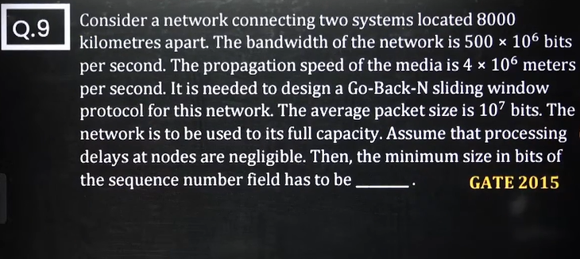

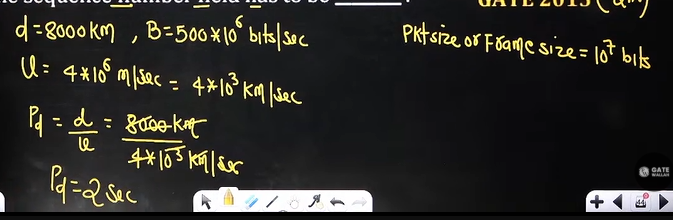

Tranmsission delay Td = Frame size/Bandwidth = 10^7/500*10^6  
0.02 second  

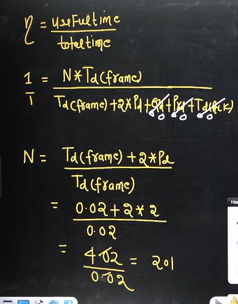

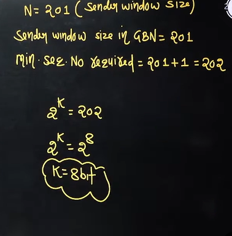

## Question 10

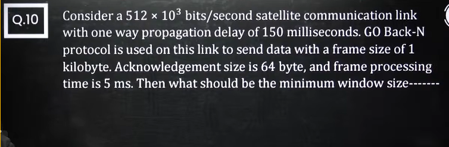

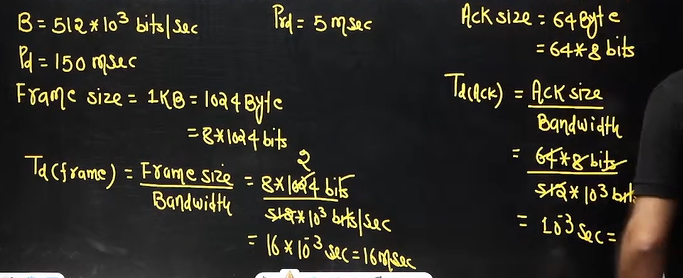

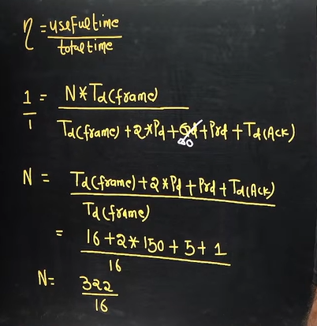

N = 20.125  

should we take 20 or 21?? what should be considered?

we will always take upper value.  

N = 21
if we take N = 20, efficiency will come less than 100

so If send 21 packets then only efficiency will be 100.

## Question 11

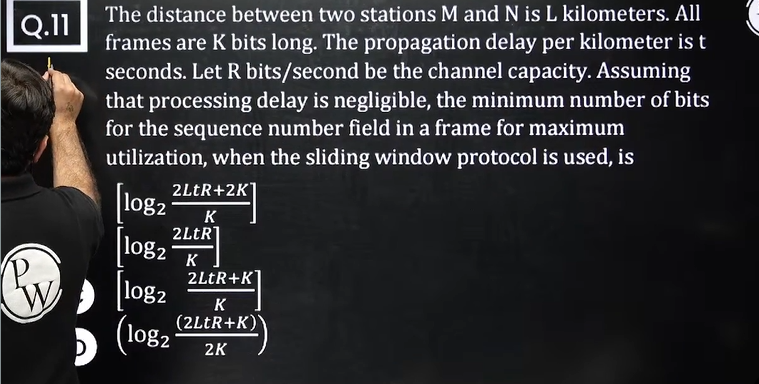

 
## Question 12

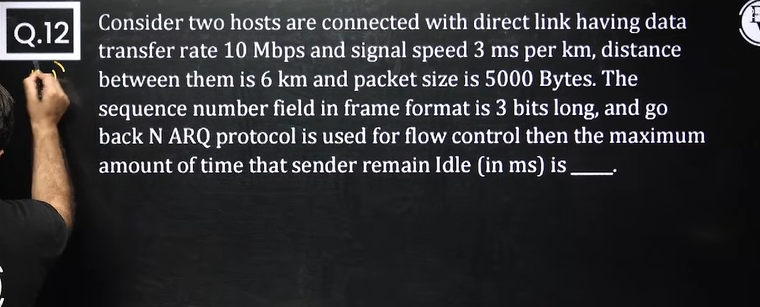

## Question 13

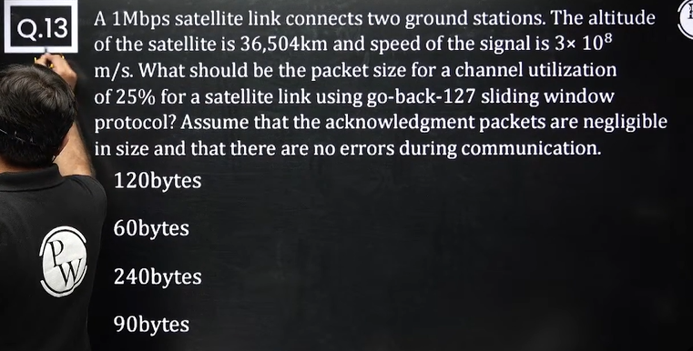