# Computer Networks 18 | Selective Repeat Protocol 

## Selective Repeat ARQ

* In GB-N , the efficiency was less. If a packet was lost , then again full window we had to send.  
* Here if a packet is lost in a window, then sender will select that packet and again send that packet.

## Selective Repeat/Selective Reject ARQ(Automatic repeat request)
1. In **SR Protocol** **window sender size** is equal to **window receiver size.**
   1. > Ws = Wr
   2. > GBN we had Ws = N and Wr = 1
2. SR Protocol uses **independent acknowledgement**, and **acknowledgement number** defines **number of error free packet received.**
   1. > GBN used cumulative acknowledgement
   2. > Stop and wait used independent protocol
   3. > In cumulative ack, if GBN-3, Ack would have been four i.e. next expcted packet or frame.
3. **SR receiver** can **receive out of order packet** but **packets are delivered to upper layer in order**
   1. > GB-N never recive out of order packet and there packet was discarded
   2. > At data link layer out of order but at network layer it will be send in order
4. In SR protocol **searching and sorting logic** is required. **Searching is done by sender** and **sorting is done by receiver.**
   1. > Receive can get packets out of order but then it will sort it and then send to network layer in order
5. **Timer is maintained** **for each and every frame in the window at sender size**
   1. > GBN, Timer was maintained for first frame only. only for first packet
   2. > Here 3 packet is lost, then only 3rd packet will be retransmit. If Acknowledgement doesn't come retransmit will be done

Let's take an example to understand -  

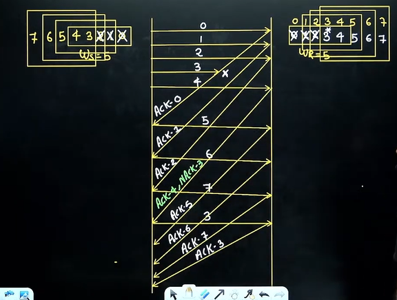

Diagram explanation -   

Note -  
1. For **1st out of order** delivery or if packet received is corrupted then **NAK(negative acknowledgement)** for respective packet is sent by receiver to sender.
2. When sender **receive NAK 3** then it will **search in the window for packet 3** & immediately packet 3 is retransmitted even though its **timer is not expired**

## Relationship between window size & sequence number
* Minimum how many sequence required to achieve 100% efficiency
* Very important to understand with diagram

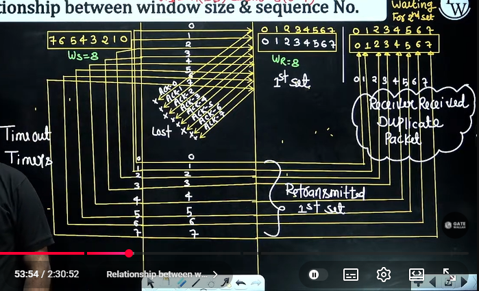

In the above we have problem of duplicate packet, as according to this is also proved

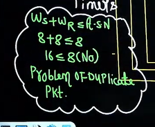

Note -   
1. Duplicate packet problem can be solved by increasing the sequence No. or decreasing the sender window size
2. Duplicate packet problem can be solved by using the following formula

Ws + Wr <= A.S.N(available sequence number)  

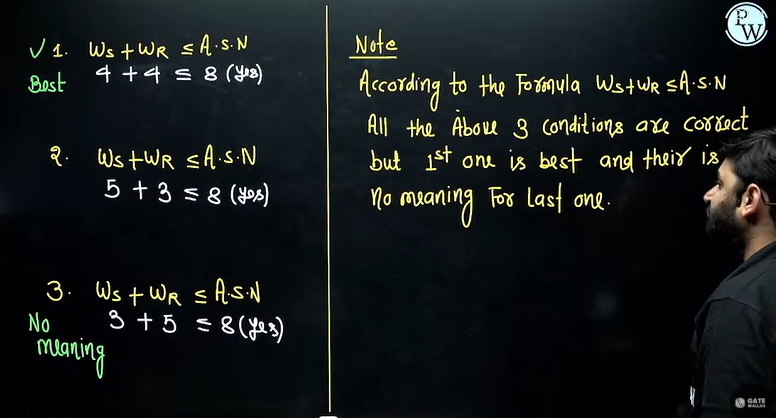

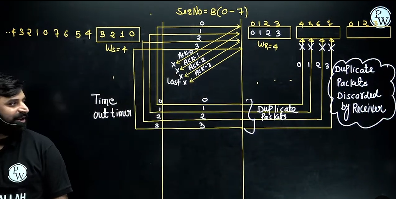

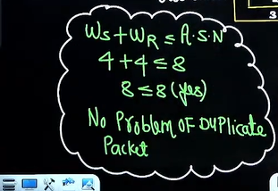

So hence we can put a general formula - 

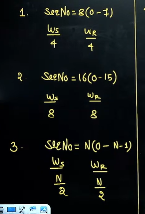

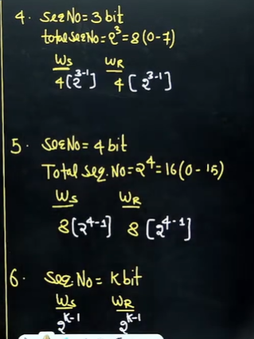

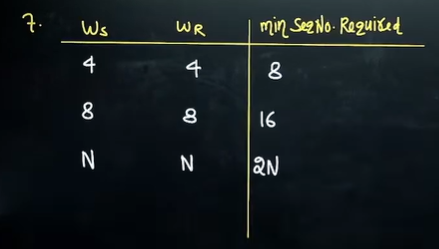

## Efficiency

efficiency = usefultime/total time

In question window size will be given of the frame

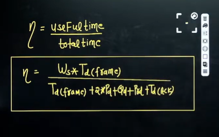

## Throughput

Throughput = efficiency * Bandwidth

or  

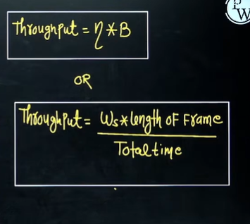

## Summary - Comparison between stop & wait, GB-N , and SR
 
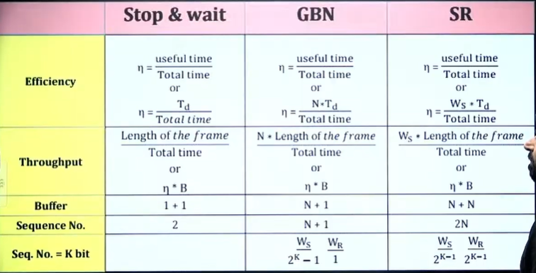

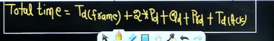

## Problem solving on SR Protocol

## Question 1
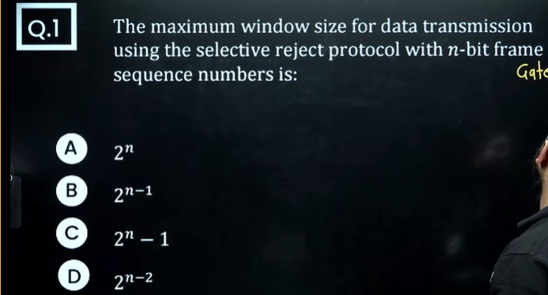

B will be the correct answer

## Question 2
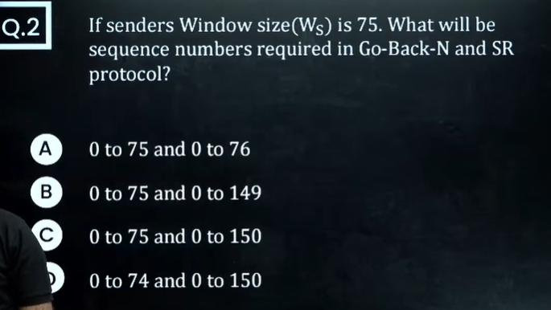

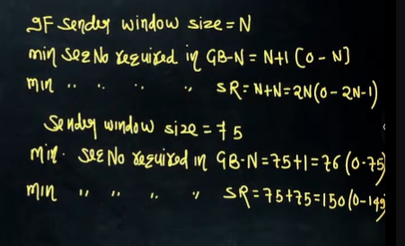

## Question 3

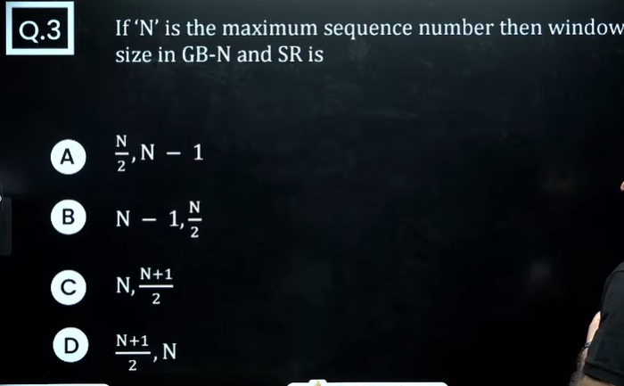

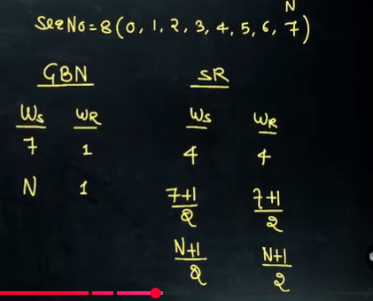

In above question N is the maximum sequence number NOT total sequence number

## Question 4
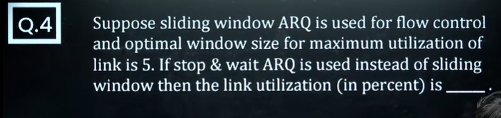

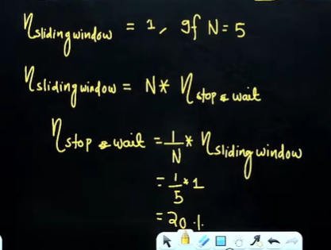

## Question 5
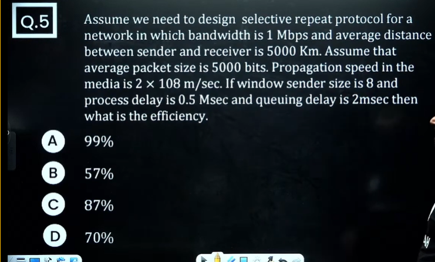

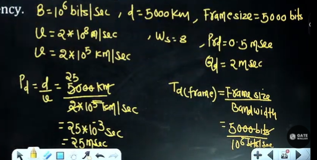

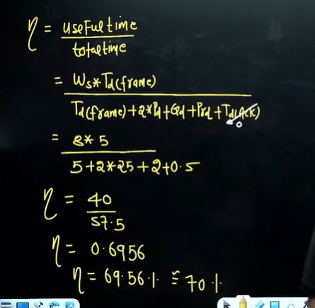

## Question 6
HW  

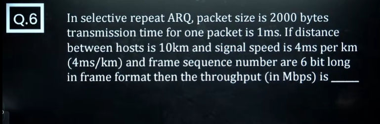

## Question 7
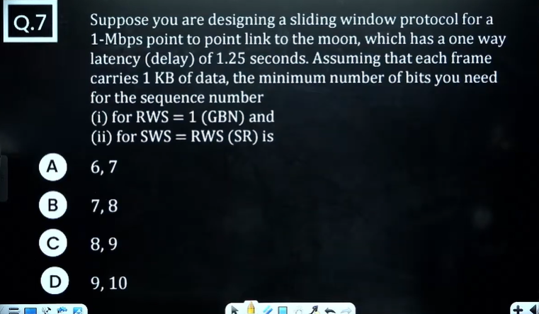

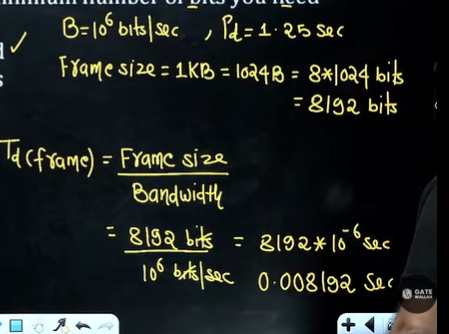

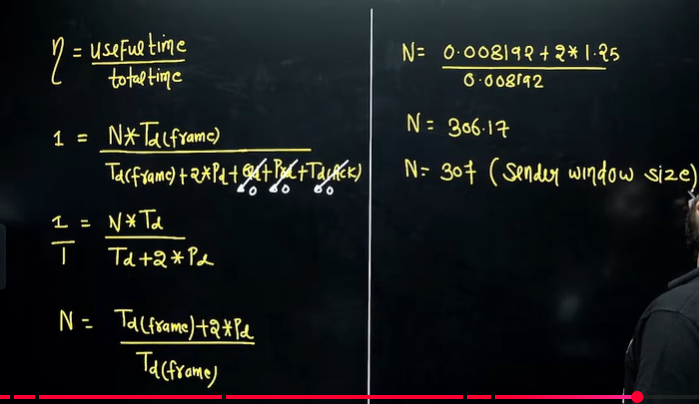

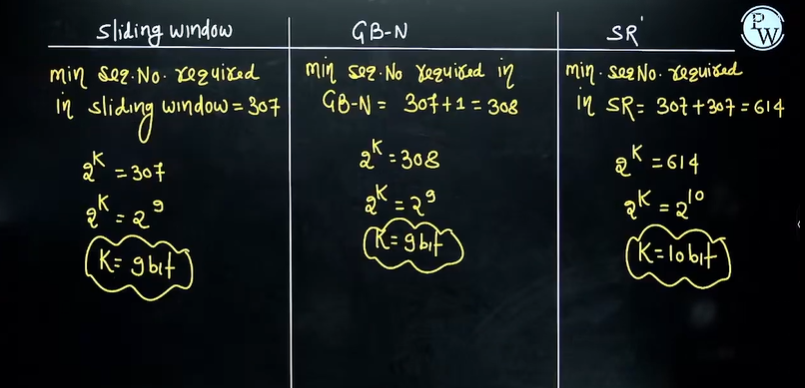

## Question 8

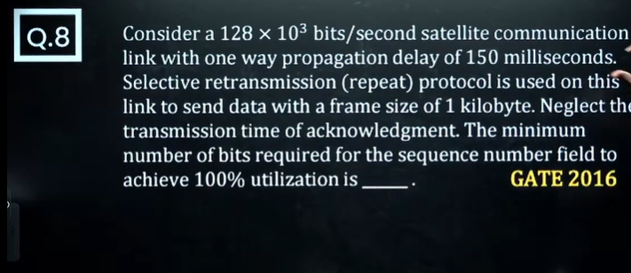

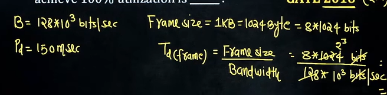

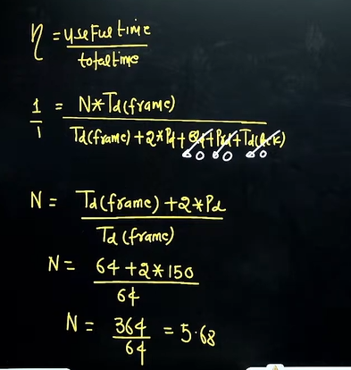

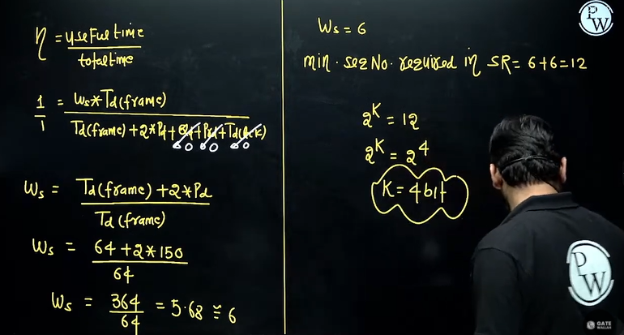

## Question 9

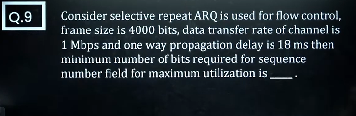

above is HW

## Question 10

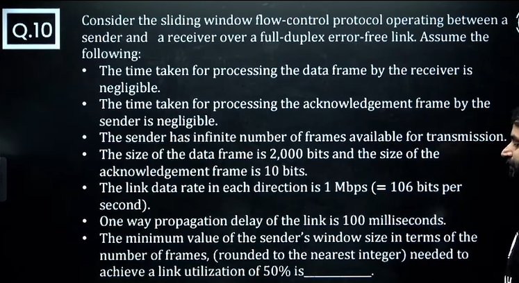

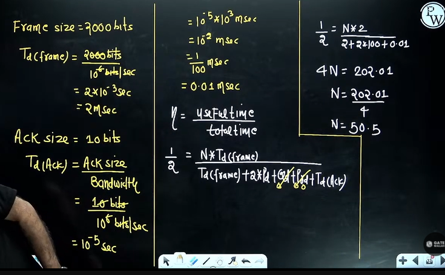

Take N greater so N = 51

## Question 11

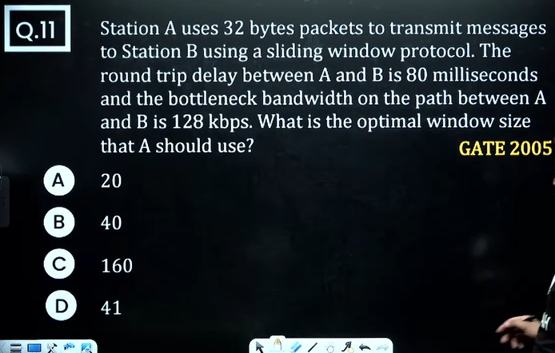

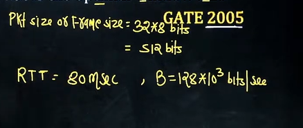

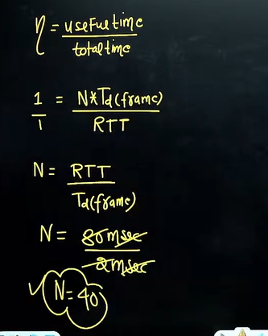

## Question 12
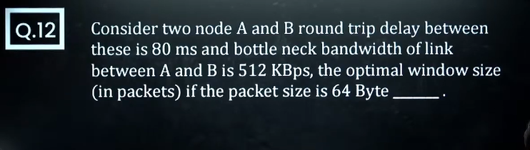

 
