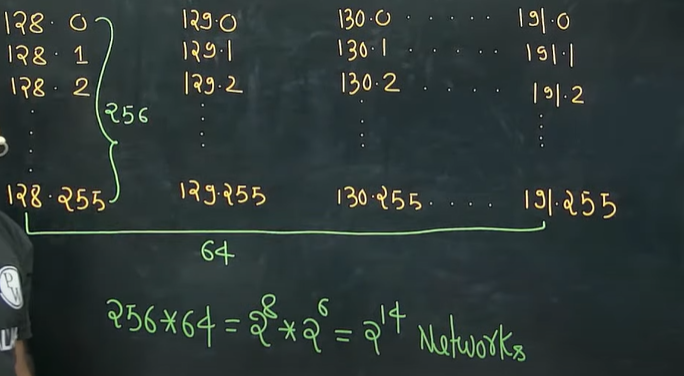
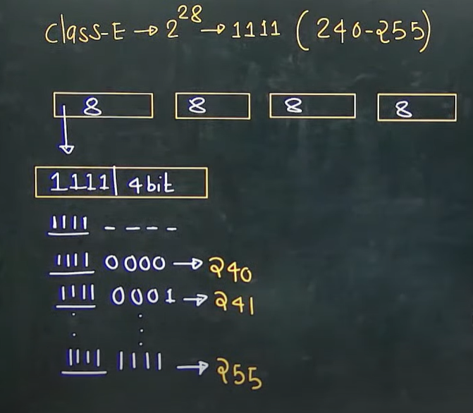

# Classful Addressing

## 🌍 What is **Classful Addressing**?

Classful addressing was the **original IPv4 addressing system** (1981, RFC 791).
It divided the **32-bit IPv4 space** into **fixed blocks called “classes”** (A, B, C, D, E), based on the **leading bits** of the address.

### Classes:

* **Class A** → For very large networks (few networks, many hosts each)
* **Class B** → For medium-sized networks
* **Class C** → For small networks (many networks, few hosts each)
* **Class D** → Reserved for multicast
* **Class E** → Reserved for experimental

Each class had a **default subnet mask**:

* A → /8 (255.0.0.0)
* B → /16 (255.255.0.0)
* C → /24 (255.255.255.0)

---

## ❓ Why was Classful Addressing done?

At the time (early internet), the goals were **simplicity and manageability**:

1. **Easy to understand** → Just by looking at the **first few bits**, you know if it’s Class A, B, or C.
   Example:

   * `10.x.x.x` → Class B
   * `192.x.x.x` → Class C

2. **Simplified routing** → Routers could decide quickly based on class, without complex subnet lookups.

3. **Matching organization sizes** →

   * Big companies/government → Class A (millions of hosts)
   * Universities/medium ISPs → Class B (65k hosts)
   * Small companies → Class C (254 hosts)

---

## ⚠️ Problem with Classful Addressing

It **wasted a massive amount of IP space**:

* A company might get a whole **Class A (16M IPs)** even if they only needed 1000.
* Small companies often ran out of Class C networks.

By the 1990s, IPv4 was running out of space because of this waste.

---

## ✅ What replaced it?

* In **1993**, **Classless Inter-Domain Routing (CIDR)** was introduced.
* CIDR uses **variable-length subnet masks (VLSM)** — so instead of rigid “classes,” you can allocate **just enough addresses**.
  Example: Instead of giving Class B (65k) to a company, you can give them a **/20 block (4096 IPs)**.

---

👉 **In short:**
Classful addressing was the **first, simple way to divide IPv4 addresses**, but it was too rigid and wasteful. CIDR replaced it to allow finer control and prevent IPv4 exhaustion.

Note -
1. Number of IP Addresses present in class A = 2^31
2. Class B = 2^30
3. Class C = 2^29
4. Class D = 2^28
5. Class E = 2^28

## IP Address Representation
1. dot Binary

e.g. 11001000.11111100.00111111.11110111
convert in dotted decimal  
Weightage - 128,64, 32, 16,8,4,2,1  
200.252.63.247

2. convert in Hexadecimal 

C8:FC:3F:F7

Note - 
1. Whenever we have all zeros or all ones, either in the network ID or in the Host ID of any IP addresses. These IP addresses are reserved for some special purpose, so we cannot assign these IP addresses to computer.

### **1. 0.0.0.0 as the “default route”**

* In IP routing, `0.0.0.0/0` means **“all possible IP addresses.”**
* A router uses it as a **catch-all route** → if no specific route matches the destination IP, traffic is sent to this **default route** (usually pointing to a gateway).
* So `0.0.0.0` here doesn’t mean “this device,” it means **“anywhere.”**

👉 Example:
If your PC wants to reach `8.8.8.8` (Google DNS), and your routing table doesn’t have a more specific entry, the packet goes via the default route (`0.0.0.0/0` → gateway).

---

### **2. 0.0.0.0 as a DHCP client address**

* Before a computer has an IP address, it uses `0.0.0.0` as its **source IP** when talking to a DHCP server.
* Why? Because it doesn’t yet know its own IP address.
* The DHCP discovery message is broadcast with:

  * Source IP = `0.0.0.0`
  * Destination IP = `255.255.255.255`

👉 Meaning: **“I don’t have an IP, please assign me one.”**

---

### ✅ Summary

* **Default Route (`0.0.0.0/0`)** → “Send traffic anywhere if no better match is found.”
* **DHCP client (`0.0.0.0`)** → “I don’t know my IP yet, I’m requesting one.”

It’s the same address, but the meaning depends on **context (routing vs DHCP).**

* 127.X.X.X -> Self Connectivity or Loop Back Testing or Inter Process Communication

* 2^8 Networks
  * subtract 2 => 2^7-2 = 126 Networks
* 2^24 Host/Network
  * subtract 2 => 2^24-2
* 10.0.0.0 - cannot be assigned to any computer
  * 10.255.255.255 - cannot be assigned to any computer

# Class B
* IP Address - 2^30
  * Kitne bits fix hain? 10

# Class C

* Number of networks - 32*2^16 = 2^21

# Class D
Note - 
1. No network id and no host id in class D
2. class D is used for multicasting

# Class E
* 240-255
* 2^28
* No network and no host id in class E
* Class E is reserved for research and future purpose

# Short notes

