# Computer Networks 19 | IPv4 Header 

## IPv4 header

Explanation -   
* First 5 rows are of 4 Byte which is total 20 byte. These 20 byte header is fixed.
* **Option** is of 40 byte. And it is variable and available to user for modification as per requirement.
  * Minimum value can be zero and maximum value can be 40 byte.
* Minimum header size = 20 byte (when option is of 0 byte )
* Maximum header sie = 60 byte (when whole 40 byte is used from option)

## Header Length(HL)
* It is 4 bit length
  * Maximum no. = 15 can be written from 4 bits
  * Header size can vary from 20 to 60.
  * To know what is the actual length of field that why we require HL and we write in the HL field.
  * If suppose header would have been fixed then HL field would have not been required.
* Problem - maximum 15 can only be written. Now how we write 60 in HL field? even 20 cannot be written in this? so how we solve this?
* We want 60 to get fit in HL.
  * so we want to make 60 equal to 15. so what scaling factor we should use?
  * we need to use scaling factor of 4.

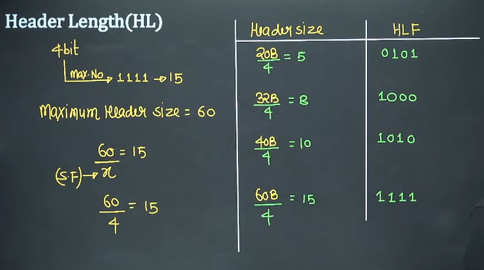

where is x is a scaling factor

Explanation - 

* The minimum header size is 20 byte. So we divide it by 4. so it comes 5. Now how do we write 5 by 4 bit? 0101.
* Now suppose we have 32 byte. So we again divide it by 4. It comes 8. so we write it as 1000.
* for 40 byte divide it again by 4. so we write 10 by 1010
* Now we have 60 byte, divide it by 4. so we write 15 by 1111

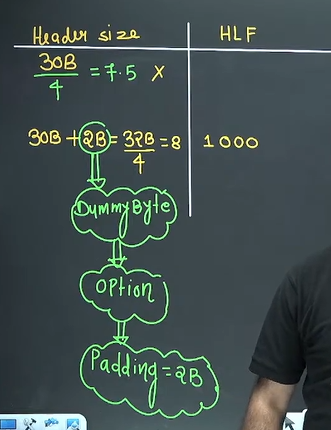

Question -  
Sir what if we have a number which is not exactly divisible by 4. e.g. 30  

30 byte divided by 4 is 7.5. Now how we write it 7.5. so what we do now?  
So to solve this we add 2B as dummy byte. so it comes as

30B + 2B = 32B/4 = 8  
now we can write it as 1000.

But now we again have a question how receiver will know?
receiver will multiply by 4 which is 32. but actual is 30. so how receiver will know it?

To solve above we create a field **padding** in option and we write in it as 2. And by this receiver will come to know that sender added 2 byte extra. And come to know the actual byte which is 30.

Another question -  
The value is 2 byte in padding . which is 16. And we write it as 10000 which is of 5 bit field.

Another thing - 
|HLF|Header Size| 
|--|--|
|1000 = 8|8*4 = 32 byte|
|1100 = 12|12*4 = 48 byte|
|1111 = 15|15*4 = 60 byte|
|Header length minimum is 5 (20/4) and max is 15(60/4)|Header size min = 20 byte and max = 60 byte|

## Version(4 bit)
* It is used to indicate IPv4 or IPv6. basically which version we are using

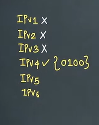
* IPv5 could get practically implemented
* IPv6 => 0110 
  * It is not now in GATE syllabus now. Sir has 300 pages note. Please contact sir. RFC. Episodes like learning.

## Services(8 bit)
In this Interpretation the first 3 bit are called **precedence bit(priority bit)** and next 4 bit are called **types of services bits** and last bit is Not used.
* first 3 bit are priority bit
  * > what is the requirement of priority bit?
  * > range 0 to 7
  * > why it is used? Suppose router gets congested. router will discard some datagram. Those datagram which have the lowest priority which has lowest priority

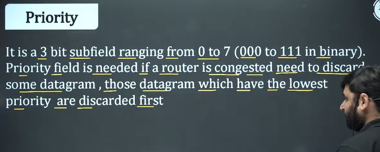

* Next 4 bit are types of services
  * IP offers 4 services
    * D - Delay - You want delay min or maximum. everyone will want minimum dealy
    * T - Throughput - You want maximum Throughput
    * R - High reliability
    * C - minimum cost
    * In above 4 you need to use one service at a time
    * Delay भी कम हो और cost भी कम हो - 
      * Analogy - Raju and Rani - Hyderabad to Delhi flight cost will be 10000. In real life also not possible. But general ticket will cost 400 but take more time.
    * You can't take all 4 services
* Last bit is not used

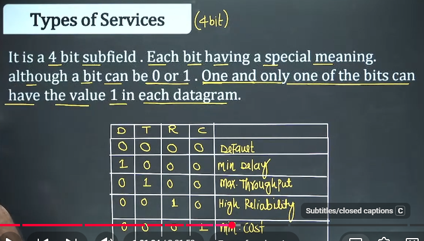

|D|T|R|C|Output|
|--|--|--|--|--|
|0|0|0|0|Default|
|1|0|0|0|Minimum delay|
|0|1|0|0|Max Throughput|
|0|0|1|0|High Reliability|
|0|0|0|1|Minimum cost|

## Total Length
* It is of 16 bit field
* It is Total length = data + Header
  * data = total length - Header
* 16 bit max number = 2^16 -1 = 65535

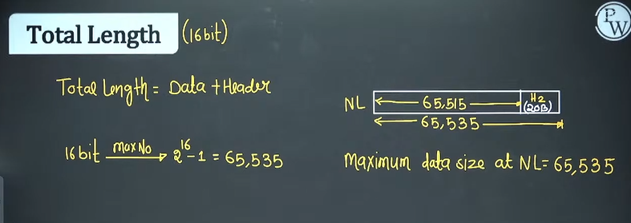

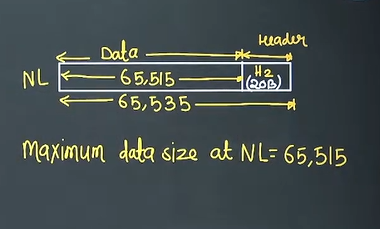

## Identification Number
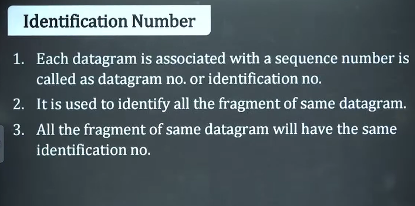

* It is of 16 bit field
* Every datagram is associated with a sequence number. And that sequence number is called identification number

* Example - 
* A wants to send a packet to B. Let's say it is of 300Byte. and it's ID no. = 100
* Packet travels to B 
* And next MTU is 100B. basically router cannot allow more than 100 byte. Router will divide the packet into pieces. And it is called Fragmentation. it will be 3 peices. each peice will have ID no. = 100. why? because then reciver will combine it later as all the pieces have same Identification number

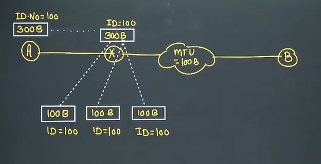

## Flags - 
It is the 3 bit field or shown in the figure.

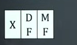

* first bit is not used
* DF mean? Second bit is called as **Don't Fragment**
* MF mean? 3rd bit is called **More Fragment**

## DF - Don't Fragment
* It is bit. it can be 0 or 1
* DF = 1 means - Datagram cannot be fragmented
* DF = 0 means - Datagram can be fragmented
what is the meaning of above?

let's take an example

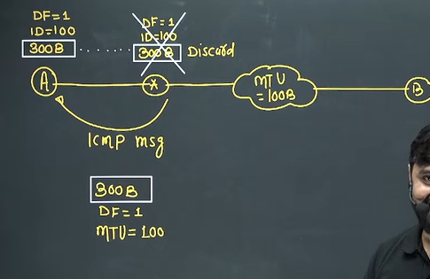

* suppose we have A. A wants to send data  of packet 300 byte. and ID = 100. And DF = 1
* It comes to router. Sender sets the DF = 1 and says don't fragment
* Now router what will do? sender wants NOT fragment but MTU is 100. Now what router will do? If router can't divide then can't send? so what will do
  * In this case **Router will discard the packet**
  * And after discard it will send the message - ICMP
  * It will send reason of ICMP. It's a supporing protocol of IP
* So now what sender will do?
* So sender will divide itself it to 100
* but what if router and a MTU of 50 is ahead? so again it will discard.
  * So minimum  MTU packet can be send from that route.

Next question?? So why source don't want to divide? 

let's take an example

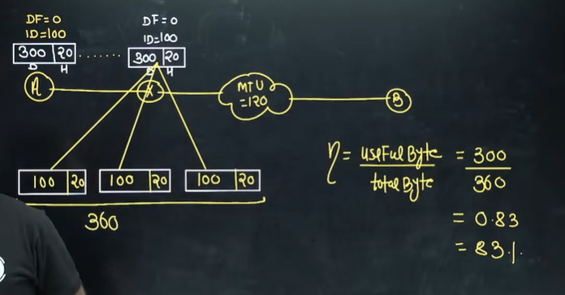

* suppose we have 300 byte data and 20 byte header. And it ID no is 100. And DF is 0, so it means data can be fragmented
* Now we have MTU is 120. so router will divide the data into pieces.
* Header has every information
  * So we will have to add 20 byte header to each 3 pieces attached.
  * हर पैकेट के साथ Header होना चाहिए
  * Each path can go different path, that's why we need to attach it
* Analogy - 4 cars going to delhi but with different paths. then we need to give GPS to each
* Efficiency will decrease as number of packets increase because overhead will increase.

## MF - More Fragment - 
* MF = 1 means this is not last fragment, there are more fragment after this Fragment
* MF = 0 - means this is the last fragment or only fragment

Let's take an example - 

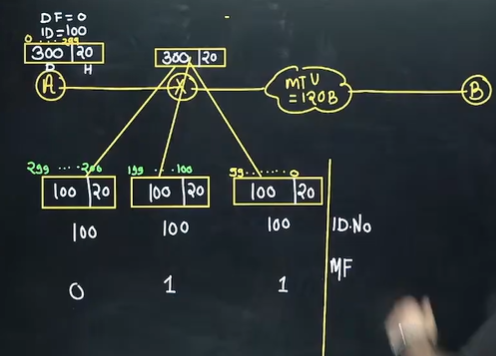

* Suppose we have piece of 300 byte data and 20 byte header. ID is 100 and DF is 0.
* MTU is 120 byte
* So we will hav 20 and 100 3 peices. And each piece will have same identification number 100
* which one is first and last. let's write it as 0 - 99, 100 to 199 , 200 to 299
* So MF for will be 1 for first . And again for second MF will be 1. For last MF will be 0

what is the requirement of MF?

suppose last piece is lost? so how reciver will come to know the last piece . so with MF with 0 receiver will come to know.

## Fragment offset
* It is of 13 bit
* Fragment offset indicate **no of data byte ahead** of this fragment **in that particular packet**
* how many byte ahead of this byte

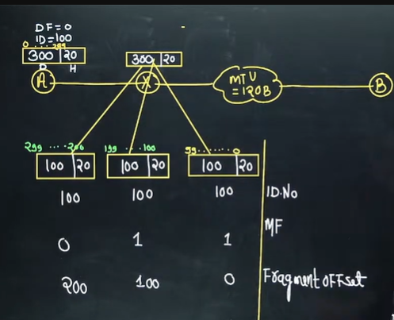

* IP is a **packet stream protocol**
* i.e. Every packet is associated with a sequence number
* In TCP, we give sequence number to each byte
  * TCP is **byte stream protocol**
* Fragement works as indexing. कौन सा पहला है, दूसरा और तीसरा
* Receiver can out of order packet.

Question - Sir , 0, 1, 2 is the best indexing? simple right? we will see it in fragment offset. why above method works

