# Computer Networks 20 | IPv4 Header (Part 2) |

## TTL(Time to field)
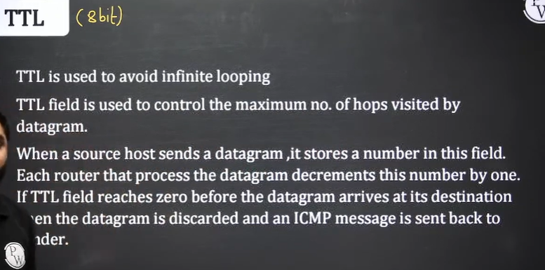
* It is 8 bit field

Let's taken an example when infinite loop can be present  

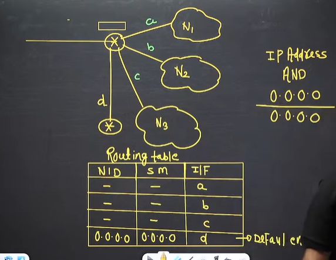

consider the router and different network N1, N2, N3 connected to it.

Suppose one packet arrives to it. Either the router it will send it to any of the 3 networks. Packet will have destination IP

If it doesn't match any interface then what will happen

bitwise ANDing with of destination with subnet mask1, subnet mask2, subnet mask3 we will get network ID

Every router has a default entry. It will forward to default entry

|Network ID|Subnet Mask|Interface|
|--|--|--|
|||a|
|||b|
|||d|
|0.0.0.0|0.0.0.0|d|

what will happen next?

suppose R1 default router has R2. and suppose R2 checked each network and doesnot match. R2 will forward to default router of R2. R2 will again send the packet to R1. packet will keep moving and each router will get busy. so from this we have condition of **infinite looping** 

Let's see point 3 with example - 

So at last TTL value becomes 0 and then there packet will be discarded. So by this packet will not move in infinite loop. 

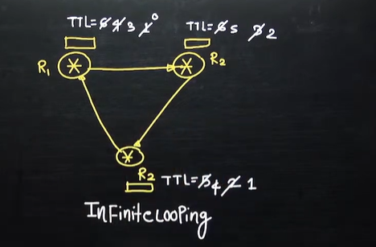

* If TTL value is zero at the router, packet will be discarded.
  * If TTL value is zero at the destination, packet will be accepted (point 3)

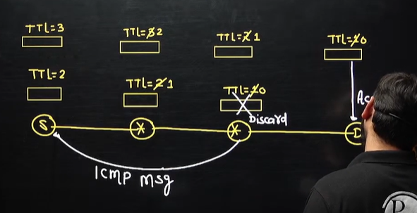

Now take another example - 

If TTL value is 1 at the destination. packet will be accepted.

* TTL range is 0 to 2^8 = (0 to 255)
* TTL concept is IPv4. let's take an example

Any device which has the network layer can decrement the TTL value

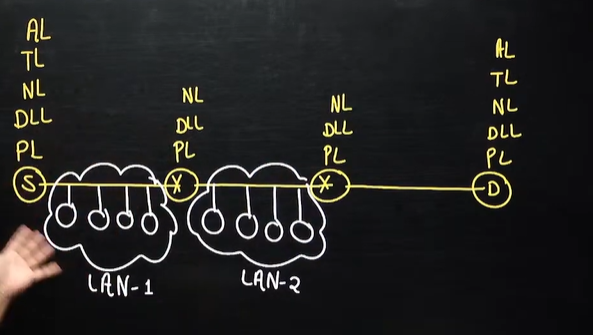

Inside the LAN TTL value will not be decremented

## Protocol
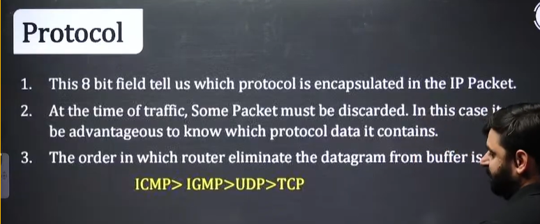

* It's a 8 bit field

Let's take an example

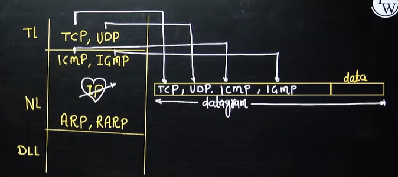

* Suppose we have a router with a buffer memory and it's full. And a TCP packet arrives. so what will happen if no buffer space is available? The packet will be discarded? First ICMP, IGMP, or UDP packet are present in the buffer that will be discarded and stored in router buffer. ICMP, IGMP and UDP are connection-less protocol. No one will ask because acknowledgement is not expected by sender. 

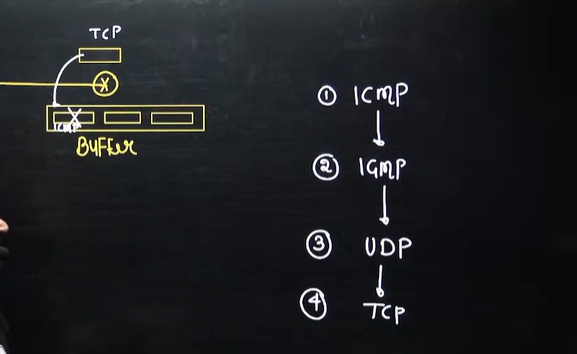

In this we will write the number.

ICMP - 01  
IGMP - 02  
UDP - 17  
OSPF - 89  
TCP - 06  

from above things will be worked out

## Header Checksum (16 bit)
1. It is calculated only for header part not the data because rest of the component in packet already covered by TCP checksum
2. Header checksum is calculated at **each and every** **Router** because related to IP Header might be change with packet is moving from one router to another. Every router makes one modification i.e. TTL so Header checksum is calculated at every Router. Fragment offset, mF, Total Length, option all may be changed at a Router

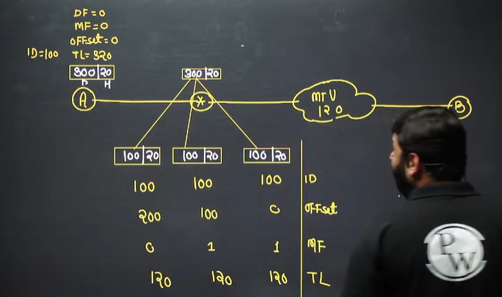

This table is very important

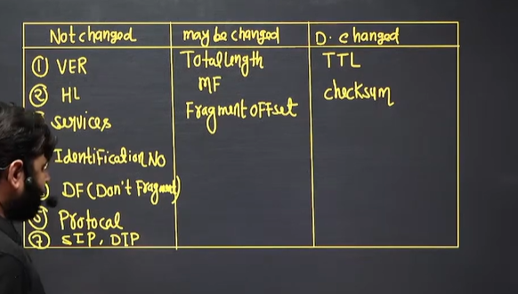

## SIP and DIP

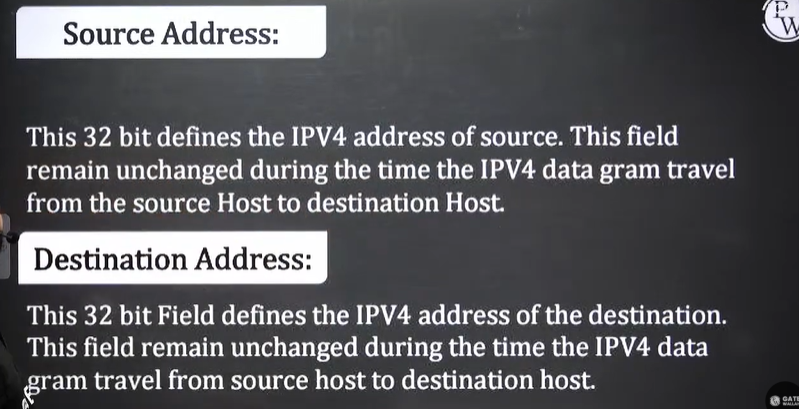

## Option
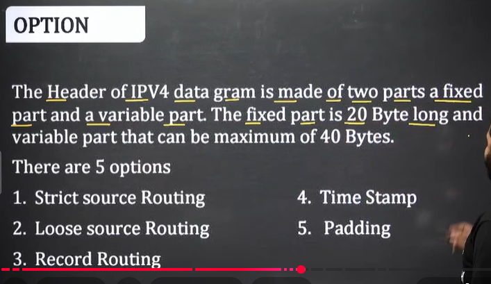

* Source routing means - Sourc will decide the route
* Record routing - router will decide the route

## Strict Source Routing
A strict source routing is used by the source to predetermine a route for data gram as it travel through the internet

## Loose Source Routing
A loose source route option is similar to strict route but it is less rigid. Each router in the list must visited, but the data gram can visit other router as well.

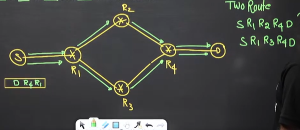

## Record Routing
A record route option is used to record the internet routers that handle the data gram. It can list up to 9 router Address. All the Router are supposed to record their IP Address on their IP packets

* Suppose we have a packet and travels to R1
  * Here R1 router IP address is recorded.
* suppose it travels to Router R2
  * here again R2 IP address is recorded

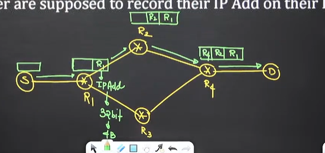

Note - First 16 bits (2 byte) are reserved for option type(8 bit) and length(8 bit). Out of 40 byte only 38 bytes are remaining for storing IPv4 addresses. In 38 byte we can store 9 IPv4 addresses as each IPv4 address is of 4 byte.

## Time Stamp 
It is used to find out the delays at each router. Every router should incoming time and outgoing time.

 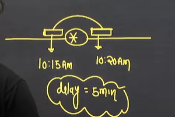

 ## Problem solving on IPv4

 ## Question 1

 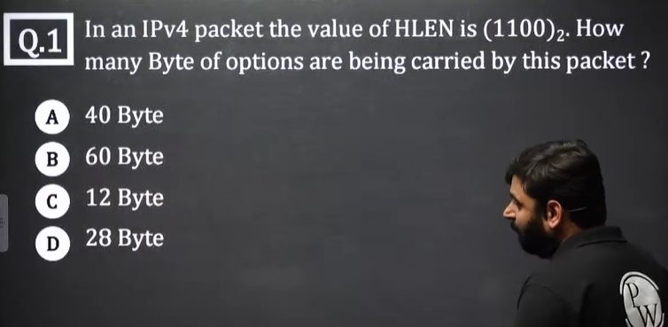

 

 ## Question 2

 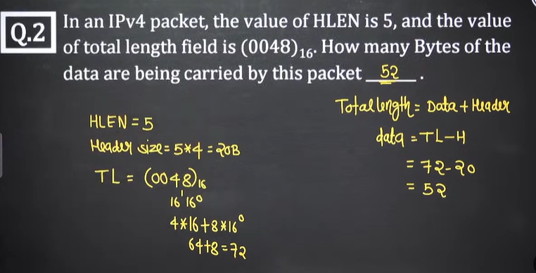

## Question 3
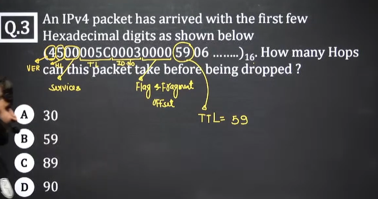

covert 59 to decimal - 5*16^1 + 9*16^0 = 89

## Question 4
HW

## Question 5
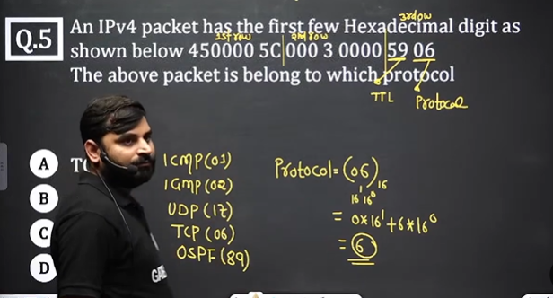

## Question 6
HW
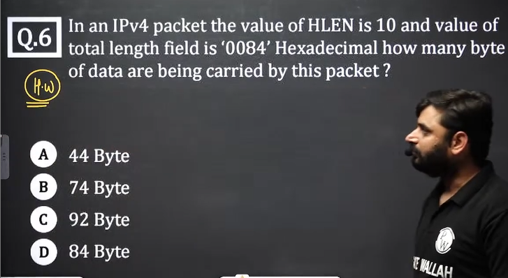

## Question 7
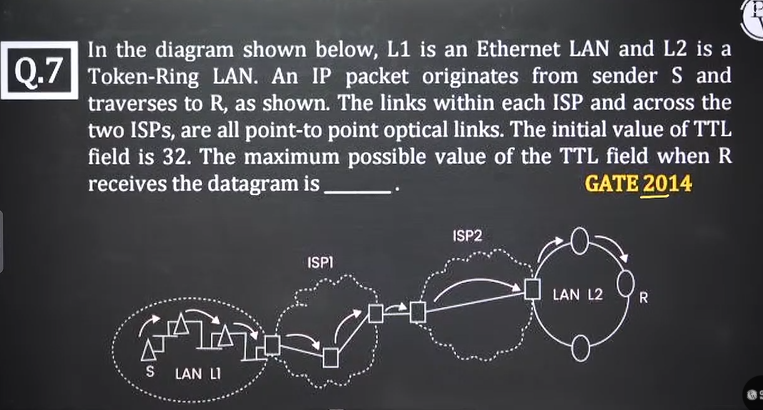

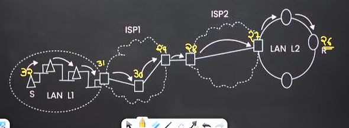

## Question 8
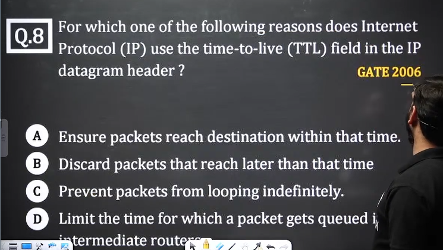

option c - to remove infinite loop

## Question 9
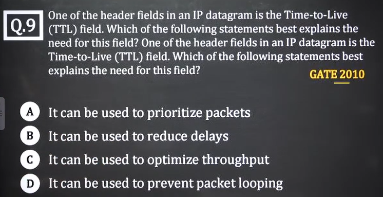

## Question 10
 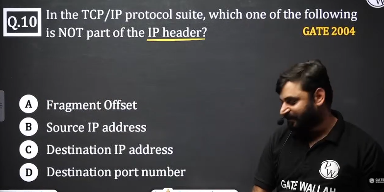

 answer is d

## Question 11
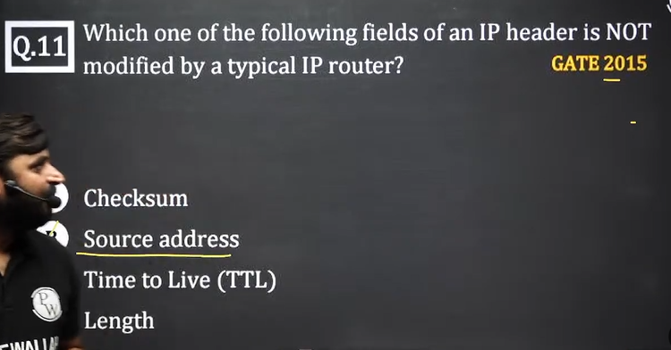

## Question 12
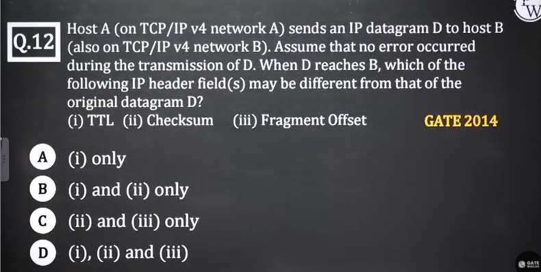

option d - 1, 2, 3 all will change

## Question 13
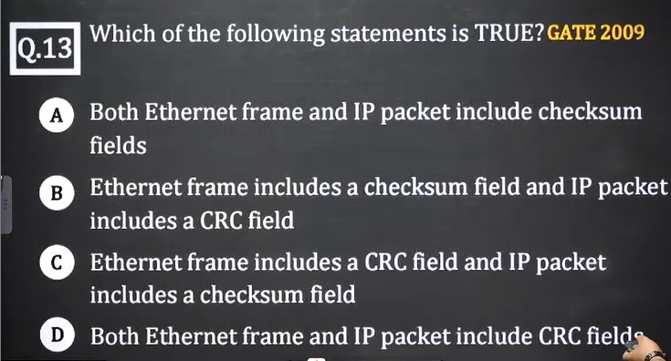

option - C

## Question 14
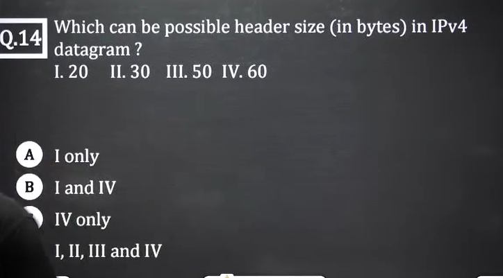

Header size can be in between 20-60 byte but always in the multiple of 4

option B

## Question 15
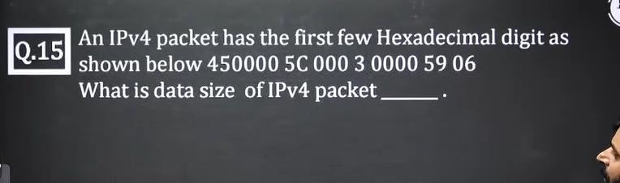
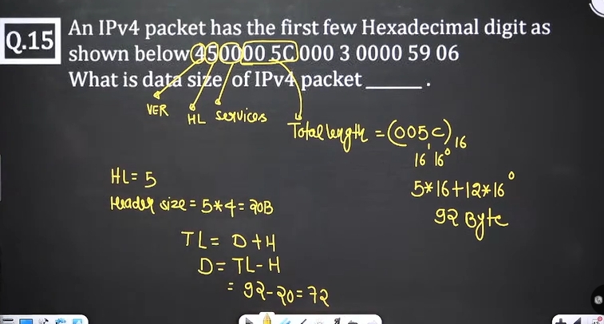

## Question 16
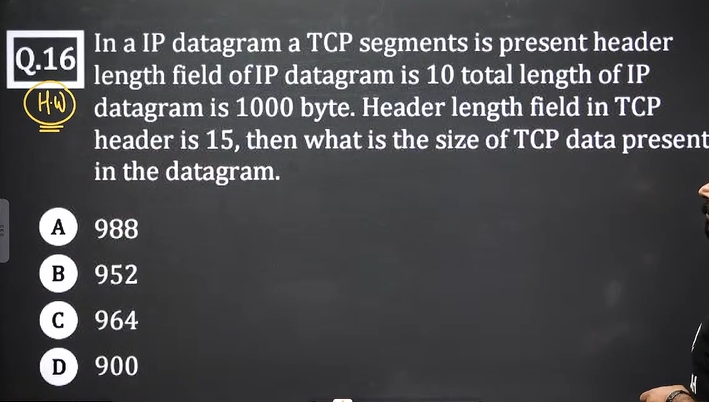
HW

## Question 17
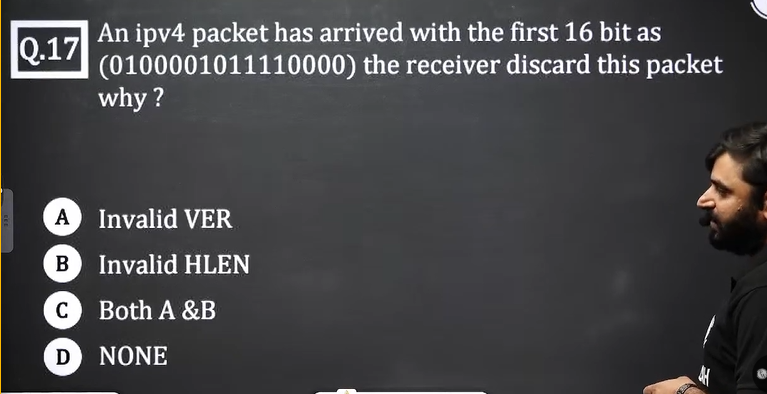

HW
## Question 18
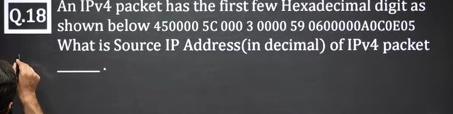

# Question 19
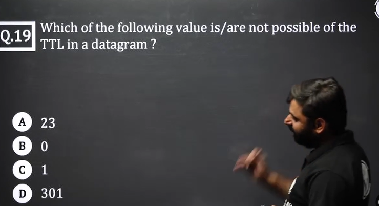

TTL is of 8 bit so it's range is 0 to 2^8-1 = 255  

TTL value cannot be 0. Packet cannot travel. Minimum value can be 1. Source will never assign TTL value to 0.

TTL value can be in the range  - 1 to 255