# Computer Networks 21 | Fragmentation in IPv4

We will take one example and understand everything.

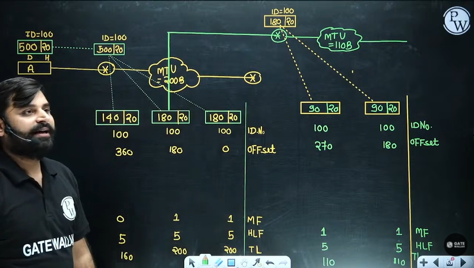

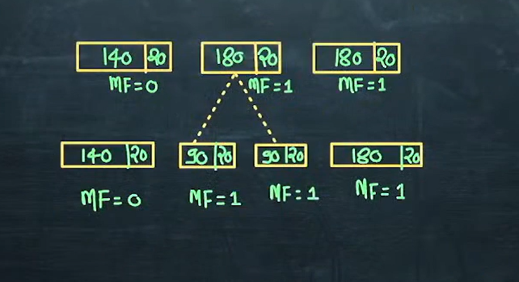

MF will be 0 only for the last packet.

* Fragmentation is only applicable for the Header part.

is it possible last piece can be 1 Byte?
It is possible.

Fragment offset - number of data byte ahead of this

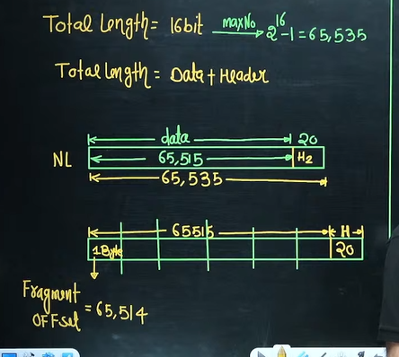

Fragment offset max value is 8191 i.e. 2^13 -1

then how do we write 65514

so now we need to fit ~2^16 fit in ~2^13

so again we need to use the scaling factor

8 will be the scaling factor

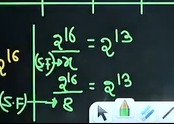

so we will divide by 8

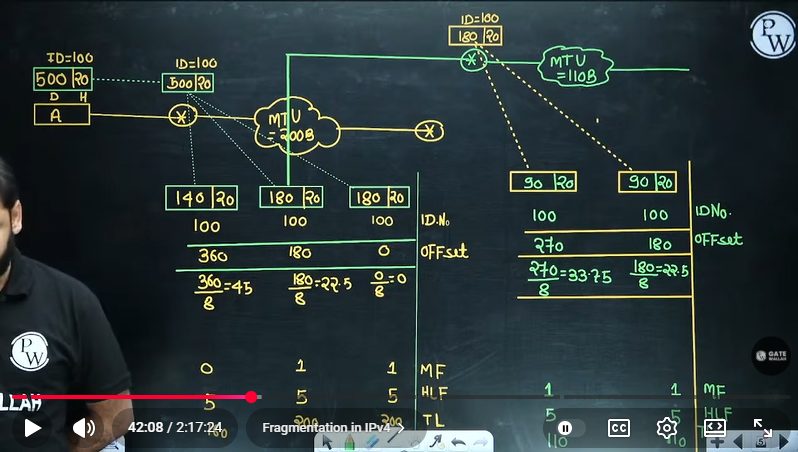

but now we have another problem now? now how do we write floting number in fix length.

22.5 को कैसे लिखेंगे ?

Data size in each fragment must be divisble by 8.

We can add 4 or substract 4. what to do?
we need to subtract because MTU is 200B only.

180 -4 => 176
180 -4 => 176
140 + 8 => 148

above we have space so we added in 140 because MTU is 200B.

If MTU would have been smaller in those cases we have to make new fragment

**Except last fragment every fragment should be divislbe by 8**

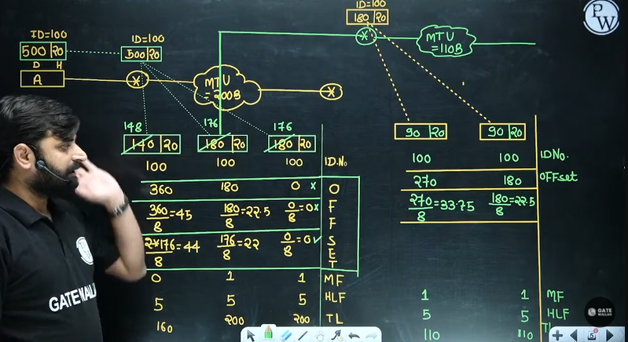

why last is not required to check divisible by 8?

because to find offset for last one we are using ahead ones values. So no need to check for last one.

Again for the second router.

we need to subtract 2 from 90

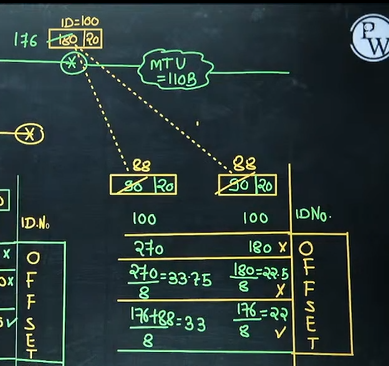

So now the total length will change

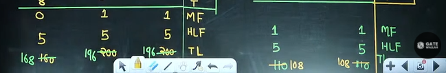

Now reciver will receive 4 packet or 5 packet?

4 pieces.

Final Result - 

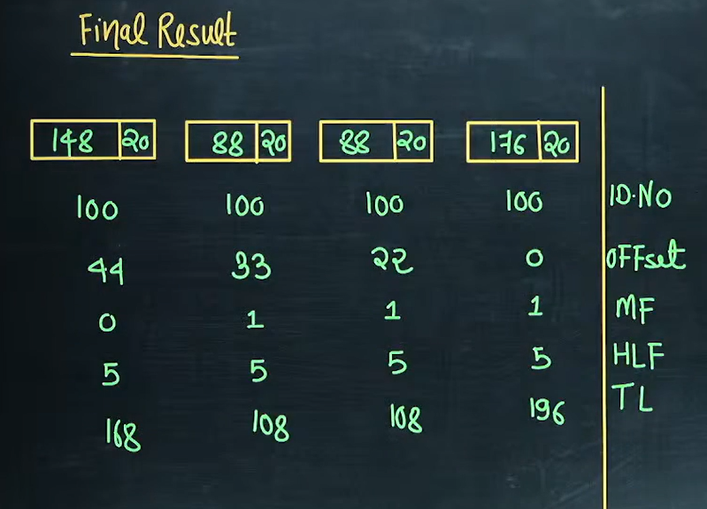

These packets can go out of order.
Offset is working as indexing. Just write in increasing order.

how receiver will come to if let's say second fragment is lost.
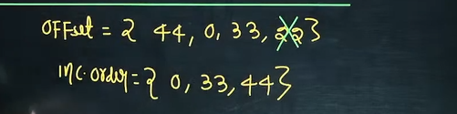

from 1st packet receiver can find out second fragment offset value.

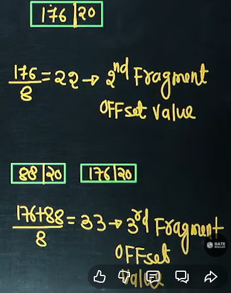

## Reassembly Algorithm
If each fragment follow a different path  and arrives out of order, the final destination host can reassemble the original datagram from the fragment received by using the following strategy - 
1. Identify the fragment with **offset = 0** and it is the first fragment
2. Identify the fragment with **MF = 0** and it is the last fragment
3. Divide the **data length** of the **first fragment** by **8**. The second fragment has an offset value equal to that result.
4. Divide the data length of the first and second fragment by 8. The third fragment has an offset value equal that result.
5. Repeat this process as many times as possible to cover all the fragment 

**suppose a piece is lost.** Receiver will discard all the pieces and ask sender to send again. Sender doesn't know how many pieces router has divided.

**can receiver ask router for second lost piece?**  
Router cannot do that. Router doesn't save the fragment. It's just forward it. It just store in buffer memory temporarily.