# Computer Networks 22 | TCP Header & Wrap Around Time
- Below is the TCP Header diagram
- Packet names at different layers
  - Application Layer data is called - Message
  - Transport Layer data is called - Segment
    - TL layer attaches H1 header
  - Network layer data is called - Datagram

* **1st row**
  * Source port is 16 bit
  * Destination port is 16 bit
  * Total is 32 bit or **4 Byte**

* **Second row**
  * Sequence number field is - 32 bit or **4 byte**

* **Third row**
  * Acknowledgment number is - 32 bit or **4 byte**
* **4th row**
  * Header length - 4 bit
  * Reserved bit - 6 bits
  * Flag - URG, ACK, PSH, RST, SYN, FIN - 6 bit
  * Window Size or (Advertisement Window) - 16 bit
  * So totla is 32 bit or **4 Byte**

* **5th row**
  * Checksum is 16 bit
  * Urgent pointer is 16 bit
  * So total is 32 bit or **4 byte**
* hence 5 rows size is  5 * 4 byte = **20 byte**
  * And this 20 byte header is fixed
* **Options of 0 to 40 byte** is variable or freely available or use according to requirement

* **Minimum Header size = 20B + 0 = 20 Byte**
* **Maximum Header size = 20B + 40B = 60 Byte**
* Header size will vary from 20 byte to 60 byte
  * How receiver will know about header size?

* Receiver will come to know the **header size** from **Header length**
  * The header size information will be put in header length.

## Header Length(HL)
maximum number with 4 bit = 1111 = 15(2^4-1)

Maximum Header size = 60 Byte

Now we need to fit 60 with 15.  
So what scaling factor we need to use.  
Use x = 4 as **scaling factor**  

|Header Size|Header Length Field|
|-----------|-------------------|
|20B/4 = 5|0101|
|32B/4=8|1000|
|40B/4=10|1010|
|60B/4=15|1111|

## Source Port Address(16 bit)
* This is a **16-bit field** that defines the port number of the application program **in the host that is sending the segment**

## Destinationn Port Address
* This is a **16-bit field** that defines the port number of the application Program in the host that is receiving the segment.

* Port number is assgigned to process in the computer

Port No = 16 bit - Range is 0 to 2^16-1  

* **Well known port number** - from 0 to 1023 are used for well known services
  * Assigned and control by I.A.N.A(Internet assigned number authority)
  * e.g. SMTP uses port number - 25, HTTP - 80, FTP - 20 and 21, DNS - 53
  * Every process will have different port number
* **Registered Port number** or **Reserved**- from 1024 to 49151 are registred port number or reserved port number. Neither assigned nor controlled by IANA
* **Dynamic Port number** - from 49152 to 65535 are dynamic port number. These are freely available

Now let's come to important thing - sequence number.

## Sequence number
This is a **32-bit field** defines the sequence number **of the first data byte**
* **TCP is a byte stream protocol**
  * i.e. Every byte is associated with one sequence number

* Also remember IP is a packet stream protocol

## Acknowledgement
This is a 32 bit field defines the sequence number of the **next expected byte**. If receiver has successfully received byte number x from other party(sender), it returns x+1 as the acknowledgment number.
)
* TCP is a byte stream protocol. That every byte is associated with one sequence number

**Example -**  
Suppose we have a data of 100 byte and header is attached.

* If I am sending 100 bytes then we need to use 100 sequence number.
We have **segment** and need to send it. 
* We will write the sequence number as 100? why ? because in the sequence number is sequence number of first byte of data as per definition

* TCP is connection oriented. So receiver will send acknowledgement.
  * After receiving the segment , receiver sends acknowledgement. Now what will be the ACK number?
  * Here - Next expected databyte number. here till where it has received the segment? कहाँ तक रिसीव कर लिया है । 199 तक । अब ये डिमांड 200 की करेगा ।
  * It has received from 100 to 199. So it will send the ACk number as 200

* **Question** - how receiver will come to know. Header only has first byte sequence number. **How receiver will come to know last byte sequence number?** so how receiver will come to know last byte sequence number is 199.
  * We can find out by byte size? and subtract 1 from it.
  * But do we have any field where data length is present? **No**.
  * If we had total length field also , then we would have found out TCP data. And from there last byte sequence number.
  * so now what?
  * Whose help to take? **Now here we take help of network layer.** **Network layer has total length field.**

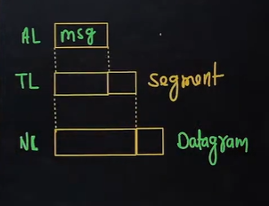

* AL layer sends "message"(packet name is called message here) to Transport layer. Here packet name is called "segment" if we use TCP. TL sends packet to Network layer.
* NL attach H2 header. Here packet is called datagram.
* Total length field is available on Network layer.

Question - we have not taken sequence number from 0. is there any reason?
TCP says - Initial sequence must not start from 0. take any random number.

Example -  

suppose 1st byte seq. No = 100  
and Total length at Network layer = 140 byte

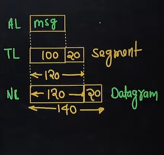

And suppose we take header size of 20B at transport layer.
So datasize at TL will be 100 Byte.

So last byte sequence number = 100+100-1 = 199

**Acknowledgment number  = 200**  

* Transport layer **segment** network layer के **data** में फिट हो जाता है ।
* TL segement(data+header) fit in Network Layer data. Let's take a shortcut

* Suppose below we have a network layer. And header is H2. TL segment will fit in NL Data.

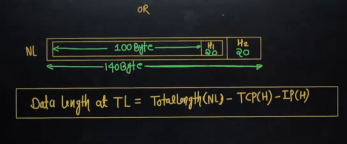

**Data length at TL = Total length(NL) - TCP(Header)- IP(Header)**

## Question
Suppose we have HL = 10, and total length is 1000 for IP header.

And HL = 5 and Sequence no. = 100 of TCP(header) given.

what is the data at transport layer?

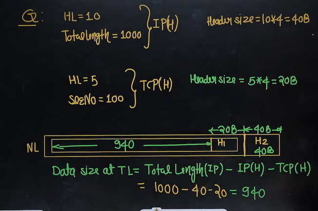

Last byte sequence number how to find?  
sequence number is 100. it is nothing but first byte sequence number  

last byte seq no = 100 + 940 -1 = 1039  
Ack No. = 1040  

let's say we have Sequence number = 32 bit  
Total sequence number = 2^32  = 2^2 * 2^30 = 4G Sequence number  

TCP is byte stream protocol. every byte is assigned a sequence number. हरेक बाइट को sequence नंबर assign होता है । so 4G sequence can assigned to 4G byte.

above means I can send max of 4GB of data at a time.

but we have a problem, what if data size is 4GB.  
e.g. you are downloading a movie of greater than 4GB

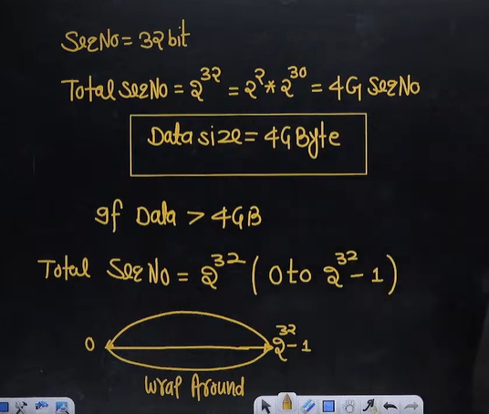

above is called wrap around.

sequence number खत्म हो जाने के बाद, reuse करूँगा ।

We select random number. 
TCP says, Don't start from 0. Take any random number.  

## Wrap Around Time(WAT) - 
Time taken to wrap around .   
कितने  समय के बाद में फिर से वहीं random number पर आ जाऊँगा ? इसी को wrap around time कहते हैं । और ये किस पर  depend करेगा । हम कितनी स्पीड से डेटा को सेंड कर रहें हैं ।

It depends on - Bandwidth

* Let's take an example -  

Bandwidth = 1MBps = 10^6 Byte/second

1 second => 10^6 Byte  
10^6 => 1 second  
10^6 sequence  => 1 second(10^6 sequence number will get over in 1 second)
एक सेकेंड में 10^6 sequence number खत्म हो जाएँगे ।  

1 sequence number = 1/10^6 second

so  
2^32 sequence number = 2^32second/10^6 = 4294.96 second  

So after 4294.96 second sequence number will again start.

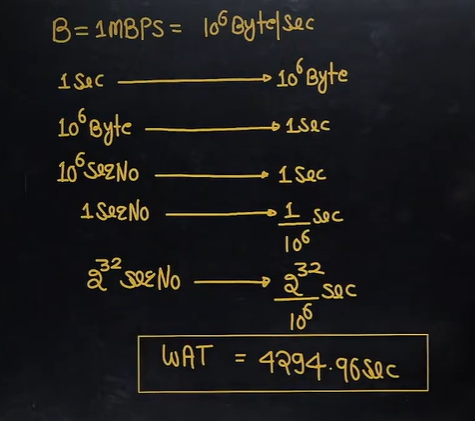

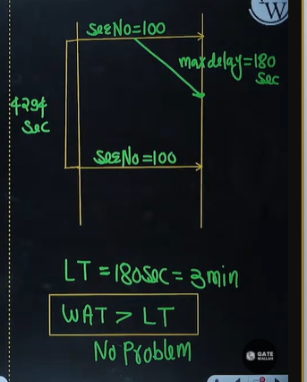

A packet can stay for max of 3 minute on the network. after that it will be discarded ?

WAT - wrap around time  
LT - Life Time  

doubt - is above concept can be applied to when browser stops responding?

now let's create a problem for above thing.

**Example **-  
Support Bandwidth = 1GBps = 10^9 Byte/second.

so above mean  

10^9 Byte are sent in 1 second.  
so 10^9 sequence number will get over in 1 second.  

So 1 sequence number will get over in  1/10^9 second  

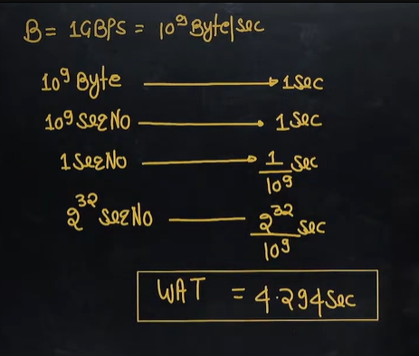

so from above in 4 second sequence number will get over  

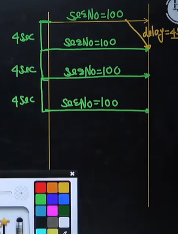

In above same sequence number comes after 4 second. so we have problem.

**WAT < LT**  

Wrap around time is less than Life time. so it's a problem and how we solve it now.

* Sir, reduce bandwith ? do you really want your wifi speed to less. keeping less speed is not the solution
* I don't want to compromise on Bandwidth

 
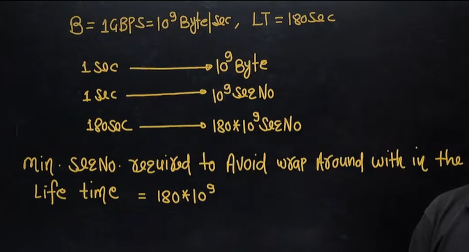

So we can have generalize formula

**Lifetime * Bandwidth**  

minimum no. of bits required in the sequence number field to avoid wrap around within the lifetime is  

[log2180*10^9] = log2(LT*B)  
38 bit

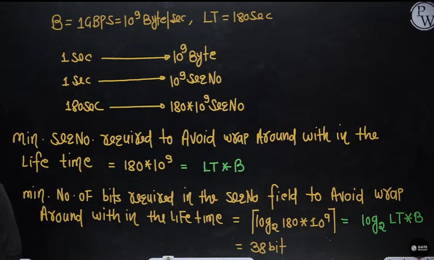

(10^3 ~2^10) => assumption

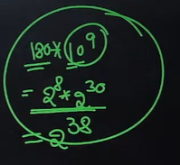

1. **Minimum sequence number required to avoid wrap around within the lifetime = LT * Bandwidth**
2. **Minimum no. of bits required in the seq. no field to avoid wrap around within the lifetime** = [log2(LT*B)]
3. **Bandwidth must be byte/second**

## Question 1
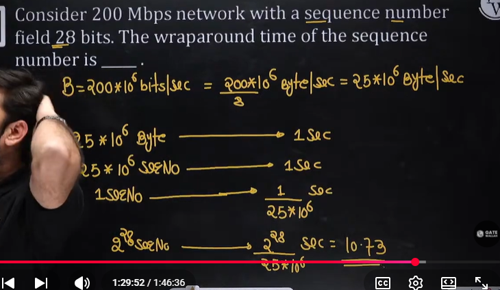

shortcut => 
Wrap Around Time = Total sequence number/(bandwidth in Byte per second)

## Question 2

just apply the formula

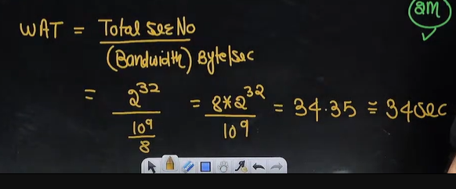

## Question 3
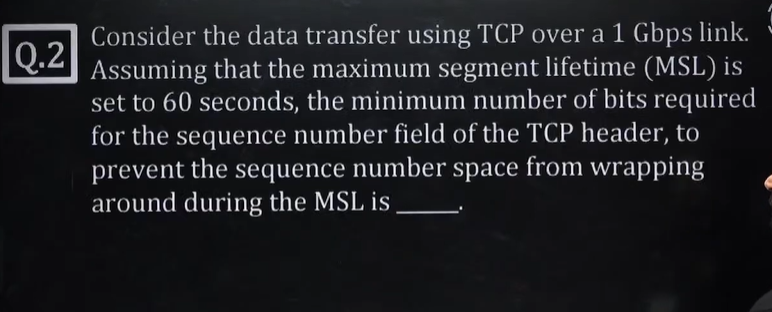

make sure to convert the bits/second into byte/second 

**Minimum no. of bits required in the seq. no field to avoid wrap around within the lifetime** = [log2(LT*B)]

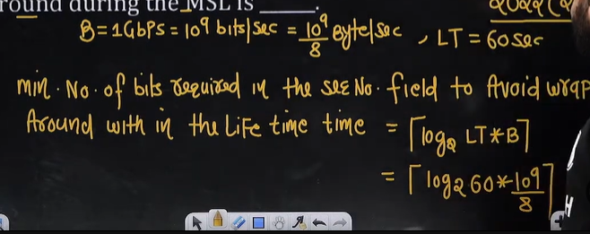

32.8 => 33

