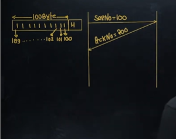

# Computer Networks 22 | TCP Header & Wrap Around Time

* Minimum Header size = 20B + 0 = 20 Byte
* Maximum Header size = 20B + 40B = 60 Byte

* Receiver will come to know the header size from Header length

## Header Length(HL)
maximum number with 4 bit = 1111 = 15(2^4-1)

Maximum Header size = 60 Byte

Now we need to fit 60 with 15.  
So what scaling factor we need to use.  
Use x = 4 as scaling factor  

|Header Size|Header Lenght Field|
|-|-|
|20B/4 = 5|0101|
|32B/4=8|1000|
|40B/4=10|1010|
|60B/4=15|1111|

## Source Port Address(16 bit)
* This is a 16-bit field that defines the port number of the application program in the host that is sending the segment

## Destinationn Port Address
* This is a 16-bit field that defines the port number of the application Program in the host that is receiving the segment.

Port No = 16 bit - Range is 0 to 2^16-1  

* **Well known port number** - 0 to 1023
  * Assigned and control by IANA
  * e.g. SMTP - 25, HTTP - 80, FTP - 20 and 21, DNS - 53
  * Every process will have different port number
* **Registered Port number** or **Reserved**- 1024 to 49151
* **Dynamic Port number** - 49152 to 65535. These are freely available

Now let's come to important thing - sequence number.

## Sequence number
This is a 32-bit field defines the sequence number of the first data

## Acknowledgement
This is a 32 bit field defines the sequence number of the **next expected byte**. If receiver has successfully received byte number x from other party(sender), it returns x+1 as the acknowledgment number.
)
* TCP is a byte stream protocol. That every byte is associated with one sequence number

Suppose we have a data of 100 byte and header is attached.

* If I am sending 100 bytes then we need to use 100 sequence number.
We have segment and need to send it. 

* TCP is connection oriented. So receiver will send acknowledgement.
  * After receiving the segment , receiver sends acknowledgement. Now what will be the ACK number?
  * Here - Next expected databyte number. here till where it has received the segment?
  * It has received from 100 to 199. So it will send the ACk number as 200

* Question - how receiver will come to know. Header only has first byte sequence number. How receiver will come to know last byte sequence number? so how receiver will come to know last byte sequence number is 199.
  * We can find out by byte size? and subtract 1 from it.
  * But do we have any field where data length is present? No.
  * If we had total length field also , then we would have found out TCP data. And from there last byte sequence number.
  * so now what?
  * whose help to take? Now here we take help of network layer. Network layer has total length field.

