# Computer Networks 23 | Congestion Control in TCP

* This topic is very important for GATE
* We will study this in depth

## Window size or Advertising window(16 bit)
* Used for flow control
* TCP is a full duplex connection
  * For understanding we are using half duplex connection

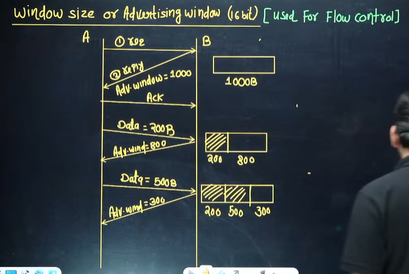

* Sender will not send data more than the capacity of receivers advertised window

## TCP Congestion control

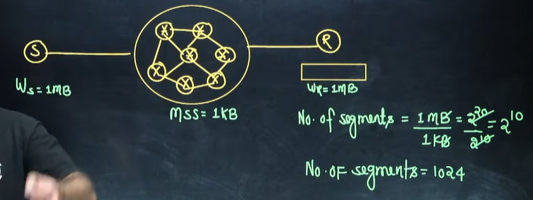

**MSS - Maximum segement size** is 1 KB of the network

Receiver can receive 1024 segments  
So sender will send 1024 segment in the network.  

Router has buffer space. If router doesn't have space it will discard.
So no acknowledgement will NOT be sent by receiver. 

Sender will again send after time-out timer. And more Retransmission means more traffic.

And a situation may come whole network will collapse.

Sender doesn't know why packets are discarded because they both agreed upon receiving 1024 segments.

So before 1980's topic congestion control wasn't present.

Sender was confused why no acknowledgement

**After research, it was concluded network was discarding the packet** and not the receiver.
It was found by Scientist - 1980's  

**Now look in Network capacity also.**

At present - **Window sender size**  

**Ws = min{Network capacity, Receiver Capacity}**

but how sender will know network capacity? It knows receiver's capcity by advertised window send by reciever. 

There is not any general forumula for network capacity as it is dynamic.

**Ws = min{Wc, Wr}**  

So we have a concept of **congestion window for the network**  

## TCP Congestion Control

**An Internet** is a combination of networks and connecting devices (e.g., routers). A packet from a sender may pass through several routers before reaching its final destination. A router has a buffer that stores the incoming packets, processes them, and forwards them.   
If a router the receives packets faster than it can process, congestion might occur and some packets could be dropped.   
When a packet does not reach the destination, no acknowledgement is sent for it.   
The sender has no choice but to retransmit the lost packet.   
This may create more congestion and more dropping of packets, whic means more retransmission and more congestion.  
A point may be reached in which the whole system collapses and no more data can be sent. **TCP therefore needs to find some way to avoid this situation**

## Congestion Window

In TCP, **the sender's window size** is determined not only by the
receiver but also by congestion in the network.  
The sender has two pieces of information: the receiver-advertised
window size and the congestion window size.   The actual size of the
window is the minimum of these two.  

**Actual window size = minimum (receiver window size, congestion window size)**

**Ws = min{Wc, Wr}**  

Initially I will take Wc = 1

पहले मैं एक पैकेट सेंड करूँगा ।

so Ws = min{1, 1024}  

so Ws = 1  

मतलब नेटवर्क की कैपेसीटी 1 पैकेट को होल्ड करने की है ।

next time , Wc = 2  

and if acknowlegement comes, Ws = 2

again this time I will double Wc = 4  

if acknowlegement comes, again it will double to 8. Exponentially increase करेंगे ।    

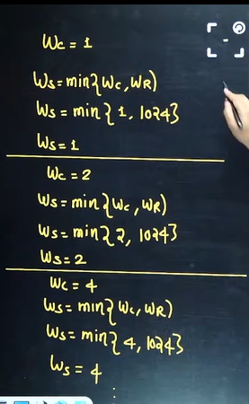

और ये कहाँ तक चलेगा । ये चलेगा Threshold तक  

**Threshold is half of receivers capacity** = 512 capacity  

**After threshold it will be additive.****  

Congestion window =

Wc = 1,2,4,8, 16, 32, 64, 128, 512, 513, 514, 515, 516, ... 1024, 1024, 1024 ...  

It won't go beyond 1024 as receiver's capacity is 1024.

Analogy -  

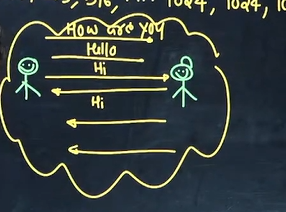

note - Above is congestion window.  

Sender window will be always

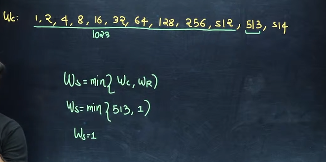

## congestion Control Algorithm

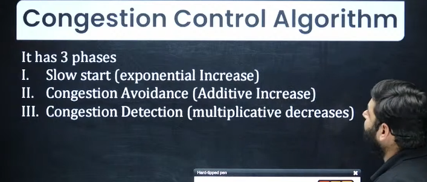

### Slow start phase

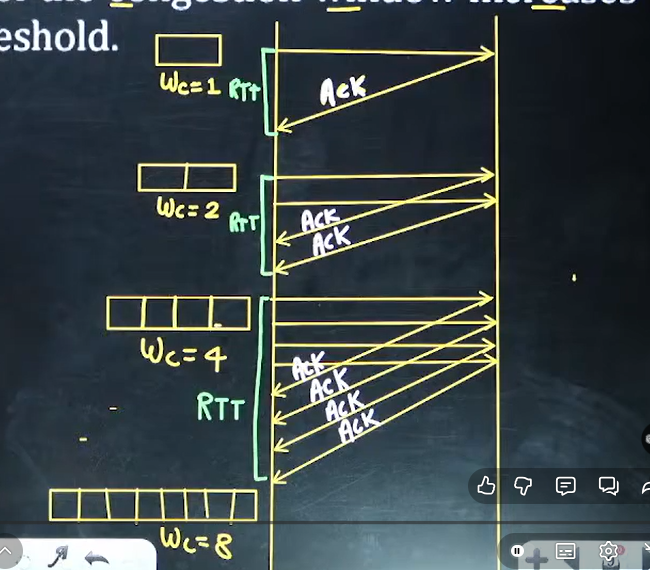

* After one RTT , congestion window will be double in slow start phase
* After receiving one acknowledgement, congestion will be increment by +1  

### Congestion Avoidance Phase

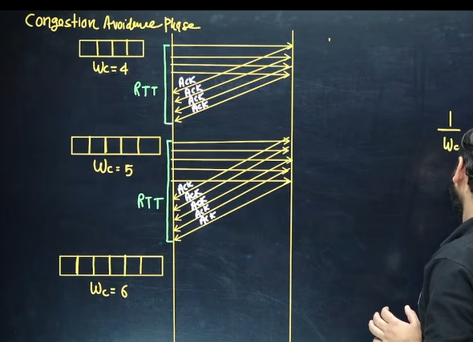

**To Avoid congestion** before it happens(Congestion होने से पहले) we must slow down its exponential growth. In congestion Avoidance we use additive increase instead of exponential increase.

* After one RTT the congestion window will be increased by one only
* If an Ack arrives **Wc = Wc + 1/Wc**

4 + 1/4 + 1/4 + 1/4 + 1/4 = 5  

5 + 1/5 + 1/5 + 1/5 + 1/5 + 1/5 = 6  

### Congestion Detection Phase

Congestion can be detected in 2 ways  
1. Time-out timer
2. 3 duplicate ACK

* => **Time-out Timer**

**Timeout timer** indicate **severe congestion** condition. In this case the new threshold value is set to half of the current window size and next transmission starts from one segment and Algorithm
enters in a slow start phase.

example -  

Suppse sender wants to send below 5 packets each of 100 bytes to receiver

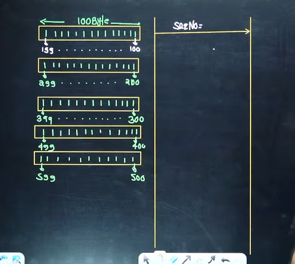

sequence number is equal to sequence number of first packet in the segment  

After receving 1st segement, ack will be 200.

but suppose next 4 segement are lost  

Now since TCP connection oriented, every packet have time-out timer 

पैकेट भेजने के बाद time-out timer हो जाए, इसका मतलब congestion है । 

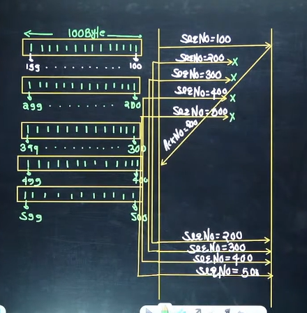

* => **3 Duplicate ACK**

**3 Duplicate Ack indicate** **mild congestion** condition. In this case the new threshold value is set to half of the current window size and
next transmission start from new threshold value and algorithm enters in a **congestion avoidance phase.**

Consider the below diagram where sender wants to send 5 packets of 100 byte each.  

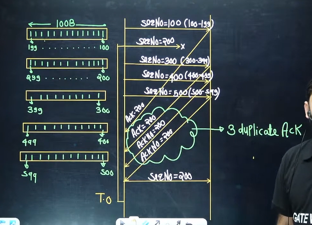

suppose 2nd is lost. 3rd, 4th, 5th are received.  

Acknowlegement number will not be 400 after receiving 3rd packet. it will send 200 acknowledgement.

Again after receiving 4th packet, it will send 200 acknowledgement

And same for 5th packet, ack number will be 200.  

हर पैकेट का timeout timer है ।

यदि Timeout timer से पहले 3 duplicate acknowledgement आ गया, तो सेंडर फिर से sequence number 200 वाला पैकेट भेज देगा । 

So in TCP, before timeout timer also the retransmission of packet can be done.

now after receiving the 2nd packet, what will be the acknowledgement number?

ACK NUMBER WILL be 600. 3rd, 4th, 5th was already received. **hey but did the ACK number 300, 400, 500 were skipped??** and directly send for 600.

Receiver will receive out of order packet, but it will arrange and then send it to network layer  

**one question** - 3 duplicate acknowledgement how it comes? it comes when one packet was lost and next atleast 3 packets were received.
तभी 3 duplicate ack आ सकता है 

तीन क्यों - तीन बार 200 आए, अब तो action लेना पड़ेगा । 

* => **Timeout timer**

Now suppose 512 is Wc and here Timeout timer is processed.
**then new threshold will be half of current window size**

NTH = 256  

and it will again **start from 1st segment** since it was timeout timer condition
1, 2, 4, 8, 16, 32, 64, 128, 256, 257, 258, 259, 260, ... 1024, 1024,...

* => 3 duplicate ACK

SUPPOSE you are currently at 512 and after that 3 duplicate Ack is received.

new threshold will be set to half of current window size = 256  

and new transmission will start from 256, 257, 258, 259, ... 1024, 1024  

ट्रैफिक ज़्यादा नहीं है । इसलिए 256 से स्टार्ट करेंगे । 

Example -  

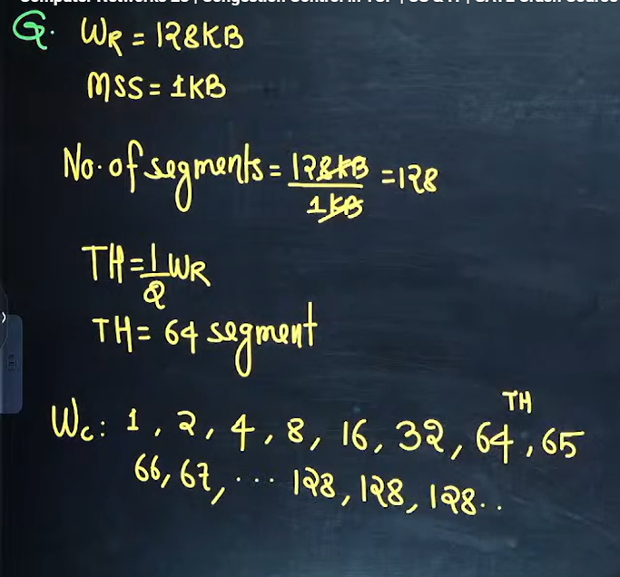

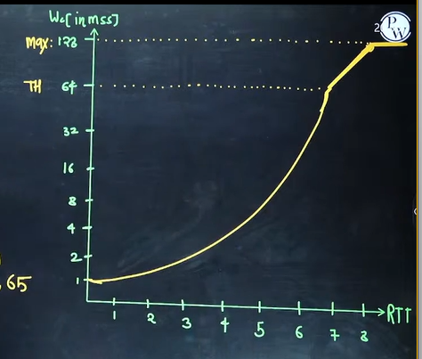

Example -  
suppose we have 3 duplicate condition at 68 here

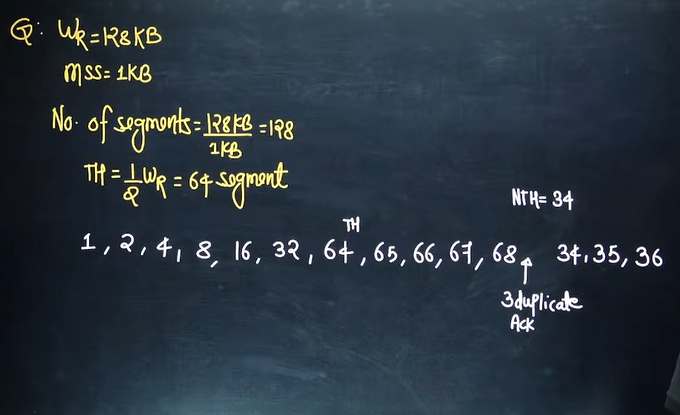

now suppose at 38 we get timeout timer. then we have to start from 1 and NTH =  19

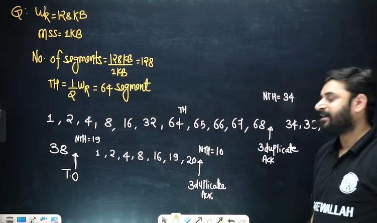

and suppose again at 20 we ahve 3 duplicate, so NTH = 10, and it will start from 10.

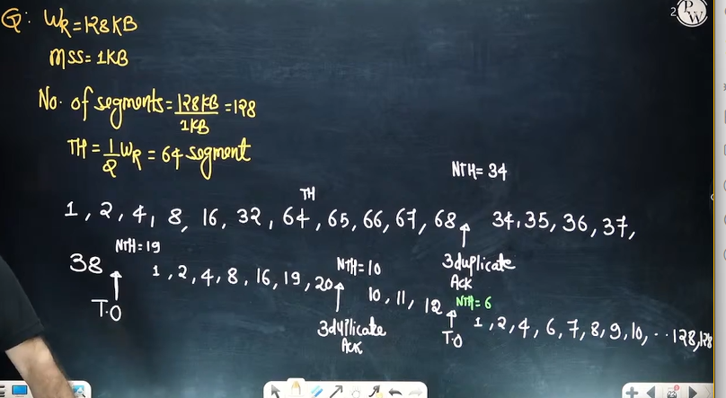

## Problem solving on congestion control

1. Question 1  

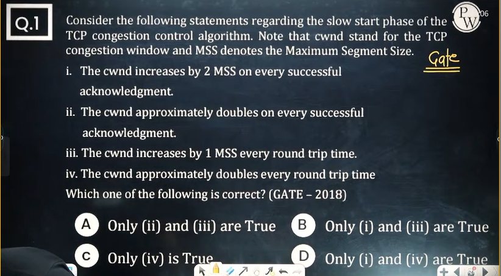

answer - 4th only

2. Question 2  

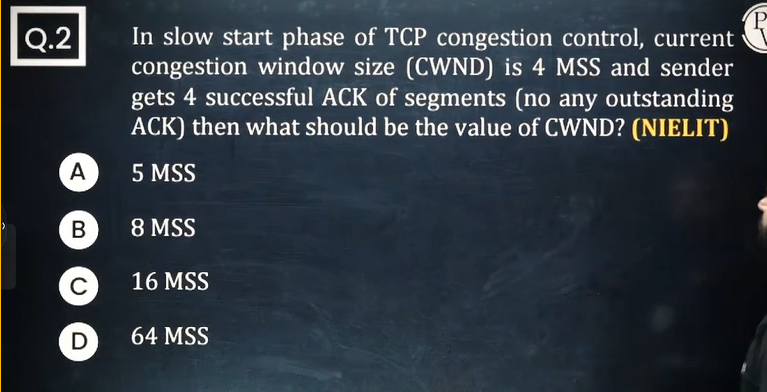

