# Computer Network 25 | UDP | CS & IT |

## Transport layer protocol

Transport layer can be connection oriented or connection less  

* Transport layer
  * TCP (Transmission Control Protocol)
    * connection oriented
  * UDP (User datagram protocol)
    * Connection less

> Important points
1. TCP is reliable process to process delivery of entire message
2. TCP is a connection oriented
3. TCP connection are full duplex and point to point.
4. TCP connection has 3 phases
   1. Connection establishment
   2. Data transfer
   3. Connection termination
5. Each TCP connection is associated with four window
6. TCP uses three way "Handshake" to establish TCP connection.
7. TCP is NOT useful for Broadcasting and Multicasting.
8. TCP Header size is 20 byte but if options are added it will become 60 byte.
9. TCP provide end-to-end error control and flow control
10. Data will be received at the destination in order.

## Out of order segment

TCP implements **today do not discard out of order segment**.They store them temporarily and flag them as out of order until the missing segment arrive.
Note, however, that out of order segment never delivered to process.
**TCP guarantee that data are delivered to the process In order**  

**NOTE** - 
Data may arrive out of order and be temporarily stored by receiving TCP, but TCP guarantee that No out of data delivered to the process

## UDP
1. UDP is message oriented connection less Datagram protocol.
2. It is unreliable tranport protocol
3. It does not provide flow control and error control & congestion control
4. It does not add anything to the services except process to process delivery of data.
5. Header is simple and fixed in size i.e. 8 byte

## => UDE Header

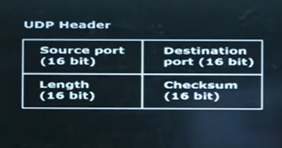

* => **Source Port Address**

This is a 16 - bit field that defines port number of the application program in the host that is sending the segment.
* => **Destination Port Address**

This is a 16 - bit field that defines port number of the application program in the host that is receiving the segment.

* => **Total Length**

It is of 16 bit  
Maximum Number = 2^16-1 = 65535  

Total length = Data + Header
65535 = Data + 8  

**Max UDP data size = 65535-8 = 65527**  

but above is incorrect practically.

Explanation -  

AL sends message to TL  
TL sends segment(in case of TCP) OR Datagram(in case of UDP) to Network layer   
 

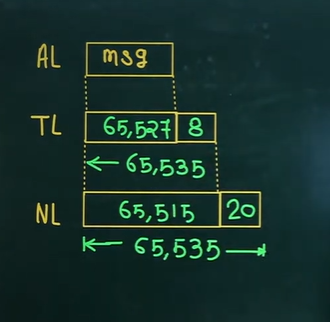

**Network layer can receive maximum data of size 65515 from Transport layer**  

from above diagram, 65535 will not fit in the 65515.

Now let's see what happens actually

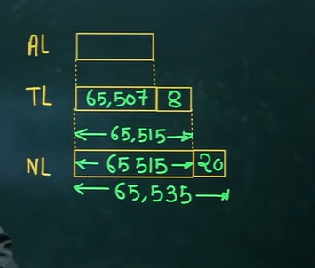

Now header length for TL will be of 8 for UDP. > **So, maximum data size will be of 65507 byte for UDP**

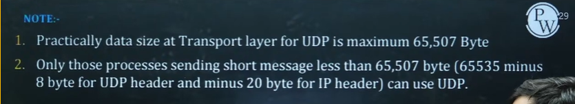

* => **Checksum**

UDP Checksum includes three sections - a pseudo header, UDP header, and the data coming from application layers

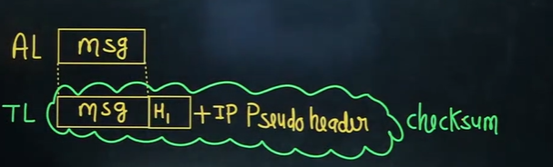

**UDP Checksum = UDP data + UDP header + IP pseudo header**

IP Pseudo Header will not be sent  

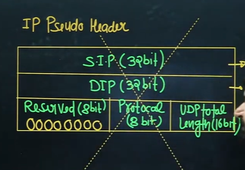

1. Question

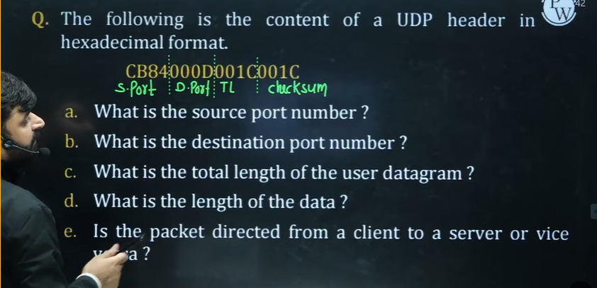

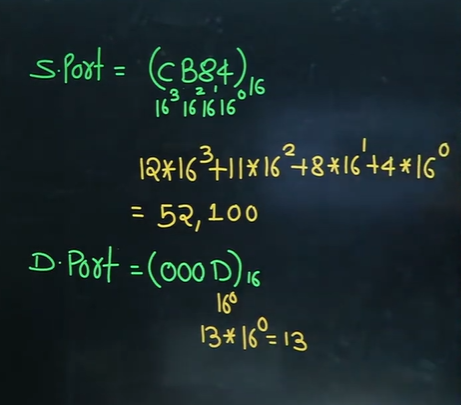

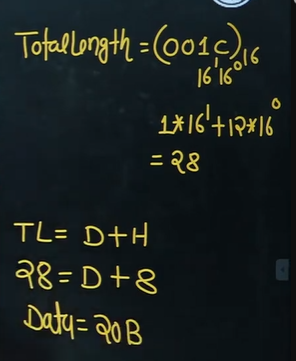

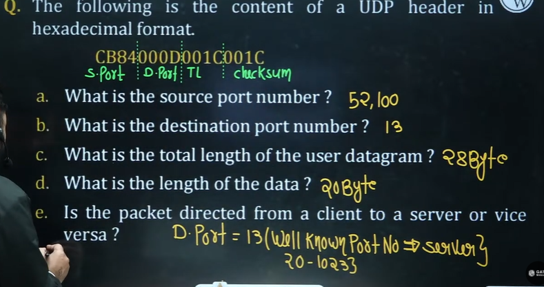

Packet is moving from clint to server  

**Note** -  
1. **When destination port number is well known port number** then data is moving from client to server.
2. **When Source port number is well known port number** then data is moving from server to client

The checksum in UDP is optional  

Note - 

Unlike TCP, the checksum calculation is not mandatory in UDP. No error control or flow control is provided by UDP. Hence UDP depends on IP and ICMP for error reporting.

=> **Optional Inclusion of checksum**  
The sender of UDP packet can be choose not to calculate the checksum. **In this case the checksum field is filled with all 0s before being sent**

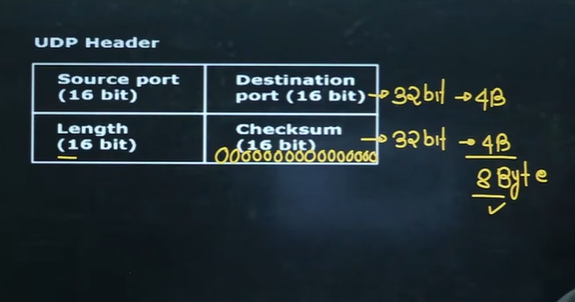

* Question 2  

What value is sent for the checksum in each one of the following hypothetical situations?
1. The sender decides not to include the checksum.
2. **The sender decides to include the checksum**, but the value of the sum is all 1s.
3. The sender decides to include the checksum, but the value of the sum is all 0s.

