# Computer Network 24 | Congestion Control in TCP Part-2 | CS & IT | 

* Question 4

RTT = 10msec  
Wr = 24KB  
MSS = 2KB  
Number of segments = Wr/MSS = 24KB/2KB = 12

Threshold TH = 6 segment
> Since threshold is half of receiver

so upto threshold we do exponential increase (double of previous one)  
After 4 we can't go to 8, but can go to 6
1, 2, 4, 6, 7, 8, 9, 10, 11, 12

count the number of commas in above. And so after 9 round trip time we can send full window.

9 * 10 = 90 msec

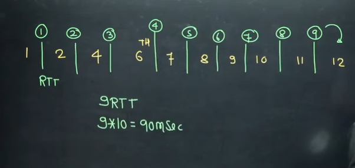

OR  

In above we converted into number of segments.
We can do without segments also.
Threshold is half of Window receiver capacity  
TH = 24/2 = 12KB

Segment size = 2KB  

2, 4, 8, 12, 14, 16, 18, 20, 22, 24

In above we have one segement size of 2 KB, so after 12 it will be 14 and NOT 13(since after threshold we do additive increase)

So after 9 round trip time, whole segment will be send  
9*10 = 90 msec

* Question 5

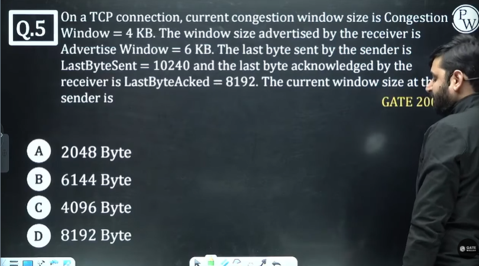

Wc = 4KB  
Wr = 6KB  
Last byte sent = 10240  
Last byte acknowledget = 8192  
We know that window sender size = min{Wc,Wr}  

min{4,6}  
4KB  
4*1024 = 4096 byte  

Those are unnecessay information given

* Question 6

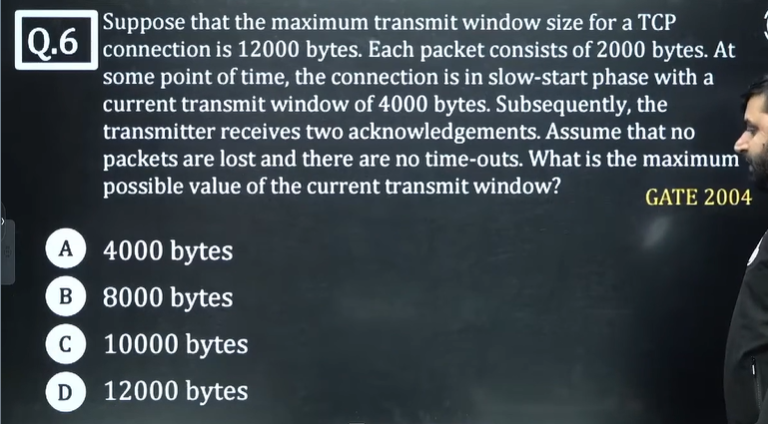

Packet size = 2000 byte  
Ws = 4000  

So if current Ws = 4000, I would have sent 2 segments  
And it got 2 acknowledgements

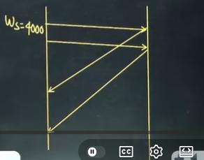

Now recall, in slow start phase, after 1 ack, congestion window increase by 1. And after RTT it's doubled.

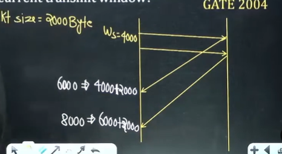

So answer will be 8000 bytes

* Question 7

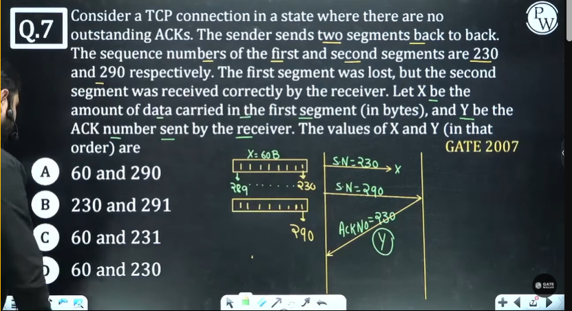

> We have sequence number of 1st and 2nd segment
> Sequence number 230, so first byte sequence number is 230
> First segment lost, and 2nd segment was received
> 1st segment में कितना डेटा है 
> So for 1st segment sequence number will be 289 to 230.(as next segment starts from 290)
> 230 is not received so Y will be 230

TCP can receive out of order packets, but will always send acknowledgement in order

* Question 8

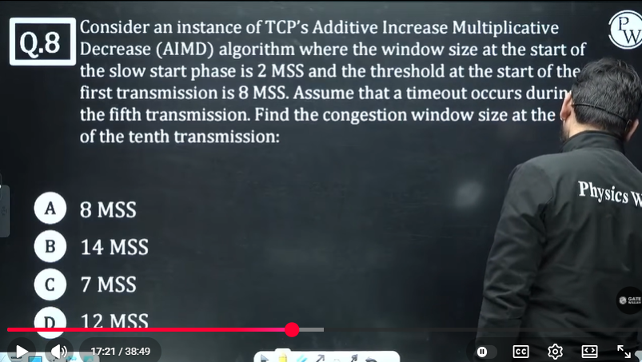

2, 4, 8(threshold), 9, 10  

but assume at 5th we have timeout, so new threshold will be half of set of current window size  

NTH = 5  

And next transmission starts from 1st segement  
timeout suggest severe congestion  

We should take 1 or 2?  
because slow start phase is starting from 2  

some students answered 7 and some 8. there is ambiguity  

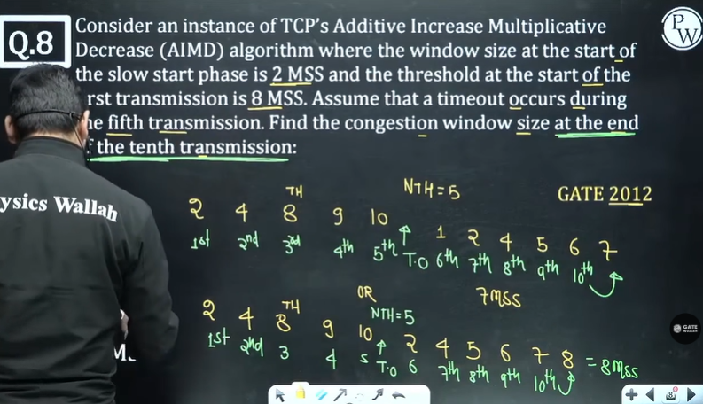

In standard book it's written - It will start from 1st.

but in question it was given 2.

* Question 9

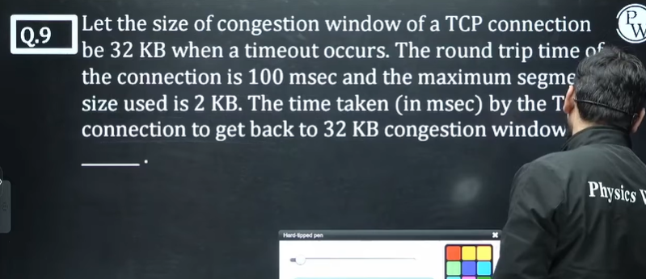

Wc = 32 KB and time out occured

RTT = 100 msec

MSS = 2KB  

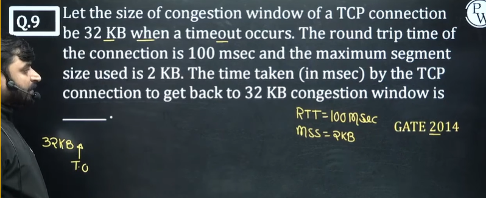

अभी मैं 32 पर हूँ, और Timeout timer हो गया, फिर से 32 आने में कितना टाइम लगेगा ।

New threshold = half of current window size = 16  

2, 4, 8, 16,
after 16 we do additive increase, but one segment is of 2KB

so after 16

18, 20, 22, 24, 26, 28, 30, 32  

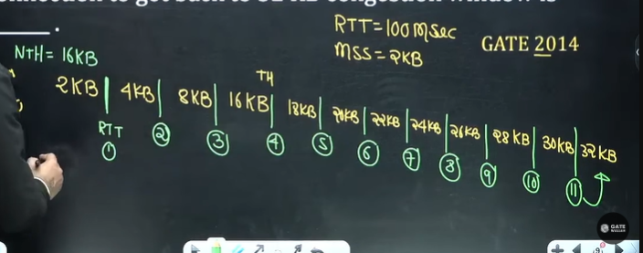

11*100 = 1100 msec  

* Question 10

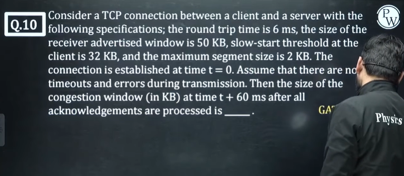

RTT = 6msec  
Wr = 50KB
Threshold = 32KB(given else we would have taken half of Wr)  

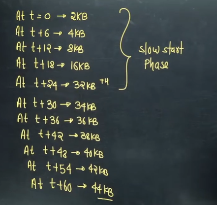

OR  

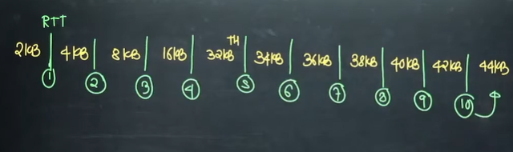

* Question 11

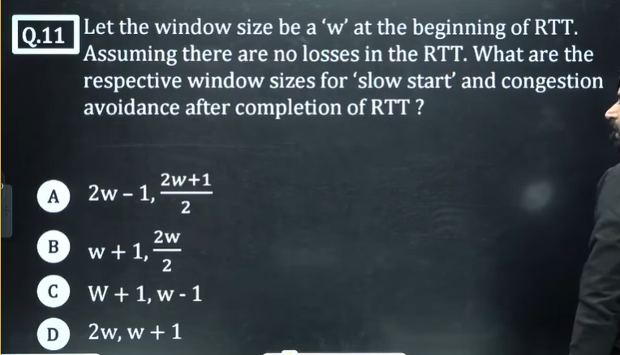

Recall that After a RTT, window size will be double in slow start  

In Congestion avoidance, size will increment by 1

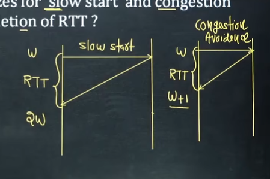

* Question 12

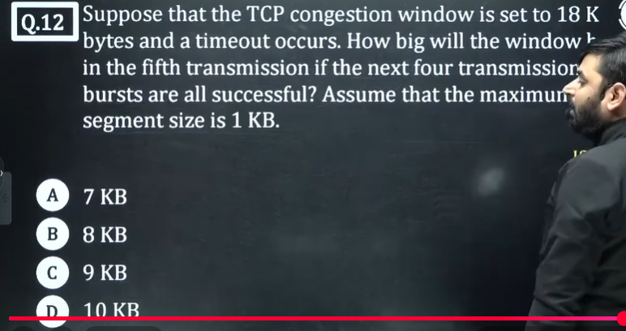

New threshold will be half of current window size = 9KB

**IN** (not after) the 5th tranmision

MSS = 1KB  

1, 2, 4, 8, 9  

so in 5th it will be 9KB

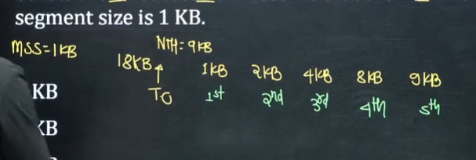

