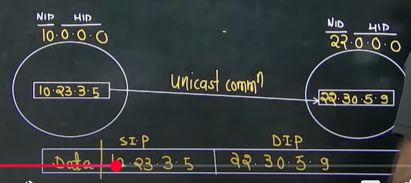
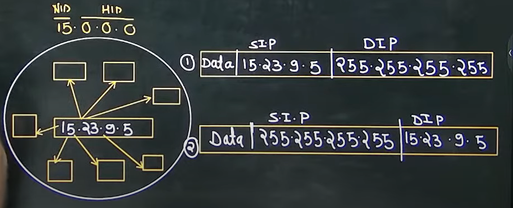
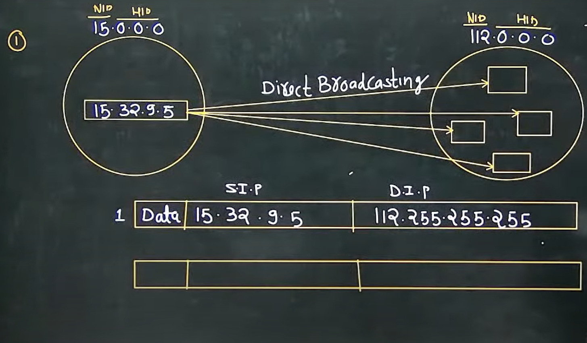

# Computer Networks 03 | Types of Communication

Note - When ever we have all 0's in HID part of any IP address, that IP address represent the NID of entire network this the reason we can't assign this IP address to any host.

## Types of communication
1. Unicast communication(1 to 1)
2. Broadcast communication(1 to all)
3. Multicast communication(1 to many)

## Unicast Communication
Transmitting the data from one computer to another computer is called as unicast communication
It is one to one transmission

Note - 
* In Unicast communication both source and destination can be present in the same network or different network.

## Broadcast communication(1 to all)
Two types -  
1. Limited Broadcasting
2. Direct Broadcasting

**Limited Broadcasting** -   
Transmitting data from **one** computer to **all other** computer in the **same network** is called as Limited Broadcasting

Note - 
1. Limited Broadcast address cannot be use as a Source IP Address
2. Limited Broadcast address will always be used as a destination IP address

2. **Direct Broadcasting** - Transmitting data from one computer to all other computer in the different N/W is called as Direct Broadcasting

Note - Whenever we have all 1's in HID part of any IP address, that IP address represents the direct broadcast address so this is the reason we can't assign this IP address to any host

