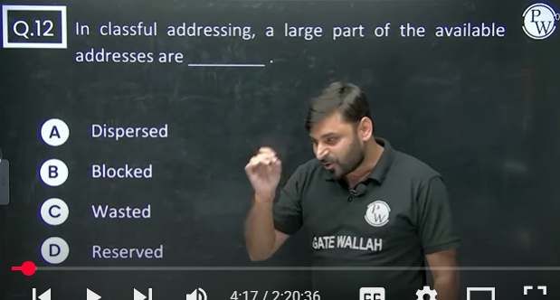
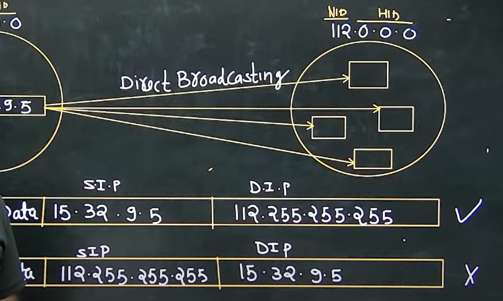
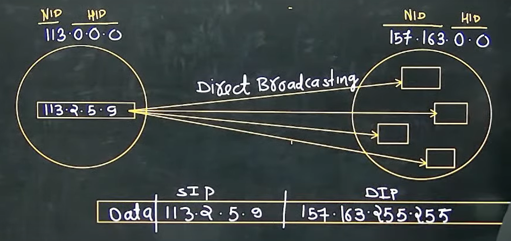
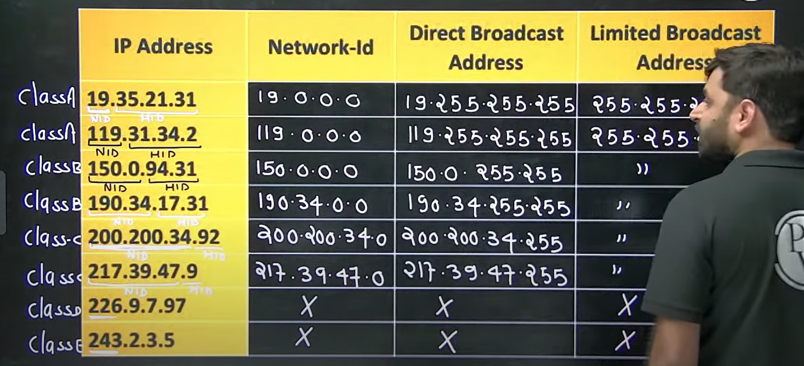
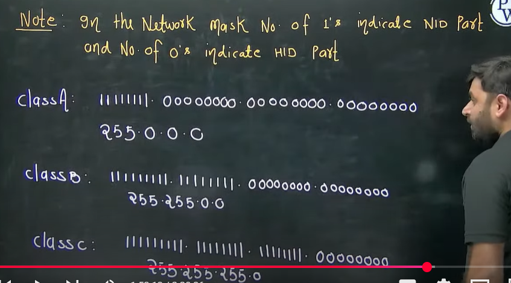
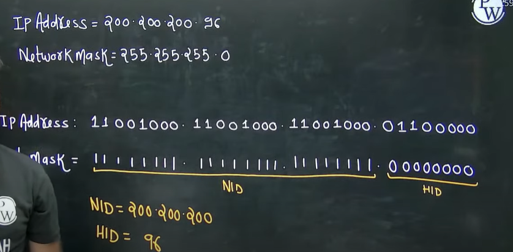
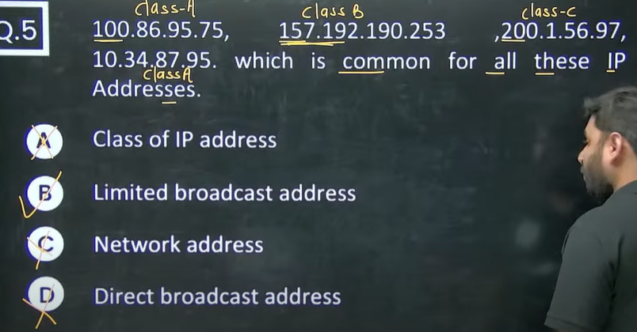

# Computer Networks 03 | Types of Communication
> Question  
> 

Class A - 2^24 IP Address in one network or 2^24 Host/Network  
Class B - 2^16 IP Addresses in one network  
Class C - 2^8 IP Addresses in one networkc  

> Question  
> 

Note - When ever we have all 0's in HID part of any IP address, that IP address represent the NID of entire network this the reason we can't assign this IP address to any host.

## Types of communication
1. Unicast communication(1 to 1)
2. Broadcast communication(1 to all)
3. Multicast communication(1 to many)

## Unicast Communication
Transmitting the data from one computer to another computer is called as unicast communication.  
It is one to one transmission

Note - 
* In Unicast communication both source and destination can be present in the same network or different network.

## Broadcast communication(1 to all)
Two types -  
1. Limited Broadcasting
2. Direct Broadcasting

**Limited Broadcasting** -   
Transmitting data from **one** computer to **all other** computer in the **same network** is called as Limited Broadcasting

Note - 
1. Limited Broadcast address cannot be use as a Source IP Address
2. Limited Broadcast address will always be used as a destination IP address

2. **Direct Broadcasting** - Transmitting data from one computer to all other computer in the different N/W is called as Direct Broadcasting

Note - Whenever we have all 1's in HID part of any IP address, that IP address represents the direct broadcast address so this is the reason we can't assign this IP address to any host

Note - 
1. Direct Broadcast Address can't be used as a source IP address
2. Direct Broadcast Address will always be used as Destination IP address

example 2  of direct broadcast - 

|Network ID|Host ID|Name|
|--|--|--|
|Valid|0's|NID of entire network|
|valid|1's|Direct Broadcast address|
|1's|1's|Limited Broadcast Address|

Example -   

|IP Address|Network ID|Direct Broadcast Address|Limited Broadcast Address|
|--|--|--|--|
|19.35.21.31|19.0.0.0|19.255.255.255|255.255.255.255|
|119.31.34.2|119.0.0.0|119.255.255.255|255.255.255.255|
|150.0.94.31|150.0.0.0|150.0.255.255|255.255.255.255|
|190.34.17.31|190.34.0.0|190.34.255.255|255.255.255.255|
|200.200.34.92|200.200.34.0|200.200.34.255|255.255.255.255|
|217.39.47.9|217.39.47.0|217.39.47.255|255.255.255.255|
|226.9.7.97|X|X|X|
|243.2.3.5|X|X|X>|

## Network Masks - 
A network mask helps you to know which portion of the address identifies the network-id and which portion of the address identifies the host-id. Class A, B, and C networks have default masks, also known as natural masks, as shown here-  
Class A - 255.0.0.0  
Class B - 255.255.0.0  
Class C - 255.255.255.0  

Note - In the network mask number of ones indicate network ID part and number of zeros indicate host id part

Note - IP Address ANDing Network Mask => It gives Network ID

Home Work - Questions 6,7,8,9