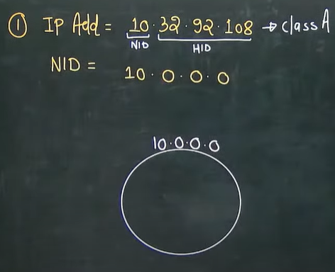

# Computer Networks 03 | Types of Communication

Note - When ever we have all 0's in HID part of any IP address, that IP address represent the NID of entire network this the reason we can't assign this IP address to any host.

