# Computer Networks 37 | Medium Access Control Part 01 ( Pure Aloha)
> Question was asked in 2024 and first time I am teaching this topic in YT
> 

## Topics to be covered
* PURE ALOHA

but before let's understand few things
## Multiple Access Protocols

Lets take a example. In the below diagram. IEEE divided data link layer in 2 parts. **LLC(Logical link control) and MAC(Medium access control)**  

We have studied about LLC - Error control, flow control.

In MAC , it is about access control. We will see how and what happens in access layer later

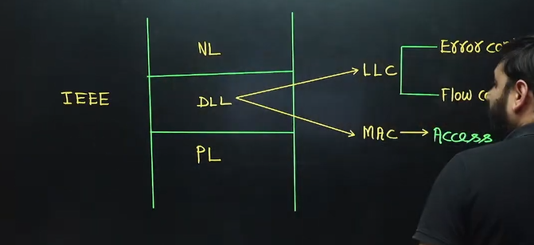

* Data link layer is divided in two - 
  * LLC(Logical Link Control)
    * Error Control
    * Flow control
  * MAC(Medium Access Control)
    * Access Control

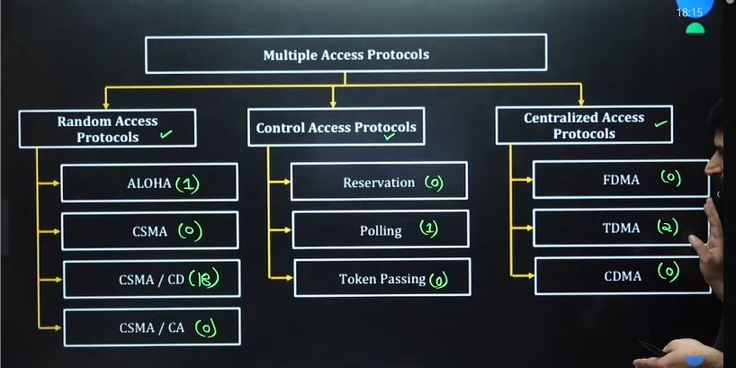

Only 1 question from ALOHA. No question from CSMA.
from CSMA/CD we have 18 question in  GATE.

> I will conver ALOHA, CSMA/CD and TDMA. We will study CSMA/CD in depth
> I will not cover anything in Control access protocols

## What is Media Access Protocol ?
Let's understand this first - 

क्या है Media Access Protocol  

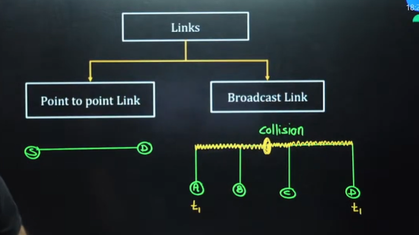

> Link are of two types - Point to point and broadcast link
> In point to point we have source destination with a dedicated link

* **Point to point** - Source and destination send data between each other which is dedicated in Point to point. No problem of collision in if it is full duplex.
* **Broadcast** - We have common channels and many station are connected to it. It is also called **shared channel**. Basically they can access data.
  * Two stations data can collide at a given time t1 when A and B sends data
* Access control का मतलब - **Access Control** basically means **we have to access this link in such a way there is no problem of collision.**
  * Collision की कोई समस्या ना हो ।
  * We have different protocol for above such that no collision occur
* We have different way to access such link.
* Solution - Idea - At a time only one station should data?
* What if we make slots of time - 10:05 to 10:10 only A will transfer , 10:10 to 10:15 only B will transfer

## Random Access Protocols
* Any station can send data at any time
* All stations have same power here.

1. In Random Access, No station is superior to another station and None is assigned control over another i.e. no station permits or stops other station to send data
2. Any station can send the data whenever it wants.
3. If more than one station tries to send then there is an access conflict collision and the Frames will be either destroyed or modified
4. To Avoid collision station must send data by executing a preocedure or condition defined by the protocol
5. There is not fixed order in which station send data so these are called Random Access Protocols
6. Each station competes for the channed hence these are also known as **Contention methods.**

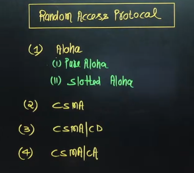

## Introduction To ALOHA
* Aloha was developed at university of hawaii in 1970's.
* It was Designed for wireless LAN but it can be used in any shared medium.
* Each station sends **equal size** Frame.

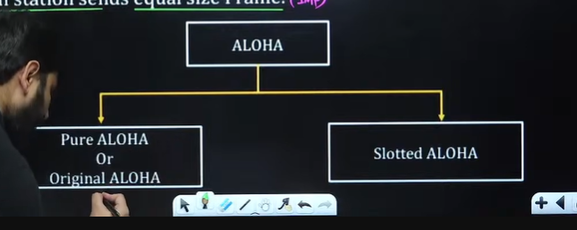

## PURE ALOHA
* It allows the stations to transmit the data at any time whenever they want.
* Hence collision chances are very high.
* After transmitting the data packet stations must wait for the acknowledgement.
* If acknowledgement does not arrive after a time out period, the station assume that frame (or the acknowledgement) has been destroyed.
* The timeout period is equal to the maximum possible round trip propagation delay i.e. **2*Pd**
  * Reason?
* After time out, station will again send data but if it immediately tries to send data packet then collision will occur. Because timeout timer is also same for all the stations. Hence no station can effectively send data.
* So station must not send frame immediately after time out.
* It must wait for random amount of time called **back-off or waiting time   
* Back off time = k * **slot time**
  * k is any random number in between 0 to 2^n -1

Note - Collision number is with respect to the data packet

What is slot time?  
different things are said in different book - RTT, Pd, Td. Standard books have conflict among themselves.
In exam question it will be given
Note - Maximum number of attempts for the station is 15.

## Binary exponential Back off Algorithm(2 station)
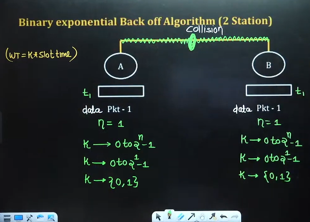
* Suppose Station A wants to send packet 1 and Station B wants to send packet 2
* They send at same time at t1
* So a collision will happen
  * so n =1 for both of them for first time becasue both data packet collided for first time
  * so k will be {0,1} - 0 to 2^n-1

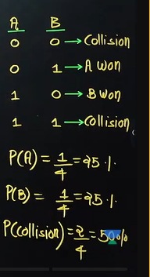

from above collision probability is 50%

* If we choose {0,1}. A choose 0 and B choose 1
  
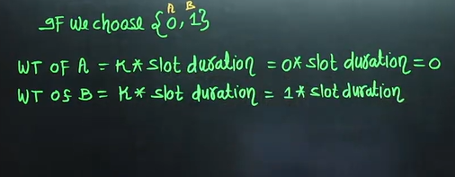

So A would have successfully sent the data packet

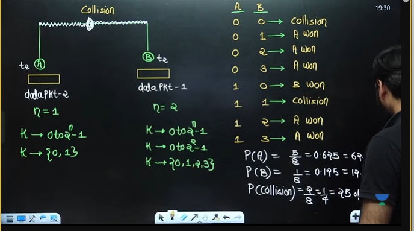

At second time n = 1 for A, because data packet 2 has collided for first time and for B, n = 2 because it's the same packet which is colliding again.

* **Third Time**

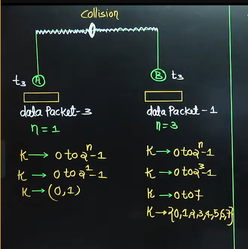

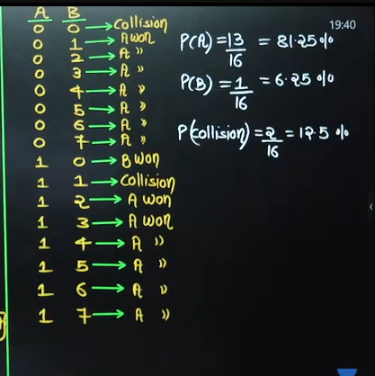

Now above is the one of the disadvantage of above algorithm
* Starting - A have 25% and B have 25%
* Second time A won, 3rd time A won
* A will capture whole link and won't give chance to other station

## Disadvantage of Back Off Algorithm
This algorithm suffers from **capture effect**. If any station wins in the 1st collision then it have a more probability for winning in the next collision.

e.g. 
P(A) =  25%  
P(A) =  62.5%  
P(A) = 81.25%  

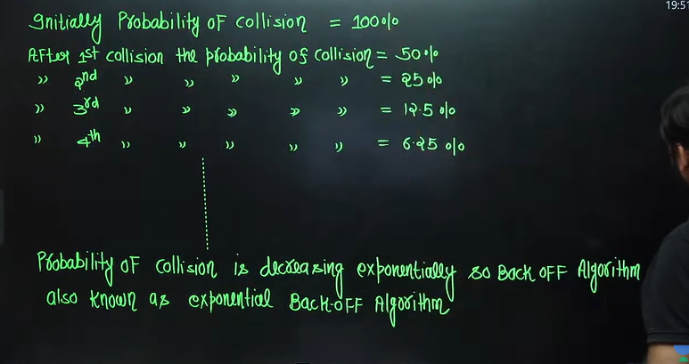

