# Computer Networks 38 | Medium Access Control Part 02 ( Slotted Aloha)

> Today we will complete Pure ALOHA and start slotted ALOHA
> We studied till disadvantage of back off algorithm 

## Vulnerable Time for Pure ALOHA
* Vulnerable time is the **range of time where collision take place**.

Suppose we have below timeline diagram. let's we divide the time into slots.

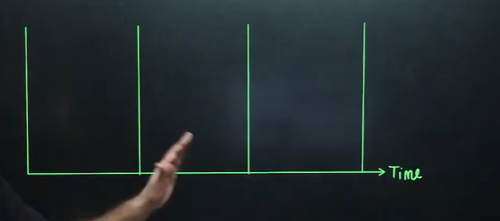

what are these slots?
> These slots are transmission time for single frame

**Transmission time for single frame(Tf) = Frame size/Bandwidth**  
**= L/B**  

Tf is transmission time for single frame

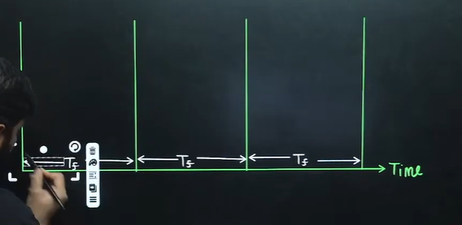

With the channel can be any number of system connected. let's say we 3 stations.

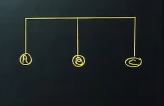

let's say we have time 't'.  
back will be t-tf
and front will be t+tf

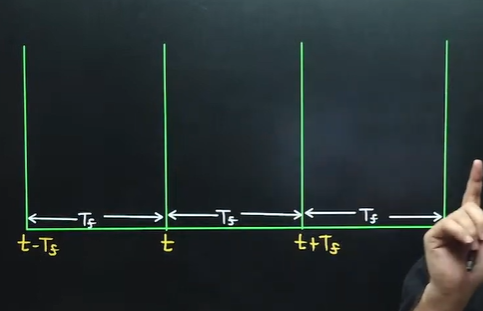

Let's say we have station B and it start transfer of frame and when it will complete? t+tf

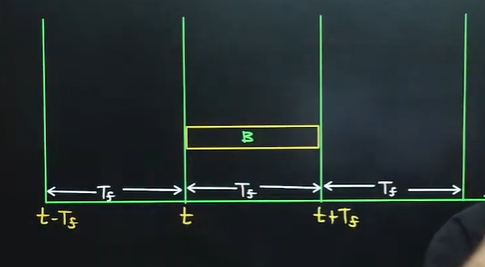

> Question - Now let's say station A or C start transfer of frame like below no collision will happen

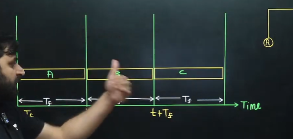

But we have a problem. let's say another station start from like below as shown. Now the **A's frame End will collide with B's beginning frame.**

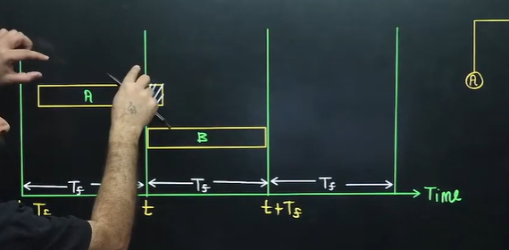

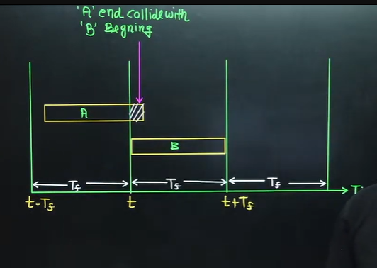

Now let's say station C start from slight earlier from t+tf as shown. then what will happen?

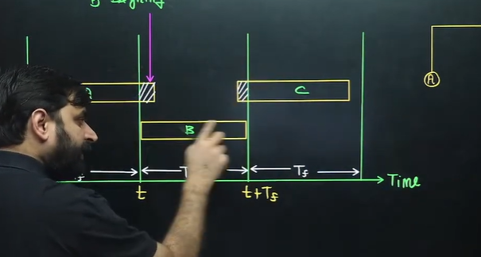

> C's frame beginning will collide with B's End

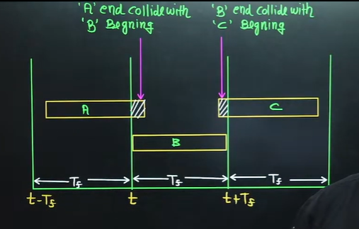

now what's is vulnerable time? कौन से टाइम में कॉलिसन हो रहा है ।

Collision range = [t-Tf to t + Tf]

**Vulnerable time for Pure ALOHA = 2*Tf**

Another example for collision range

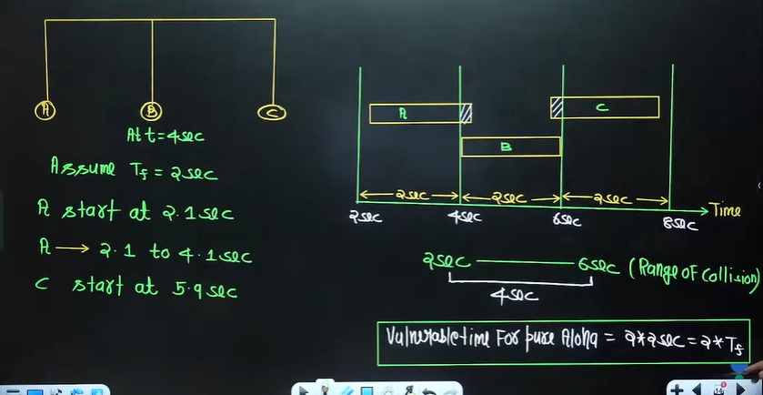

## Throughput of Pure ALOHA

ये फॉर्मूला कहाँ से आया । गेट एग्जाम के लिए जरूरत नहीं है

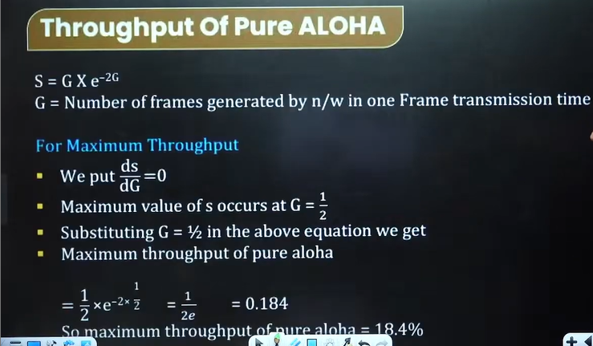

Maximum throughput of pure aloha = 18.4%  

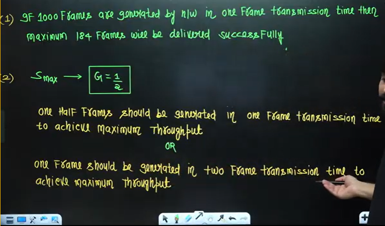

> One Frame should be generated in two frame transmisson time to achieve maximum throughput. It is nothing but vulnerable time = 2*Tf

* Proof =>

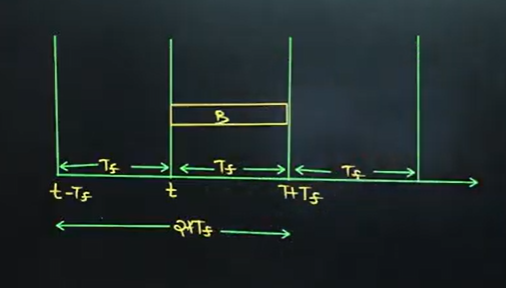

**Note -** 

* If one frame is generated by the network in two frame transmissior time then in this situation we will achieve maximum throughput
* Vulnerable time 2Tf is basically representing if one frame is generated by the network in two frame transmission time then there will be no collision. if there is no collision then we will achieve maximum throughput

* Example 

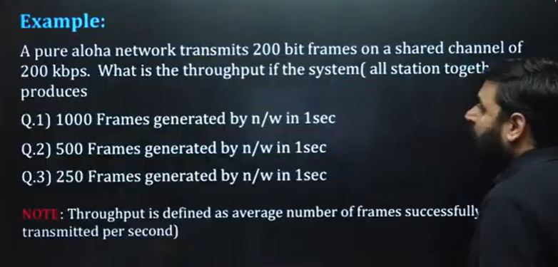

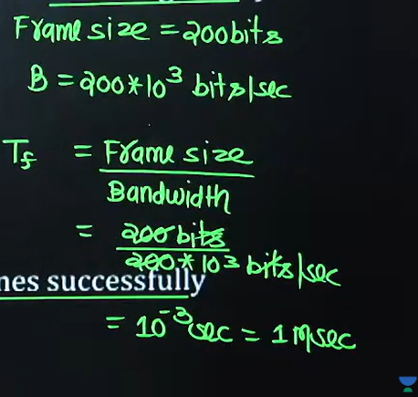

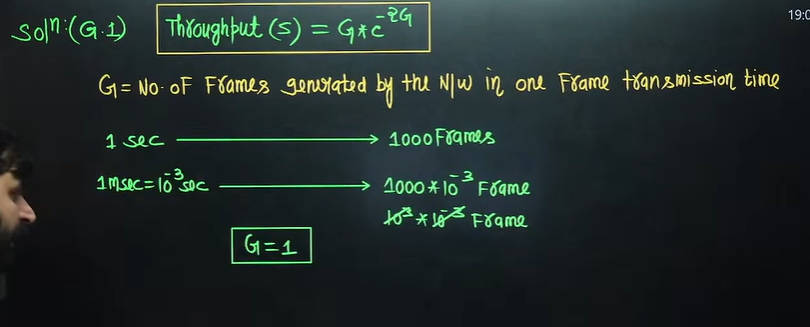

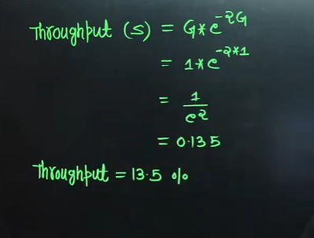

By question throughput is  Average number of frames transmitted per second  
so 1000*0.135 = 135  

Solve 2nd and 3rd on your own  

> 2nd part

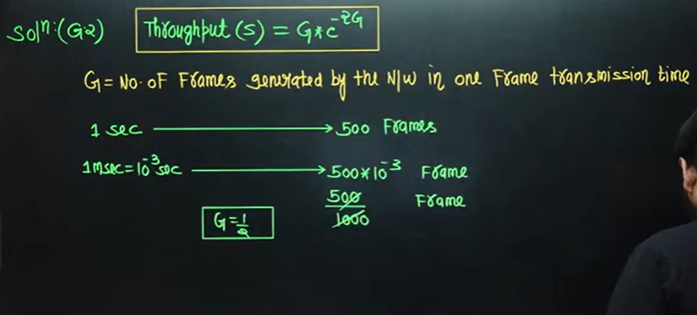

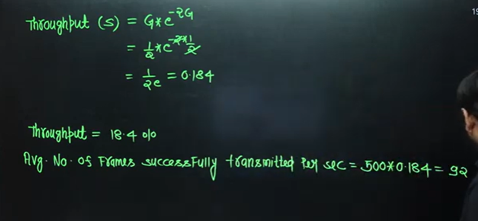

> 3rd part

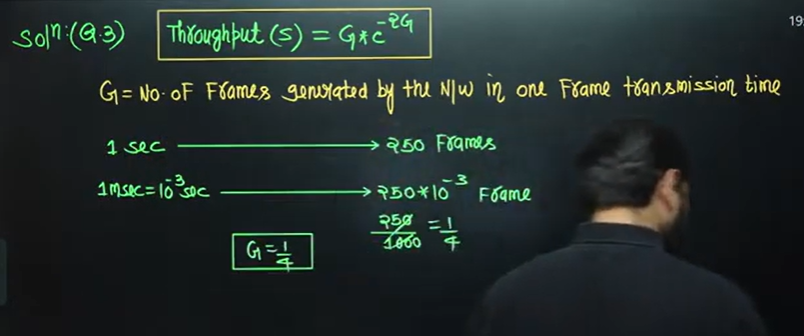

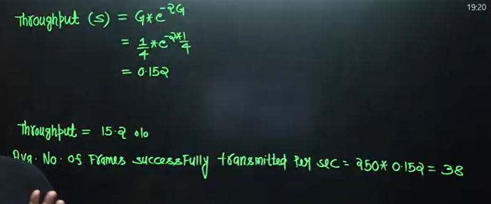

## => Slotted ALOHA

> Why we went from pure aloha to slotted aloha?
> Let's take the example

* Slotted aloha divides the time of shared channel into discrete intervals called as time slot (time slot = Transmission time For one frame).
* Any station can transmit its data in any time slot.
* The only condition is that station must start its transmission from the Beginning of time slot.
* If the Beginning of the slot is missed, then station has to wait until the beginning of next time slot.
* A collision may occur if two or more stations try to transmit data at the beginning of the same time slot.

## => Vulnerable time for Slotted ALOHA
Vulnerable time is the range of time where collision take place.

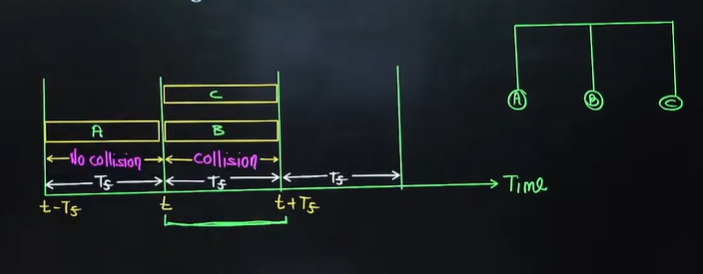

Collison may happen if any other station tranmit frame in the slotted time

**Vulnerable time for slotted ALOHA = Tf**  

> Collision will occur only in one slot. because frame will be transferred only in the begenning of the slot , not in the middle or any other time

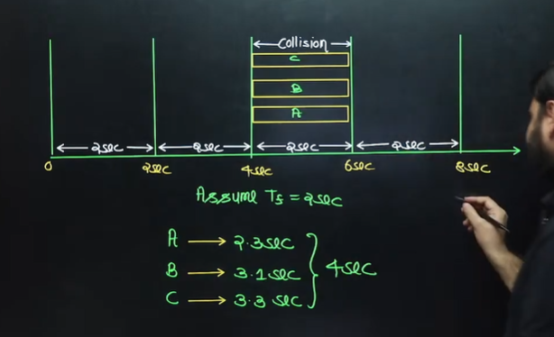

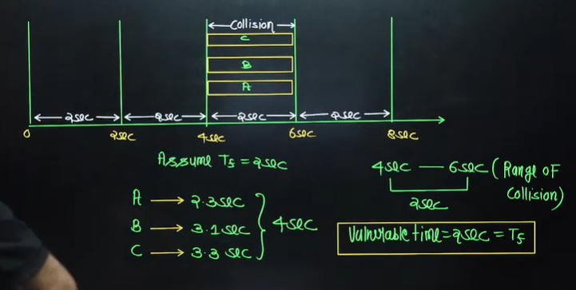

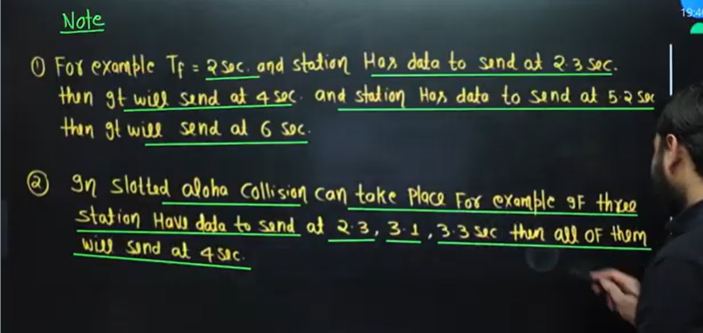

## => Throughput of Slotted ALOHA

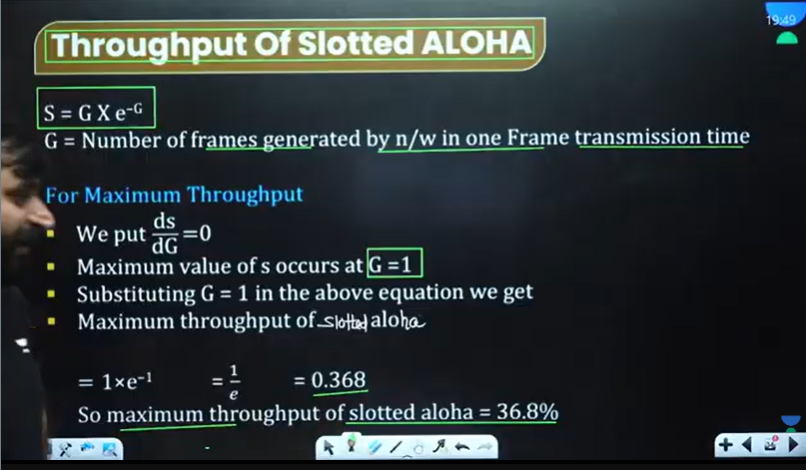

> If collision time is halved then throughput will be doubled when we compare with pure aloha 

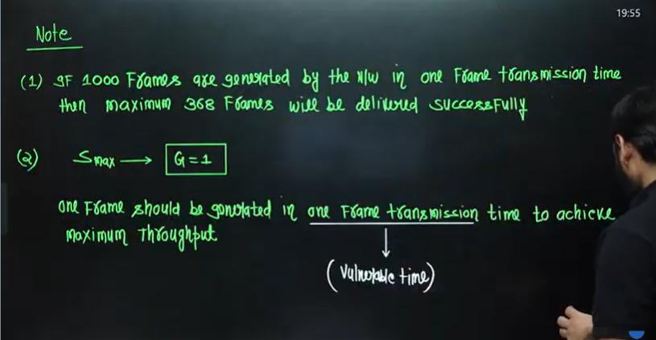

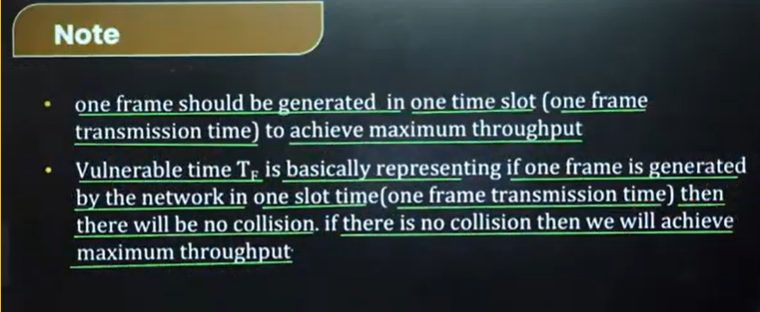

* => Above screenshot explanation

## 1️⃣ What does “no collision” mean in **Slotted ALOHA**?

In **Slotted ALOHA**, time is divided into equal slots.

* A frame can only start at the **beginning of a slot**
* If **exactly one station** transmits in a slot → ✅ success
* If **2 or more stations** transmit in the same slot → ❌ collision
* If **no one transmits** → idle slot (wasted)

So “no collision” in a slot means:

> Exactly one frame was transmitted in that slot.

---

## 2️⃣ Your doubt:

> If there is no collision, throughput should be 100%

This is the key misunderstanding 👇

You're thinking:

> "If no collision happens at all, then every slot is successful → so throughput = 100%"

That would be true **if every slot had exactly one transmission.**

But in Slotted ALOHA:

* Some slots are idle
* Some slots have collisions
* Only some slots are successful

So when the slide says:

> “If there is no collision then we achieve maximum throughput”

It does **not** mean:

> There are zero collisions in the entire system.

It means:

> In that particular slot, if exactly one frame is generated → no collision → that slot contributes to throughput.

---

## 3️⃣ Why throughput is NOT 100% even at maximum

Throughput = probability that a slot has exactly one transmission.

Mathematically:

[
S = G e^{-G}
]

Where:

* G = average number of transmission attempts per slot
* S = successful throughput

Maximum throughput occurs at:

[
G = 1
]

Then:

[
S = 1 \cdot e^{-1} = \frac{1}{e} \approx 0.368
]

So maximum throughput ≈ **36.8%**

---

## 4️⃣ Why only 36.8%?

Even when we tune the system optimally:

* Some slots are still empty
* Some slots still have collisions
* Only ~36.8% slots have exactly one transmission

So the system **cannot** reach 100% because randomness causes unavoidable idle slots and collisions.

---

## 5️⃣ What the slide actually means

The slide says:

> “If one frame is generated in one slot time then there will be no collision. If there is no collision then we will achieve maximum throughput.”

What they are saying is:

* If we adjust traffic so that on average one frame is generated per slot (G = 1)
* Then the system reaches its theoretical maximum throughput
* Even though collisions still happen probabilistically

So yes — you're correct to suspect something subtle.

It would be clearer if it said:

> “When the average load is one frame per slot, the system achieves maximum throughput.”

Not:

> “If there is no collision.”

---

## 6️⃣ Short Answer to Your Question

You are **not wrong**, but:

* “No collision” refers to a single slot being successful.
* It does NOT mean zero collisions overall.
* Maximum throughput of Slotted ALOHA is 36.8%, not 100%.

* Example - 

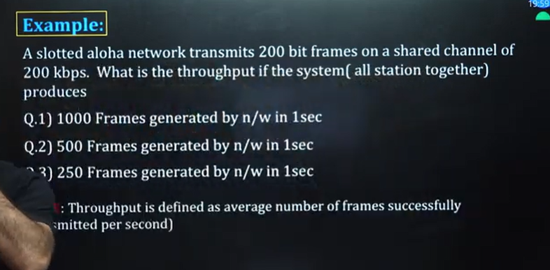

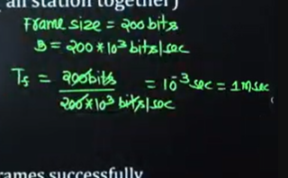

> Part 1 

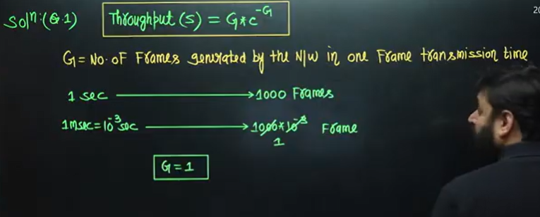

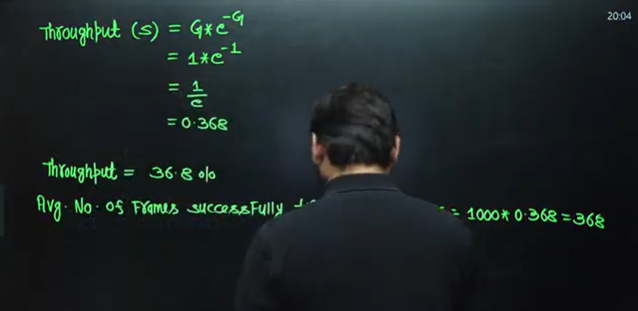

Next two parts are homework  

