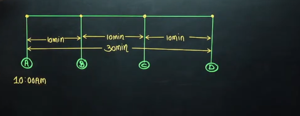
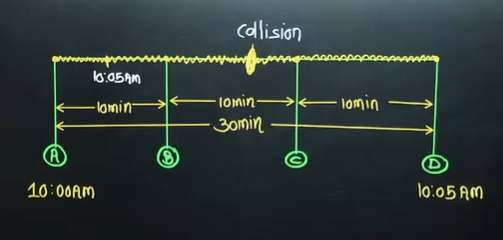
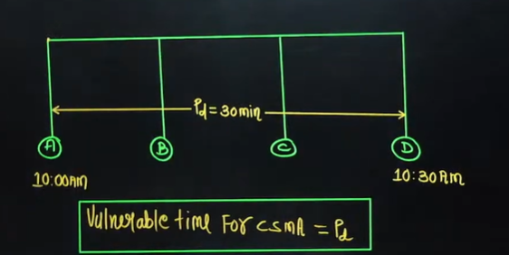
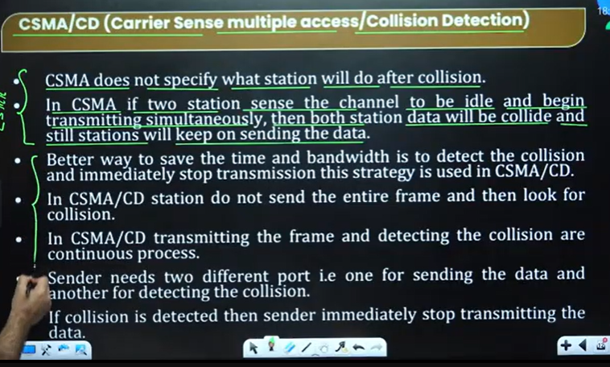
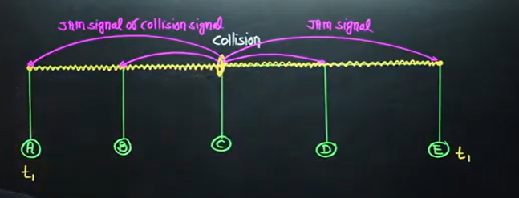
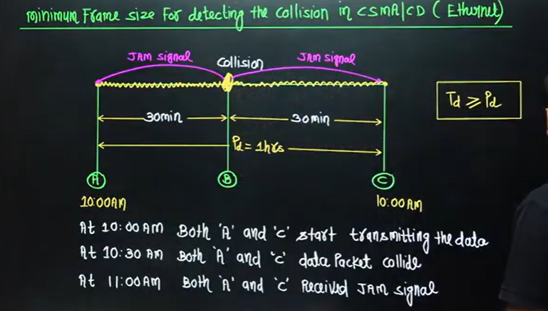
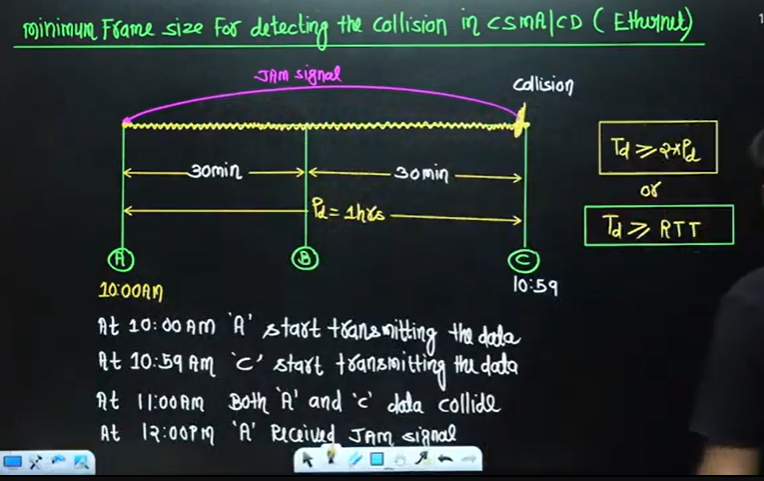
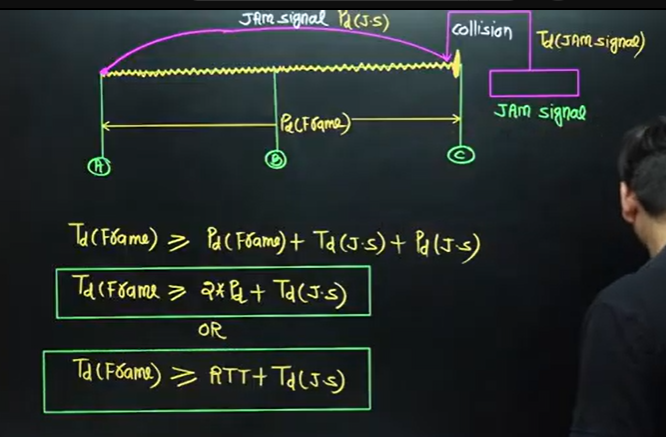
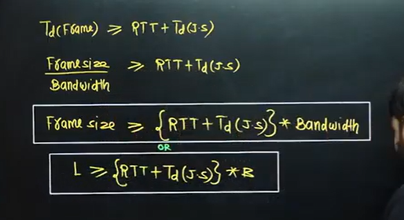

# Computer Networks 39 | CSMA/CD And Enternet | CS & IT

> CSMA is important to understand before studying CSMA/CD

## CSMA (Carrier Sense Multiple Access)
> Carrier sense - We have to sense the medium
> We need to reduce the chances of collison that's why we need it.
> लिंक फ्री है कि नहीं
> Before transmitting the data, Station has to sense the carrier

* **To minimize the chances of collision** **CSMA method was developed**
* Chances of collision can be reduced if **station sense the medium or carrier before trying to use it.**
* CSMA requires that each station , **first sense the the carrier before transmit the data**

## How To sense the Medium?

* Each station **can sense the carrier only at its point of contact** with carrier.
* **It is not possible for any station to sense the entire carrier.**
* **Thus, there is a huge possibility that a station might sense free when it is actually not.**

example -  

consider below diagram.
कोई भी स्टेशन ये सेन्स नहीं कर सकता कि पूरा फ्री है कि नहीं ।

> Analogy - Raju wants to go to Dehradun from Delhi. Raju cannot tell whole road from delhi to dehradun is free and there is no traffic.

* **The possibility of collision still exists because of propagation delay.**
* When a station send a Frame, it still takes small amount of time for the 1st bit to reach every station so the station may sense the medium and find it idle.

* **Vulnerable time in CSMA**
  * Vulnerable time for CSMA = Propagation time

> If A started at 10 am then no station should transfer the bit until the bit of A reaches the destination. So collision will not occur after 10:30 am

* When a station send a frame and any other station try to send a frame during this time, a collision will result.
* But if the first bit of frame reaches the end of medium, every station will already have heard the bit then stations will understand that medium is busy.

## => CSMA/CD(Carrier sense multiple access/Collision Detection)
> CD means collision detection

SP - Sending Port - For sending the data
LP - Listening port - For detecting the collision

CS - Before transmitting the data, station has to sense the carrier or medium. Otherwise it has to wait.

MA - Many stations can access the same channel

CS - Station has to detect the collision before finishing the transmission

* **No Acknowledgement**
There is no need of acknowledgement if collision is not detected then frame is definitely received by receiver

* No copy

**Once frame is transmitted** **sender does not maintain a copy of that frame** because station is simultaneously sending the frame and detecting the collision, if collision is not detected that means receiver has successfully received the frame.

* JAM signal may come after complete packet is tranferred to the link. And in that case station A will by mistake come to conclude that some other station is transferring the packet. but infact JAM signal came late

From above we get a new concept of **"Minimum frame size for detecting the collision"**

**Transmission delay should be greater than propagation delay**

Extreme case - End point collision

from above Transmissin delay should be twice of propagation delay. Here 2Pd is called Round trip time. It's not same as we studied before.

Td >=2Pd  

above formula is not complete  

Let's see the perfect formula  

