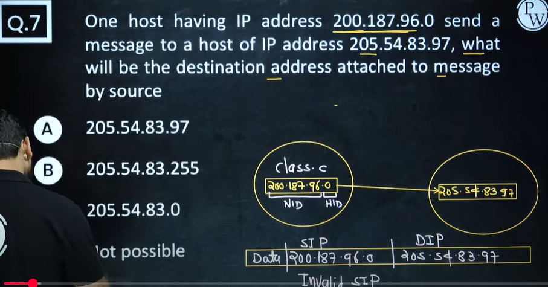
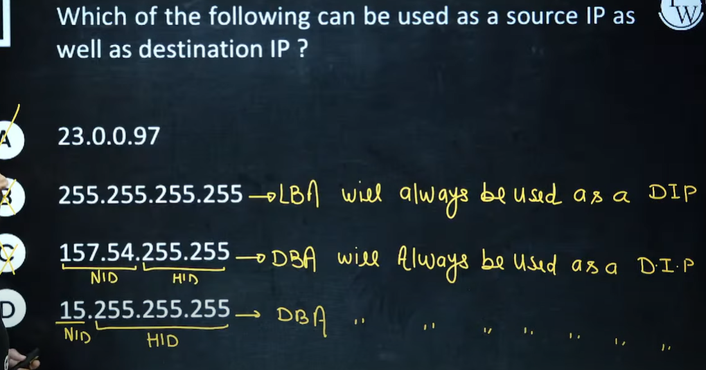
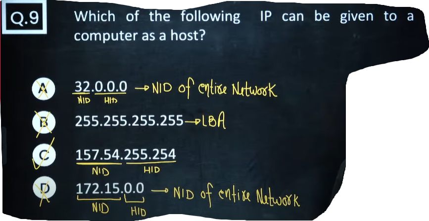
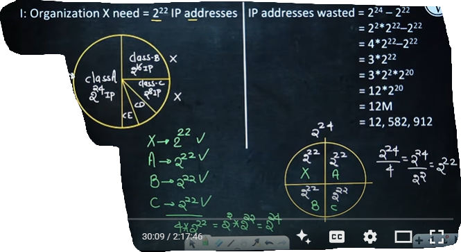
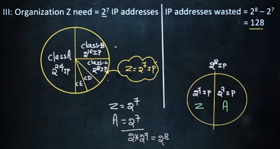
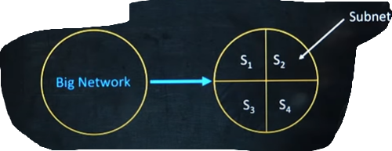

# Computer Networks 04 | Introduction to Subnetting

# Classful Addressing
1. Class A - 2^24 IP Addresses in one network
2. Class B - 2^16 IP Addresses in one network
3. Class C - 2^8 IP Addresses in one network

### 1. **Classful Addressing (Old Method)**

* IPv4 was originally divided into **fixed classes** (A, B, C, D, E).
* Example:

  * Class A → **/8** → 16,777,214 usable hosts
  * Class B → **/16** → 65,534 usable hosts
  * Class C → **/24** → 254 usable hosts

👉 Problem: **Wastage of IPs.**
If an organization needed only 500 IPs, they couldn’t fit in Class C (only 254 hosts), so they had to take a whole Class B (65k hosts). That meant \~64k addresses wasted.

---

### 2. **Subnetting**

* Introduced to **divide large blocks into smaller networks**.
* For example:

  * Instead of using the full **Class B (/16)** = 65k hosts, you could subnet it into smaller chunks, say /24 → 254 hosts each.
* Benefits:

  * **Less wastage** (right-size the subnet to the actual number of hosts).
  * **Better network management** (smaller broadcast domains).
  * **Improved security and routing**.

---

### 3. **CIDR (Classless Inter-Domain Routing)**

* Came **after subnetting** as a more flexible approach.
* CIDR allowed **ignoring the rigid classes** (A, B, C) and just using prefixes like /10, /13, /28, etc.
* This made **IP allocation more efficient** and slowed IPv4 exhaustion.

---

✅ So in order:
**Classful Addressing → Subnetting → CIDR**

Example -2

Example - 3

# Subnetting
The process of dividing a big network to many smaller subnet is called as subnetting.

Note - The process of Borrowing bits from Host ID to generate the subnet ID is also called as Subnetting
* No of bit borrowed depends on our requirement

Example - 
