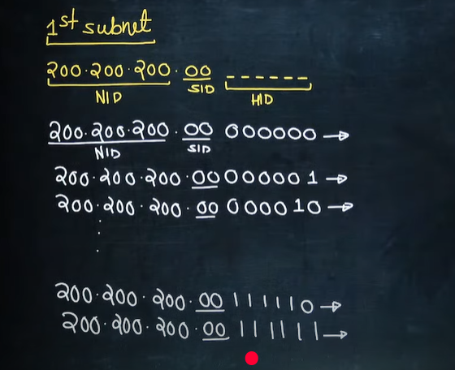
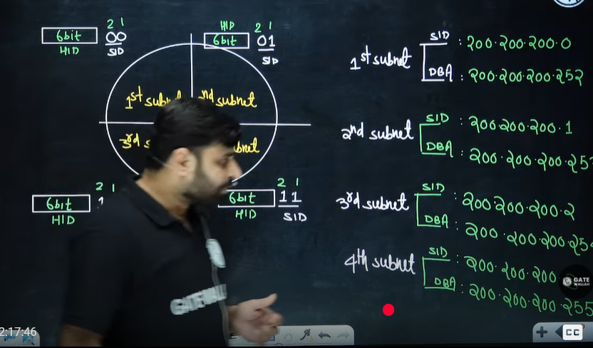
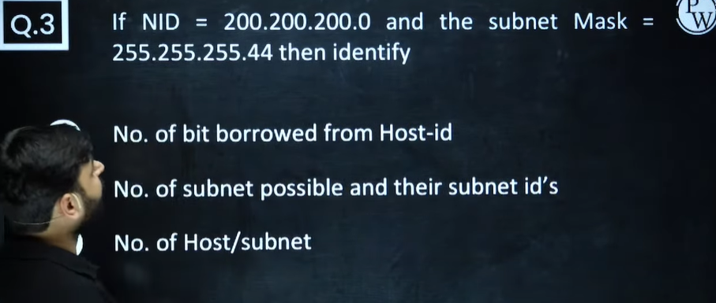
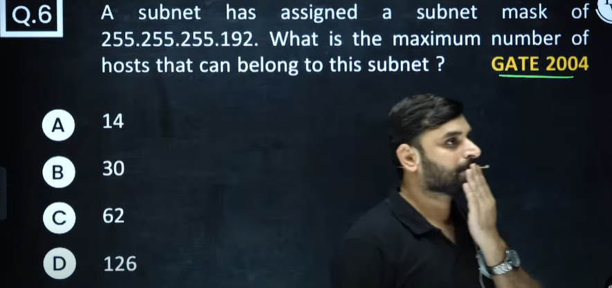

# Computer Networks 04 | Introduction to Subnetting

> Question 6  
> 
> Option C - IP address belongs to class B. See the table and limited broadcast address sabka same hota hai.

> Question 7  
> 
> Refer Lecture 3 at 33:30 for concept

> Question 8  
>   

> Question 9  
>   

# Classful Addressing
1. Class A - 2^24 IP Addresses in one network
2. Class B - 2^16 IP Addresses in one network
3. Class C - 2^8 IP Addresses in one network

### 1. **Classful Addressing (Old Method)** and **Why Subnetting required**
> Example 1  
>>   

* IPv4 was originally divided into **fixed classes** (A, B, C, D, E).
* Example:

  * Class A → **/8** → 16,777,214 usable hosts
  * Class B → **/16** → 65,534 usable hosts
  * Class C → **/24** → 254 usable hosts

👉 Problem: **Wastage of IPs.**
If an organization needed only 500 IPs, they couldn’t fit in Class C (only 254 hosts), so they had to take a whole Class B (65k hosts). That meant \~64k addresses wasted.

---

### 2. **Subnetting**

* Introduced to **divide large blocks into smaller networks**.
* For example:

  * Instead of using the full **Class B (/16)** = 65k hosts, you could subnet it into smaller chunks, say /24 → 254 hosts each.
* Benefits:

  * **Less wastage** (right-size the subnet to the actual number of hosts).
  * **Better network management** (smaller broadcast domains).
  * **Improved security and routing**.

---

### 3. **CIDR (Classless Inter-Domain Routing)**

* Came **after subnetting** as a more flexible approach.
* CIDR allowed **ignoring the rigid classes** (A, B, C) and just using prefixes like /10, /13, /28, etc.
* This made **IP allocation more efficient** and slowed IPv4 exhaustion.

---

✅ So in order:
**Classful Addressing → Subnetting → CIDR**

> Example -2  
>>   

> Example - 3  
>> 

# Subnetting
* Matlab kaafi IP address waste ho jaate the. Isiliye hum subnetting use kar rahe hain.
* Iske baad Subnetting bhi fail hoga. Phir subernetting uske baad hum class less me jaayenge.
* The process of dividing a big network into many smaller pieces/subnet is nothing but a subnetting.

Note - The process of Borrowing bits from Host ID to generate the subnet ID is also called as Subnetting
* **No of bit borrowed depends on our requirement**
* Let's take an example

> Example 1  
> >  

> First Subnet  
>>   
>>   
>>   
>>   
>>   

> Second subnet  
> >   

> 3rd subnet  
> > 

> 4th Subnet  
> >   

> Shortcut  
> >   
> >   

# Homework - Question 2
  
* 8 combination banane ke liye 3 bit chahiye minimum
* 

# Question 3 - ISRO exam
* Last 2 bit is used. If we take last 2 bit borrow from host ID, then what is subnet ID and Direct broadcast ID?
* 

>   
>   
> Isme IP address sequence me nahi hai. Practically aisa possible nhi hai.  
> 

# Subnet Mask
* We saw Network mask. Now let's see subnet mask
* It is a 32 bit number used to indicate no. of bits borrowed from host-id and there positions based on the following rules
* Rule 1 - No of 1's in the subnet mask indicate NID + SID
* Rule 2 - No of 0's in the subnet mask indicate HID part.
* Subnet Mask ka concept kyun aaya? kyunki humne subnet me divide kiya isliye aaya

# Default subnet Mask

# Question 1

# Question 2

# Question 3

# Question 4

# Question 5

# Question 6

# Question 7

# Question 8

Answer - D

# Question 9

# Question 10

# Question 11
