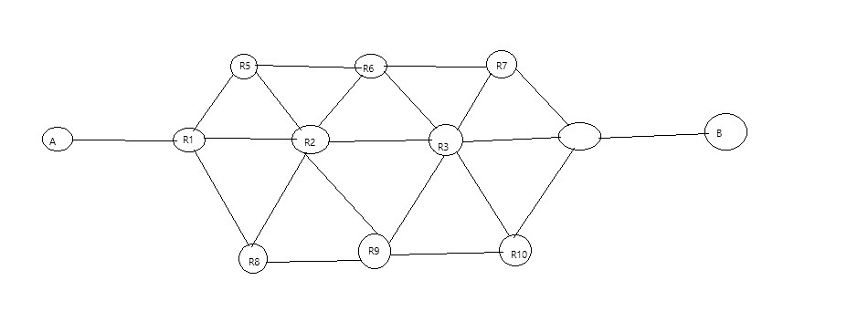
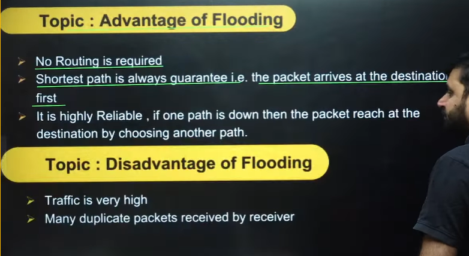
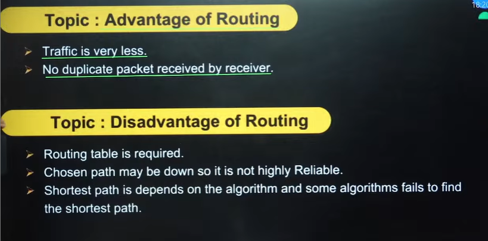
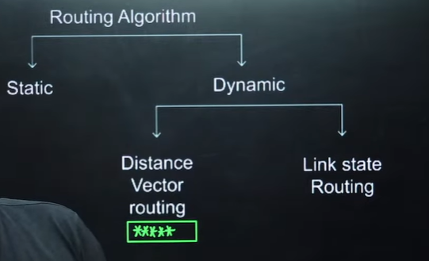
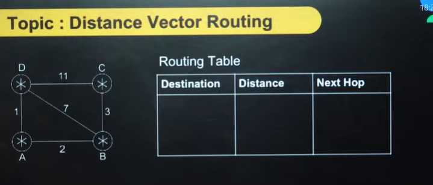
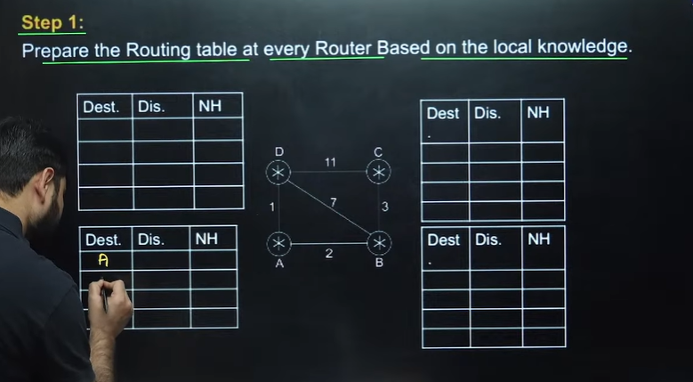
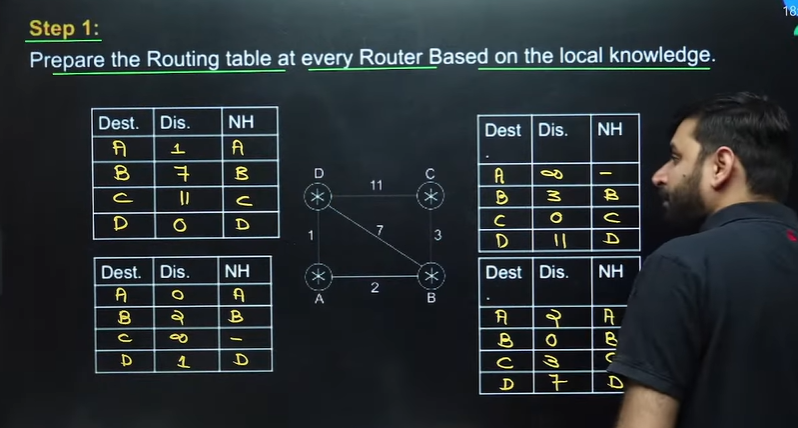
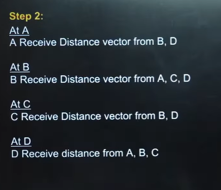
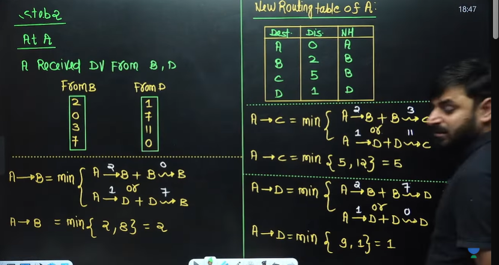

# Computer Networks 40 | Routing Algorithms Part 01

## => What is Routing?

consider the below network diagram between A and B. A and B are source with routers in between.

> A wants to send packet to B
> R1 receives the packet first
>> Now R1 has 3 choices

> Routing is the process of preparing the routing table and finding the best path is known as routing
> R1 router will prepare routing table(RT). what is routing table? we will see it today
> suppose it found the best path R5. here again R5 will prepare the ROUTING TABLE and find the best path
> suppose packet is given to R6. R6 will again prepare the routing table.
> Suppose packet is given to R7. again R7 prepare the routing table
> suppose packet is received by R4. And R4 will send the packet to destination.
> is it possible to send the packet to destination without Routing?
>> Yes it is possible. but how? Concept is flooding.

> computer network - 70 functions. Mandatory and optional function

* What is Flooding?
  * Here when packet is received by R1. R1 will send the packet to all the outgoing links. 
  * one copy will sent to R5, R2, R8.
  * and so on.
  * Flooding has advantage and disadvantage
    * No routing table required
    * Many duplicates packets can come to destination in flooding
    * Traffic is very high in flooding
    * Suppose one path is down, packet can follow another path and can reach the destination

* In internet we use routing concept.

### >>> Flooding
Flooding is simple computer network Routing Algorithm in which every incoming packet is sent through every outgoing link except one it arrived on.

* Advantages and disadvantages of Flooding

* Advantage and disadvantage of Routing

* Routing Algorithm

* > In static you cannot change the path
* > In GATE till now questions are asked from Distance vectore routing
* > Questions in GATE have never been asked in Link state Routing. 

## >> Distance Vector Routing

* It is very very important
Consider the below graph. A, B,C and D are 4 nodes.

* Step 1 - Prepare the Routing > at every Router Based on the local knowledge

> If node is connected by direct edge then enter the distance value, if no direct edge enter infinity

* Step 2 - 

> Basically here we receive distance vectors from the neighbours

* Step 3 -  

