# Computer Networks 40 | Routing Algorithms Part 01

## => What is Routing?

consider the below network diagram between A and B. A and B are source with routers in between.

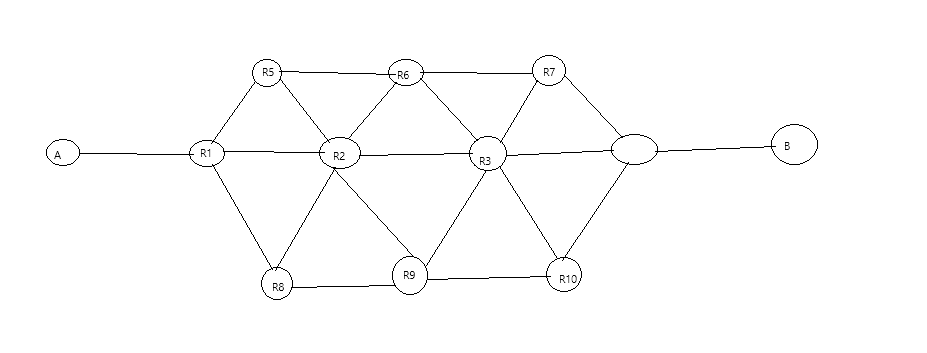

> A wants to send packet to B
> R1 receives the packet first
>> Now R1 has 3 choices

> Routing is the process of preparing the routing table and finding the best path is known as routing
> R1 router will prepare routing table(RT). what is routing table? we will see it today
> suppose it found the best path R5. here again R5 will prepare the ROUTING TABLE and find the best path
> suppose packet is given to R6. R6 will again prepare the routing table.
> Suppose packet is given to R7. again R7 prepare the routing table
> suppose packet is received by R4. And R4 will send the packet to destination.
> is it possible to send the packet to destination without Routing?
>> Yes it is possible. but how? Concept is flooding.

> computer network - 70 functions. Mandatory and optional function

* What is Flooding?
  * Here when packet is received by R1. R1 will send the packet to all the outgoing links. 
  * one copy will sent to R5, R2, R8.
  * and so on.
  * Flooding has advantage and disadvantage
    * No routing table required
    * Many duplicates packets can come to destination in flooding
    * Traffic is very high in flooding
    * Suppose one path is down, packet can follow another path and can reach the destination

* In internet we use routing concept.

### >>> Flooding
Flooding is simple computer network Routing Algorithm in which every incoming packet is sent through every outgoing link except one it arrived on.

* Advantages and disadvantages of Flooding

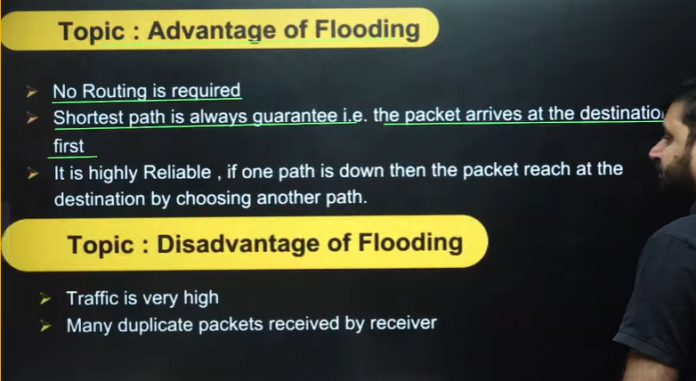

* Advantage and disadvantage of Routing

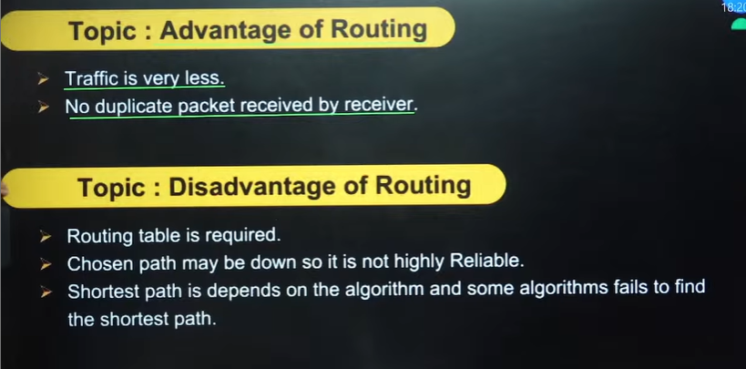

* Routing Algorithm

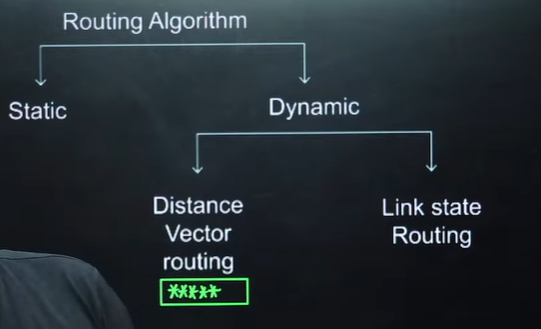

* > In static you cannot change the path
* > In GATE till now questions are asked from Distance vectore routing
* > Questions in GATE have never been asked in Link state Routing. 

## >> Distance Vector Routing

* It is very very important
Consider the below graph. A, B,C and D are 4 nodes.

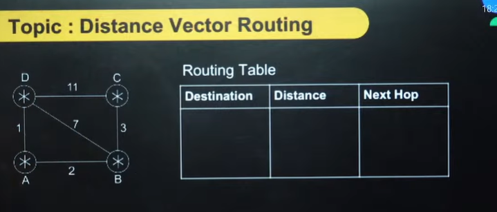

* Step 1 - Prepare the Routing > at every Router Based on the local knowledge

> First table(Bottom left one)  
> Distance between A to A is zero. Next hop is A  
> Distance of A from B is 2. Next hop is B.  
> A to C no direct edge. जो पड़ोसी है, उसके बारे में सब जानता हूँ, जो पड़ोसी नहीं है, उसके बारे में मुझे नहीं पता । Next hop infinity. From A to C, I don't know  
> A to D is 1. and next hop is D

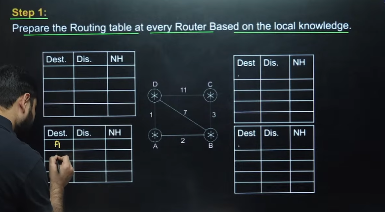

> If node is connected by direct edge then enter the distance value, if no direct edge enter infinity

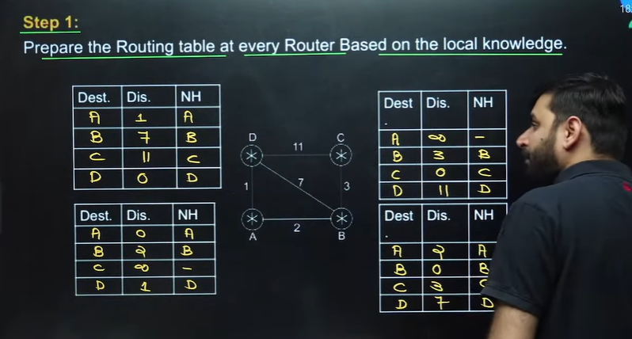

> B to A, B to B, B to C and B to D for table 2(bottom right one)    
> Third table - C to A, C to B, C to C and C to D  
> 4th table(Left-top one) - D to A, D to B, D to C and D to D  

* Step 2 - 

> Here we share the information to our neighbour. E.g. A share the info to D and B.  

The Distance in green boxes will be shared

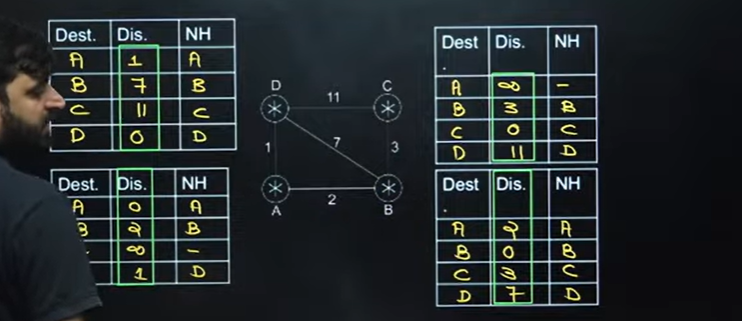

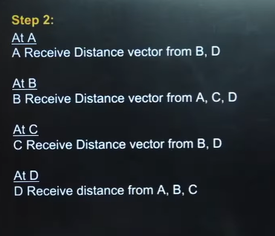

> Basically here we receive distance vectors from the neighbours
> A will update it's routing table after receiving distance vectores

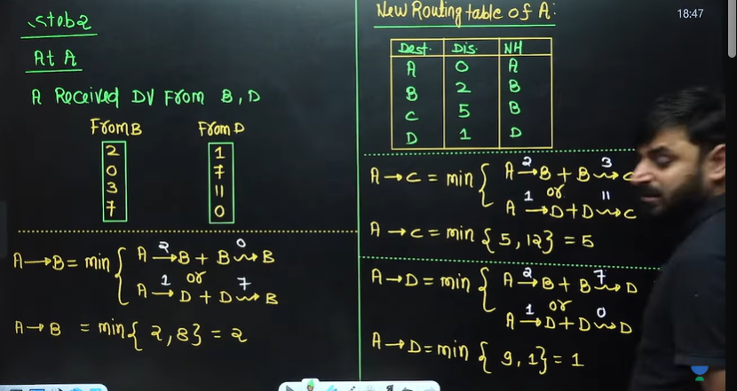

A अपनी Routing Table कैसे बनाएगा ।  
A has it's own information and has information from neighbour(basically distance vector)  

Take the minimum in above.  
> Practise the above process else you will forget

Shortcut - AD Rule  

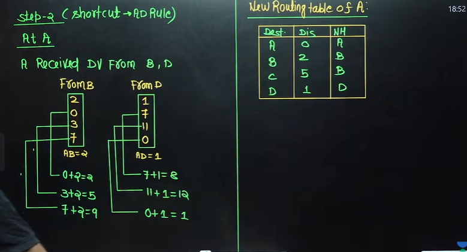

> Practise the above way also

* **Step 2 at "B"**

B receive distance vector from A, C, D
> B to B distance will be zero

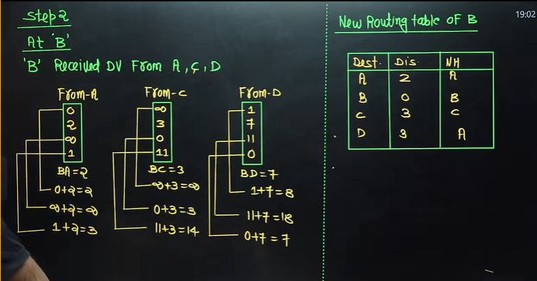

Similary do for "C" and "D"

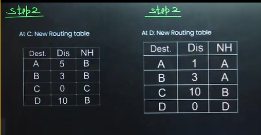

> The above is not the final routing table
> If you see the table, C to D was initially 11, and after updating above it is 10  
> But still if you see graph there is still shorter way - 3+2+1  
> If graph has 4 node, then it will take 3 steps to make the final routing table 
> **If n nodes, then n-1 steps**  
> 1st step or round - One edge involved  
> 2nd step or round - At most 2 edge involved  
> 3rd step or round - At most 3 edge involved  
> (N-1)th steps or round - At most (N-1) edges involved  

* Step 3 -  

* But in GATE exam you don't have to solve like above  

Just use graph. It's a aptitude question and find the minimum  

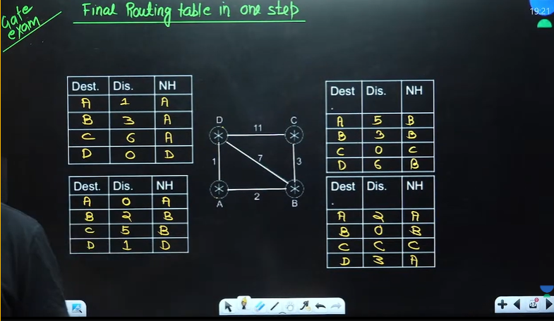
> correction in above image - B to C is 3 in routing table of B  

> Edges which are not included in any routing table  
> Ans - D to C and D to B  

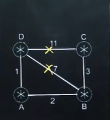

* Question - After the final routing table, which edges are not included in any routing table

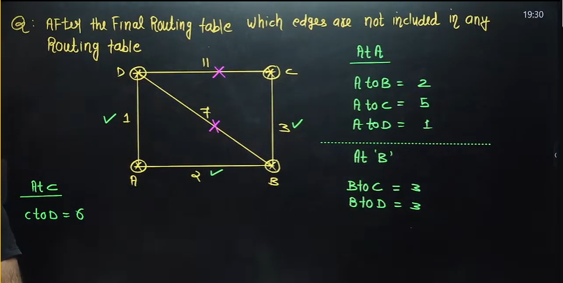

## Problem Solving on Distance Vector Routing(DVR)

* Question 1

From Tanenbaum(Unsolved Problem)

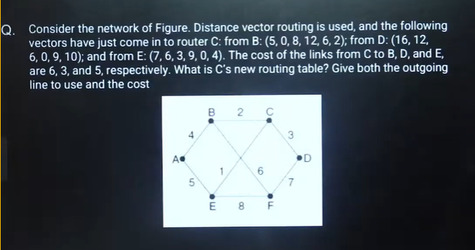

* Don't take the distance from graph as Distance of C from B, D and E are already given

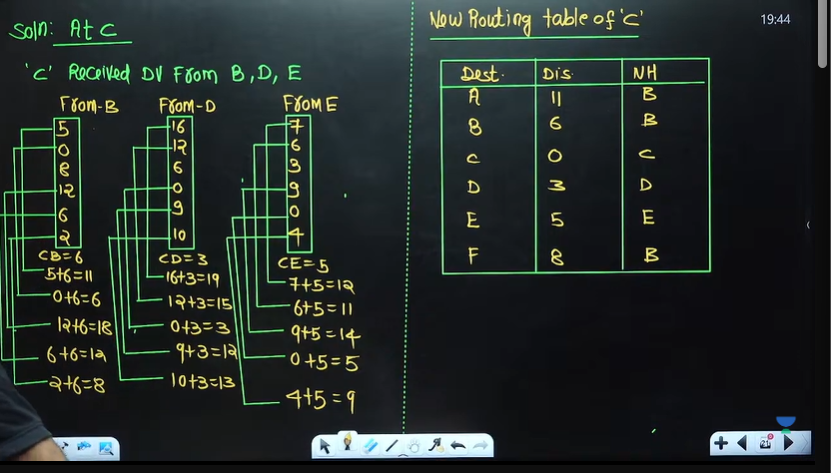

* **Question 2 - common data questions**

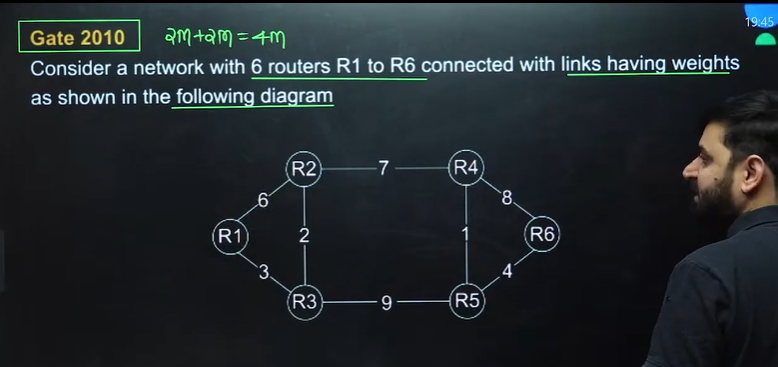

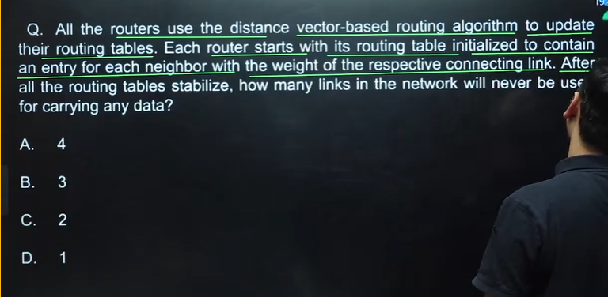

Hint - Find these

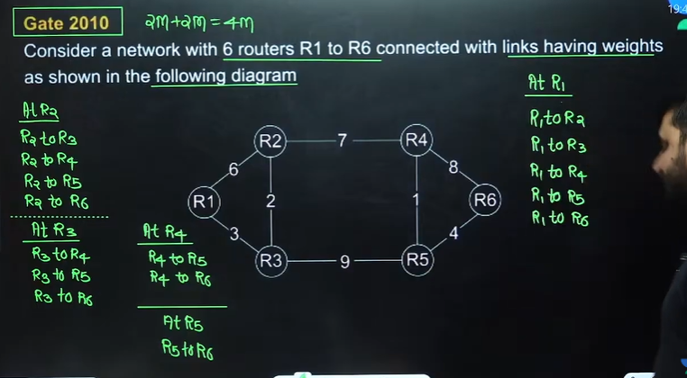

> Part 2  

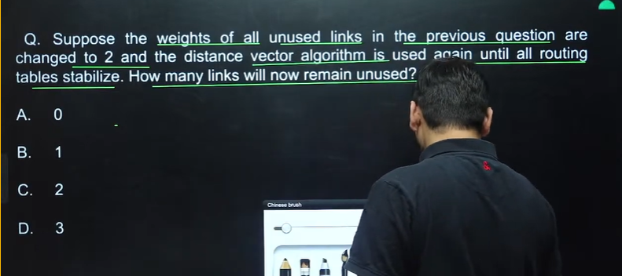

> Solution -  

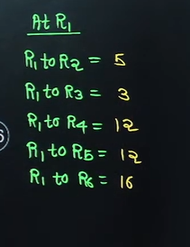

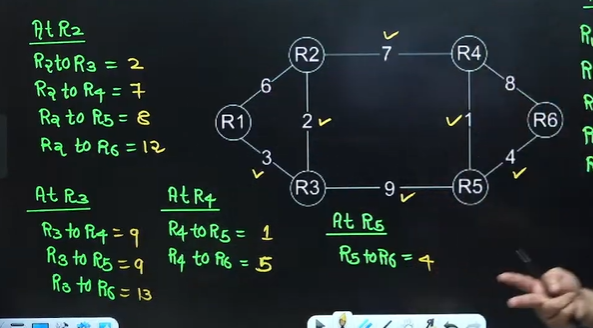

from above 6 and 8 distance edges are not used anywhere  

* **Question 3 - Home work**

 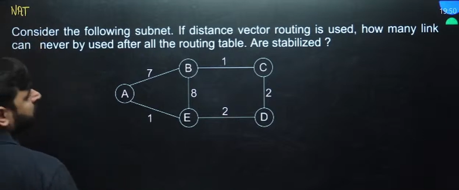

 * Question 4 - Home work

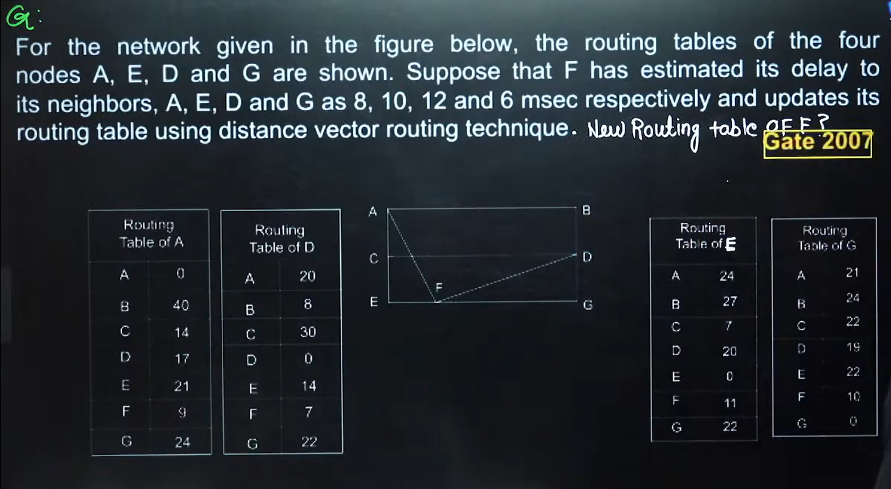

Options - 

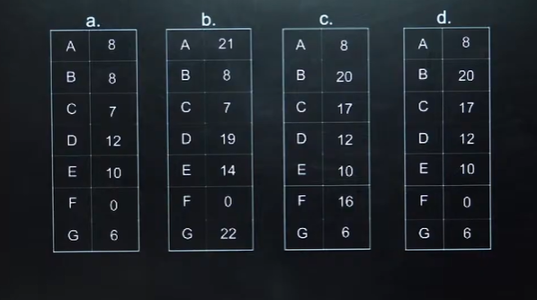

* Question 5 - Home work

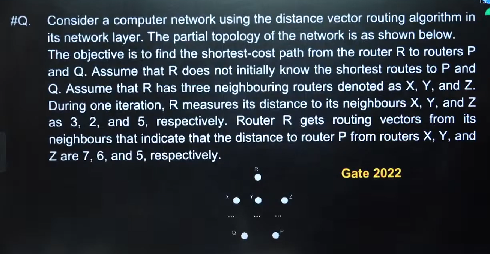

> Part 1 - MSQ

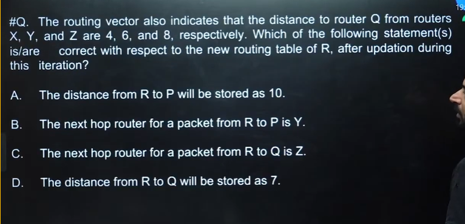

## Disadvantage of DVR

* Count to infinity problem

