# Computer Networks 41 | Routing Algorithms Part 02 |

## Disadvantage of DVR

* Count to infinity problem
  * We discuss above in paid course

## => Link State Routing

> No question state asked till now in GATE  
> Let's see why  

Step 1 -  

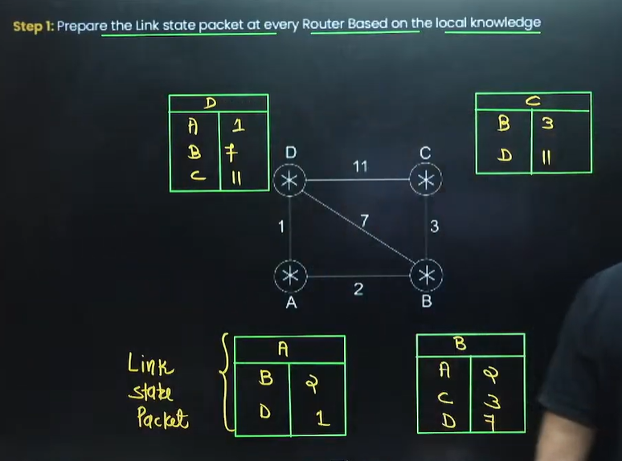

Step 2 - Every router flood the link state packet to every other router

हर किसी के पास हर किसी की Information हो जाएगी

And then each router will have complete information of the graph in it's memory  

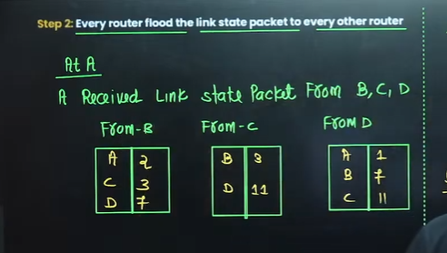

Below is the final routing table of A  

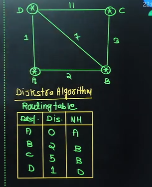

Dijkstra algorithm will be taught in DSA Class  

Now Find at B

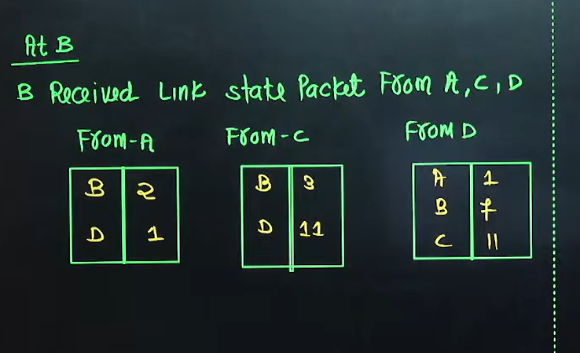

apply Dijkstra algorithm at B  

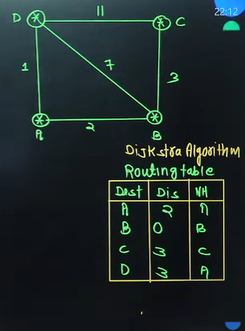

Same thing do for C and D  

## => Difference between DVR(Distance vector routing) and LSR(Link state Routing)

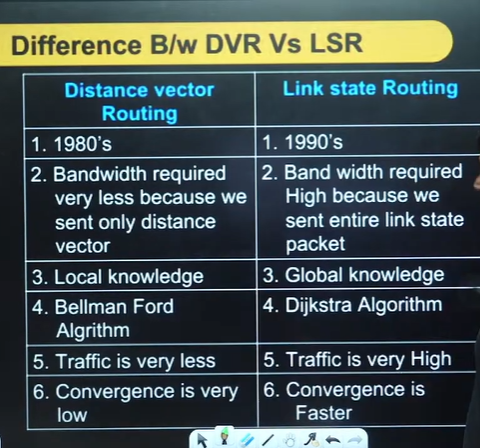

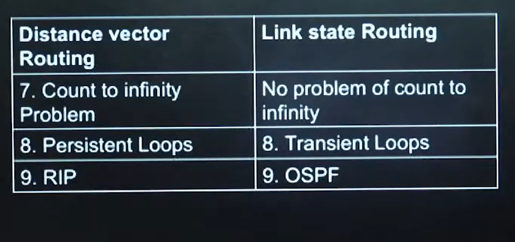

RIP - Routing information protocol  
OSPF - Open shortest path first  

## => Topic - Routing Information protocol

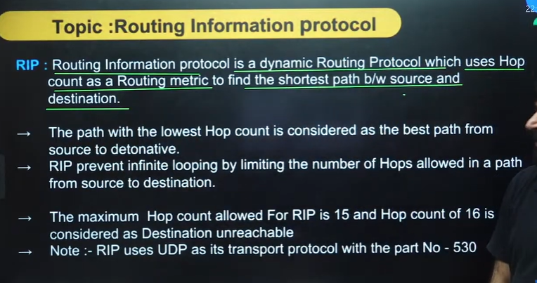

* Question 1  

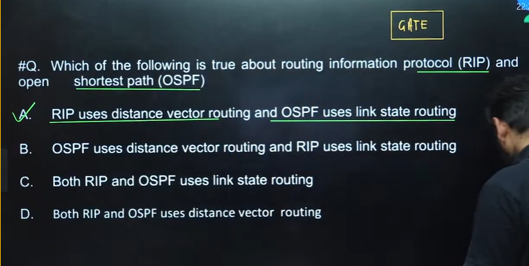

* Question 2

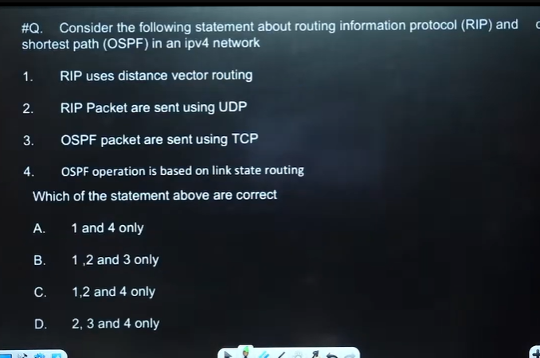

Correct - 1, 2 and 4 only  

* Question 3  

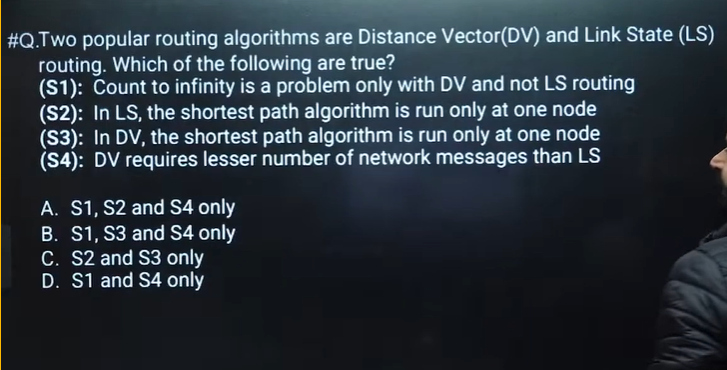

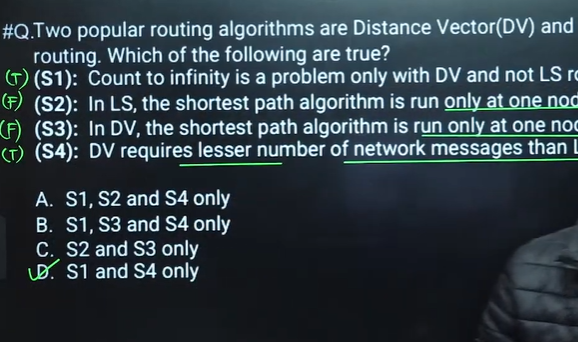

* Question 4  

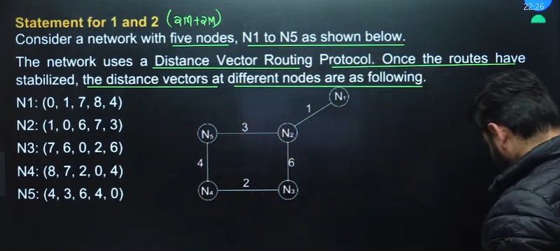

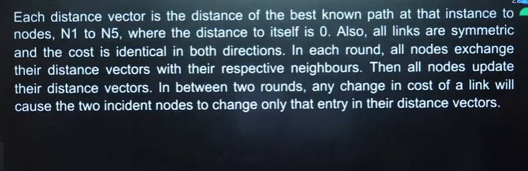

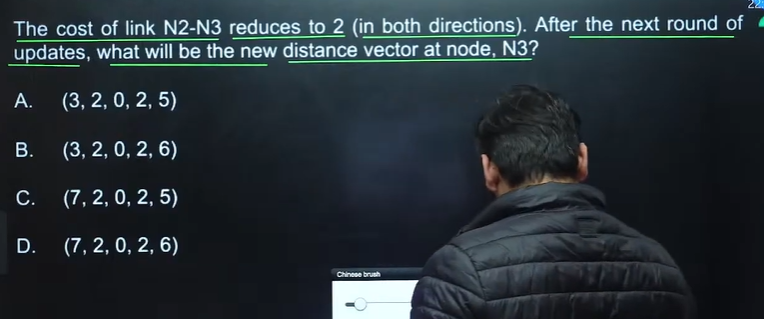

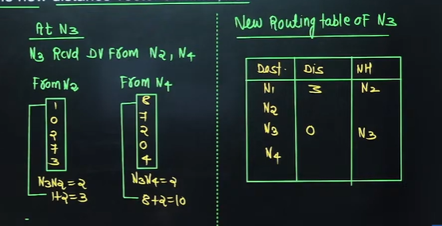

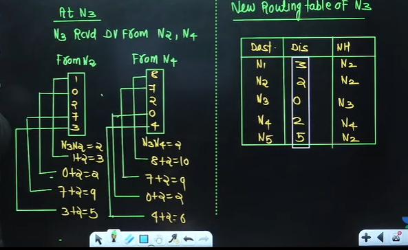

A is the correct option

Home Work    

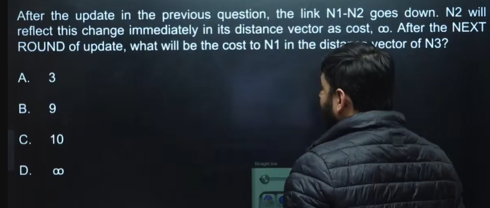