# Classless Addressing

> Subnetting was not a permanent solution  
> > Aisa hamesha nhi ho sakta ki aapko aisa org mil jaye jisko same requirement ho IP addresses ki. Mushkil kaam hai.
> > In staring demand of Class C network was most because less IP address was required(In starting many small companines were there)

# Disadvantage of classful addressing
1. Wastage of IP Addresses
2. Class C was generally was more used compared to Class-A and Class-B

# Advantage of Classful Addressing
* I could see any IP address and tell what is Network ID and what is Host ID size
  * E.g. 10.19.32.55 => NID is 8 bit size and host id is 24 bit size
* Notation is a.b.c.d in classful Addressing
* But in **classless Addressing** how would I tell it belongs to which class? so for that we have different notation
  * e.g. **a.b.c.d|n where n is Network ID or Subnet mask**
  * e.g. 10.9.32.54|2 where Network id = 22 bit size and host id size = 32-22 = 10 bit
    * Number of IP addresses = 2^10 = 1024
    * Number of Host = 2^10 - 2 = 1022

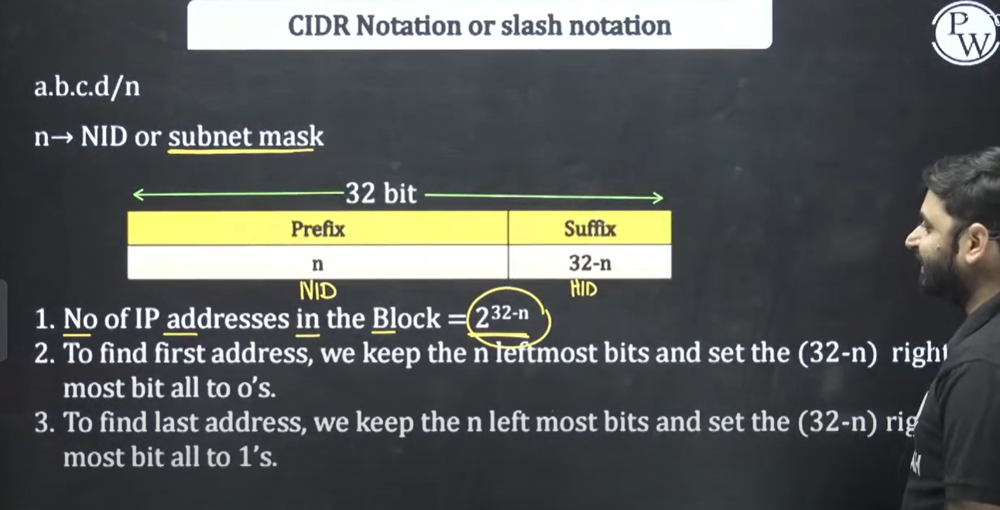


```txt
Classless addressing in computer networks is a way of assigning **IP addresses without being restricted to the traditional classful system (Class A, B, C, D, E)**.

In the older **classful addressing** system:

* IP addresses were divided into fixed classes (A, B, C).
* Each class had a fixed size network portion and host portion.
* Example:

  * Class A → 8 bits network + 24 bits host (supports \~16 million hosts per network).
  * Class B → 16 bits network + 16 bits host.
  * Class C → 24 bits network + 8 bits host.

The problem:

* **Wastage of IP addresses** — e.g., an organization needing 2000 IPs could not use Class C (too small, 254 hosts) and had to take Class B (65,534 hosts), wasting most of them.

---

### **Classless Addressing (CIDR – Classless Inter-Domain Routing)**

* Introduced in **1993** to replace classful addressing.
* Uses the format:


  IP_address / prefix_length

  where `prefix_length` = number of bits in the **network ID**.
* Example:

  * `192.168.10.0/20` → first 20 bits are the network, remaining 12 bits are for hosts.

This gives flexibility:

* Networks can be **divided into variable-length subnets** (VLSM – Variable Length Subnet Masking).
* IP space can be allocated more efficiently, reducing wastage.

---

✅ **Benefits of Classless Addressing:**

1. Efficient utilization of IP addresses.
2. Supports subnetting and supernetting.
3. Makes routing tables smaller and faster.

---

⚡ Example:

* Organization needs \~2000 IPs.
* With classless addressing, they can be assigned `172.16.0.0/21` → which provides 2048 IPs.
* No need to waste an entire Class B block.

```

# CIDR
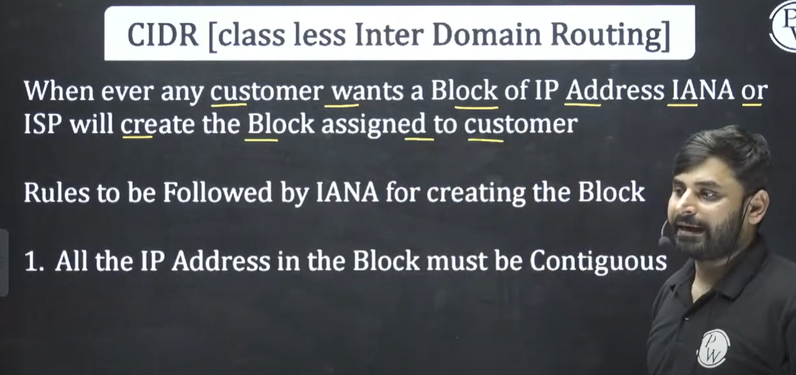

what is the meaning of contiguous? It means IP address should be continuous block

2. **Block size must be a power of 2. That means 512, 256. 1000 is not possible**


* How to find Quotient and remainder when we divide number by 2 or 10

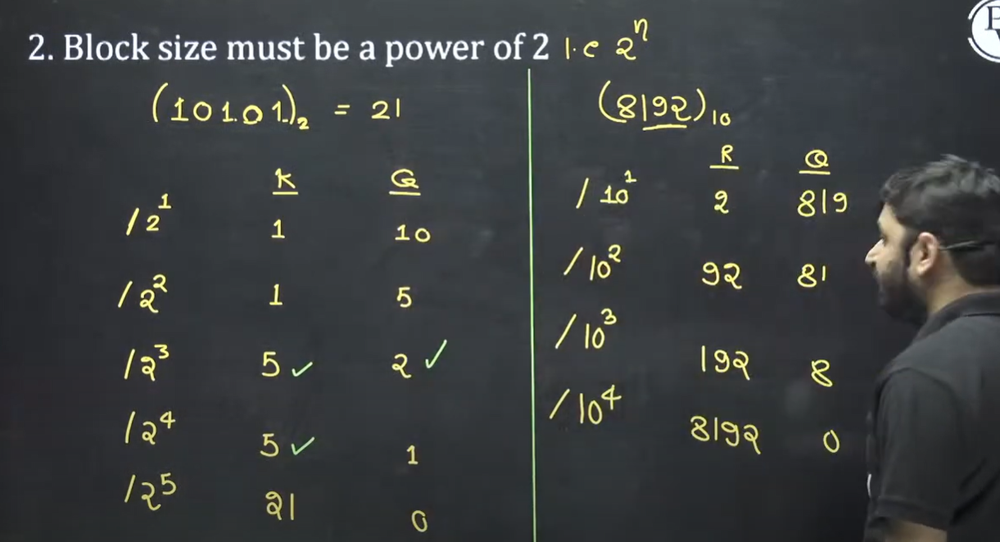

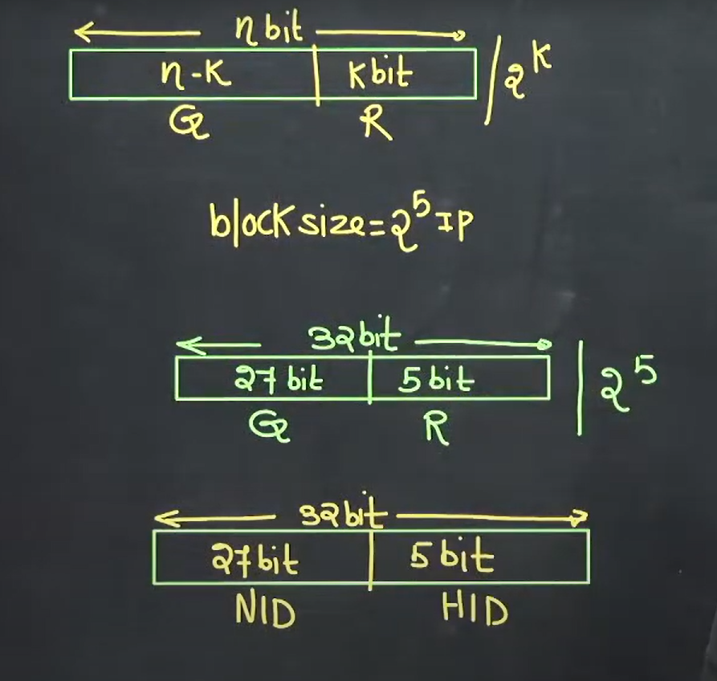

* If block size is given in power of 2 we can easily find network ID and host ID
* Host ID - 5 bit and Network ID is 27

3. **First IP address of the block must be divisible by size of the block**

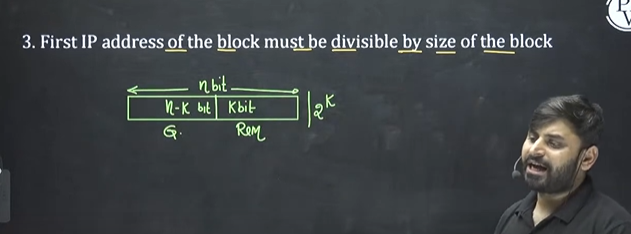


> what is the meanning of divisible? it basically means the Host ID will be all zeros. so the first IP address will be all zeros
> > Basically it wants to convey the first IP address will be **block ID**.(Similar to Network ID and Subnet ID)

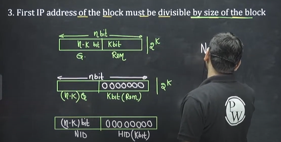

> Note - First IP address must be used as a block ID
> > And it is understood that the first IP address are not assigned to any host computer as it represents ID of Network ID or Subnet ID.


* Question - Last IP is DBA - Directed Broadcast address. And host ID is all 1's
* 4th rule is not required - As if first 3 rules are true for a block and 4 th rule will be automatically true. Basically all bits of host id in the block will be ones

## Example - 
100.100.100.64  
100.100.100.65  
100.100.100.66  
100.100.100.67  
.  
.  
100.100.100.127  
1. It is contiguous(IP address are present in serial form)
2. Block size  is 2^6 i.e. from 64 to 127 is total 64 count
3. 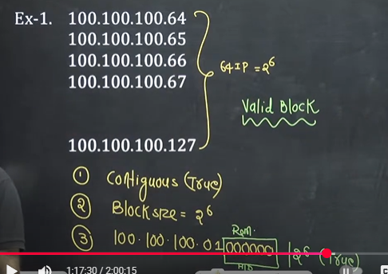

that means this block can be assigned to a customer.

## Representation of CIDR
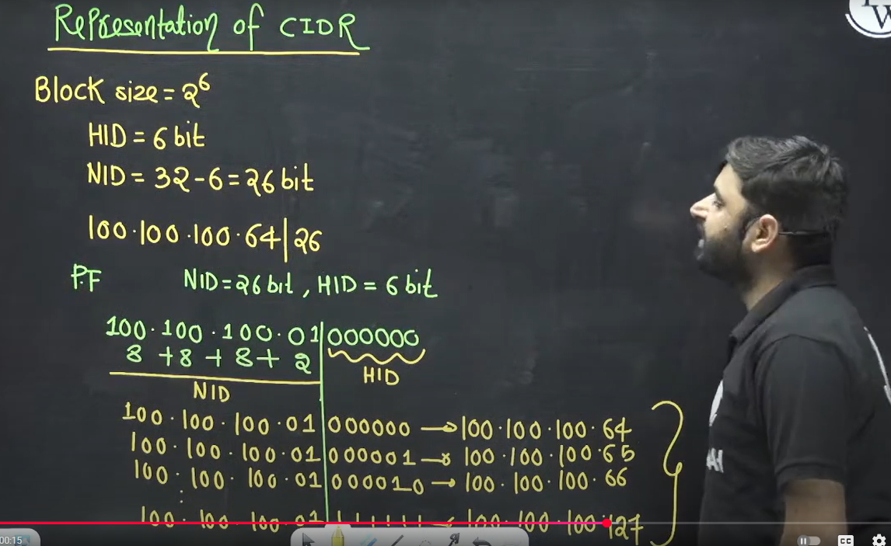

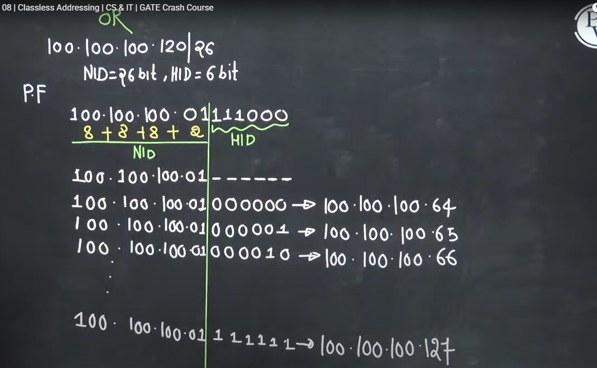


## Example 2
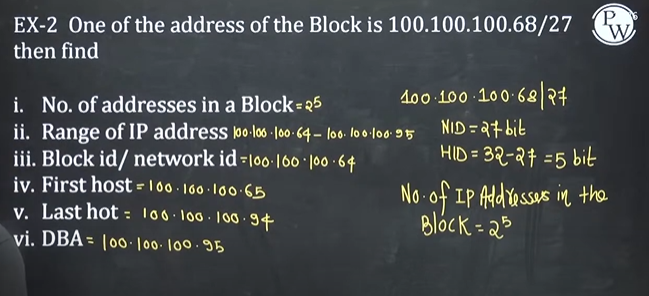


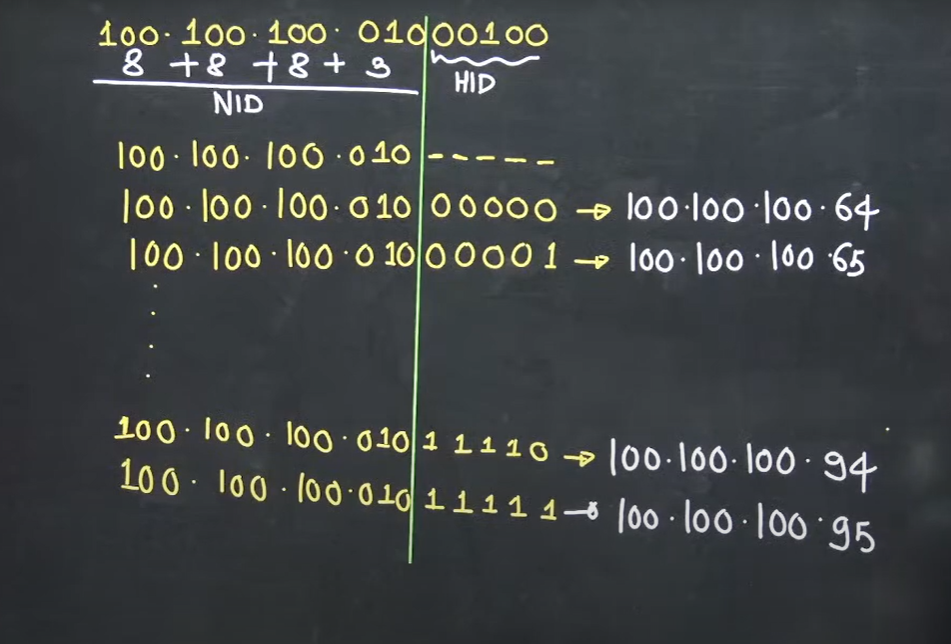

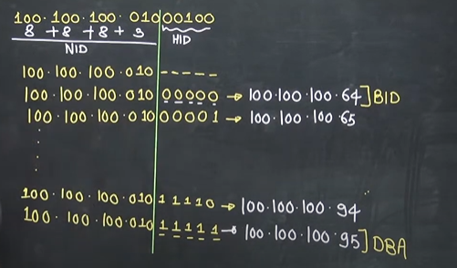

First IP address will represent Block ID(BID) and it cannot be assigned to any host computer

Last IP address will represent DBA

# Subnetting in CIDR
