# Computer Network 02 : Application Layer [ DNS, HTTP, Email ] | CS & IT |

# Topics to be covered
1. Application Layer Protocols
2. DNS
3. HTTP => V. Imp
4. Email => SMTP

## Topic - Two Process Communication
Two paradigm -   
1. Client-Server
   1. e.g. Web browsing, Email, Internet chat, Online live classes
2. Peer to peer
   1. e.g. BitTorrent, VoIP(Voice over IP) - 4G(Internet based voice call)
   2. e.g. Skype call
   3. Server can record the call if it want

## Topic - Client-Server Paradigm
* Server -  
  * **Always on** host
  * **Permanent IP Address**
  * Mostly in data centers
* Client - 
  * Communicate(contact) with **server**
  * May have **dynamic IP address**
  * Clients do not communicate directly with each other
    * They have to communicate via a server(Client-Server Architecture)
    * In peer to peer architecture Client can directly communicate.

* Server - Here server serve data. In restaurant waiter serves food
* Example - 
  * **Web browsing**
    * Client - **Web browser**
    * Server - **Web Server**
  * **Email**- 
    * Client - **User Agent**
    * Server - **Mail Server**

**Client-server is nothing but communication. Client process communicates with Server process**

## Topic - Peer - Peer Architecture
* **No always on** server
* Arbitrary **end systems** directly communicate
* **Complex management**(Peers can change IP address)
  * Clients share each other IPs to each other
* e.g. **P2P file sharing**(BitTorrent), Voice over IP(VoIP)
  * Whatsapp privacy feature for IP address 

Q. How two process client-server communicate? - Watch all 18 lectures :) to understand it completely

## Question 
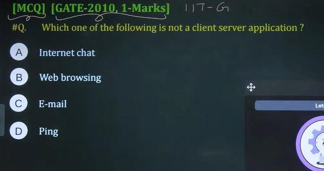

Correct option - d - Ping
Ping is a utility, to check connectivity between either client-client or client-server

## Topic - Stateless vs Stateful Protocol
* **Server** maintains **no information** about past **client requests**
  * **Every request** from **client** will be treated as new request by **server**
  * So it is called **Stateless**
  * > Don't talk about cookies now. Cookies is a business need. Cookies is not connected with state. It's personal interest. It's not a protocol need
* **Protocols** that maintain "**state**" are **complex**
  * [Past history(**state**) must be maintained]
  * It is called **Stateful**

* DNS server is a stateless protocol. It doesn't maintain any log regarding client requests. If it wants it can expand it's business like anything. It can recommend according to the needs to the clients.

|Protocol|Stateless or Stateful|Description|
|-|-|-|
|DNS|Stateless|
|HTTP|Stateless|
|SMTP|Stateless/Stateful|Stateful within one session|
|POP3|Statelss/Stateful|Post office protocol ;Stateless across multiple session|
|IMAP|Stateful|Internet mail access protocol|
|FTP|Stateful|

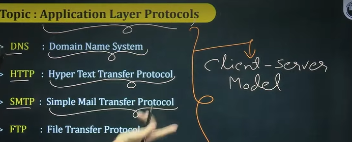

## Topic - Application layer protocols
1. DNS - Domain Name System
2. HTTP - Hyper Text Transfer Protocol
3. SMTP - Simple Mail Transfer Protocol
4. FTP - File Transfer Protocol

All the above are Client-server model

## Question 2

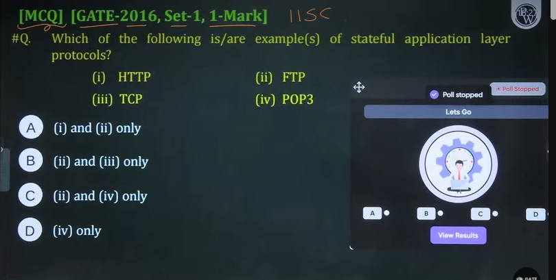

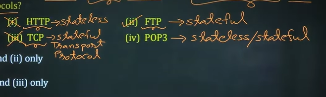

## Topic - DNS Protocol
* Domain Name System(DNS)
* "Stateless" Application Layer Protocol
* Client-Server Model
* Used to translate **"Host Name"** into "**IP Address**"(Vice-versa)
* **Hosts**(**DNS clients**) and **DNS server** communicate to **resolve names**[**Name/Address translation**]

## Topic - DNS Hierarchy
* **Distributed Hierarchical Database** - **Global Hierarchy**
  * Implemented in **hierarchy** of many **name servers**
* DNS name servers - 
  * 1. Root Name Servers
  * 2. Top-Level Domain(TLD) Name
  * 3. Authoritative Name Servers
    * (Organization own DNS server)

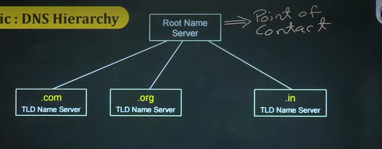

## Topic - DNS Messages
* Two types of DNS messages
  * 1. **DNS Query(Request) Message**
  * 2. **DNS Response(Reply) Message**

* **DNS Query** and **Response messages** have **same format**

## Topic - DNS Name Resolution
* **DNS Name Resolution** or **Lookup** - **DNS Resolver Program**
* **Two Mode** - 
  * **Iterated Query**
  * **Recursive Query**
DNS is a Address Resolution/Translation

## Topic - Iterated Query
* **Contacted server** replies with name(address) of server to contact

e.g. Domain name - www.google.com

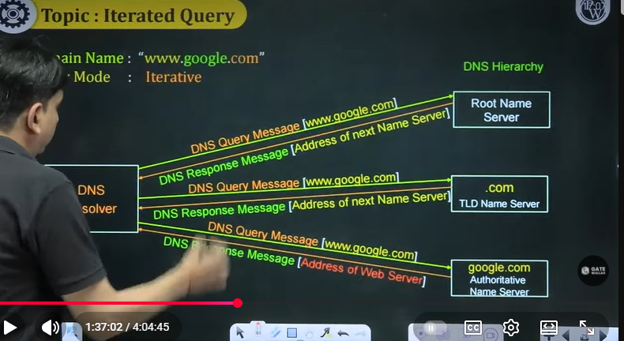
 

## Question 2
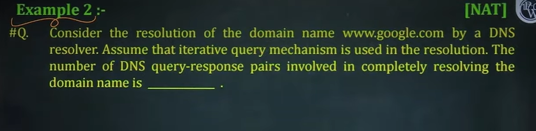

3 pair

## Question 3

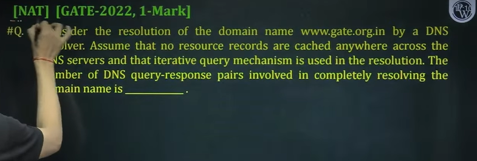

## Topic - Round Trip Time
RTT - **Round Trip Time**
* Time required for a small packet to travel from client to server and returned back

RTT > 2 * Propagation delay

## Question 3

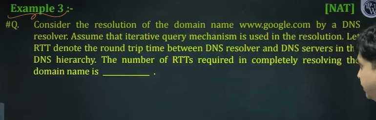

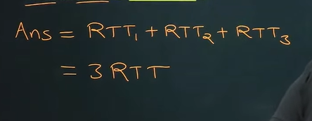

## Topic - Recursive Query
* Put burden of name resolution on Contacted name server
* Heavy load at upper levels of hierarchy

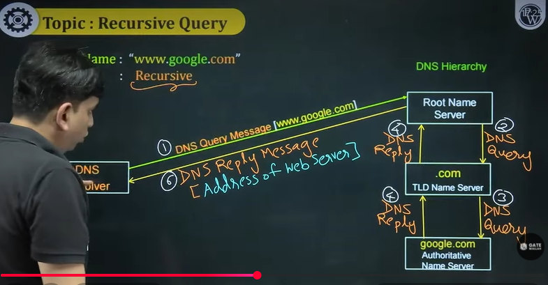

* Local DNS is maintained by Router

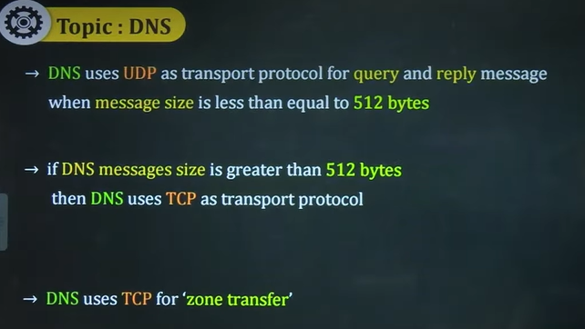

## Topic - Web Page

## Topic - HTTP
* **Hypertext Transfer Protocol**(HTTP)
  * > Initially we used to send only HTML file
  * > Now it is called objects
  * > Now it is used to transfer objects between HTTP client and HTTP Server
* '**Stateless**' Application Layer Protocol
* **Client-Server** Model
* **Client** - **Browser** (HTTP Client)
  * **Requests** web objects to **Web Server**
  * Receives web objects from Web Server
  * Display web objects[Rendering Process]
* **Server** - **Web Server**(HTTP Server)
  * **Sends** **web objects** in response to **requests**

## Topic - HTTP Messages
Similar to DNS Request message and response message , we have same in HTTP messages
Two types of HTTP Messages -   
1. **HTTP Request Message**
2. **HTTP Response Message**

## Topic - HTTP uses TCP
* **Client** initiates **TCP connection** to **server**
  * **Server** accepts **TCP connection** from **client**
* **3-way handshake process**
  * [For **TCP Connection Establishment**]

## Topic - TCP Connection Establishment
Let's see 3-way handshake process

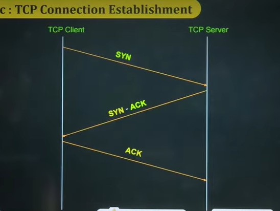

* TCP Client is an HTTP Client and TCP Server is HTTP Server

Detail we will see in next lecture

## Topic - HTTP uses TCP
First TCP connection is created then HTTP communction happens  

* **HTTP messages** are exchanged
  * between **browser**(**HTTP client**) and **web server**(**HTTP server**)
* TCP Connection **closed**

## Topic - HTTP Connections
* Two types of HTTP Connections - 
  * 1. Non-persistent HTTP - HTTP/1.0
  * 2. Persistent HTTP - HTTP/1.1

## Topic - Non-persistent HTTP - HTTP/1.0
* At most **one object** **sent** over a **TCP connection**
* **Downloading** **multiple objects** required **multiple TCP connections**

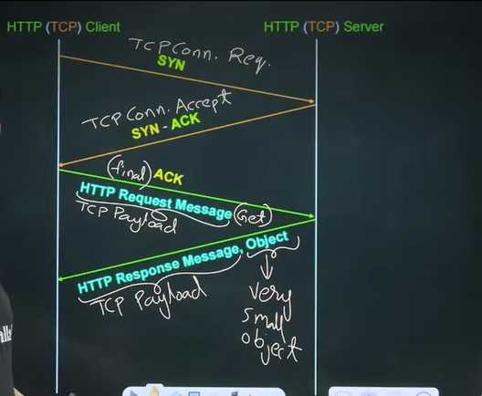

* If object is sent by server in payload then we get 200  
* In above 1.0 TCP connection is closed after one object
  * If object or payload is large then multiple TCP segments are required

## Example 4 - 

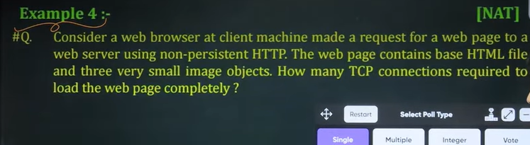

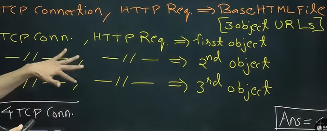

## Question - 
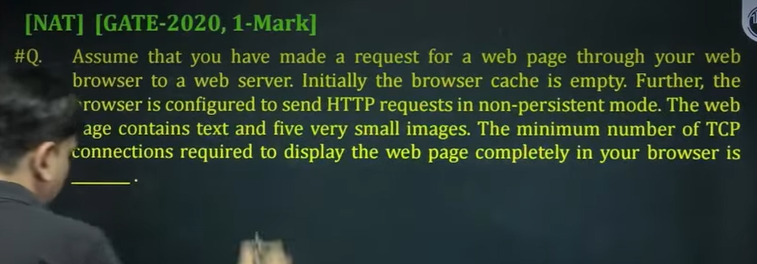

## Topic - Non-persistent HTTP(HTTP/1.0)
HTTP response time(per object) -   
* 2 RTT (per object)

## Example 5

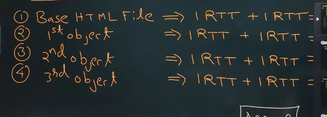

## Topic - Non-persistent HTTP(HTTP/1.0)
* Browser often open **multiple parallel** **TCP Connection** to fetch referenced **objects in parallel**

## Example 6 - 
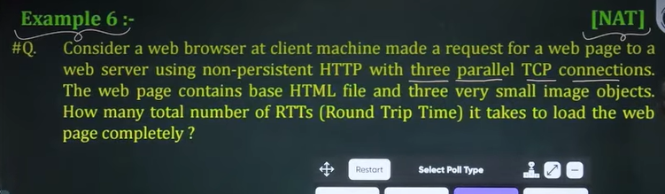

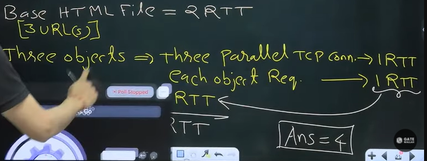

## Topic - Persistent HTTP(HTTP/1.1)

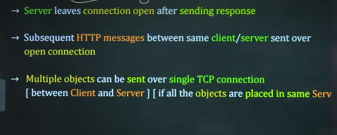

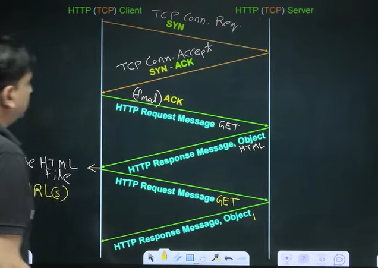

## Example 7
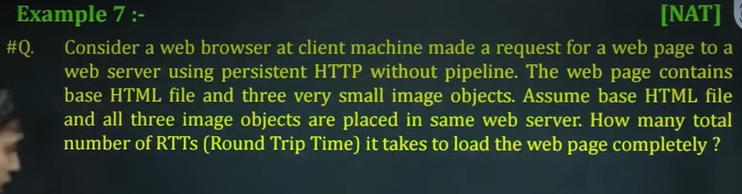

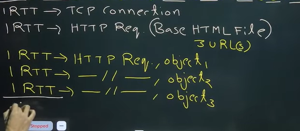

5 round trip time  

## Question - 
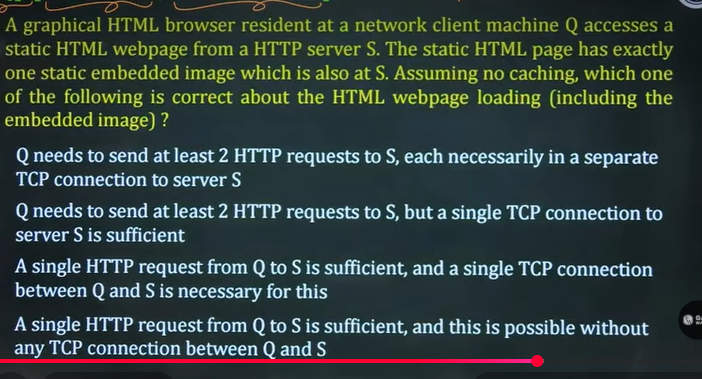

## Topic - Persistent HTTP (HTTP/1.1)
* **Client** can make **requests**  in pipeline
* **Server** can send **referenced objects** in pipeline
* **One RTT** for all **referenced objects(for small size objects)**

## Example 8 - 

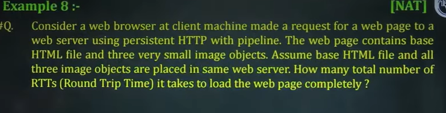

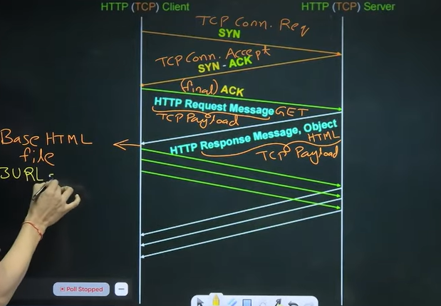

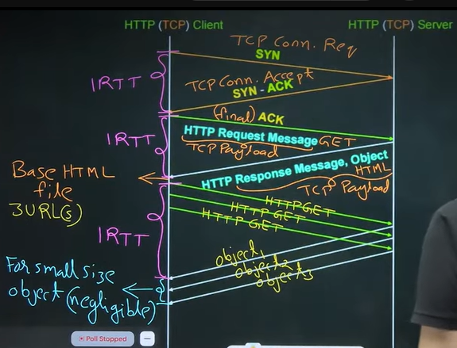

