# Computer Network 03 | Transport Layer [ UDP and TCP ]

## Topics to be covered
1. Transport Layer Services
2. UDP
3. TCP
4. MSL

## Topic - Syllabus 
**Transport layer** - **flow control** and **congestion control**, UDP, TCP , **sockets**;

Tranport layer communication not possible without sockets  
Process read/write through sockets.

e.g. Consider the below diagram  

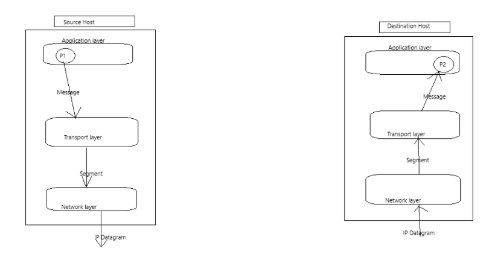

* Process P1 is initiating the communication. 
* Two hosts don't communicate. Two hosts process communicate through their sockets.
  * Analogy - Milkman keep the milk in the pot
  * Similary pot is a like buffer to keep the data
  * Analogy - Garbage box kept at a place outside and picked by the van
* Process P1 through sockets transfer the message through sockets to transport layer. And tranport layer encapsulates into segment. Tranport layer decides to make TCP segment or UDP segment. And network layer make IP datagram. 

## Transport Layer
1. Provide **logical communication** between **application processes**(Processes running on different machine)
2. Responsible for **process-to-process**(end-to-end) **communication**(connectivity)
   1. > It is called end-to-end because two process are run on two end machines
3. **Multiplexing** & **Demultiplexing**
   1. > It is a must functionality

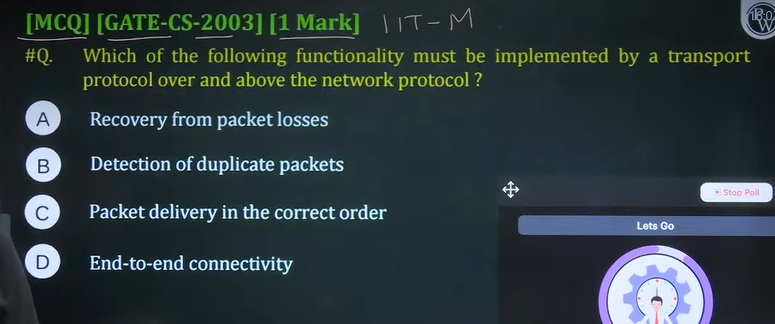

option d(it is must categoy funcitonality)

## Two Transport layer Protocols
1. **UDP - User Datagram Protocol**
   1. > Uncontrolled and not structured transmission. It's free protocol
   2. > UDP is a basic protocol
2. **TCP - Transmission control protocol**
   1. > Controlled and structured fashion transmission
   2. > TCP = UDP + Extra services

Note - UDP provide faster communication

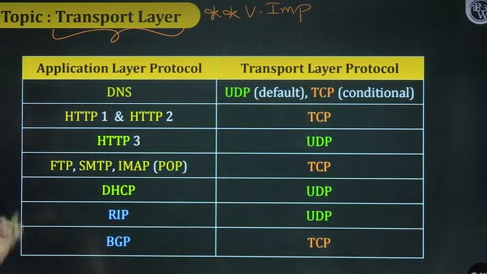

DHCP - Used for dynamic IP protocol

These do not use TCP/IP => [OSPF, ICMP, IGMP] gives packet directly to IP  


Telnet is remote login. These days we have better to login into servers.

option - c

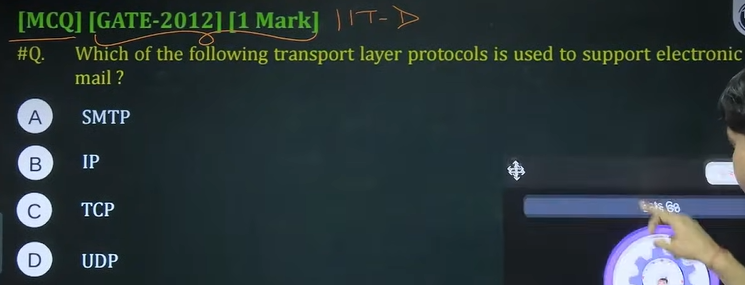

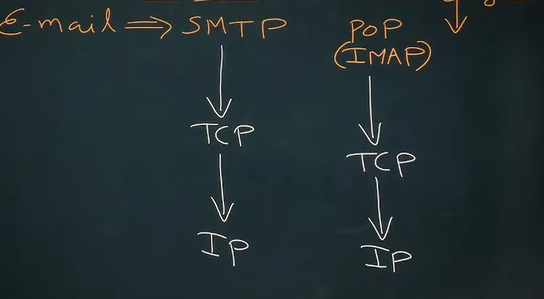

## Topic - UDP
* **UDP** - **User Datagram Protocol**
* Provide "**Connection-less**" and "**Unreliable**" services  
  * [**Unordered delivery of messages**, messages **may be lost**]

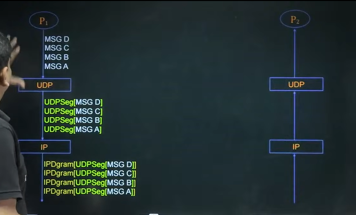

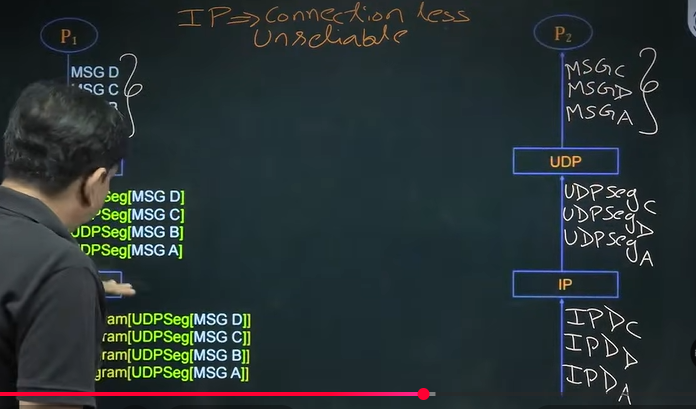

> Suppose P1 sends 4 messages P2
> no numbering in UDP
> IP is a connection-less protocol and unreliable

* **Connection-less** - 
  * **No handshaking** between **UDP** **sender** and **receiver**
  * **Delivery** of messages be **any order** to the communication process
* Unreliable
  * Messages may be lost
  * No any recovery of lost of messages
*  **Simple and Fast** - 
   *  **No connection state** at sender and receiver
   *  **No any flow** and **congestion control**
*  Prefer for **shorter communication**[like **query** and **response**]
*  UDP as transport protocol used by:
   *  DNS, SNMP,HTTP/3, RIP and Real Time Multimedia[Streaming Multimedia]

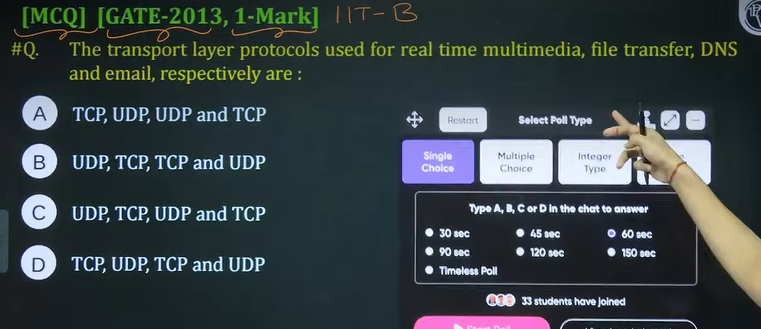

Email uses TCP
DNS by default uses DNS
FTP uses TCP

correct answer is C

## Topic - UDP Header

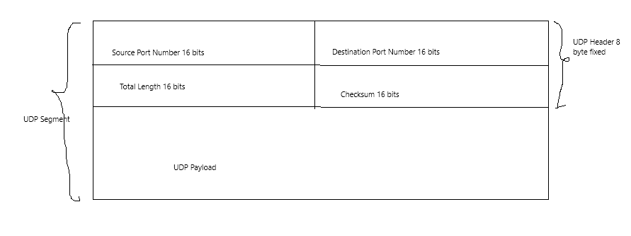

## Topic - TCP
* **TCP - Transmission Control Protocol**
* Provide "**Connection-oriented**" and "**reliable**" services
  * [In-order delivery of messages]
  * We can recover the loss via retransmission
  * It provide on top of IP protocol

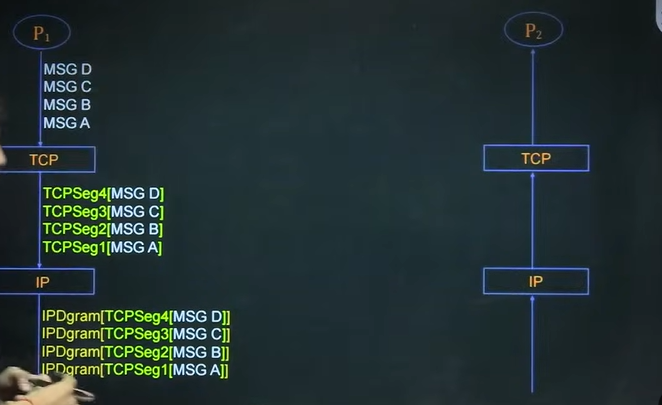

* TCP will add numbering in the segment
* **TCP/IP Model**
  * TCP ensures numbering of the segment(the order in which it was transmitted), connection oriented
    * TCP maintains acknowledgement
  * IP will take care of routing, IP is connection less.

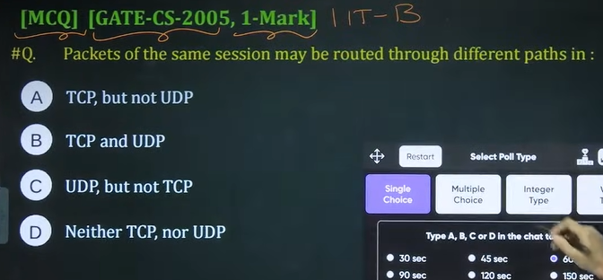

IP is connection less. packets may come in different routes.
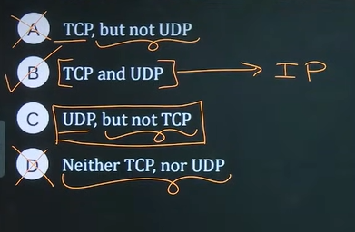

The correct answer is B. Path is reserved in circuit switching. Packet will go from anywhere it finds the path.

 ## Topic - TCP
 * **Connection-oriented**
   * **Need to establish(logical) connection** between **TCP sender** and **receiver**
   * **In order delivery** of **messages** to the communicating process
 * **Reliable** - 
   * **Recover lost messages**, via **retransmission**
 * **Complex and Slow** 
   * Need to maintain **connection state** at **TCP sender** and **receiver**
   * Provide **Flow** and **congestion control**

* UDP provides faster communication over TCP

## Topic - TCP
* **Full-duplex** and **point-to-point** **logical connection**
* Provide **Flow**, **Error** and **Congestion** control
* Prefer for **long communication** 

## Topic - TCP Header

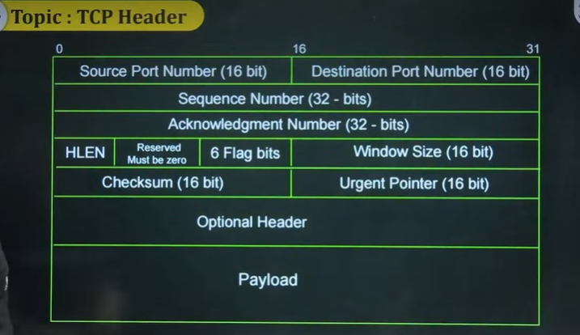


This diagram is showing the **TCP Header Format** — basically how a TCP segment looks internally when data is sent over a network (like when you load a webpage or send an email). TCP = **Transmission Control Protocol**, part of the TCP/IP suite.

---

# 🧩 **High-level idea**

When two computers communicate using TCP, every message is broken into segments. Each segment consists of:

```
[ Header | Data ]
```

The header carries control information so TCP can ensure:

✔ reliable delivery
✔ proper ordering
✔ no duplicates
✔ flow control
✔ congestion control

# 📦 **Now Looking at the Diagram Field-by-Field**

I'll go row by row from the top:

## **1. Source Port (16 bits) & Destination Port (16 bits)**

These identify **who is talking to whom** at the application level.

* **Source Port:** app sending data
* **Destination Port:** app receiving data

Example:
Sending HTTP request → destination port = 80/443

## **2. Sequence Number (32 bits)**

Used for **ordering data**.

TCP breaks data into pieces. Each piece has a sequence number so receiver can reassemble correctly.

Example:
If data arrives 3, 1, 2 → receiver puts them as 1,2,3 using sequence numbers.

## **3. Acknowledgment Number (32 bits)**

This is how TCP confirms receipt.

It contains: `Next byte expected`

Example: If receiver got bytes 1–100, it sends **ACK = 101**

## **4. HLEN (Header Length)**

HLEN = Header Length (also called Data Offset)

Tells how long the TCP header is. Minimum = 20 bytes.
Used because TCP can have variable length due to **options**.


## **5. Reserved (must be zero)**

Future use – currently kept 0.

## **6. 6 Flag bits (Control Flags)**

Flags control connection behavior. Common ones:

| Flag | Meaning                      |
| ---- | ---------------------------- |
| SYN  | start connection             |
| ACK  | acknowledgment valid         |
| FIN  | finish/close connection      |
| RST  | reset connection             |
| PSH  | push data to app immediately |
| URG  | urgent data                  |

During TCP handshake:

1. SYN
2. SYN+ACK
3. ACK

## **7. Window Size (16 bits)**

Used for **Flow Control**.

Specifies how much data receiver can handle without being overwhelmed.

## **8. Checksum (16 bits)**

Used for **error detection** to ensure no corruption in transit.

## **9. Urgent Pointer (16 bits)**

Used only if **URG flag** = 1
Points to urgent data in the payload (rarely used today).


## **10. Optional Header (Optional Field)**

Used for features such as:

✔ Maximum Segment Size (MSS)
✔ Window Scaling
✔ Timestamping

Options make TCP more flexible.


## **11. Payload (Data)**

This is the **actual application data** like:

* HTML file
* email content
* video chunk
* API response


# 🧠 **Overall TCP Header Size**

Minimum header = **20 bytes**
Maximum header (with options) = **60 bytes**

# 🧨 Why TCP is Reliable

Because it uses:

✔ Sequence numbers → ordering
✔ ACKs → confirmation
✔ Retransmissions → lost data recovery
✔ Window mechanism → flow control

Whereas UDP doesn't do these.

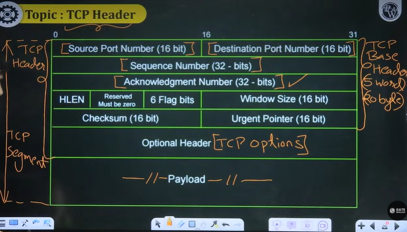


## Summary 
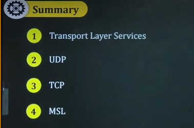

MSL - Maximum segment lifetime(additional topic)

