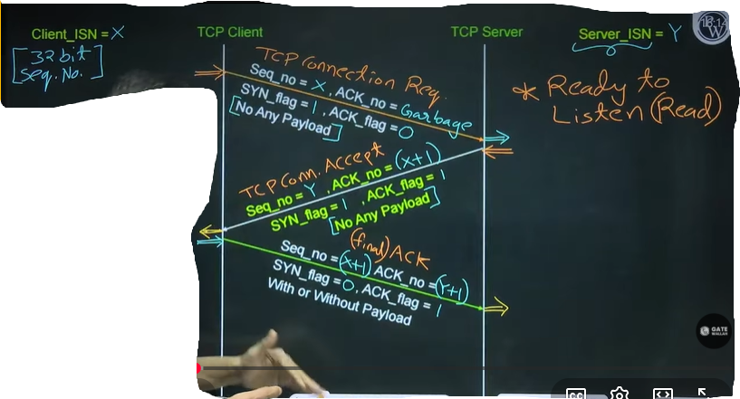

# Computer Network 04 | Transport Layer [TCP Connections]

## Topic - TCP Operation
Three phases of TCP operation - 
1. **Connection establishment**
   1. **3-way handshake** process that **establishes a connection**
   2. >3 way handshake is important topic
2. **Data transfer**
   1. > Once connection is established, data transfer can be done
3. **Connection termination**
   1. 4**-way handshake** process **that closes the connection**

> Video Streaming, Banking transaction uses TCP since it's requires reliable communication
> Online Gaming streaming use UDP

## Topic - TCP Connection Establishment
1. **Connection establishment** between TCP Client and TCP server
   1. > 
2. **3-way handshake process**
3. Always **TCP client** initiate the **connection request** to **TCP server**

Explain the above diagram

* **Initial Sequence Numbe**r - If **SYN** flag is **on**
  * [Both **TCP client** and **server** randomly chooses their **initial sequence number**, to prevent from some kind of attacks]