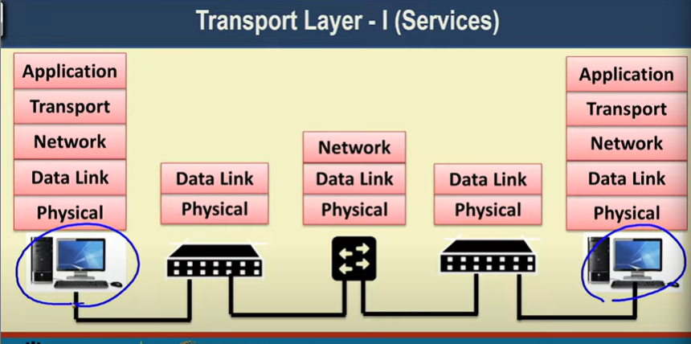
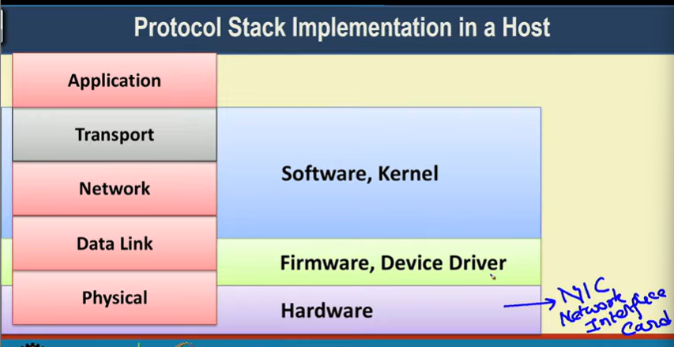
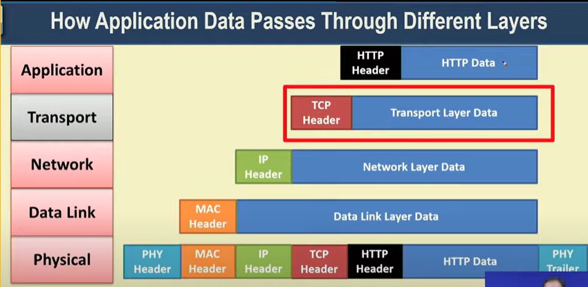
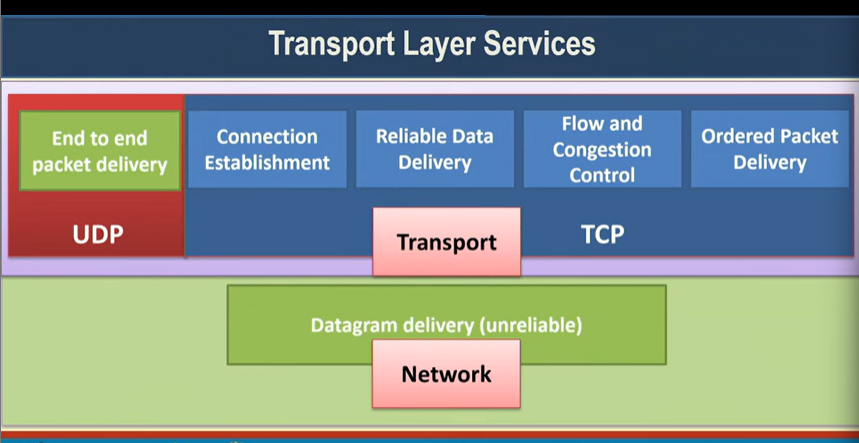

# Tranport Layer - 1 (Services)

## Protocol Stack Implementation in a Host

## How Application Data Passes through Different Layers

## Transport Layer Services

> Why packet might get dropped
    * > Channel interference
    * > Router doesn't have buffer space(Buffer overflow)

