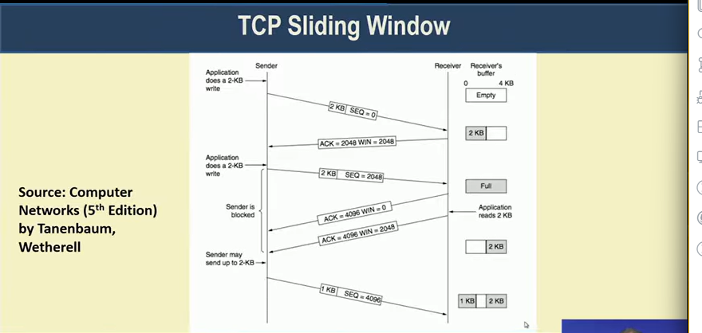
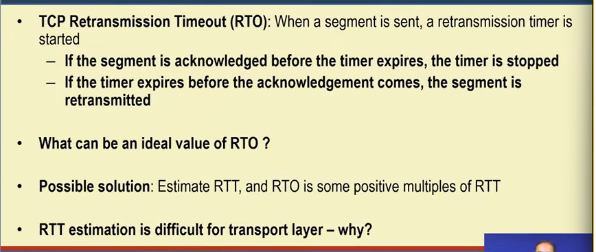
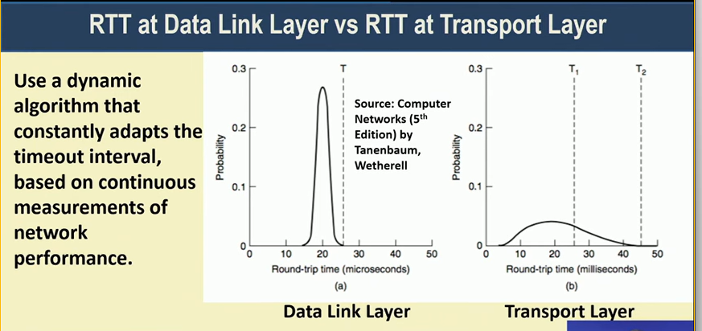
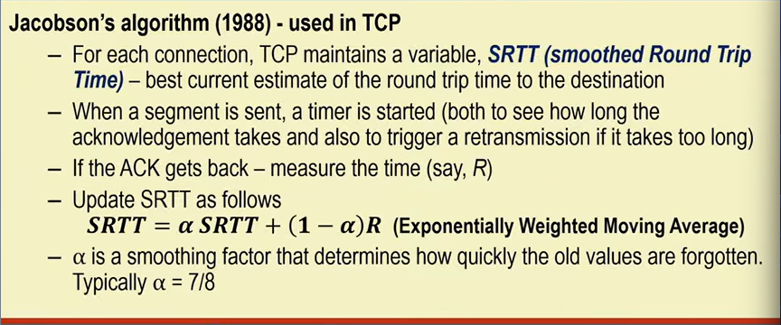
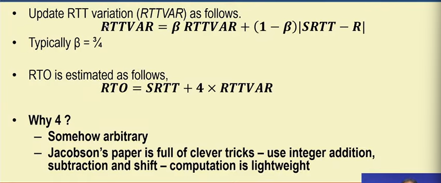
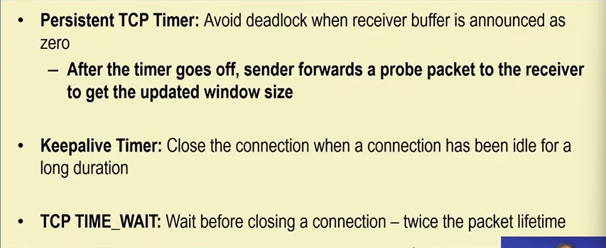

# Lecture 21 : Transmission Control Protocol III – Flow Control

## TCP Sliding Window

Note - Practise the above diagram

## => Delayed Acknowledgements

* Consider a telnet connection, that reacts on every keystroke.
* In the worst case, whenever a character arrives at the sending TCP entity, TCP creates a 21 byte TCP segment, 20 bytes of header and 1 byte of data. For this segment, another ACK and window update is sent
when the application reads that 1 byte. This results in a **huge wastage of bandwidth.**

> To solve above problem we use concept of delayed acknowledgements

* **Delayed acknowledgements:** Delay acknowledgement and window updates for up to 500 msec in the **hope** of receiving few more data packets within that interval.
* **However, the sender can still send multiple short data segments.**

> To prevent sender from sending small data we use Nagle's Algorithm

## => Nagle's Algorithm

* When data come into the sender in small pieces, just send the first piece
and buffer all the rest until the first piece is acknowledged.
* Then send all buffered data in one TCP segment and start buffering again
until the next segment is acknowledged.
— **Only one short packet can be outstanding at any time.**

* **Do we want Nagle's Algorithm all the time?**
* **Nagle's Algorithm and Delayed Acknowledgement**
  * Receiver waits for data and sender waits for acknowledgement - **results in starvation**

## Silly Window Syndrome
* Data are passed to the sending TCP
entity in large blocks, but an interactive
application on the receiver side reads
data only 1 byte at a time.

> To solve 1 byte of small data solution we use Clark's solution

* **Clark's solution:** Do not send
window update for 1 byte.
Wait until sufficient space is
available at the receiver
buffer.

> what is sufficient space? that depends on TCP implementation

## Handling Short Segments - Sender and Receiver Together
* Nagle's algorithm and Clark's solution to silly window syndrome are **complementary**
* **Nagle's algorithm:** Solve the problem caused by the sending application
delivering data to TCP a byte at a time
* **Clark's solution:** Receiving application fetching the data up from TCP a byte at a
time
> By combining above no starvation of acknowlegement happen
* Exception: The PSH i.e. PUSH flag is used to inform the sender to create a segment
immediately without waiting for more data

## Handling Out of Order in TCP
* TCP **buffers** out of order segments and forward a **duplicate acknowledgement** or DUPACK to the sender.
* **Acknowledgement in TCP — Cumulative acknowledgement**

* Example - 
* Receiver has received bytes 0, 1, 2, _, 4, 5, 6, 7
  * TCP sends a cumulative acknowledgement with ACK number 2, acknowledging everything up to byte 2
  * Once 4 is received, a duplicate ACK with ACK number 3 (next expected byte) is forwarded - **triggers congestion control**(we will see it in next class)
  * After timeout, sender retransmits byte 3
  * Once byte 3 is received, it can send another cumulative ACK with ACK number 8 (next expected byte)

## TCP Timer Management

## RTT at Data Link Layer vs RTT at Transport Layer

how to measure network performance?

## RTT Estimation at the Transport Layer

* Jacobson's alogrithm(1988) - used in TCP 

### Problem with EWMA

### RTO Estimation

why 4? god knows.

## Karn's Algorithm
* How will you get the RTT estimation, when a segment is lost and retransmitted again?
* **Karn's algorithm:**
  * Do not update estimates on any segments that has been retransmitted
  * The **timeout is doubled each successive retransmission** until the segments gets through the first time

## Other TCP Timers

