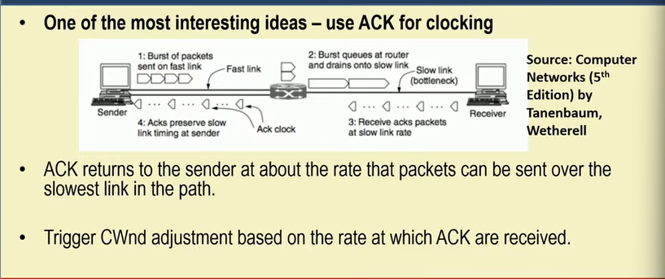
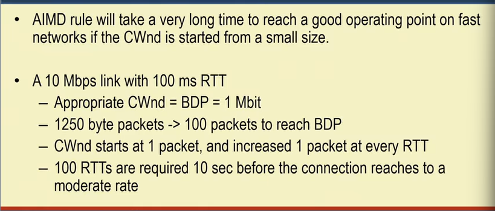
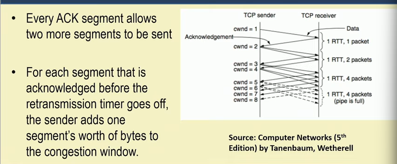
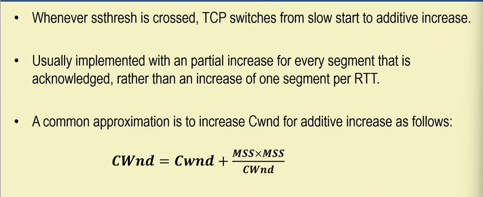
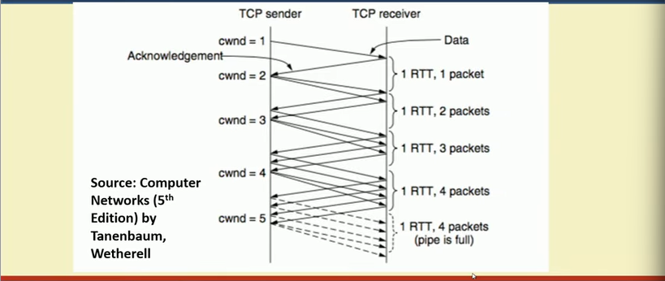
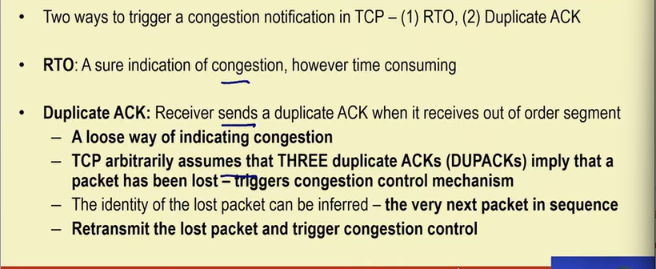
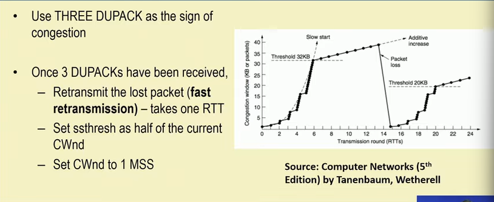
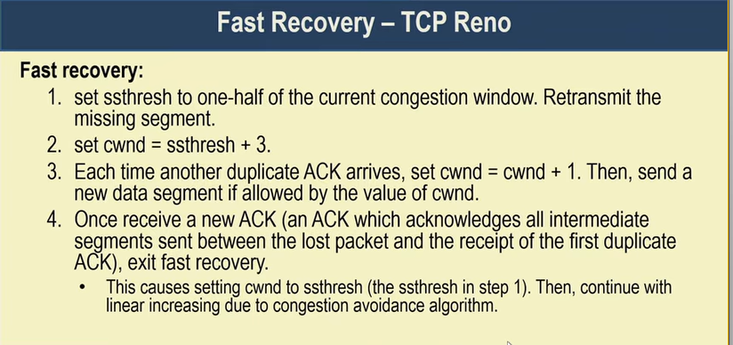
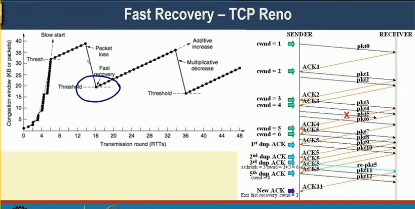

# Lecture 22 : Transmission Control Protocol IV – Congestion Control

## TCP Congestion Control
* Based on implementation of AIMD using a window and with packet loss as the binary signal
* TCP maintains a **Congestion Window (CWnd)** - number of bytes the sender may have in the network at any time
  * > CWnd - rate that network supports
* **Sending Rate = Congestion Window/RTT**
* **Sender Window (SWnd) = Min (CWnd, RWnd)**
* RWnd — Receiver advertised window size

## 1986 Congestion Collapse

* In 1986, the growing popularity of Internet led to the first occurrence of congestion
collapse - a prolonged period during which goodput dropped precipitously (more
than a factor of 100)
* Early TCP Congestion Control algorithm - Effort by Van Jancobson (1988)
* **Challenge for Jacobson** — Implement congestion control without making much
change in the protocol (made it instantly deployable)
* **Packet loss is a suitable signal for congestion — use timeout to detect packet loss. Tune CWnd based on the observation from packet loss**

### Adjust CWnd based on AIMD

## Increase Rate Exponentially at the Beginning - The Slow Start

* Slow Start - Exponential increase of rate to avoid slow convergence  
— Rate is not slow at all !  
— CWnd is doubled at every RTT  

## TCP Slow Start

## Slow Start Threshold
* Slow start causes exponential growth, eventually it will send too many packets into the network too quickly.
* To keep slow start under control, the sender keeps a threshold for the connection called the **slow start threshold (ssthresh).**
* Initially ssthresh is set to BDP (or arbitrarily high), the maximum that a flow can
push to the network.
* Whenever a packet loss is detected by a RTO, the ssthresh is set to be half of the
congestion window

## Additive Increase (Congestion Avoidance)

## Additive Increase - Packet Wise Approximation

> We have another way to trigger the congestion
>> Using duplicate acknowlegement
## Triggering an Congestion

Above is called Fast Retransmission - TCP Tohoe

## Fast Retransmission - TCP Tohoe

## Fast Recovery - TCP Reno
* **Once a congestion is detected through 3 DUPACKs, do TCP really need to set CWnd = 1 MSS ?**
* DUPACK means that **some segments are still flowing in the network** - a signal for temporary congestion, but not a prolonged one
* Immediately transmit the lost segment (**fast retransmit**), then transmit additional segments based on the DUPACKs received (**fast recovery**)

