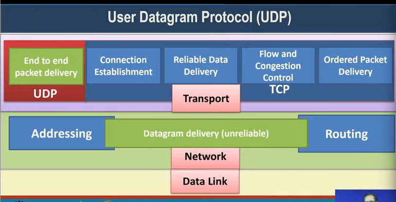
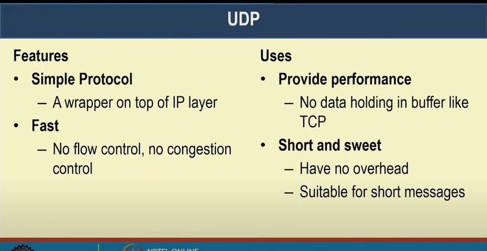
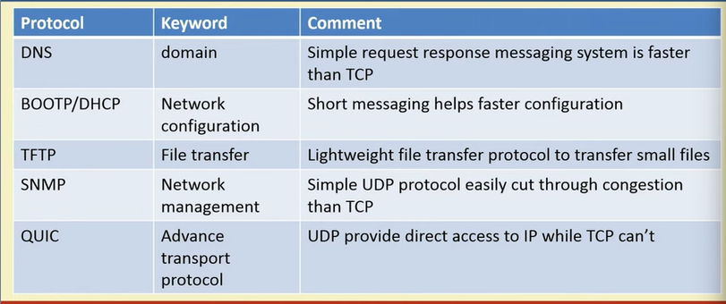
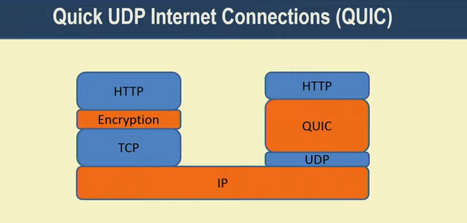
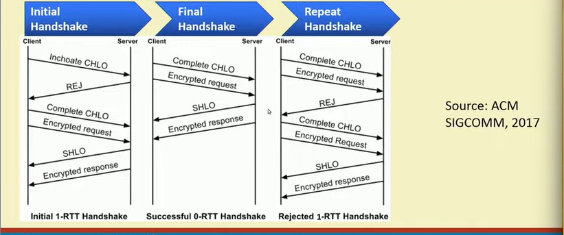
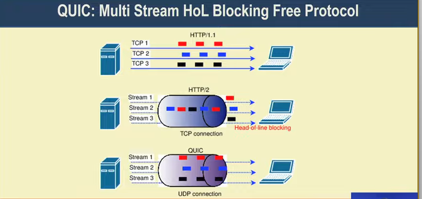

# Lecture 23 : User Datagram Protocol

## UDP (User Datagram Protocol)

## UDP - Features and Uses

## UDP is connection less and unreliable

## UDP Header

## Applications

## => QUIC - Quick UDP Internet Connections

## QUIC - 0-RTT Connection

## Headofline Blocking

