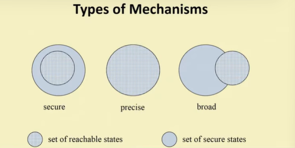
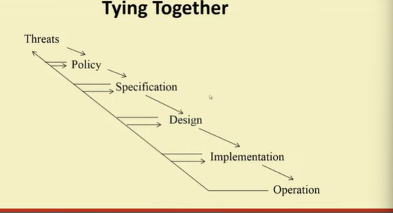
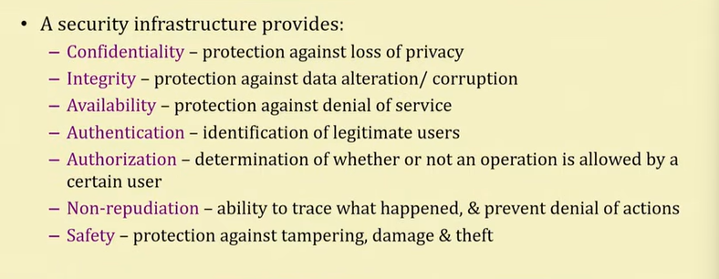
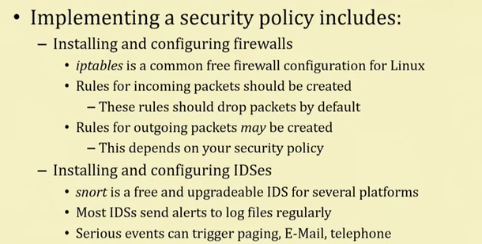

# Lecture 58 - Network Security - Overview

* Network security, computer Security, Information Security - These are becoming a line of vertical altogether

## Security - Basic Components(C.I.A)
* Confidentiality
  * Keeping data and resources hidden
* Integrity
  * Data Integrity(integrity)
  * Origin Integrity(authentication)
* Availability
  * Enabling access to data and resources

## Security Attacks
* Four types
  * Interruption
    * Attack on availability
  * Interception
    * Attack on confidentiality
  * Modification
    * Attack on Integriy
  * Fabrication
    * Attack on authenticity

## Classes of Threats
* Disclosure
* Deception
* Disruption
* Usurpation

## Policies and Mechanisms
* Policy says what is and what is not allowed
* Mechanisms enforce policies
* Composition of policies
  * If policies conflict, discrepancies may create security vulnerabilities

## Goals of Security
* Prevention
  * Prevent attackers from violating security policy
* Detection
  * Detect attackers violation of securiy policy
* Recovery
  * Stop attack, assess and repair damage

## Trust and Assumptions
* Underlie all aspects of security
* Policies
  * Unambiguously partition system states
  * Correctly capture security requirements
* Mechanisms
  * Assumed to enforce policy
  * Support mechanisms work correctly

## Types of Mechanisms

* Secure
* Precise
* broad

## Assurance
* Specification
* Design
* Implementation

## Operational Issues
* Cost-Benefit Analysis
* Risk Analysis
* Laws and Customs
* Organization Problems
* People problems

> So overall we have following - 

## Passive and Active Attacks
* Passive attacks
  * eavsdropping
* Two types
  * Release of message contents
  * Traffic analysis
* Active attacks
  * Four categories
    * Masquerade
    * Replay
    * Modification
    * Denial of service(DOS)

## Security Services
* Confidentiality(privacy)
* Authentication(who created or sent the data)
* Integrity(has not been altered)
* Non-repudiation(the order is final)
* Access control(prevent misuse of resources)
* Availability(Permanence, non-erasure)
  * Denial of Service Attacks
  * Virus that deletes files

## Role of Security
* A security infrastructure provides

## Types of Attack
* Social engineering/phishing
* Physical break-ins, theft, and curb shopping
* Password attacks
* Buffer overflows
* Command injection
* Denial of service
* Exploitation of faulty application logic
* Snooping
* Packet manipulation or fabrication
* Backdoors

## Network Security Outline
Network security works like this:
- Determine network security policy
- Implement network security policy
- Reconnaissance
- Vulnerability scanning
- Penetration testing
- Post-attack investigation

### Step 1 - Determine Security Policy
* **A security policy is a full security roadmap**  
- Usage policy for networks, servers, etc.
- User training about password sharing, password strength, social engineering,
privacy, etc.
- Privacy policy for all maintained data
- A schedule for updates, audits, etc.

* **The network design should reflect this policy**  
- The placement/protection of database/file servers
- The location of demilitarized zones (DMZs)
- The placement and rules of firewalls
- The deployment of intrusion detection systems (IDSs)

### Step 2 - Implement Security Policy

> TCP/IP or OSI layer doesnot talk about security, Security comes additionally. In doing so we should be careful that intermediate devices which gives this packet , should not be any problem like intervention, interference with the standard.

